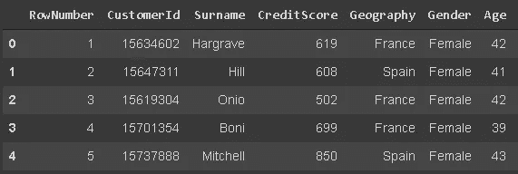

# Pandas vs SQL —与示例进行比较

> 原文：<https://towardsdatascience.com/pandas-vs-sql-compared-with-examples-3f14db65c06f?source=collection_archive---------8----------------------->

## 如何使用这两者完成数据分析中的典型任务


[咖啡极客](https://unsplash.com/@coffeegeek?utm_source=unsplash&utm_medium=referral&utm_content=creditCopyText)在 [Unsplash](https://unsplash.com/s/photos/compare?utm_source=unsplash&utm_medium=referral&utm_content=creditCopyText) 上的照片

Pandas 是一个用于数据分析和操作的 Python 库。SQL 是一种用于与数据库通信的编程语言。大多数关系数据库管理系统(RDBMS)使用 SQL 来操作存储在数据库中的表。它们的共同点是 Pandas 和 SQL 都操作表格数据(即表格由行和列组成)。

熊猫和 SQL 都是数据科学家和分析师的必备工具。当然，两者都有替代方案，但它们是这一领域的主导方案。

因为 Pandas 和 SQL 都是对表格数据进行操作的，所以类似的操作或查询都可以使用这两者来完成。在这篇文章中，我们将比较 Pandas 和 SQL 在数据分析过程中的典型操作。

我们将使用 Kaggle 上的[客户流失数据集](https://www.kaggle.com/shubh0799/churn-modelling)。

对于熊猫，我会用 Google Colab。将 csv 文件上传到 Colab 环境后，数据集被读入 pandas 数据帧。

```
import pandas as pd
churn = pd.read_csv("/content/churn.csv")
```

对于 SQL，我[在 Amazon RDS 上创建了一个 MySQL 数据库，并使用 MySQL Workbench 将](/how-to-practice-sql-on-aws-for-free-dde1bc461e10)连接到它。建立连接后，我创建了一个名为“CHURN”的表，并将 csv 文件中的数据上传到该表中。您可以通过在 MySQL Workbench 中运行以下 SQL 语法来完成相同的操作。

```
CREATE TABLE CHURN (
RowNumber INT NOT NULL,
CustomerId INT NOT NULL,
Surname VARCHAR(20) NULL,
CreditScore INT NULL,
Geography VARCHAR(20) NULL,
Gender VARCHAR(20) NULL,
Age INT NULL,
Tenure INT NULL,
Balance DECIMAL(10,2) NULL,
NumOfProducts INT NULL,
HasCrCard INT NULL,
IsActiveMember INT NULL,
EstimatedSalary DECIMAL(10,2) NULL,
Exited INT NULL,
PRIMARY KEY(RowNumber)
);LOAD DATA LOCAL INFILE "C:/Users/soner/Desktop/SQL/churn.csv" INTO TABLE CHURN 
FIELDS TERMINATED by ','
ENCLOSED by '"'
LINES TERMINATED by '\n' IGNORE 1 LINES;
```

> **注意**:如果使用最新版本(8。)的话，上面的 load data 语句就不起作用了。我用的是 6 版。

我们现在有了一个客户流失数据框架和一个客户流失表。让我们从数据分析过程中常见的基本操作开始。

## **获取数据概述**

这里概述的含义有点模糊。这里我指的是列及其数据类型的列表。

DESC 语句后跟表名将在 SQL 中完成这项工作。

```
DESC CHURN;
```


(图片由作者提供)

对于熊猫，“dtypes”方法将返回每一列的数据类型。我们还可以使用“columns”方法来查看列的列表。

```
churn.dtypes
```


(图片由作者提供)

## **显示前 5 行**

这也可以被认为是获得数据的概述。数字 5 只是惯例，但是你可以改变它。

在 SQL 方面，我们将使用 SELECT 语句。

```
SELECT * FROM CHURN LIMIT 5;
```


(图片由作者提供)

我们选择了所有列(*)的前 5 行(限制为 5 行)。该屏幕截图仅包含 7 列，因此很适合屏幕。

不是每个 DBMS 都有相同的语法。我们这里用的是 MySQL。例如，SQL Server 使用 SELECT TOP 语句。

Pandas 为这个操作提供了一个更简单的语法。

```
churn.head(5) # The default is 5 so churn.head() also works
```



(图片由作者提供)

## **选择特定的列**

对于 SQL，我们只需要用列名替换“*”。

```
SELECT CustomerId, Geography FROM CHURN;
```


(图片由作者提供)

对熊猫来说是这样做的。

```
churn[['CustomerId', 'Geography']]
```


(图片由作者提供)

## **选择符合条件的行**

在分析数据时，我们可能会考虑一些条件。例如，在我们的数据集中，任务可能是基于一些测量来比较不同的国家。因此，能够有条件地选择数据点非常重要。

我们可以在 SQL 中使用 WHERE 语句。例如，以下查询将返回“地理位置”列中的值为“法国”的选定列。

```
SELECT CustomerId, Geography FROM CHURN
WHERE Geography = 'France'
LIMIT 5;
```


(图片由作者提供)

对于 Pandas，根据条件过滤数据帧，然后选择所需的列和行。

```
churn[churn.Geography == 'France'][['CustomerId','Geography']][:5]
```


(图片由作者提供)

## **列中的唯一值**

分析分类列和数字列是很重要的。分类列的一个关键特征是唯一的类别。

让我们看看在地理位置一栏中有哪些国家。

SELECT DISTINCT 语句将返回表中的不同值。

```
SELECT DISTINCT Geography FROM CHURN;
```


(图片由作者提供)

同样的操作可以用熊猫特有的功能来完成。

```
churn.Geography.unique()
array(['France', 'Spain', 'Germany'], dtype=object)
```

## 列中唯一值的数量

在地理栏中，只有 3 个不同的国家，所以我们可以直观地计算。在某些情况下，独特类别的数量很大，所以我们需要一种方法来计算它们。

对于 SQL，我们可以如下使用 COUNT 语句:

```
SELECT COUNT(DISTINCT Geography) FROM CHURN;
3
```

对于熊猫，nunique 函数将完成这项工作。

```
churn.Geography.nunique()
3
```

## **每个类别中的行数**

我们已经介绍了如何检查唯一类别和唯一类别的数量。更进一步，查看每个类别有多少数据点(即行数)可能更有用。

对于 SQL，可以使用 COUNT 和 GROUP BY 语句来完成，如以下查询所示:

```
SELECT Geography, COUNT(Geography) AS 'count' 
FROM CHURN
GROUP BY Geography;
```


(图片由作者提供)

我们选择了两列，一列是 Geography，另一列是 Geography 列中的行数。如果末尾没有“GROUP BY”语句，查询将返回一行，指示表中的总行数。

熊猫的 value_counts 函数可以完成同样的任务。

```
churn.Geography.value_counts()
```


(图片由作者提供)

## **分组和聚合函数**

SQL 和 Pandas 都允许对查询结果应用聚合函数，这对于高效的数据分析非常重要。

例如，我们可以检查不同国家客户的平均年龄。下面的 SQL 查询将完成这项任务，它还将根据平均年龄值对结果进行排序。

```
SELECT Geography, AVG(Age) AS 'Average Age' 
FROM CHURN
GROUP BY Geography
ORDER BY Age;
```


(图片由作者提供)

熊猫遵循相同的想法，只是语法不同。

```
churn[['Geography','Age']].groupby('Geography').mean()\
.sort_values(by='Age', ascending=False)
```


(图片由作者提供)

## **结论**

我们只介绍了 Pandas 或 SQL 的一小部分功能。然而，这些操作对于典型的数据分析过程是必不可少的。我认为它们是学习复杂操作所必须掌握的基础。

正如您在示例中看到的，Pandas 和 SQL 背后的逻辑非常相似。一旦你熟悉了其中的一种，学习另一种就相当容易了。这只是一个语法问题。

如果你正在从事或者打算从事数据科学领域的工作，我强烈推荐你学习熊猫和 SQL。

感谢您的阅读。如果您有任何反馈，请告诉我。