# 熊猫！！！第一次现场技术面试后我学到了什么

> 原文：<https://towardsdatascience.com/pandas-what-ive-learned-after-my-1st-on-site-technical-interview-4fb94dbc1b45?source=collection_archive---------12----------------------->

## 技术面试

## 关于熊猫 str 关键文本清洗技巧的思考

# 前言

我知道很多人在面试时会紧张。同样，在我的面试中，10 次有 8 次我会坐立不安。这意味着忘记我口袋里的常用技巧，或者错过一些我应该知道的关键知识。最近，我参加了一个商业智能实习职位的现场技术面试，你猜怎么着？全是:熊猫！虽然采访没有我想象的那么顺利，但我想把这次经历转变成对我认为对熊猫至关重要的事情的反思，特别是文本数据处理。


由 [Unsplash](https://unsplash.com?utm_source=medium&utm_medium=referral) 上[车头](https://unsplash.com/@headwayio?utm_source=medium&utm_medium=referral)拍摄

# 概观

本文将介绍**在 Pandas** 、**、**中处理文本数据的主要功能。Series.str "。大部分问题设置和我面试时经历的差不多。当你阅读这篇文章时，你将有机会回顾你所学到的东西，如果你期待一次技术面试，你将会收到一个友好的提醒。如果您是熊猫的新手，我希望您可以将本文中展示的技巧添加到您的数据科学工具包中。让我们开始朝着更加结构化的数据前进。

[](https://medium.com/subscribe/@yunglinchang) [## 每当张彝伦出版的时候收到一封电子邮件。

### 每当张彝伦出版的时候收到一封电子邮件。或者督促他多发表！！！通过注册，您将创建一个媒体…

medium.com](https://medium.com/subscribe/@yunglinchang) 

台北动物园的熊猫，来源:我

## 仅供参考:

*   这篇文章将被分成小的问题集和这些问题之后可能的解决方案(或者我用来解决每个问题的方法)。
*   这个数据集是[一个虚构的“水果”公司](https://github.com/yunglinchang/DataScience_playground/blob/master/Pandas/data/TheFruit_sales.csv)的销售数据，用来说明你在面试、工作或数据项目中可能遇到的挑战。

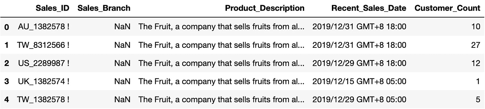

“水果”公司的销售数据，来源:我

*   数据被预加载并保存在 *df* 中，并且不要忘记:

```
import pandas as pd
```

事不宜迟，我们开始吧！

> 首先，面试官给了你一份水果销售部门的数据集。你被要求用你的 Python 技术能力解决每一个专栏中的问题。你发现了什么？

# Sales_ID:怪异的感叹号和多余的空格

如果我们看一下 Sales_ID 列的第一行，您会发现它包含不必要的空格和一个感叹号。这是一个问题，因为在 Sales_ID 列中我们不需要那些多余的字符。

```
df[ 'Sales_ID'][0]**Out: 'AU_1382578        !'**
```

我们能做的就是利用 [**熊猫。**中的](https://pandas.pydata.org/pandas-docs/stable/reference/api/pandas.Series.str.strip.html)法熊猫！ ***strip()*** 修剪掉列的前导和尾随字符。还有类似于右条带的 ***rstrip()*** 和左条带的 ***lstrip()*** 的小变体。

当数据两边有不重要的字符和符号时，使用 ***strip()*** 非常有用。这里我们先去掉右边的“！”然后去掉两边的空格。

```
df['Sales_ID'] = df['Sales_ID']**.str.rstrip('!').str.strip()**
```

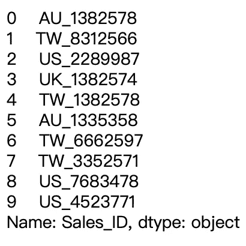

Sales_ID，来源:我

> 祝贺您清理了 Sales_ID 列！

# Sales_Branch:缺失？一点特色工程

似乎 Sales_Branch 列完全丢失了！面试官让你用 Sales_ID 一栏的提示来搞定。快速检查后，您发现销售是根据 Sales_ID 的前两个单词分配给水果的各个分支的。

我们可以用 [**熊猫。series . str . slice**](https://pandas.pydata.org/pandas-docs/stable/reference/api/pandas.Series.str.slice.html)**方法对字符串的关键元素进行切片。例如:'**AU _ 1382578**'**in Sales _ ID→【AU】in Sales _ Branch**。**

*****slice()*** 包含 3 个参数:**

*   ****开始:**从哪里开始，默认值为 0**
*   ****停止:**在哪里停止(不含)**
*   ****步:**多远的一步，默认值为 1**

```
df['Sales_Branch'] = df['Sales_ID']**.str.slice(stop=2)**
```

**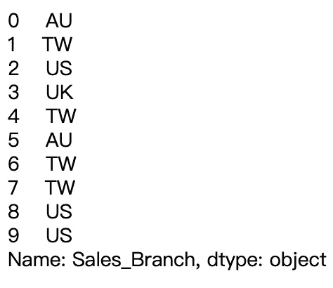**

**销售 _ 分公司，来源:我**

> **祝贺 Sales_Branch 专栏的特色工程！**

# **Product_Description:包含销售产品的详细描述**

**大概在大多数场合，公司的系统都会产生一个长句子的交易日志。但是这些句子包含了你的面试官想要的有价值的信息。**

```
df['Product_Description'][0]**Out: 'The Fruit, a company that sells fruits from all over the world, has branches in Australia, the United Kingdom, the United States, and Taiwan. Product: Apple Mango Banana Watermelon Orange Blueberry Banana Watermelon Kiwifruit'**
```

**我们可以看到，虽然所有的第一句都是相同的，但我们可以将其分为两列:描述和产品。这就是 [**熊猫。**](https://pandas.pydata.org/pandas-docs/stable/reference/api/pandas.Series.str.split.html) 方法进场。**

*****split()*** 包含 3 个参数:**

*   ****pat:** 默认情况下，使用空白分割什么**
*   **用户可以指定他们想要多少分割**
*   ****展开:**当 expand=True 时，拆分被放入单独的列中**

```
df['Product_Description']**.str.split(' Product: ', expand=True)**
```

**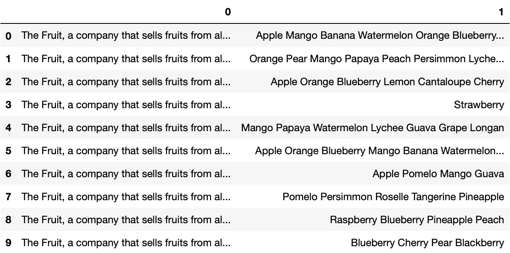**

**来源:我**

**我们可以通过两种方式将 0 和 1 分配给描述和产品:**

```
df['Description'] = df['Product_Description'].str.split(' Product: ', expand=True)[0]
df['Product'] = df['Product_Description'].str.split(' Product: ', expand=True)[1]
```

**或者**

```
df[['Description', 'Product']] = df['Product_Description'].str.split(': ', expand=True)
```

****

**由 [Unsplash](https://unsplash.com?utm_source=medium&utm_medium=referral) 上的 [Karoline Stk](https://unsplash.com/@kstock?utm_source=medium&utm_medium=referral) 拍摄的照片**

**现在，面试官变得挑剔了，增加了一个额外的要求:对产品列中的产品列表进行排序。**

**没必要感到焦虑！这可以通过首先用 split()拆分 Product 列中的值，然后在 Python 中应用[排序的](https://docs.python.org/3/howto/sorting.html)函数来实现。**

```
df['Product'] = df['Product']**.str.split().apply(sorted)**
```

**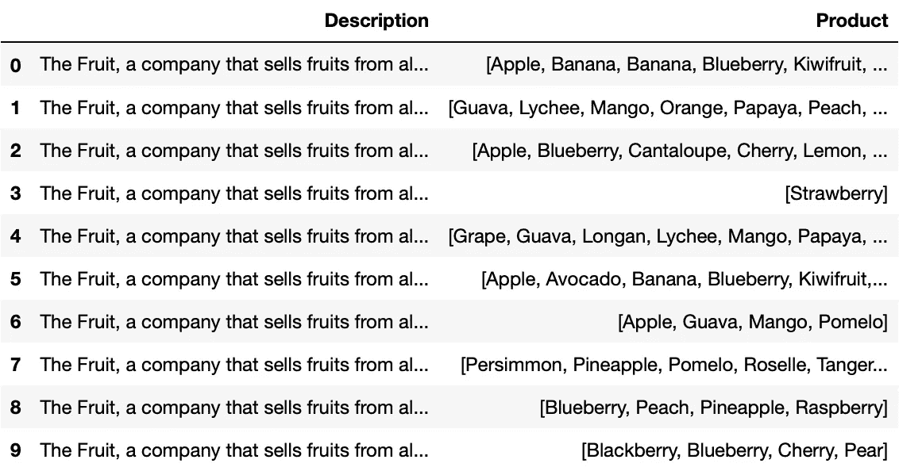**

**描述和产品，来源:我**

> **祝贺您从 Product_Description 专栏中获得了信息！**

# **Product_Count:每个销售人员的水果数量**

**采访者想了解他们的销售人员正在销售的各种水果。很高兴知道还可以用 [**熊猫。series . str . len**](https://pandas.pydata.org/pandas-docs/stable/reference/api/pandas.Series.str.len.html)**方法获取产品列中列表的长度。****

```
**df['Product_Count'] = df['Product']**.str.len()****
```

****让我们来看看谁卖的水果品种最多！****

```
**df[df['Product_Count'] == max(df['Product_Count'])]**
```

********

****来源:我****

****卖 10 种不同水果的澳大利亚代表似乎是赢家！****

> ****恭喜你在产品计数栏中计算出了各种水果！****

# ****产品:不仅仅是产品列表****

****因此，在从 Product_Description 中获取产品之后，您面临着另一个挑战！面试官问你是否可以用两种方式拆分产品栏:****

1.  ****将列拆分为产品 1、产品 2、…****
2.  ****对每个产品进行一次性编码****

****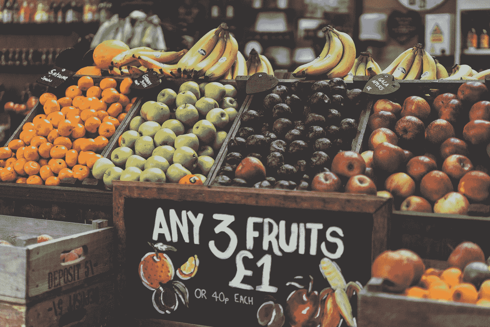****

****汤姆·格伦鲍尔在 [Unsplash](https://unsplash.com?utm_source=medium&utm_medium=referral) 上的照片****

## ****1.将此列拆分为产品 n****

****利用 [**pd，我们可以轻松应对这一挑战。**](https://pandas.pydata.org/pandas-docs/stable/reference/api/pandas.Series.html) 系列，我们可以把它的产品列表变成**pandas . core . frame . data frame**。****

```
**Products = df['Product']**.apply(pd.Series)** Products**
```

****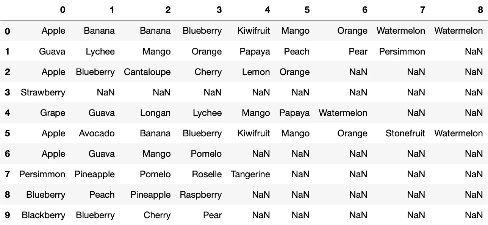****

****然后，我们通过重命名列名来完成我们的工作！****

```
**Products = Products.rename(columns=lambda x: 'Product_'+str(x))
Products**
```

****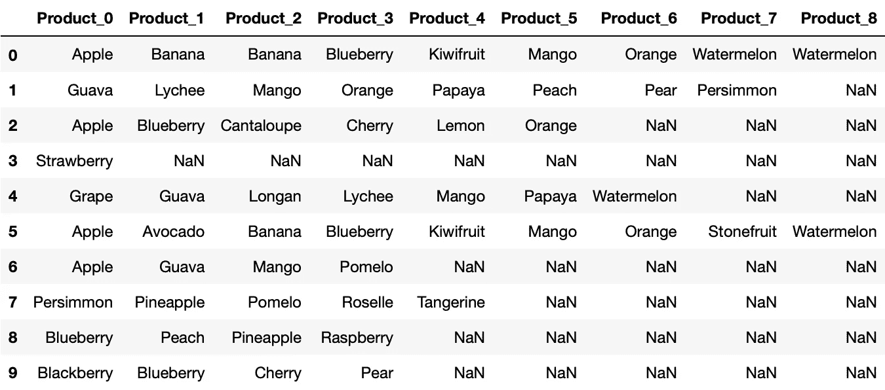****

****10 行× 9 列，来源:我****

## ****2.对每个产品进行一次性编码****

****熊猫中的一键编码称为 [**熊猫。Series.str.get_dummies**](https://pandas.pydata.org/pandas-docs/stable/reference/api/pandas.Series.str.get_dummies.html)****

*******get _ dummies()****只有 1 个参数:*****

*   *******sep:** 要拆分的内容，默认值为' | '*****

*****我们使用拆分后的原始形式，因为我们可以使用空格来分隔它们。(填充自由以尝试使用带有循环的列表形式！)*****

```
***df['Product_Description'].str.split(': ', expand=True)[1]***
```

*****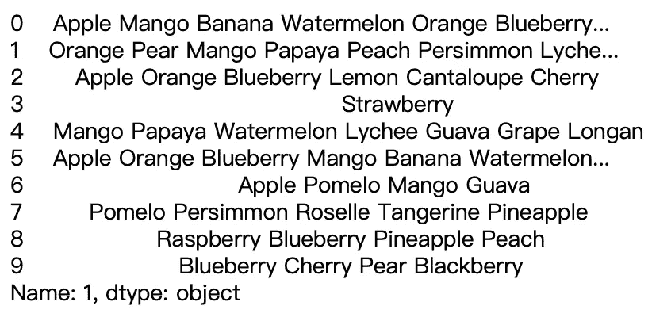*****

*****由空格分隔的产品，来源:Me*****

*****通过应用***get _ dummies()***，我们从操作中得到每个水果的 10 行× 27 列(那是巨大的！).*****

```
***Products2 = df['Product_Description'].str.split(': ', expand=True)[1]**.str.get_dummies(' ')**
Products2***
```

*****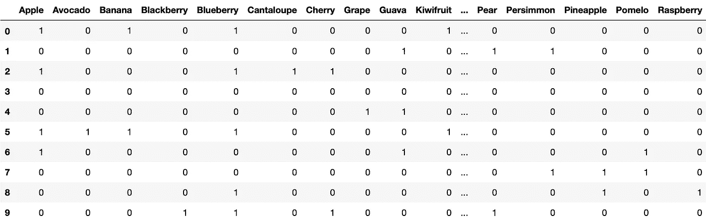*****

*****10 行× 27 列，来源:我*****

*****在满足了这两个要求后，面试官最终决定选择选项 1 作为最终版本。我们可以将产品(选项 1)与原始数据框 *df* 合并，得到 10 行× 17 列的形状。*****

```
***df = **pd.concat([df, Products], axis=1)*****
```

## *****仅供参考:*****

*****scikit-learn 库也提供了一个具有相同功能的“[**multilabel binary izer**](https://scikit-learn.org/stable/modules/generated/sklearn.preprocessing.MultiLabelBinarizer.html)，不过那是后话了。*****

> *****恭喜你将每种水果从产品栏中分离出来！*****

# *****最近销售日期:年-月-日*****

*****我们几乎完成了我们的采访，最后一个任务是数据时间的职责。面试官要求您将“最近销售日期”列转换为“年-月-日”格式。这是为了进一步防止将来选择具有不同输出时间的日期的操作。*****

*****首先，我们裁剪出我们想要的日期，这可以通过两种方式实现:*****

```
***Dates = df['Recent_Sales_Date']**.str[:10]*****
```

*****或者*****

```
***Dates = df['Recent_Sales_Date']**.str.slice(stop=10)*****
```

**********

*****[Mille Sanders](https://unsplash.com/@millesanders?utm_source=medium&utm_medium=referral) 在 [Unsplash](https://unsplash.com?utm_source=medium&utm_medium=referral) 上拍摄的照片*****

*****第二，简单的把它包在***PD . to _ datetime()***里面。*****

```
***df['Recent_Sales_Date'] = **pd.to_datetime(Dates)*****
```

*****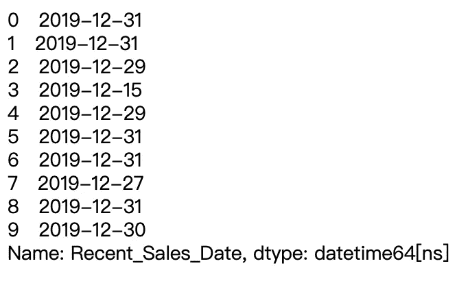*****

*****最近 _ 销售 _ 日期，来源:我*****

> *****恭喜您重新格式化了最近销售日期列中的日期时间！*****

# *****收场白*****

*****面试过程正式结束！恭喜你。我希望这篇文章能给你提供我第一次技术面试的经历。虽然这次我做得不好，但这也不会是最后一次！现在，我们对熊猫的文本数据操作更有信心了。感谢大家的参与！*****

*****简单回顾一下， ***strip()*** ， ***slice()*** ， ***split()*** 方法都是处理文本数据时的有用工具:您可以选择剥离两边不相关的部分，切片可以使用的必要部分，并根据拆分标准划分数据。*****

> *****这里是文章中所有代码的 Github repo[！](https://github.com/yunglinchang/DataScience_playground)*****

*****[](https://medium.com/subscribe/@yunglinchang) [## 每当张彝伦出版的时候收到一封电子邮件。

### 每当张彝伦出版的时候收到一封电子邮件。或者督促他多发表！！！通过注册，您将创建一个媒体…

medium.com](https://medium.com/subscribe/@yunglinchang) 

我喜欢学习数据，并思考(写下)我在实际应用中所学到的东西。如果你有更多需要讨论的，你可以通过 LinkedIn 和 Twitter 联系我。此外，请随时关注我的 Medium，以获取更多数据科学文章！

> 来数据科学游乐场一起玩吧！*****