# 熊猫与 Dask，一个超快的笔记本电脑

> 原文：<https://towardsdatascience.com/pandas-with-dask-for-an-ultra-fast-notebook-e2621c3769f?source=collection_archive---------8----------------------->


礼貌: [Pixabay](https://pixabay.com/photos/highway-drive-driving-road-travel-1209547/)

如果你进入数据世界，那么使用熊猫的需求可能会非常频繁。嗯，我们都知道一件事，熊猫是惊人的，更像是数据世界的福音。我们大多数人至少花几分钟甚至几个小时使用熊猫进行数据处理和日常分析。熊猫不需要太多的介绍，但这里有几件事你应该知道:

**熊猫**非常适合许多不同种类的数据:

*   具有不同类型列的表格数据，如在 SQL 表或 Excel 电子表格中
*   有序和无序(不一定是固定频率)时间序列数据。
*   带有行和列标签的任意矩阵数据(同类或异类)
*   任何其他形式的观察/统计数据集。数据根本不需要被标记就可以放入 pandas 数据结构中。

使用具有千兆字节或兆兆字节数据的熊猫更像是笔记本中的一种痛苦:d .我经常使用千兆字节的文件，笔记本就像*“等一下，让我现在冻结！”*。顺便说一下，我的系统有一些惊人的配置。使用熊猫无法处理海量数据，因此这就是我们必须开始使用 dask 的地方。在这篇文章中，我将演示如何使用 dask 和 pandas 来加速你的笔记本。在 dask 中，读取 GB 的文件只需要几秒钟。在开始演示之前，让我简单介绍一下 dask。

**达斯克:**

Dask 有 3 个并行集合，即数据帧、包和数组。这使得它能够存储比 RAM 更大的数据。其中的每一个都可以使用在 RAM 和硬盘之间分区的数据，也可以分布在集群中的多个节点上。Dask 数据帧是按行划分的，按索引值对行进行分组以提高效率。这些熊猫对象可能存在于磁盘或其他机器上。Dask 数据框架协调许多熊猫数据框架或沿索引排列的系列

Dask 可以利用多核 CPU 在单台机器上实现高效的并行计算，并从磁盘高效地传输数据。它可以在分布式集群上运行。Dask 还允许用户用单机调度程序替换集群，这将降低开销。这些调度程序不需要设置，可以完全在与用户会话相同的进程中运行。关于 dask 的其他一些事情:

*   并行处理 NumPy 数组和 Pandas DataFrame 对象的能力
*   与其他项目的集成。
*   分布式计算
*   更快的操作，因为它的低开销和最少的序列化
*   在具有数千个内核的集群上弹性运行
*   实时反馈和诊断

**演示:**

用于演示的完整代码可以在我的 Github repo 中找到，您可以在本文末尾找到链接。现在，让我们开始演示:

**导入库:**

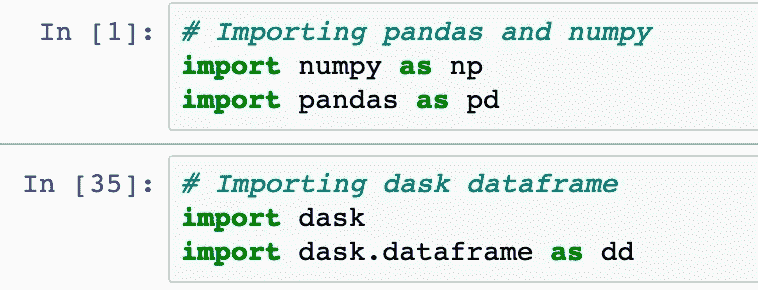

**计算运行时间和文件大小的代码:**

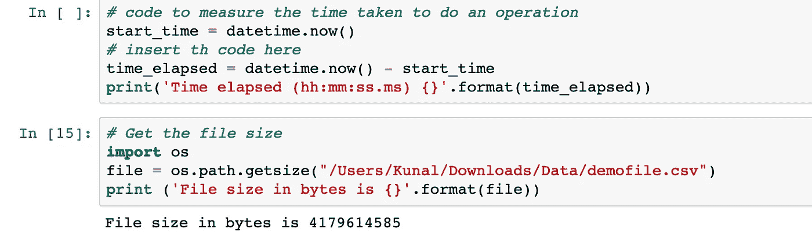

第一个代码片段是计算我们在这里执行的操作所用的时间，例如:读取文件。在第二个片段中，我们显示了我们将在这个演示中使用的文件大小。文件大小约为 4GB。

> 首先，我们将看到一些东西 Dask
> 
> 更擅长的事情，然后我们将跳到熊猫做得更好的事情。这将帮助您结合这两个库并执行您的分析。

## 关于熊猫的讨论:

**读取文件—熊猫& Dask:**

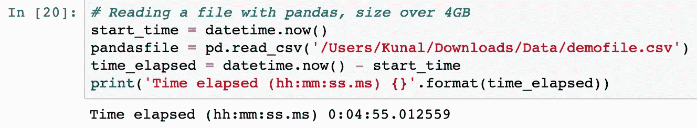

熊猫花了大约 5 分钟来读取一个 4gb 大小的文件。等等，大小并不代表一切，数据集中的列数和行数在时间消耗中起着重要作用。让我们看看 Dask 处理同一个文件需要多少时间。

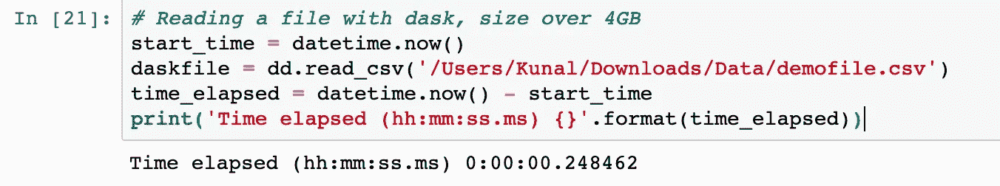

天啊，读同一个文件只花了大约 2 毫秒，而熊猫花了大约 5 分钟。是不是太神奇了？让我们对 pandas 数据帧和 dask 数据帧执行更多的操作。

**追加两个文件—熊猫& Dask:**

为了执行这个操作，我们将读取另一个文件，然后将它附加到前一个文件中。


执行上述操作大约需要 9 分钟。现在让我们看看如何使用 Dask 来优化它。

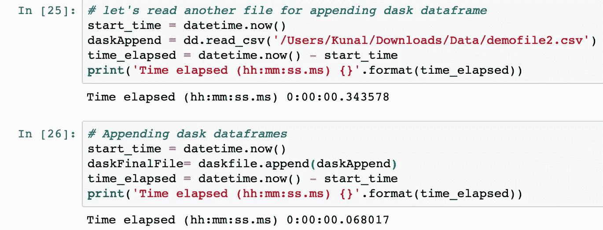

好吧，好吧，你又节省了 9 分钟。现在让我们看看其他常用的熊猫。

**数据分组—熊猫& Dask:**

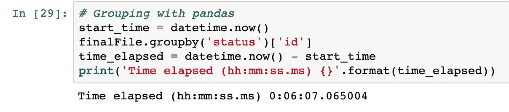

熊猫花了 6 分多钟做了一个简单的分组。让我们看看 dask 还能节省多少时间。

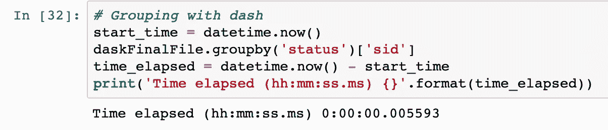

哇，你又节省了 6 分钟的欢呼时间。如果你使用 dask，还有许多其他的事情可以节省你更多的时间。

**合并数据集—熊猫& Dask:**

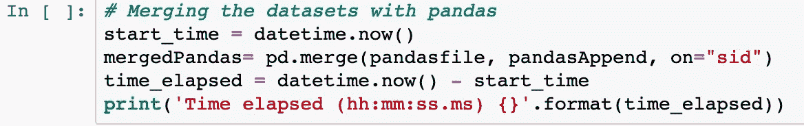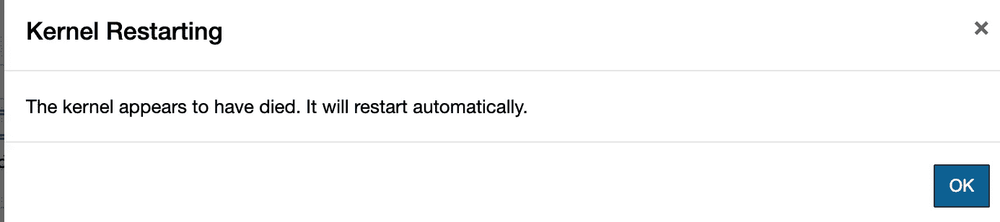

事情是这样的。它尝试了 30 分钟，仍然无法用熊猫合并这两个文件。看看用 dask 能不能做到。

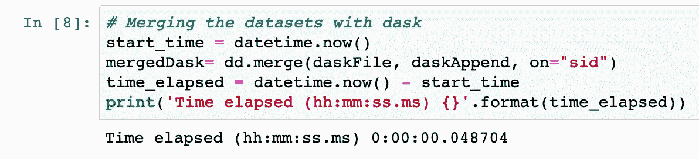

嗯，我用 dask 只花了一秒钟就搞定了。与在推断数据类型之前读入整个文件的`pandas.read_csv`不同的是，`dask.dataframe.read_csv`只从文件的开头读入一个样本(如果使用 glob，则从第一个文件开始)。然后，在读取所有分区时，会强制使用这些推断的数据类型。

## 达斯克上空的熊猫:

**分拣——熊猫& Dask:**

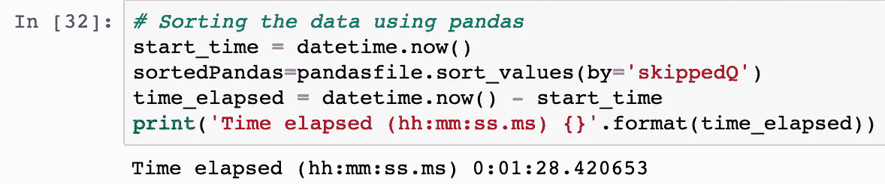

我尝试根据列中的值对数据框进行排序，这花了我大约一分半钟的时间，相当不错。让我们看看 dask 如何帮助我们。

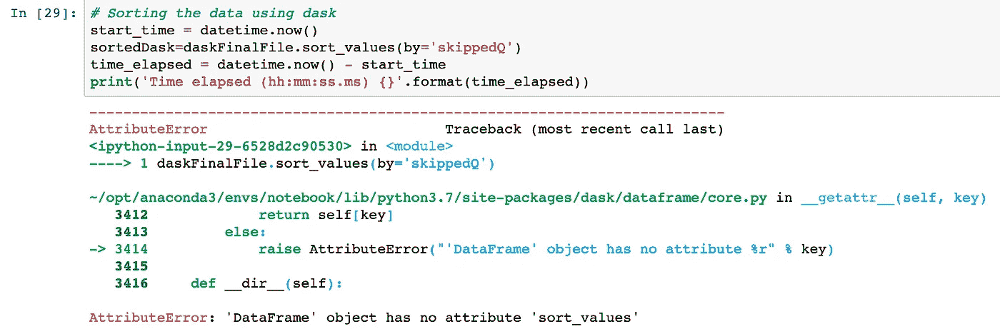

不幸的是，dask 甚至不能启动这个任务，因为 dask 没有排序功能，尽管它使用了 pandas API。熊猫万岁！

**独特的&notNA——熊猫& Dask:**

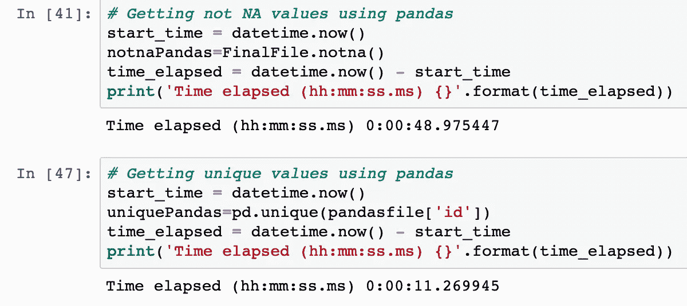

完成这些任务只需要大约 1 分钟。熊猫把大多数事情都做得很好，但也有一些事情做得不好。

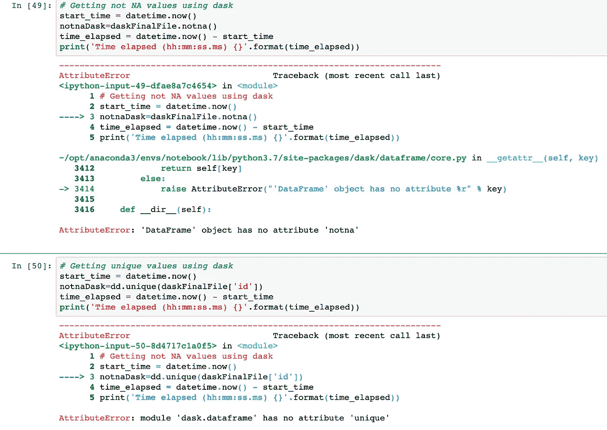

Dask 也不支持这两件事。有许多其他的事情你会用到熊猫。

**将数据帧保存到文件—熊猫& Dask:**

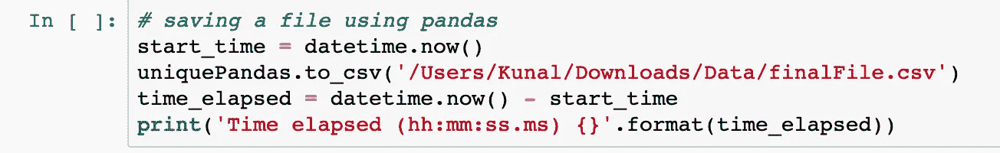

熊猫在保存文件方面做得很好。我花了大约 3 分钟保存过滤后的文件。

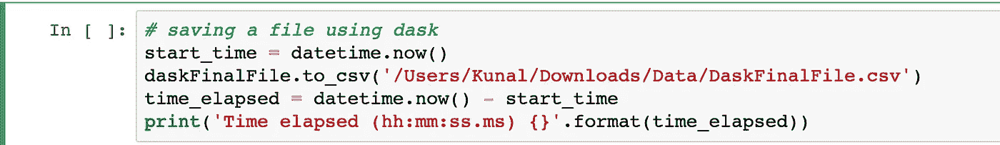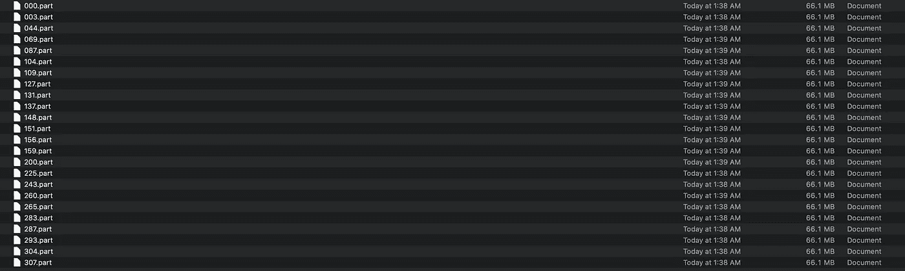

Dask 没有正确保存文件。它将文件分成多个块，并将这些文件保存在一个具有上述名称的文件夹中。另一个问题是你再也不能读取这个保存的文件了。这只是浪费时间。

将 dask 数据框保存到文件的解决方案是将其转换为类似这样的 pandas 数据框，然后将 pandas 数据框保存到文件。

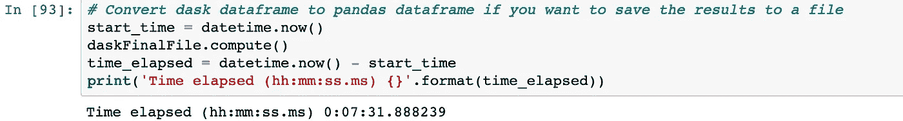

> **结论:**
> 
> 熊猫和达克一起使用总是最好的选择，因为一方可以很好地弥补另一方的不足。当单独使用时，我想你可能会遇到不同的问题。因此，我们得出结论，与 Dask 熊猫可以节省你很多时间和资源。

注意:

Dask 更快，因为在我们使用。计算()。虽然，这可以节省很多，很多时间，给我们更多的速度！

提示:

```
# Use this to make pandas run faster
pd.read_csv(filepath, engine = 'c')
```

如果你知道任何比 dask 更好的选择，请告诉我。

> ***Jupyter 笔记本(使用代码):***[*https://github . com/kunaldhariwal/Medium-12-Amazing-Pandas-NumPy-Functions*](https://github.com/kunaldhariwal/Pandas-with-Dask-For-an-Ultra-Fast-Notebook)
> 
> **领英**:[https://bit.ly/2u4YPoF](https://bit.ly/2u4YPoF)

我希望这有助于你增强你的知识基础:)

更多信息请关注我！

> 顺便说一句，你知道吗，你还可以在土星云 [**上免费使用 Dask 和 pandas，点击这里**](https://saturncloud.io/?utm_source=Kunal+Medium+&utm_medium=Pandas+with+Dask+article&utm_campaign=Pandas+with+Dask+article) ，一个云中可扩展的数据科学环境。团队可以利用强大的资源、工作、部署等进行协作。

感谢您的阅读和宝贵时间！