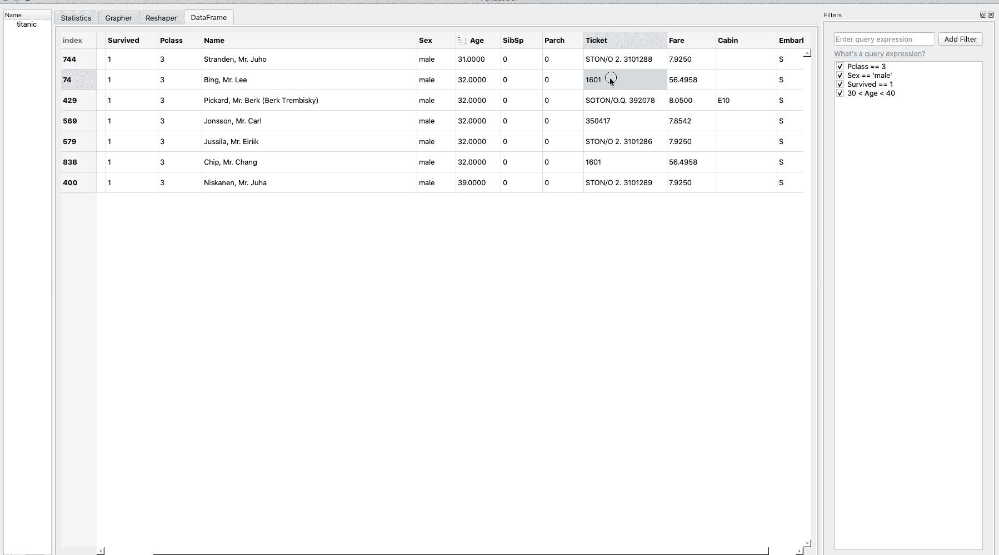

# PandasGUI:用图形用户界面分析 Pandas 数据帧

> 原文：<https://towardsdatascience.com/pandasgui-analyzing-pandas-dataframes-with-a-graphical-user-interface-36f5c1357b1d?source=collection_archive---------1----------------------->

## 只需点击鼠标即可访问熊猫数据框


图片格式由作者| [剪贴画来源](http://www.picgifs.com/clip-art/tare-panda/clip-art-tare-panda-345756-679047/)

今天 [**熊猫**](https://pandas.pydata.org/) 库已经成为用 Python 进行任何探索性数据分析的事实上的工具。它的多功能性、灵活性和易用性使其成为当今许多数据科学家的首选库。熊猫图书馆也享有很好的社区支持，因此一直在积极发展和改进。由于熊猫的这种不可或缺的性质，各种各样的工具被不时地创造出来以增强它的有效性或对它进行改进。谈到熊猫，我遇到过两种特定的工具:

*   可以用两三行代码执行基本 EDA 的工具。这些库本质上使用了熊猫的功能。例如 [SweetViz](https://github.com/fbdesignpro/sweetviz) 和 [Pandas profiling 库](https://pypi.org/project/pandas-profiling/)。
*   熊猫的基于 GUI 的替代品，例如 [Bamboolib](https://bamboolib.8080labs.com/) 。

最近，我遇到了另一个基于 GUI 的熊猫替代品，叫做 **PandasGUI。令人印象深刻的一点是，它提供了绘图和重构数据框架的能力。此外，用户也可以自由地执行自定义操作。本文将尝试解释它的各种特性和功能，以及如何将它用于您的数据。**

# 潘达斯吉

[PandasGUI](https://pypi.org/project/pandasgui/) 顾名思义，是一个用于分析熊猫数据帧的图形用户界面。该项目仍在积极开发中，因此有时可能会发生重大变化。PandasGUI 提供了许多有用的特性，我们将在本文后面详细介绍这些特性。在此之前，让我们看看如何安装这个库并让它运行起来。

## 装置

有几种方法可以安装 PandasGUI:

```
# from PyPi
pip install pandasguior# from Github
pip install git+https://github.com/adamerose/pandasgui.git
```

# 特征

现在让我们通过一个例子来看看 PandasGUI 库的各种功能。PandasGUI 已经提供了一些示例数据集。所以我们将使用库附带的`Titanic`数据集。泰坦尼克号是机器学习中一个相当著名的“Hello World”数据集，其任务是[创建一个模型，预测哪些乘客在泰坦尼克号沉船中幸存。](https://www.kaggle.com/c/titanic)

```
import pandas as pd
from pandasgui import show
from pandasgui.datasets import titanic
gui = show(titanic)
```

如果要导入数据集，可以按如下方式进行:

```
titanic = pd.read_csv('[https://github.com/adamerose/datasets/blob/master/titanic.csv](https://github.com/adamerose/datasets/blob/master/titanic.csv)')
gui = show(titanic)
```

运行以上命令后，会打开一个单独的窗口，显示上传的数据帧:


PandasGUI 中显示的泰坦尼克号数据帧|图片由作者提供

现在让我们一个接一个地看看这个工具的各种产品。

## 1.查看和排序数据帧和系列

您可以查看整个导入的数据帧，然后按升序或降序快速排序。注意，PandasGUI 也可以处理多类 datarfames。


按作者查看和排序数据帧和系列| Gif

## 2.借助查询表达式过滤数据帧

一旦浏览了数据集，您甚至可以基于一些查询表达式来过滤数据集。`[**Dataframe.query()**](https://pandas.pydata.org/pandas-docs/stable/reference/api/pandas.DataFrame.query.html)`是最初由熊猫提供的用于执行过滤操作的方法。它采用字符串形式的表达式来过滤数据，对原始数据帧进行更改，然后返回过滤后的数据帧。

对于我们的数据集，假设我们要过滤以下乘客的全部数据:

*   男性的
*   属于 Pclass 3，并且
*   在海难中幸存。


按作者过滤 Dataframe | Gif

## 3.数据编辑和复制/粘贴

这个工具的另一个很大的特点是，你可以直接编辑任何条目，甚至可以将选中的数据复制粘贴到另一个环境中，如 excel 或记事本。



作者的数据编辑和复制/粘贴| Gif

## 4.统计摘要

PandasGUI 还提供了整个数据集的压缩统计概览。


统计摘要|作者图片

## 5.交互式绘图

数据可视化是任何数据分析过程的重要组成部分，PandasGUI 提供了几个选项来快速创建一些很酷的交互式图表，如:


熊猫图形用户界面中可用的图表|作者图片

下面我们创建了一个饼图，一个条形图，甚至一个单词云。由于图表是在 plotly 中创建的，因此它们具有响应性和交互性。


互动绘图|作者 Gif

## 6.用旋转和熔化功能重塑数据帧

有时，需要重塑数据以获得更清晰的见解。PandasGUI 提供了两个函数— pivot 和 melts 来实现相同的功能。让我们看看如何通过这个工具透视数据。


通过透视方法重塑数据|作者 Gif

## 7.通过拖放导入 CSV 文件

该工具的另一个很酷的特性是，可以通过将数据帧拖动到 GUI 界面上来导入数据帧，这有时很方便。


通过拖放| Gif 按作者导入 CSV 文件

## 8.从 Jupyter 笔记本访问 GUI 数据框

如果您已经将数据帧直接导入 PandasGUI 界面，那么您也可以在熟悉的 juptyer 笔记本中访问该数据帧，只需几行代码。从那里，如果你愿意，你可以在笔记本上进行数据分析过程。


从 Jupyter Notebook | Gif 按作者访问 GUI 数据帧

# 结论

在本文中，我们看了一个基于 GUI 的工具，用于分析熊猫数据帧。这个工具有许多有趣的特性，比如过滤、排序、可视化，甚至聚合，我们在一个数据集示例中详细看到了这些特性。由于 PandasGUI 正在积极开发中，我们可能会在未来几天看到更多的功能。这样的库对于那些不太擅长编码或者正在寻找低代码环境的人来说是一个福音。无论最终目标是什么，了解另一个开源工具来添加到我们的数据科学工具包中总是有好处的。