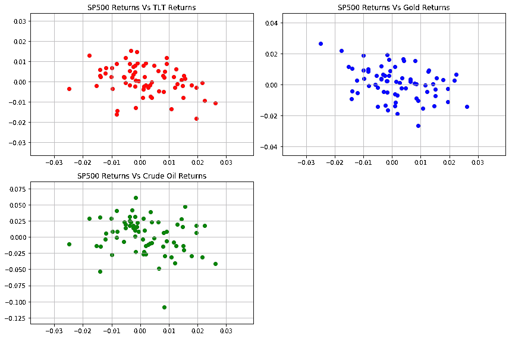
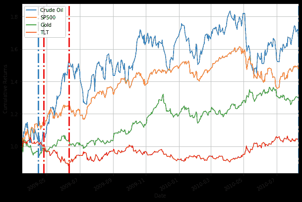

# 流行病如何影响金融市场

> 原文：<https://towardsdatascience.com/pandemics-impact-financial-markets-9a4feb6951f5?source=collection_archive---------24----------------------->

## 从过去的大流行中获得线索，定量分析对金融市场的影响。在 Python 中可视化和分析数据

我们正处于一个不确定的环境中，这也反映在金融市场上。你会有许多问题，例如 COVID19 将如何影响金融市场，它还会下跌多少，它将何时结束以及如何结束。在这篇文章中，我们将分析并从过去的大流行中寻找线索来回答这些问题以及我们对未来的预期。*本文是根据 QuantInsti 于 2020 年 4 月 2 日就此主题举办的网络研讨会撰写的。录音和代码可从下面访问。*

 [## 流行病如何影响金融市场——定量分析

### 新冠肺炎疫情已经影响了全球股市。在本次网络研讨会中，我们将从……

blog.quantinsti.com](https://blog.quantinsti.com/pandemics-impact-financial-markets-webinar-2-april-2020/) 

在我们开始深入研究对市场的影响之前，下面是我们在周围看到的或预期的新闻。

*   企业倒闭和制造工厂关闭
*   失业和失业率上升
*   供应链中断
*   日常必需品的短缺
*   医疗系统的压力
*   呈指数上升的感染和死亡人数
*   还有更多……

你已经看到商店关门，制造厂关闭。没有人生产任何东西，他们没有工资支付，所以他们解雇人，因此，失业率上升。供应链出现中断，人们开始囤积包括卫生纸在内的日常必需品。这将导致短缺。与感染相关的病例数量正在上升，这给医疗保健系统造成了巨大压力。发达市场正在某种程度上应对这种前所未有的局面，但印度等发展中市场将发现很难管理医疗体系的压力。

与此同时，金融市场大幅下跌。在这种情况下，你可能会问，我们什么时候能期待一些好消息，市场什么时候会复苏，以及许多其他问题。

# COVID19 对金融市场的影响

> 与 10 年前相比，当今市场的风险速度提高了。社交媒体驱动的新闻周期、全球供应链的相互关联性和昂贵的股票市场，使华尔街更容易受到黑天鹅的影响。
> 
> ~ Seema Shah，Principal Global Investors 首席策略师

让我们从评估 COVID19 对金融市场的当前影响开始。我使用 Python 免费提供的 API 和代码创建了本文中的所有图表。所有这些代码都可以在 [GitHub](https://github.com/QuantInsti/webinars/tree/master/Impact%20of%20Pandemics%20on%20Financial%20Markets) 上找到。

## 如果你是 Python 的新手，还没有使用过像 NumPy 和 Pandas 这样的金融库，那么我建议你在下面关于 Python 交易的免费互动课程中复习一下这些概念。

 [## Python 交易基础免费教程

### 使用不同的数据结构，如列表、元组和字典，使用循环、条件语句、函数…

quantra.quantinsti.com](https://quantra.quantinsti.com/course/python-trading-basic) 

让我带您看一下这段代码，它用于绘制标准普尔 500 的每日百分比变化。

代码如下所示:

SP500 每日百分比变化图

我使用了 pandas_datareader 的 get_data_yahoo 方法来获取 S&P500 的价格。

get_data_yahoo 方法有两个参数，第一个参数是股票代码，即 Yahoo Finance 中标准普尔 500 指数的“^GPSC ”,第二个参数是我想要的数据的起始日期。如果你查过，第一例冠状病毒是在 11 月 17 日确诊的。因此，我使用了相同的日期。

当我运行这段代码时，我将得到包含六列的数据集，它们是开盘价、最高价、最低价、收盘价、成交量和调整收盘价。由于我们对每日百分比变化感兴趣，我将使用 Python 的 pct_change()函数来计算它，并在 close 列上调用它。例如，如果每日百分比变化从 100 变为 102，那么我在该数据框中的值为 0.02。

如果您想用 Python 绘制这个系列，您只需传递系列的名称(在本例中为“data_pc ”)并调用函数 plot，它将绘制数据系列。这就是每日回报的样子。由于它看起来更小，我添加了一个网格，并做了一些改进，以提高其可读性。

## 每日百分比变化

除了 S&P500，我还绘制了原油，黄金和 TLT 的图表，这是美国市场的 20 年期国债。

我画出了它们的每日百分比变化。为了更详细地描述这些图表，蓝线是发现首例病例的日期，红线是世卫组织宣布进入公共卫生紧急状态的日期。

因此，我们可以看到 S&P500 每日价格的波动性或变化非常接近于零，我们可以看到，在世卫组织宣布紧急状态几天后，其波动性发生了急剧变化。在日常生活中，这一比例在 5%到 10%之间。此外，不仅仅是 S&P500 是美国市场的晴雨表，它也可以在原油，黄金和我们的 TLT 中看到，这是美国市场的 20 年期国债。因此，我们很容易得出结论，电晕正在使金融市场紧张不安。

观察这些图表的另一种方式是，有很多向下的运动，但也有很多向上的运动。因此，我该如何评估市场的走势呢？

## 累积回报

为此，我绘制了四个案例的累积收益。开始日期是报告第一例病例的前几天，最后一天是 3 月 30 日。

如你所见，红线代表原油，它似乎受到的影响最大。从顶部开始下降了将近 60%。表示标准普尔 500 的蓝线也出现了大幅下降。但如果你看看黄金，你会发现其影响不如 S&P500 和原油那么显著。

这是否意味着在这个不确定的时期，我们应该将黄金纳入我们的投资组合，作为一种合理的对冲手段？

似乎是这样，但我们不要这么快下结论。我们稍后将回到这个问题。最后但并非最不重要的是美国国债，它经历了急剧下降，但很快恢复。

## 水位降低

另一种方式来看这个图表是下降图。简而言之，下降衡量的是在任何特定时间段从峰值的下降。现在让我们看看图表。

例如，在 S&P500 图表中，在二月左右有一个峰值，然后下降到接近 33%。每种情况的下降值如下所示:

最大提现
原油 67.07%
SP500 33.92%
黄金 11.80%
TLT 15.72%

## SP500 与原油、黄金和 TLT 的关系

提款帮助我们理解资产类别可以下降多少，但它们仍然是不同的资产类别，对吗？我们如何比较它们，或者说，它们之间的关系是什么？

为了回答这个问题，我们将创建一个散点图。散点图有助于我们理解现有工具之间的关系。

首先，我们将绘制不同仪器相对于 S&P500 的散点图。让我们看看他们看起来怎么样。

红色散点图是相对于 TLT 的 S&P500，显示了负相关关系。我们都知道，在危机时刻，会出现经济放缓，美联储和其他政府。代理机构介入后，利率就会降低。由于费率和价格之间存在反比关系，费率的降低会导致价格的上涨。因此，我们看到了 S&P500 和 TLT 之间的这种消极关系。然而，我们有一些数据点，因此在这里下结论是不明智的。

对于黄金，我们认为与 S&P500 没有关系，因为数据点分布在该图中。当谈到原油和 S&P500 时，似乎远点是负相关的，但近点是正相关的。因此，我们在这一点上不能真正下结论。

这是在不同文书之间建立联系的一种方式。基于这些关系，我们可以创建一个在流行病时期对我们有用的投资组合。

## 部门绩效

到目前为止，我们谈论的是整个 S&P500。但是构成指数的单个板块呢？

看待这个问题的一种方式是行业表现。我绘制了一张图表，其中考虑了市场的主要部门。

**从这张图中可以看出，制药和科技是受影响相对较小的两个行业。**在上图中，技术是这条橙色的线，你可以在最上面看到，后面是蓝色的制药线。总的来说，你可以看到所有的部分都在同一个方向，但是相对幅度，或者说下降幅度，是不同的。正如我之前所说的，制药和技术受影响相对较小。

**你可以看到粉红色的线代表能源受到的影响最大。**这是合乎逻辑的，因为我们之前已经看到原油受到的影响最大，而这又反过来影响了能源行业，因为它们两者直接相关。另一个观察是绿线，这表明金融，也下降了。其原因是，每当经济放缓时，就会有大量贷款违约，导致银行不良资产增加，最终它们的损益将受到打击。不良资产的增加使银行很难生存。印度市场的一个经典例子是 Yes bank。因此，在这场经济危机中，金融部门首当其冲。

**这是否意味着我们应该忽略金融类股，转而投资科技和制药类股，我的投资组合应该是什么样的？**

除此之外，我们都有如下所示的问题:

*   什么时候会结束？
*   会如何收场？
*   市场会从这里进一步下跌吗？它将如何发展？
*   我应该买黄金作为避风港吗？我的作品集应该是什么样的？
*   它如此具有传染性，每个人都会受到它的影响吗？
*   收益会受到怎样的影响，哪个部门会受到最大的影响？

让我们通过回顾过去的大流行和世界的发展来回答这些问题。我想在这里补充一个小小的免责声明，我没有任何水晶球可以给我一个 100%正确的答案，但我相信数据永远是得出合理结论的最佳方式。让我们现在开始吧。

# 过去的大流行

> "那些不记得过去的人注定要重蹈覆辙。"
> 
> ~乔治·桑塔亚纳

如果你认为这是一个特殊的情况，那么，你会惊讶地知道，自过去几个世纪以来，流行病一直在影响着我们。我在一个简单的表格中收集了一些数据，如下所示

来源:[世界经济论坛](https://www.weforum.org/agenda/2020/03/a-visual-history-of-pandemics/)

我用红色标出了死亡人数最多的三种流行病，绿色标出了死亡人数最少的四种。

这里出现了一个重要趋势。你能搞清楚吗？

这里实际上出现了两种趋势。一个是这些年来死亡人数显著下降。另一个趋势是期限也大幅缩短。这是因为我们有了一个更好的医疗保健系统，同时我们也付出了很大的努力来为大众寻找和部署疫苗。

但这是对过去的回顾。**冠状病毒是如何影响感染和死亡人数的？**让我们快速了解一下冠状病毒的传染性有多大

来源:[世界经济论坛](https://www.weforum.org/agenda/2020/03/a-visual-history-of-pandemics/)

**这张信息图告诉了你什么？**

它向我们展示了感染传播的速度。麻疹是这里 16 岁的头号杀手。这意味着一个患麻疹的人可以感染 16 个未接种疫苗的人。相比之下，冠状病毒为 2.5，这意味着一个感染冠状病毒的人平均可以影响 2.5 人。

但是为什么我们会看到病例数量呈指数增长呢？

我想用我们的投资世界做一个类比，并引起你对复利的注意。一个人在第一天就会受到影响。所以第二天 2.5 将受到影响。第三天，我们将会看到大约六个人被感染。这六个人会在 15 左右再次冲击(6*2.5)。以这种方式，受感染的人数呈指数上升。

遏制这种情况的最好方法是社会距离，这是世界上大多数政府所遵循的。

# 这件事会如何收场？

> 过去的表现是成功的最佳预测
> 
> ~吉姆·西蒙斯

实际上，这里有两种情况我想谈谈。先说第一个。

# 场景 1:采取严格措施

# 严重急性呼吸综合征

在我们的历史上有一个类比，它是关于非典疫情。SARS 具有类似的性质，它于 2002 年在中国南方爆发。通过我们在周围看到的隔离、检疫和接触者追踪措施，疫情得到了控制。

在这个疫情，大约有 8500 人被感染。目前，还没有疫苗，但他们能够通过社会距离来控制这种情况，新感染的数量持平，因此，死亡人数最终减少。但是，尽管识别感染 SARS 的人很容易，但对于冠状病毒携带者来说就有点棘手了。尽管如此，我们还是可以以此为参考来理解冠状病毒对行业的影响。

来源:英国《金融时报》

在这里，我们累计计数，以及自第 100 例以来的天数。您还可以看到案例每天翻倍、第二天翻倍等等的轨迹。

例如，美国用了 24 天达到 100，000 次计数，其他国家也是如此。这里的目标是使这个指数上升曲线尽快变平。在这里，让我把你的注意力放在韩国的泥土上，他们把它弄得很平，在非典时期也做了类似的事情。现在让我们看看图表。

来源:[维基百科](https://en.wikipedia.org/wiki/Severe_acute_respiratory_syndrome)

这是从维基百科上截取的，在这里你可以看到累积的病例以橙色线的形式，代表 8437。最初，从 4 月到 5 月，病例数呈指数增长，但由于社会距离和其他措施，增量病例数开始减少。这创造了一个“S”或我们在上面看到的逻辑曲线。死亡率遵循橙色曲线并趋于平缓。

如果我们认为 SARS 是冠状病毒的一个很好的类比，那么下面的时间表将有助于我们理解当前的情况会如何发展。

来源:[疾病预防控制中心](https://www.cdc.gov/about/history/sars/timeline.htm)

让我们看看金融市场在 SARS 爆发期间的表现。

来源:雅虎财经和 GitHub 代码

这是我们正在使用的四种工具的相同的每日百分比变化。回想一下，原油、标准普尔 500、黄金和 20 年期美国国债。因为这是一种在中国流行的疾病，所以我们认为对金融市场的影响较小，但红线表明何时宣布这是一种可能的卫生紧急情况。你可以看到两个方向都有一些剧烈的波动，表明波动性增加了。下面的图表将使它更加清晰。

来源:雅虎财经和 GitHub 代码

你可以看到原油在此期间大幅下跌，但与冠状病毒相比，S&P500 受到的影响相对较小。黄金和 TLT 的情况也是如此。

让我们看看这一时期的提款情况。

来源:雅虎财经和 GitHub 代码

你可以看到下降相当严重。在此期间，S&P500 约为 15%，原油约为 30%。但金价又回到了 15%左右，美国国债下跌了 5%左右。我应该指出的是，由于疫情得到了很好的控制，下降幅度没有我们现在看到的那么大。

我们将尝试相关性分析，我们看到一切都与 S&P500 负相关。

来源:雅虎财经和 GitHub 代码

这不是正确的数据，因为这种流行病发生在中国。一个更好的衡量标准是将其与上证综指进行比较。但尽管如此，我们看到这段时间 S&P500 和美国国债、黄金和原油的负相关性非常高。

让我们看看危机结束后事情会如何发展。

来源:雅虎财经和 GitHub 代码

蓝色阴影区域是世卫组织宣布危机已经避免的时候。你可以看到，虽然在世卫组织宣布进入紧急状态后有相当大的跌幅，但指数实际上恢复得相当快，而且自这种情况发生以来的天数也相当短。

为简单起见，我仅采用了四种工具，您可以使用自己的本地指数进行任何您可能想要进行的相关性分析。请在评论中与我分享你的见解。

控制 SARS 的措施与控制冠状病毒的措施相似。事实上，它处理得非常好，因此它没有从中国传播出去。

我们将看到 3 月 26 日世卫组织宣布紧急状态后的结果。

来源:雅虎财经和 GitHub 代码

一定要明白，这是一个月、三个月、半年和一年的回报。你可以看到，标准普尔 500 的回报率非常强劲，在各个时间段分别为 5%、10%、15%和 25%。对其他人来说也是类似的情况。这里，CL=F 代表原油期货，GC=F 代表黄金期货，TLT 代表国债。

如果你要问哪些行业受影响最大，以及危机过后该行业的表现如何，我试图用这张图表来回答这个问题。

来源:英国《金融时报》和摩根大通

您可以看到，受影响最大的行业位于顶部，回报为正或受影响最小的行业位于底部。这张图是摩根士丹利资本国际中国板块。如你所见，受影响最大的是耐用消费品、软件、酒店、餐厅和休闲以及航空公司。受影响最小的是医疗保健、食品、饮料和烟草。深蓝色表示该行业在危机期间的表现，浅蓝色表示该行业在危机后的表现。你可以看到，食品和饮料不仅在危机期间有正回报，而且在疫情结束后也延续了这种积极的表现。这给了我们一些线索，比如快速消费品或日常必需品中的产品是我们可以寻找的，类似的医疗保健和制药公司也显示出类似的趋势。有趣的是，在疫情结束期间和之后，零售业呈现出负面趋势。

因此，如果我们认为这种情况很有可能发生，那么你就会知道哪些行业将出现健康复苏，哪些行业将需要更多时间才能复苏。

在这种情况下，我们能够通过强有力的措施控制疫情。我们现在将进入下一个场景。

# 场景 2:疾病广泛传播

来源:[维基百科](https://en.wikipedia.org/wiki/Influenza_pandemic)

类似的事情在过去也发生过。我们正在谈论始于第一次世界大战期间的西班牙流感，它影响了近 56%的世界人口。

另外两个是亚洲流感和香港流感，影响了大约 50 万人。为了比较，我给出了冠状病毒的数字。这些数字可能不是最近的，但它可以帮助比较现在和过去的情况。

# 猪流感

对于第二种情况，我们将与始于 2009 年、影响了大约 20%人口的猪流感进行类比。让我们看看这一时期的财务影响。

这是猪流感的时间表。

来源:[疾病预防控制中心](https://www.cdc.gov/flu/pandemic-resources/2009-pandemic-timeline.html)

现在让我们看看金融市场。

来源:雅虎财经和 GitHub 代码

蓝线是第一个病例报告的时间，红线是世卫组织宣布紧急状态的时间。

因此，你会看到与目前市场上看到的截然不同的情况，因为市场正在从 2008 年金融危机中复苏，而股票在那个特定时期被大幅低估。因此，这些运动不像我们现在看到的那样剧烈。

来源:雅虎财经和 GitHub 代码

但是尽管如此，当疫情宣布的时候，在红线之后有原油的下降。黄金和标准普尔 500 也是如此。只有 TLT 在上升，原因是美联储降低了利率以支持经济。

让我们现在检查一下提款。

来源:雅虎财经和 GitHub 代码

最大下降

原油-21.68%
SP500 -16.00%
黄金-13.56%
TLT -14.37%

所以标准普尔 500 在疫情宣布后下降了 6%。原油下跌了 18%左右，黄金下跌了 7%左右，TLT 下跌了 13%左右。然而，出现了多次波动，虽然最初并不认为它很严重，但它开始蔓延到美国的许多人。因此，我们看到许多人不是在疫情宣布时而是在后来的某个时候跌倒的。

现在让我们看看散点图告诉我们什么。

来源:雅虎财经和 GitHub 代码

在这里，你可以看到一个清晰的关系出现在资产类别中。例如，标准普尔 500 和 TLT 是负数，这意味着如果 TLT 上升，S&P 500 将下降。与黄金的关系并不明确，因此我们不能确定黄金是否是一个安全的避风港。

对于原油，我们看到两者之间的正相关关系，这意味着如果 S&P500 下跌，原油价格也会下跌。

总而言之，S&P500 与原油正相关，与 TLT 负相关，与黄金无关。

让我们看看在世卫组织说一切都好之后事情会变成怎样。

来源:雅虎财经和 GitHub 代码

正如我们之前看到的，蓝色阴影区域是在世卫组织宣布疫情结束之后。你可以看到回报相当可观。数据是申报后一年的，这些是回报。请记住，回报是从报告第一个案例的开始日期开始计算的。

从第一次约会返回

原油 73.62%
SP500 42.20%
黄金 29.89%
TLT -10.46%

因此，当一切都理清了，市场试图赶上，并进入牛市模式，一切看起来都非常正常。让我们以条形格式查看回报，以示强调。

来源:雅虎财经和 GitHub 代码

在这里，您可以看到所有仪器在时间范围内的性能。

我们来看看板块表现。

来源:雅虎财经和 GitHub 代码

有趣的是，与前一种情况不同，这里的金融部门表现相对较好，实际上处于领先地位。原因基本上是，自猪流感疫情爆发一年后，世界陷入了经济衰退，导致大量抛售，并导致金融市场被低估。科技股也是类似的情况。

能源行业在疫情期间受到了严重影响，但在形势好转后大幅反弹。这类似于我们之前看到的原油反弹。

# 亚洲型流感

来源:雅虎财经和 GitHub 代码

来源:雅虎财经和 GitHub 代码

我希望这能让人们对目前的形势有所了解。事实上，再做一个练习，让我们看看亚洲的流感疫情。

以下是 S&P500 的表演。

在这里，红线表示它开始在美国传播的时间。蓝色区域是在世卫组织宣布它结束之后。

同样的故事也发生在提款上，在世卫组织宣布公共紧急状态后，我们看到最高提款率为 20%。

# 香港流感

现在来看看香港流感告诉我们什么。

来源:雅虎财经和 GitHub 代码

红线表示世卫组织宣布紧急状态的时间，而蓝色阴影区域显示世卫组织宣布紧急状态结束后的时间。

在提款方面，我们看到最大提款率为 35%。

来源:雅虎财经和 GitHub 代码

这里的一个重要观察是，市场不喜欢不确定性。因此，当宣布紧急状态时，市场急剧下跌。但一旦我们采取了必要的措施来控制局势，一旦世卫组织宣布它是安全的，市场就会立即做出反应，反弹到危机前的水平，在某些情况下甚至超过危机前的水平。

# 西班牙流感

让我们看看西班牙流感给我们的启示。西班牙流感可以说发生了三波。1918 年 6 月和 7 月，然后是 1918 年 10 月至 12 月，最后是 1919 年 1 月至 3 月。我用的是道琼斯指数，S&P500 是 1927 年创建的。你可以看下面的表现。

来源:[宏观趋势](https://www.macrotrends.net/1319/dow-jones-100-year-historical-chart)

你可以看到，即使在西班牙流感最严重的时期，市场也在上涨。原因是，类似于猪流感，有一个更大的事件影响了市场，这就是第一次世界大战。1918 年西班牙流感来袭时，世界正从结束的第一次世界大战中恢复过来。这就是市场上升趋势的原因。

# 第二次世界大战

作为题外话，下面是第二次世界大战对金融市场的影响。

来源:雅虎财经和 GitHub 代码

V 形类似于我们过去看到的图表，只是恢复的时间不同。

来源:雅虎财经和 GitHub 代码

我们知道第二次世界大战结束于 1945 年，但市场从 1942 年开始上涨。正如我之前所说，市场不喜欢不确定性。这就是为什么市场跌破，但在 1942 年，盟军已经走到一起，并开始规划一个协调的计划，以击败敌人。因此，市场考虑了这一信息，因此，一旦我们确定了计划，市场就开始复苏。这里可以看到的最大下降幅度约为 43%。

# 要素投资

在当前形势下，你会如何投资？一种新兴的方法是要素投资。因素的一个例子是动量，它表示如果任何东西在一年内上涨，它将继续上涨。

让我们看看 COVID19 期间一些因素的表现。

来源:[范弗利特，皮姆和巴尔图森，圭多，股票风格和西班牙流感(2020 年 3 月 30 日)](https://ssrn.com/abstract=3564688)

从 1 月到 3 月 20 日，各种因素的月度表现如上所示。

**在这里你可以看到，当其他投资者普遍持消极态度时，基于动量的因素投资却跑赢了市场。在某种程度上，即使是低波动性也跑赢了市场。但这种情况会持续下去吗？**

基于目前的表格回答这个问题其实很难。让我们试着看看过去事情是如何发展的。

来源:[范弗利特，皮姆和巴尔图森，圭多，股票风格和西班牙流感(2020 年 3 月 30 日)](https://ssrn.com/abstract=3564688)

我们可以看到，虽然动量接近市场(黑色)，小盘股表现不佳。但在复苏阶段，小盘股的表现优于所有其他形式的投资。你还可以看到，在复苏阶段，动量和低波动股票的表现不如市场。

但到目前为止，我们已经看到了与流行病相关的数据。我将尝试展示 1926 年之前，或者更具体地说是 1872 年至 1918 年之间发生的市场调整数据。这些调整并不完全与大流行有关，但它们是一个非常不确定的时期，让我们看看这将如何发展。

来源:[范弗利特，皮姆和巴尔图森，圭多，股票风格和西班牙流感(2020 年 3 月 30 日)](https://ssrn.com/abstract=3564688)

正如我们之前看到的，低波动性和基于动量的投资不会像市场那样下跌，但在复苏阶段也不会跑赢市场。相比之下，小盘股在调整阶段跌幅大于大盘，但在复苏阶段的表现优于大盘。

# 这什么时候会结束？

> 哈克特金融公司对流行病的研究表明，大多数重大病毒爆发，如 1665 年的大瘟疫和一个多世纪前的西班牙流感，都在 3 个月内发生。换句话说，那些糟糕的事件主要在 12 周内来来去去。

考虑到过去的数据显示，世卫组织宣布安全的天数已经减少，我们可能需要三到六周的时间。

猪流感:116 天
非典:101 天

然而，我怎么强调社交距离的重要性都不为过。世界各地的政府应该积极主动地施加社会距离。事实上，以下是西班牙流感在美国蔓延时美国各城市的图表。

来源:国家地理

阴影区域是实施封锁的时间，你可以看到死亡人数迅速下降。因此，社交距离对于克服这种危机是非常有效的。

# 如何保护你的股票重投资组合？

如果你在考虑你的投资组合，那么 TLT 是有意义的，因为它与 S&P500 负相关。你应该避开原油，因为由于当前的危机，对原油的需求可能会减弱。

*注意:在采纳任何建议之前，您应该咨询财务顾问。*

# 摘要

唷！我们经历了相当多的场景。让我们试着用表格总结一下。

来源:雅虎财经和 GitHub 代码

您可以看到，在缩减方面，COVID 排名第三，为 33%。但如果你在六个月后检查回报，它们看起来真的很有希望。这将让您对 COVID 19 后 6 个月和一年后的回报有所了解。

***来自《走向数据科学》编辑的提示:*** *虽然我们允许独立作者根据我们的* [*规则和指南*](/questions-96667b06af5) *发表文章，但我们并不认可每个作者的贡献。你不应该在没有寻求专业建议的情况下依赖一个作者的作品。详见我们的* [*读者术语*](/readers-terms-b5d780a700a4) *。*

# 来源和参考

1.  [大英百科全书](https://www.britannica.com/event/Hong-Kong-flu-of-1968)
2.  [疾控中心](https://www.cdc.gov/flu/pandemic-resources/index.htm)
3.  [世界卫生组织:世卫组织](https://www.who.int/)
4.  雅虎财经
5.  金融时报
6.  世界经济论坛
7.  [医药网](https://www.medicinenet.com/script/main/art.asp?articlekey=26428)
8.  [源代码](https://github.com/QuantInsti/webinars/tree/master/Impact%20of%20Pandemics%20on%20Financial%20Markets)
9.  维基百科(一个基于 wiki 技术的多语言的百科全书协作计划ˌ也是一部用不同语言写成的网络百科全书ˌ 其目标及宗旨是为全人类提供自由的百科全书)ˌ开放性的百科全书
10.  摩根大通
11.  [霍华德·马克斯备忘录](https://www.oaktreecapital.com/insights/howard-marks-memos)
12.  [NCBI](https://www.ncbi.nlm.nih.gov/books/NBK92460/)
13.  [世界经济论坛](https://www.weforum.org/agenda/2020/03/a-visual-history-of-pandemics/)
14.  摩根大通
15.  [van Vliet，Pim 和 Baltussen，Guido，股票风格和西班牙流感(2020 年 3 月 30 日)](https://ssrn.com/abstract=3564688)
16.  [国家地理](https://api-nationalgeographic-com.cdn.ampproject.org/c/s/api.nationalgeographic.com/distribution/public/amp/history/2020/03/how-cities-flattened-curve-1918-spanish-flu-pandemic-coronavirus)
17.  熊猫数据阅读器