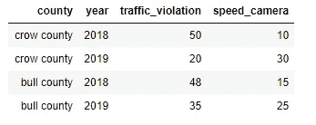
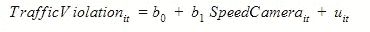
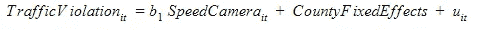
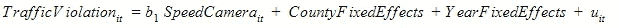
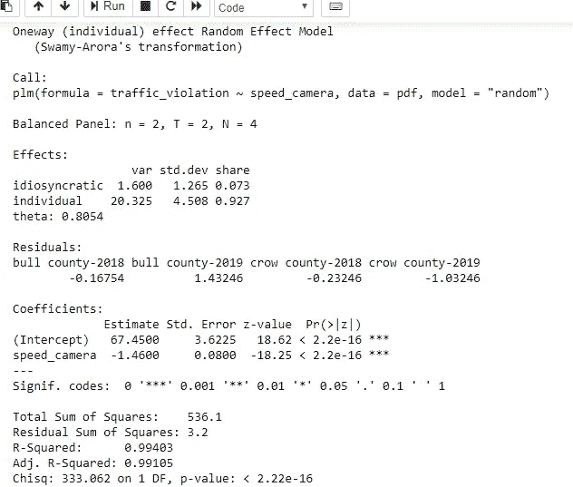

# 面板数据回归:一种强有力的时间序列建模技术

> 原文：<https://towardsdatascience.com/panel-data-regression-a-powerful-time-series-modeling-technique-7509ce043fa8?source=collection_archive---------2----------------------->

## 在数据科学和机器学习问题中应用计量经济学


弗兰基·查马基在 [Unsplash](https://unsplash.com?utm_source=medium&utm_medium=referral) 上拍摄的照片

在[之前的一篇文章](/econometrics-101-for-data-scientists-584f4f879c4f)中，我简要提到了面板数据模型；在这篇文章中，我将通过一些技术细节对此进行更深入的探讨。正如我在那篇文章中所说的，**计量经济学拥有数据科学家工具箱中一些最重要的工具**。它有许多用例——从测量[温度变化对农业的影响](https://www.tandfonline.com/doi/abs/10.1080/17565529.2014.989189?journalCode=tcld20)到时间序列数据建模和[预测](https://www.sciencedirect.com/science/article/abs/pii/S0304407618302112)。

# 什么是面板数据？

那么到底什么是面板数据呢？首先，让我们来看看下面的定义:

> **面板数据**是随时间重复测量的观察的多维数据。

这是一个单行的定义，但是有很多内容需要解释。该定义隐含地描述了面板数据集的三个关键属性:

*   特性 1:重复观察相同的对象/个人
*   特性 2:对那些相同的个人/对象测量多个变量
*   特性 3:观察发生在多个时间点

为了说明这些属性，下面是一个假设的(我在运行中创建的)数据集，有 4 列 4 行。



*   数据集包含两个(假想的)美国县的 4 个观测值-克劳县和布尔县(属性 1)。
*   对于每个县，测量了 2 个变量—安装的速度摄像头的数量和交通违规的数量(属性 2)。
*   最后，测量发生在 2 个不同的离散时间点——2018 年和 2019 年(属性 3)。

多酷啊！

# 面板数据回归技术

我现在将继续描述面板数据建模技术如何回答特定的问题。假设使用上述 4 x 4 数据集，我们想要回答以下问题:

> **安装的测速摄像头数量对交通违章案件数量有影响吗？**

如果我们运行简单的线性 OLS 回归，我们应该能够快速检查两个变量之间的关联(如果有的话):

*traffic _ violation = f(speed _ camera)*

然而，请记住，这不是普通的数据集，这是一个面板数据。这意味着我们可以比运行简单的 OLS 回归更有效地使用它。

怎么会？

首先，我们不应该忘记自变量还有另外两个属性——county 和 year。这意味着个体和时间维度存在差异，我们可以在更高级的模型中捕捉到这种差异，我们称之为 ***面板数据回归*** 。

面板数据模型(即估计量)有三种主要类型，下面简要介绍它们的公式。

**a)汇集 OLS 模型**

混合 OLS(普通最小二乘)模型将数据集视为任何其他横截面数据，并忽略数据具有时间和个体维度。这就是假设与普通线性回归相似的原因。



**b)固定效果模型**

虽然安装速度摄像头可能会对交通违规产生影响，但由于速度摄像头以外的原因(例如，高速公路巡逻率较高),每个县的交通违规情况也可能有所不同。).然而，这并没有反映在上述 OLS 模型中。固定效应模型更进了一步，它考虑了个体实体(在我们的例子中是县)之间的差异:



**c)随机效应模型**

在固定效应模型中，我们控制了各个县之间的差异。但是那些在个体中不变但随时间变化的变量呢？随机效应模型考虑了这些个体变化*以及*时间相关变化。该模型消除了变量的偏差，这些偏差是无法观察到的，并且会随着时间的推移而变化。



# 履行

真的只是几行代码(假设你已经完成了数据角力的另外 80%的工作！).是镇上最好的 R 库，只需三个简单的步骤就能实现你的模型:(1)输入数据；(2)将数据转换成面板数据帧；(3)实现您指定的模型。

```
# import package
library(plm)
# import data 
df =   read.table("../data.csv")
# convert the data frame to a data format recognizable by `plm` 
pdf = pdata.frame(df, index = c("county", "year"))
# specify and run the model
model = plm(traffic_violation~speed_camera, data = pdf, model = "random")summary(model)
```



## 最终注释

数据科学是一个不断发展的学科，来自许多学科的各种工具和技术丰富了它。计量经济学提供了传统上用于社会和经济研究的工具，但也增加了数据科学的价值。对于那些感兴趣的人来说，两本开放存取的书可以让你开始计量经济学和高级社会科学研究:

*   [计量经济学导论与 R](https://www.econometrics-with-r.org/) 与
*   [带 R 的计量经济学原理](https://bookdown.org/ccolonescu/RPoE4/)。

这两本书以通俗易懂的方式描述了复杂的技术，以及 R 编程语言的应用和实现。