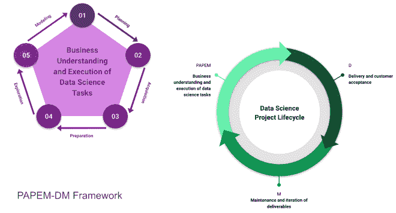

# PAPEM-DM:迈向数据科学胜利的 7 个步骤

> 原文：<https://towardsdatascience.com/papem-dm-7-steps-towards-a-data-science-win-f8cac4f8e02f?source=collection_archive---------76----------------------->

## 数据科学项目生命周期

## 数据科学管道的高级概述。

# 介绍

在这篇文章中，我将尝试分解成功的数据科学项目所涉及的步骤:从理解业务需求到维护您的数据科学团队最终产生的任何数据产品。在这个过程中，我们将讨论每个步骤的要求以及每个步骤所必需的技能和工具。

# PAPEM-DM:数据科学框架

我第一次了解数据科学管道是在参加 [Codeup](https://codeup.com/) (完全沉浸式、基于项目的 20 周数据科学和 Web 开发职业加速器)时。从那以后，我阅读了无数的文章，列举了数据科学项目中涉及的步骤，但我还没有遇到一篇包括所有这些步骤的文章。因此，这篇文章。

PAPEM-DM 是一个方便的首字母缩写词，是我自己编的，用来提醒我的步骤:计划、获取、准备、探索、建模、交付和维护。这应该从头到尾涵盖数据科学流程的所有主要步骤。如果我错过了什么重要的东西，请告诉我！哦，等等，他们都很重要…所以评论吧！LOL。

# 规划

在这第一步，我们必须确定需要解决的问题。大多数利益相关者和最终用户讲的是业务，而不是数据科学；通常情况下，他们问的问题要么太笼统，要么太具体，无法解决需要解决的实际问题。当开始一个新的项目时，重要的是在迷失在杂草中之前先了解事情的商业方面。

在《用数据思考的*一书中，马克斯·史隆主张先回答“为什么”，再弄清楚“如何”他建议使用由背景、需求、愿景和结果组成的 CoNVO 框架。有哪些情况或术语可以更好地理解或解释问题？利用数据可以满足哪些特定需求？一旦项目达到目标，它会是什么样子？最后但同样重要的是，项目的可交付成果将如何在组织内使用，谁将拥有或维护它？*

*这一步不需要特别的工具，但这并不意味着它不重要。事实上，这一步非常关键，因为它可能意味着您的数据科学项目的成败。*

*这一步的可交付成果是对您想要完成的事情和成功的衡量标准的清晰描述。*

# *获得物ˌ获得*

*这一步包括获取原始数据，您需要这些数据来洞察您所面临的问题。它要求您考虑从哪里以及如何获取数据，以及这是一个手动还是自动的过程。*

*您需要的工具将取决于数据源(数据将来自哪里)和您的工作环境。例如，如果数据已经存在于数据仓库中，那么获取数据可能仅仅意味着使用 SQL Alchemy 连接到您的数据仓库(如 Redshift ),并通过 Pandas dataframe 将其加载到您的 Python 环境中。另一方面，如果数据是通过电子邮件定期发送的，您可能希望使用 Fivetran 等连接器服务首先将文件加载到 Redshift 中，然后使用 Microsoft Power BI 等业务分析工具连接到 Redshift 集群。如果一个项目是一次性的特别请求，那么这个过程可能仅仅意味着检索一个平面文件(。csv，。tsv，甚至。xlsx ),然后将其直接加载到 Pandas 数据帧中，以便在 Jupyter 笔记本中进行进一步处理。另一种直接的方法是从 Salesforce 或 Zendesk 等 CRM 平台中手动提取数据。*

*无论是哪种情况，这一步的结果都是一个数据集，可以被您选择的武器(或工具)处理。*

# *准备*

*真实世界的数据通常是杂乱的，在进行分析之前需要清理和处理。数据准备就是将我们从上一步获得的原始数据转换成一种格式，使我们能够收集见解。该步骤中涉及的一些过程通常包括处理缺失值、null 值、NaN 值和重复值。根据项目的性质，这些可能需要估算或完全放弃。还需要处理数据类型以及日期时间冲突。此外，您可能还需要将几个数据集合并到一个大规模的表或数据框架中，或者甚至将大量的列精简为几列。*

*同样，所需的工具将根据您的工作环境而有所不同。对于 Python，您可能使用的库是 Pandas、matplotlib 和 scikit-learn。如果您正在使用 Power BI，您很可能会使用它的 Power 查询编辑器和 DAX 公式，请记住，在连接和合并工作之前，表之间的关系也必须正确定义。如果您的组织使用 Fivetran，您可以在分析之前使用它的“转换”特性来执行一些 SQL 查询。*

*一旦您完成了清理和准备工作，您就可以进入下一步:探索性数据分析。*

# *探测*

*根据 [*工程统计手册*](https://www.itl.nist.gov/div898/handbook/eda/section1/eda11.htm) ，探索性数据分析，简称 EDA，是一种采用多种技术进行数据分析的方法，目的是:*

*   *最大限度地洞察数据集；*
*   *揭开底层结构；*
*   *提取重要变量；*
*   *检测异常值和异常值；*
*   *测试基本假设；*
*   *开发简约的模型；和*
*   *确定最佳因子设置。*

*换句话说，这一步是你开始处理数据以发现有趣的模式、异常，并发现哪些特征或变量是你最大的驱动因素。*

*特征工程和预处理也是这一步骤的主要组成部分。对于 Python，可以使用 Pandas、scipy、numpy、statsmodels 和可视化库，如 matplotlib、seaborn、plotly 和 bokeh。*

*在这一步结束时，您不仅应该有一个可以在机器学习模型中使用的格式的数据集，而且还应该回答在规划步骤中解决的一些问题。*

# *建模*

*这是数据科学项目生命周期中最受欢迎的部分。在建模过程中，我们将经过清理和处理的数据用于训练和测试一个或几个机器学习算法，以便进行预测。*

*机器学习算法的类型包括回归，分类，聚类，异常检测，时间序列预测，以及我最喜欢的:自然语言处理或 NLP。*

*这一步涉及的任务有:*

1.  *将数据分成训练集和测试集*
2.  *确定最适合项目特定用例的机器学习模型*
3.  *训练模特*
4.  *基于训练集进行预测*
5.  *评估训练集的结果*
6.  *调整超参数*
7.  *冲洗并重复*
8.  *选择性能最佳的型号*
9.  *基于测试集进行预测*
10.  *评估测试集的结果*

*有太多的机器学习算法，由数据科学家根据特征(变量)和目标(我们试图预测的东西)的性质来选择使用哪一种。*

# *交付*

*训练和评估一个机器学习模型很好，但迟早，你需要让其他人使用你发现或开发的东西。数据科学项目的交付成果可以像幻灯片一样简单，报告您的探索性数据分析的结果，并对后续行动提出建议。另一个是自助仪表板，其他人可以使用它来促进基于数据的管理。您可以在数据库中生成另一个可用于实时报告的表。最后但同样重要的是，您可以开发一个应用程序，使用您训练好的模型根据新的观察结果进行预测。例如，处理与客户的聊天记录以预测他们的满意度或当前情绪的机制。*

*这一步所需的工具将取决于项目可交付成果的类型。所需的技能可能很简单，比如在使用 AWS 或 Azure 等服务的无服务器环境中采用讲述故事的技术或成熟的管道部署。技术能力也是决定您可以交付何种类型的数据产品的一个因素。这也是为什么与数据工程团队保持良好的工作关系至关重要。事实上，在一个完美的世界里，数据科学家和数据工程师应该步调一致。*

*在我们今天生活的这个敏捷世界中，今天发布一个最低可行产品(MVP)比明天发布一些完美的产品更有益。*

> *“现在发货，以后迭代。”*
> 
> **–查纳**

# *维护*

*维护数据科学项目需要对管道中的每个组件保持警惕。它有助于从头到尾回顾和检查任何会影响项目的变更。例如，数据的形状和结构可能会改变，这将影响您的预处理脚本。确保您知道您使用的包和库的安全漏洞，并相应地更新每一个包和库，同时确保不破坏项目依赖性。此外，随着新技术的出现，寻找改进管道的机会(如自动化)。*

# *结论*

*这篇文章已经很长了。概括地说，在规划和执行数据科学项目时，使用 PAPEM-DM 框架。请注意，框架中的步骤并不是相互隔离的。通常情况下，你会发现自己在以一种迭代循环的方式而不是顺序地做这些步骤。例如，您可能希望在建模后进行更多的探索，因为您在结果中发现了一些有趣的东西，并且希望深入研究。只是不要在杂草中迷失太多！*

*今天到此为止！*

*您对数据科学项目生命周期有什么样的体验？当从开发切换到生产时，这个框架会如何变化或保持不变？请留言，多多益善！*