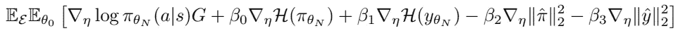

# 论文摘要:发现强化学习代理

> 原文：<https://towardsdatascience.com/paper-summary-discovering-reinforcement-learning-agents-3cf9447b6ecd?source=collection_archive---------27----------------------->

## 通过元学习学习更新规则

Jelleke Vanooteghem 在 [Unsplash](https://unsplash.com?utm_source=medium&utm_medium=referral) 上拍摄的照片

# 介绍

虽然深度学习领域发展速度极快，但有可能让我们更接近人工通用智能(AGI)的独特研究很少，也很难找到。这个规则的一个例外可以在元学习领域找到。最近，元学习也被成功地应用于强化学习。Oh 等人的论文“[发现强化学习代理](https://arxiv.org/pdf/2007.08794.pdf)”从 [DeepMind](https://deepmind.com/) 提供了一个新的和令人耳目一新的视角来看待元学习在强化学习中的应用。

**传统上，RL 依赖手工制作的算法**，如时间差异学习(TD-learning)和蒙特卡洛学习、各种政策梯度方法或其组合，如行动者-批评家模型。这些 RL 算法通常经过微调，以训练模型完成非常特定的任务，例如玩 [Go](https://deepmind.com/research/case-studies/alphago-the-story-so-far) 或 [Dota](https://openai.com/projects/five/) 。一个原因是，为了稳定训练，需要调整多个超参数，例如折扣因子γ和自举参数λ。此外，非常更新的规则以及诸如值函数的预测器的选择需要努力地选择，以确保模型的良好性能。整个过程必须手动执行，并且通常是乏味和耗时的。

DeepMind 正试图通过他们的最新出版物来改变这一点。在论文中，作者提出了一种**新的元学习方法，通过与一组简单的环境进行交互来发现学习目标和探索过程**。他们称这种方法为**习得政策梯度(LPG)** 。这篇论文最吸引人的结果是，该算法能够有效地推广到更复杂的环境，这表明了纯粹通过交互来发现新的 RL 框架的潜力。

在这篇文章中，我将试着详细解释这篇论文，并在我理解有问题的地方提供额外的解释。因此，如果你想了解更多的细节，我将尽量贴近本文的结构，以便你能在原文中找到相关的部分。让我们开始吧！

# 元学习和早期方法

深度学习(包括深度 RL)是众所周知的极度数据饥渴。相比之下，人类可以更有效地学习新技能。例如，会骑山地车的人也可以很快学会如何骑公路车。也许他们甚至可以学习如何骑摩托车，而不需要太多额外的外部输入。元学习旨在通过“学会学习”为机器学习模型配备类似的能力，即学习训练过程，以便更快地适应新的数据分布。

在论文中，作者根据他们旨在解决的问题细分了元学习框架:

*   **仅使用几个例子将在一个或多个任务上训练的模型适应新的任务(少数镜头适应)**:这种变体由通用算法举例说明，例如 [MAML](https://arxiv.org/abs/1703.03400) 或[爬行动物](https://arxiv.org/abs/1803.02999)，以及 [RL](https://arxiv.org/abs/1611.02779) 特别是在 RL 的上下文中。
*   **单个任务在线改编的元学习** : [徐等人(同样来自 DeepMind)的元梯度 RL](http://papers.nips.cc/paper/7507-meta-gradient-reinforcement-learning.pdf) 就属于这一类。该算法在与环境交互的同时在线调整超参数，例如γ和自举参数λ**。也有可能以这种方式学习内在奖励或辅助任务。**
*   ****学习新的 RL 算法**:已经有多个团队在尝试通过与多个环境交互来元学习新算法。例如，[进化策略梯度](https://papers.nips.cc/paper/7785-evolved-policy-gradients.pdf)方法试图使用[进化方法](https://en.wikipedia.org/wiki/Evolutionary_algorithm#:~:text=In%20artificial%20intelligence%20(AI),,mutation,%20recombination,%20and%20selection.)来学习策略梯度损失函数。DeepMind 的研究人员最近也表明，探索的有用知识可以作为一种奖励功能来学习。**

**以上所有方法都使用了价值函数的概念，并试图将其一般化。在所描述的论文中提出的框架第一次尝试学习它自己的引导机制。现在让我们来看看这是如何做到的。**

# **已知政策梯度(LPG)**

**本文的主要目标是找到最佳梯度更新规则:**

****

**让我们详细解释这个公式:由η参数化的最佳更新规则使代理生命周期结束时的期望回报最大化，**

****

**据此，我们从环境 p(ε)和初始代理参数 p(θₒ).的分布中取样这意味着在训练一个代理直到它的寿命结束之后，我们想要达到最大的期望回报。**

**为了实现这一点，而不具体指定我们采样的环境类型，我们要求代理生成两个单独的输出:**

1.  **预测的策略π(a|s)通常在策略梯度算法中，**
2.  **输出在范围[0，1]内的 m 维分类预测向量 y(s)。**

**策略和预测向量 y(s)都被用作元网络的输入。**元网络是一个反向 LSTM，在每个更新步骤产生一个关于如何更新参数π_hat 和 y_hat** 的指导(见图 1)。在这一点上，我并不完全清楚为什么选择了落后的 LSTM 模式。我的理解(虽然我可能是错的)是向后的方向(从环境生存期结束到初始代理状态)对应的是代理的梯度下降优化中的向后方向。**

****

**图 1:元学习过程。来自:Oh，Junhyuk，等《发现强化学习算法》。arXiv 预印本 arXiv:2007.08794 (2020)。**

**元学习 LSTM 网络的输入是**

****

**其中 r_t 是时间 t 时的奖励，d_t 表示剧集终止，γ是前述的折扣因子。由于 LSTM 不明显依赖于观察和动作空间，所以它在很大程度上对环境是不变的。相反，通过训练有素的代理π的策略，观察和动作空间仅被间接考虑。**

## **更新代理**

**在内部循环中，代理使用以下公式进行更新**

****

**如果您仔细观察这个公式，您会注意到期望值中的第一项与加强更新类似，只是使用了π_hat 而不是通常的期望回报 g。由于π_hat 是由元学习者生成的，因此它允许算法灵活地指定自己的“值”函数概念。**

**第二项最小化预测 y 和期望 y 之间的 Kullback-Leibler 散度(分布的一种距离度量形式)。y 为 LSTM 发现有用的更新规则提供了额外的信息。元学习者可能通过 y 间接影响政策。**

## **更新元学习者**

**更新元学习者 LSTM 的公式如下:**

****

**这肯定需要一些解释。理想情况下，我们希望优化环境分布上的最佳梯度更新规则的公式，如上所示。正如您可能注意到的，寿命结束时的预期回报取决于带有寿命结束参数的保单的预期，而这些参数又取决于η。这种认识使我们产生了将元梯度作为政策梯度来计算的想法。上面公式中的第一项正好对应于这个梯度。**

**其他项是正则项。引入这些是因为元学习可能非常不稳定，特别是在训练过程的开始，y_hat 没有任何附加的语义。前两个正则项用于最大化策略和预测向量的熵。策略熵正则化是 RL 中众所周知的技术(例如参见[https://arxiv.org/abs/1602.01783](https://arxiv.org/abs/1602.01783))。其余的术语引入了 L2 正则化。这有助于防止策略和预测更新的快速变化。**

## **警告**

**如您所料，在让这种方法发挥作用之前，还有一些其他小的实现问题需要解决。**

**首先，在跨不同环境培训代理时，不可能对所有代理使用固定的学习率。作者通过以下事实来解释这一点:最优策略π_hat 需要根据学习率更新来缩放，以使训练稳定。此外，由于η和π_hat 在训练期间改变，我们别无选择，只能在元学习期间动态调整学习速率(值得注意的是，这仅用于训练元学习者)。在该论文中，建议使用 bandit 来分别对每个寿命的有用超参数进行采样，并根据寿命结束时的回报来更新采样分布。**

**此外，在补充材料中，作者指出，每当策略的熵变成 0(策略变成确定性的)时，他们就重置生存期，以防止训练崩溃。**

# **实验**

**为了训练 LPG，作者为代理人设置了两个极其简单的玩具环境。其中之一是一个简单的网格世界，在环境中的特定像素处有奖励，如下图所示。第二个是延迟马尔可夫决策过程(MDP)。这只是一种描述环境的复杂方法，在这种环境中，代理人可以在某个时间点做出决策，而该决策将在稍后的某个时间点获得积极或消极的回报。**每个领域使用 5 种不同的环境，捕捉诸如“延迟奖励、嘈杂奖励和长期信用分配”等问题**。有关实验设置的更多详细信息，请参考文章。**

****

**图 2:来自网格世界的预测结果。来自:Oh，Junhyuk，等《发现强化学习算法》。 *arXiv 预印本 arXiv:2007.08794* (2020)。**

**在我看来，论文中提出的两个最重要的问题是:**

*   ****LPG 如何发现预测的有用语义？****
*   ****液化石油气能推广到更复杂的环境吗？****

## **预测语义学**

**图 2 显示了论文中的可视化预测。左上方是一个网格世界示例，其中包含积极和消极因素，左下方是一个接近最佳的策略(白色路径)及其值(黄色=高，蓝色=低)。实验的结果显示在右边。这些是左下方策略的 y 的 30 个组成部分。这些是通过使用具有固定策略的 LPG 更新 y 获得的。查看预测，我们可以看到几乎所有的预测都与真实值有很高的相关性。它们中的一些在正奖励周围具有大的值，并且这些值被传播到邻近的像素。正如作者所指出的，这个“*隐含地表明 LPG 正在要求代理人预测未来的回报，并使用这样的信息进行引导”*。**

**为了显示可视化中看到的相关性确实存在，训练了一个简单的 1 层感知器来预测各种折扣因子的 y 的真实值。虽然 y 是用 0.995 的折扣因子生成的，但训练过的感知器也可以预测低至 0.9 的折扣因子的真实值。这意味着该框架可以自动发现预测的丰富和有用的语义，即“*框架几乎可以恢复各种水平上的值函数，即使这样的语义在元训练期间没有被强制执行”。* **这一点很重要，因为它表明，与单值函数相比，学习到的 30 维向量确实捕获了额外的语义信息。注意，该语义信息完全由算法学习。****

****

**图 3:推广到雅达利游戏。来自:Oh，Junhyuk，等《发现强化学习算法》。arXiv 预印本 arXiv:2007.08794 (2020)。**

## **推广到更复杂的环境**

****另一个重要结果是，LPG 可以无缝地推广到更复杂的环境，如 Atari 游戏，同时仅在上述玩具环境中进行训练。**如图 3 所示，LPG 可以在几乎一半的游戏中击败人类水平的性能，而无需在如此复杂的领域上进行明确的元训练。在一些游戏中，元算法甚至超过了常用的优势演员评论家(A2C)。从图中可以看出，随着 LPG 看到越来越多的训练环境，性能提升很快。可以想象，通过专门设计的训练环境，性能在未来甚至可以超过最先进的专业算法。**

# **讨论**

**从实验来看，LPG 似乎能够通过与简单(或者甚至更复杂)的环境交互来在很大程度上自动发现新的 RL 算法。由于教导人类也主要依赖于创建适当的学习环境，而不是微调更新规则，这使得训练算法和训练人类更加接近。此外，该框架能够推广到比它被训练的环境更复杂的环境，潜在地开辟了一种完全基于数据的 RL 的新方法。尽管与手工制作的 RL 算法相比，新方法在性能上仍然落后，但它可以在一些 Atari 游戏以及训练环境中胜过 A2C，这表明它严格来说并不比手工制作的方法差。我们还必须考虑到这样一个事实，即这些手工制作的方法是经过多年的工作而完善的，而 LPG 只是使用数据进行训练(如果我们暂时忘记训练稳定性的问题)。**

**在我看来，也许最重要的一点是，这种方法可以随着计算能力和数据的增加而扩展。这意味着随着我们的计算机越来越快(这是不可避免的)，液化石油气只会越来越好。使用 16 核 TPU-v2 对论文中描述的模型进行了 24 小时的训练。虽然这可能对任何无法访问谷歌庞大计算资源的人来说都是禁止的，但在几年内，任何拥有现代 PC 的人都将拥有这种计算能力。我坚信，完全基于数据的算法最终是实现更强人工智能的唯一途径。**

# **结论**

**在本文中，作者首次尝试从零开始学习 RL 中的更新规则，从而避免了手动发现复杂更新规则的繁琐过程。他们的方法完全是数据驱动的，并在学习过程中引入了归纳偏差，这也是我们可能期望在人脑中发生的。该论文表明，在玩具环境中训练时，奖励预测和状态评估是自然出现的。该方法强大的泛化能力表明，有可能从与可能简单的、程序化生成的环境的交互中发现极其有效的 RL 算法。**