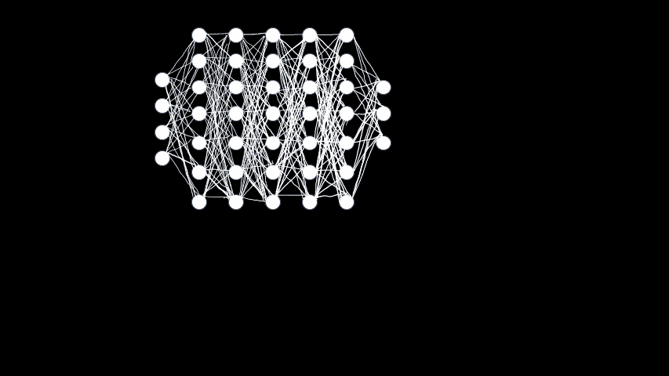
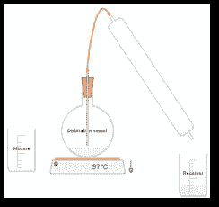
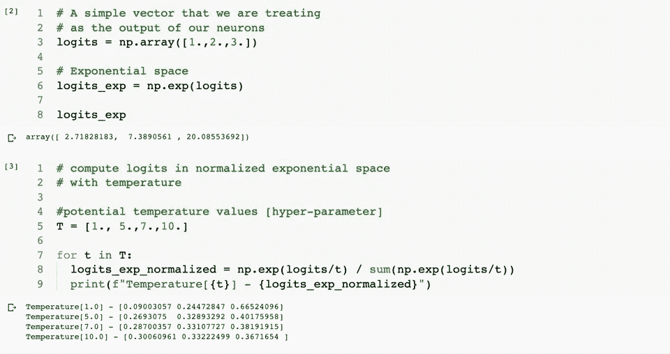
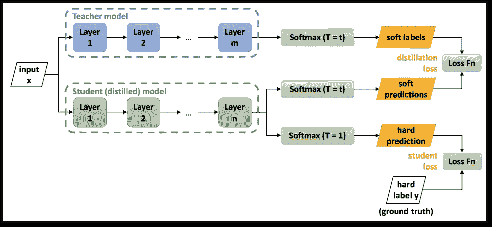
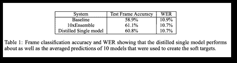

# [知识蒸馏]从神经网络中提取知识

> 原文：<https://towardsdatascience.com/paper-summary-distilling-the-knowledge-in-a-neural-network-dc8efd9813cc?source=collection_archive---------24----------------------->


照片由 [Aw 创意](https://unsplash.com/@awcreativeut?utm_source=medium&utm_medium=referral)在 [Unsplash](https://unsplash.com?utm_source=medium&utm_medium=referral) 上拍摄

**注意——YouTube 上还有一段视频解释了这篇论文**

# 解决的问题

作者以一个非常有趣的类比开始这篇论文，以解释训练和推理的要求可能非常不同的概念。

给出的类比是幼虫和它的成虫形式，事实上两种形式对营养物的要求是完全不同的。

我们很容易理解，在训练期间，首要任务是解决手头的问题。我们最终会采用多种技术和技巧来实现目标。即学习模型参数的目标。

例如，您可以

*   使用已被证明能解决许多不同类型问题的网络集合
*   你可以用辍学来更好地概括
*   增加网络的深度，
*   使用更大的数据集等

> 此外，重要的是要认识到，在寻求学习的过程中，机器学习的机制是这样的，我们将探索各种路径，这些路径虽然对学习至关重要，但在推理阶段可能并不需要。换句话说，从推理的角度来看，这些额外的信息可能被认为是多余的。

这就把我们带到了推理的需求上，除了准确性，运行时性能，也就是预测的速度也起着重要的作用。

> **如果您的产品因为速度慢而无法使用，那么无论它有多精确，都没有关系。在大多数情况下，可用性战胜了准确性！**

本文旨在解决如何使用具有较少参数的网络架构运行精确模型而不牺牲太多精度的挑战。

# 现有技术及其局限性

这不是第一次讨论这个问题。Rich Caruana 等人在 2006 年发表的一篇题为“模型压缩”的论文中阐述了使用繁琐模型知识训练简单网络的概念。

> 繁琐模型是具有大量参数的模型或者是模型的集合，并且通常难以在具有较少计算资源的设备上设置和运行。

在本文中，Hinton 提到了模型压缩，以证明他们可以从繁琐的模型中提取信息，并将其提供给更简单的模型。

在模型压缩文件中，使用的技术是使用 RMSE 最小化 logits 空间中的距离。本文认为，他们建立在这一见解，并提出了一个更普遍的解决方案；换句话说，Caruana 等人的[模型压缩技术是 Hinton 等人提出的一个特例。](https://www.cs.cornell.edu/~caruana/compression.kdd06.pdf)

# 理解关键见解所需的背景知识

要欣赏这篇论文的关键见解，你应该有良好的直觉以及对 softmax 激活功能的数学理解！

这里我展示了一个典型的分类网络，在最后一个输出层有 3 个神经元。这意味着我们有 3 个类。典型分类问题中使用的激活函数是 softmax 函数(在最后一层)。对于我们的讨论，在隐藏层中使用什么激活函数并不重要。



来源—文章的作者

以上动画展示了 softmax 激活公式，即

```
q_i = exp(z_i) / sum(exp(z_j)where j = 1 to 3
where q_i corresponds to the value of neuron i in the last layerThus the numerator corresponds to the exponentiated value of logit provided by a neuron whereas the denominator is the sum of all the logits in the exponential space.
```

但是我们为什么要找 softmax？这可以通过把这个问题分成两个子问题来回答

*   为什么我们要取幂(分子部分)？
*   我们为什么要归一化(分母部分)？

这两个问题的答案是，我们需要一个**概率分布**作为网络的输出。

现在任何**概率分布**都必须考虑两个重要的性质:

*   分布中的所有条目都应该是正数
*   所有条目的总和应为 1

指数函数具有将负实数转化为正实数的魔力，因此这满足了我们的第一个要求。接下来，归一化(即每个条目除以所有条目的总和)使其成为分布。

但是现在你可能想知道为什么我们需要**概率分布**作为输出？

在分类问题中，你使用基本事实标签作为独热编码向量。一个独热编码向量只不过是一个概率分布，其中只有一个条目得到所有的概率。因此，任务(目标)是将该基础真实概率分布与**预测的**概率分布进行比较。这就是为什么我们希望我们的输出是全能的 softmax 激活函数提供给我们的概率分布。这两种概率分布之间的比较是使用交叉熵损失函数来完成的。

# 关键见解

Softmax 适用于交叉熵损失，但它有一个问题，即在赋予最可能的类重要性的过程中，它会将其余的类推向非常小的值。

该论文从手数字分类中选取了一个例子，其中它强调了这样一种情况，即 2 的例子图像可能比 7 的例子图像更接近或相似于 3 的例子图像。

> 这些例子有多接近或相似对于理解网络实际学到了什么非常重要！

这里的关键见解是，softmax 函数倾向于隐藏其他类之间的这种相对相似性，并且这种信息(如果可用的话)可以在训练提取的网络中发挥至关重要的作用。

第二个关键的见解是关于如何突出类的例子之间的相对相似性，同时保持在 softmax 的领域中。

作者认为，如果在将 logitss 的值传递给指数函数之前，我们使 logit 的值(即最后一层神经元的输出)更低，那么我们将获得更平滑的分布。

这里的“更平滑”意味着与常规的 softmax 不同，没有对应于一个条目的大尖峰。

为了使逻辑的输出更低，你现在需要一个数来除它们。这个数字有一个叫做 T 的符号，作者称之为温度。温度越高，分布越平稳。

他们修改了 softmax 函数，如下所示

```
q_i = exp(z_i/T) / sum(exp(z_j/T)
```



这里的类比是蒸馏，你用温度蒸馏杂质。然而，T 的值非常重要，你必须通过实验才能找到。这就是为什么它是一个超参数。

下面的代码片段展示了不同的 T 值对 softmax 函数输出的影响



如您所见，温度(T)越高，获得的分布越平滑。T=1 的值对应于常规的 softmax 行为。

# 它是如何工作的？

首先，让我在这里介绍一些新的术语。

***教师模型。*** 原始的(繁琐的)模型被称为教师模型，因为我们正在从中提取知识。

***学生模型。参数较少的新模型被称为学生模型，因为我们将信息提取到其中。***

***软标签。*** 使用温度大于 1 (T > 1)的 softmax 的教师模型的输出。

***软预测。*** 使用温度大于 1 (T > 1)的 softmax 的学生模型的输出。

***艰难的预言。*** 当常规 softmax 用于学生模式时

***硬标签。***

下图说明了学生培训流程的设置。



来源—[https://nerv anasystems . github . io/distiller/knowledge _ distillation . html](https://nervanasystems.github.io/distiller/knowledge_distillation.html)

你最终会有两个损失项。第一个损失项使用**软标签(来自教师)&软预测(来自学生)**，第二个损失项使用**硬预测(来自学生)和硬标签。**你可以随时配置这两项的贡献。

作者对 MNIST 和语音识别问题进行了实验，取得了很好的结果。



Android 语音识别论文的结果

# 各种链接和详细信息

## 论文有开源实现吗？

Github 上有多种实现，实现起来非常简单。这里有一个链接，链接到一个实施多个 KD 损失的存储库

【https://github.com/karanchahal/distiller 

## 这篇论文是在一次会议上发表的吗？

是的。这篇论文在 NIPS 2014 上被接受，有超过 3000 次引用

论文链接—[https://arxiv.org/abs/1412.6550](https://github.com/karanchahal/distiller)

## 有解释论文的视频吗？

是的。我为这篇论文制作了 youtube 视频。

# 我的观点和建议

*   这是启动知识蒸馏研究领域的基础论文。
*   这篇论文写得很好，如果你对 softmax 函数的数学性质有很好的直觉和理解，那么温度的概念将是有意义的。这就是为什么我在这篇文章中花了很大篇幅解释 softmax 在分类网络中的重要性
*   该技术(即更平滑的 softmax)仍在使用，并且通常根据不同问题和架构的要求由其他方法补充。

作为这篇文章的后续，我会写更多关于知识蒸馏的论文摘要。

希望你喜欢这个摘要，我可能误解/曲解了论文的某些部分，因此，如果有的话，错误是我的，而不是原论文作者的。