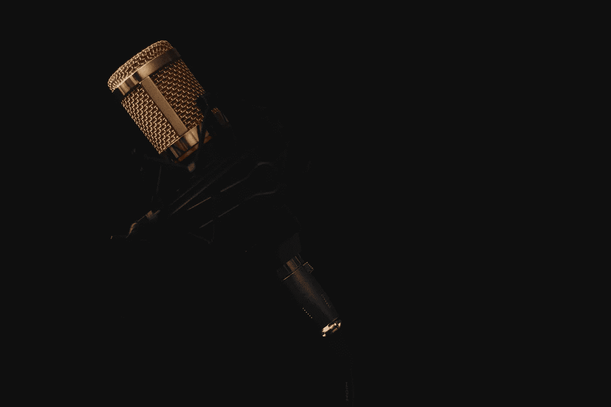
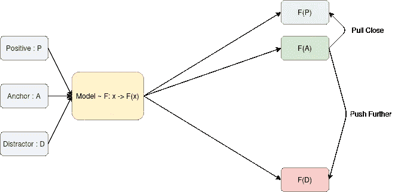

# 论文摘要与实施:通用音频表征的对比学习。

> 原文：<https://towardsdatascience.com/paper-summary-implementation-contrastive-learning-of-general-purpose-audio-representations-f4e3cc06fcf7?source=collection_archive---------25----------------------->

## PyTorch 实施的 COLA 培训计划。



赫拉尔·莫夫西斯扬在 [Unsplash](https://unsplash.com/s/photos/audio?utm_source=unsplash&utm_medium=referral&utm_content=creditCopyText) 上拍摄的照片

这篇文章是一个简短的总结和实施以下文章的步骤:

*   [通用音频表示的学习](https://arxiv.org/abs/2010.10915)

本文的目的是使用区分性预训练来学习自我监督的通用音频表示。作者训练了一个 2D CNN EfficientNet-B0 来将梅尔频谱图转换成 1D-512 向量。这些表征然后被转移到其他任务，如说话人识别或鸟鸣检测。

DPT 背后的基本思想是定义一个锚元素、一个积极元素和一个或多个干扰元素。然后训练一个模型来匹配锚和正面的例子。



DPT —作者提供的图像

使用 DPT 的一种这样的方式是使用三元组损失以及余弦相似性度量来训练模型，例如余弦(F(P)，F(A))比余弦(F(D)，F(A))高得多。这将使锚的潜在空间中的表征更接近于积极的例子，而不是干扰物。上面链接的论文的作者使用这种方法作为基线来表明他们的方法 **COLA** 效果更好。

## 可乐

这种方法适用于音频领域。对于每个音频剪辑，作者挑选一个片段作为锚，另一个片段作为正例，对于这些样本中的每一个(锚，正)，他们挑选训练批次中的其他样本作为干扰物。这是一个好主意，原因有二:

*   有多个干扰物，这使得训练任务更加困难，迫使模型学习更有意义的表示来解决它。
*   干扰项从批次中的其他样本中重用，这降低了生成它们的 IO、计算和内存成本。

COLA 还使用双线性相似度，这是直接从数据中学习的。作者表明双线性相似性比余弦好得多，相比之下，在下游任务上给出了额外的 **7%** 平均准确度。

在计算锚和其他例子之间的相似性之后，相似性值被用于交叉熵损失，该损失测量模型在干扰物中识别正面例子的能力(论文中的等式 2)。

## 可乐评价

**线性模型评估**

COLA 用于在 AudioSet 上训练 EfficientNet-B0，AudioSet 是一个数据集，包含来自 YouTube 的大约 100 万个音频剪辑。由该模型生成的特征向量然后被用于在广泛的下游任务上训练线性分类器。模型学习的表示越好，当用作执行监督任务的线性模型的输入时，其性能就越好。作者发现，在下游任务中，COLA 比其他方法(如三重损失)多了 20%的平均准确率(论文的表 2)

**微调评估**

测试这种方法的另一种方法是在下游任务中微调模型。这使得作者可以将使用 COLA 预先训练的模型与从头开始训练的模型进行比较。他们的结果显示，预训练的模型比从零开始训练的模型平均高出大约 **1.2%** 。

## PyTorch 实现

这种方法很容易在 PyTorch Lightning 中实现。
编码器可以定义为:

```
**class** Encoder(torch.nn.Module):
    **def** __init__(self, drop_connect_rate=0.1):
        super(Encoder, self).__init__()

        self.cnn1 = torch.nn.Conv2d(1, 3, kernel_size=3)
        self.efficientnet = EfficientNet.from_name(
            **"efficientnet-b0"**, include_top=**False**, drop_connect_rate=drop_connect_rate
        )

    **def** forward(self, x):
        x = x.unsqueeze(1)

        x = self.cnn1(x)
        x = self.efficientnet(x)

        y = x.squeeze(3).squeeze(2)

        **return** y
```

然后可乐训练可以定义为:

```
**class** Cola(pl.LightningModule):
    **def** __init__(self, p=0.1):
        super().__init__()
        self.save_hyperparameters()

        self.p = p

        self.do = torch.nn.Dropout(p=self.p)

        self.encoder = Encoder(drop_connect_rate=p)

        self.g = torch.nn.Linear(1280, 512)
        self.layer_norm = torch.nn.LayerNorm(normalized_shape=512)
        self.linear = torch.nn.Linear(512, 512, bias=**False**)

    **def** forward(self, x):
        x1, x2 = x

        x1 = self.do(self.encoder(x1))
        x1 = self.do(self.g(x1))
        x1 = self.do(torch.tanh(self.layer_norm(x1)))

        x2 = self.do(self.encoder(x2))
        x2 = self.do(self.g(x2))
        x2 = self.do(torch.tanh(self.layer_norm(x2)))

        x1 = self.linear(x1)

        **return** x1, x2

    **def** training_step(self, x, batch_idx):
        x1, x2 = self(x)

        y = torch.arange(x1.size(0), device=x1.device)

        y_hat = torch.mm(x1, x2.t())

        loss = F.cross_entropy(y_hat, y)

        _, predicted = torch.max(y_hat, 1)
        acc = (predicted == y).double().mean()

        self.log(**"train_loss"**, loss)
        self.log(**"train_acc"**, acc)

        **return** loss
```

我没有计算资源来复制论文中的实验，所以我试着在小得多的规模上做类似的事情。我在 [FMA 大号](https://github.com/mdeff/fma)(没有标签)上使用可乐预训练了一个模型几个时代，然后微调了应用于 FMA 小号的音乐流派检测。

FMA·斯莫尔的结果如下:

*   随机猜测:12.5%
*   从零开始培训:51.1%
*   使用可乐预先训练: **54.3%**

## 结论

论文[通用音频表示的学习](https://arxiv.org/abs/2010.10915)介绍了 COLA 预训练方法，该方法实现了一些伟大的想法，使自我监督训练更加有效，如使用批量样本作为干扰物和双线性相似性度量。这种方法可用于提高下游监督音频任务的性能。

代码:[https://github.com/CVxTz/COLA_pytorch](https://github.com/CVxTz/COLA_pytorch)