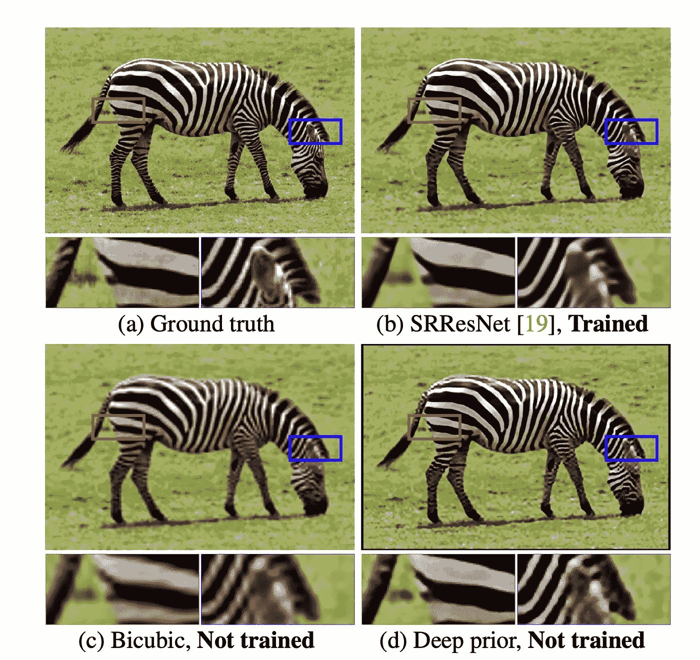
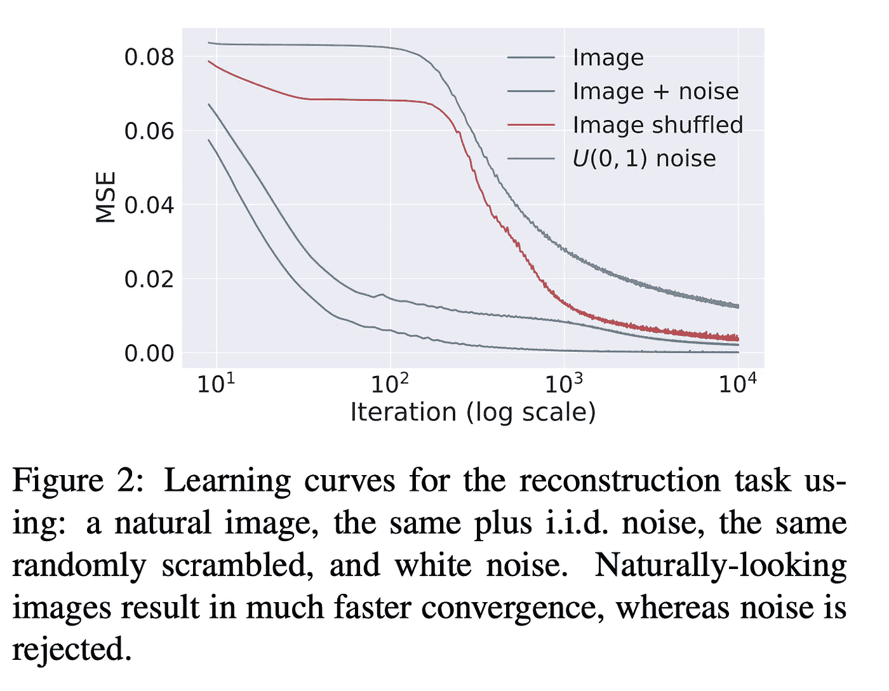
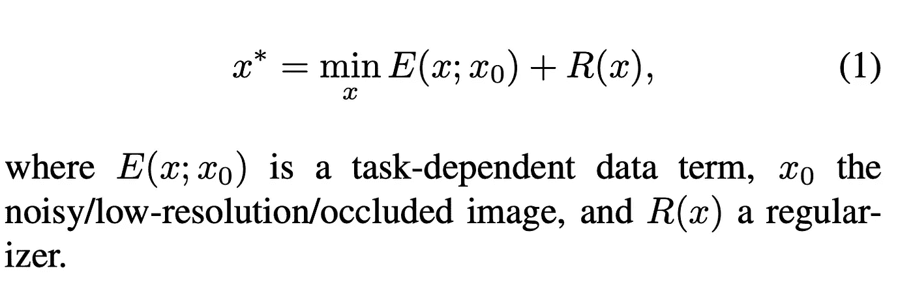
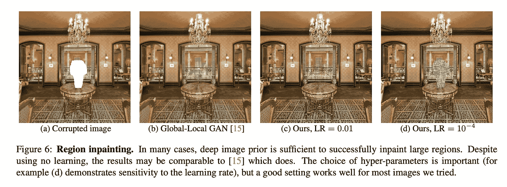
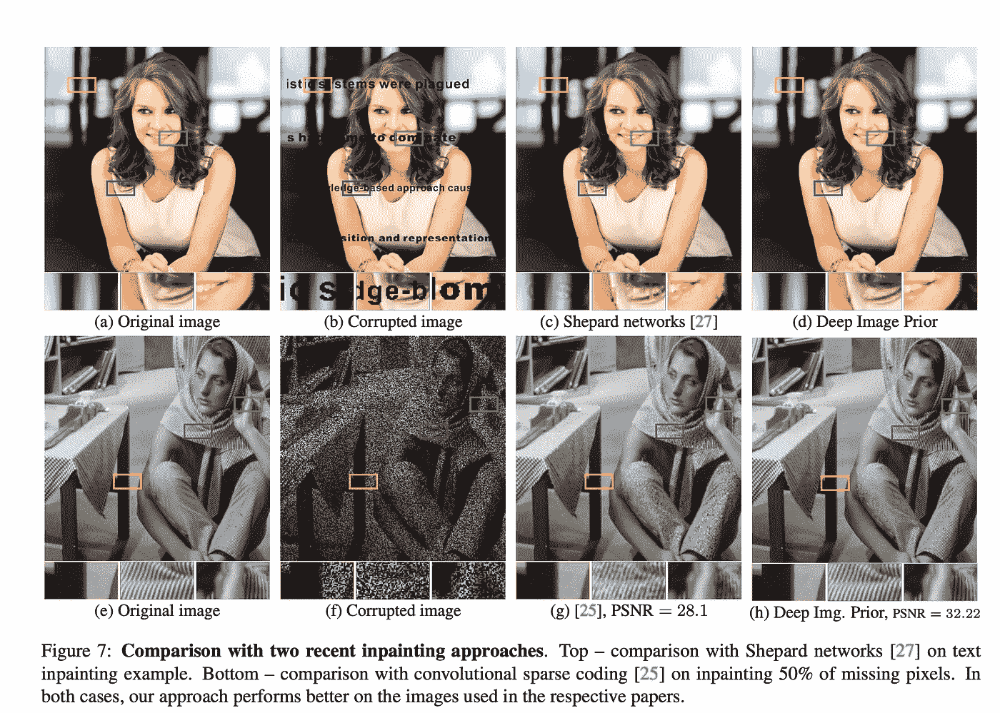

# 纸周刊:没有数据的图像重建

> 原文：<https://towardsdatascience.com/paper-tuesday-image-reconstruction-without-data-c2acdba1aa53?source=collection_archive---------29----------------------->

每周二，我都会强调我在研究或工作中遇到的一篇有趣的论文。希望我的评论能帮助你在 2 分钟内获得论文中最多汁的部分！

# 基本思想

图像重建是一项具有挑战性的学习任务，因为没有人知道原始图像是什么样子的。因此，似乎唯一实用且合乎逻辑的方法是开发关于图像的一些先验知识，并挑选具有最大概率(最大先验估计)的重建。例如，我们希望在 MNIST 数据集上训练的模型能够开发一些关于手写数字的先验知识，可以用来对模糊的数字进行降噪。

我偶然看到了这篇名为 *Deep Image Prior* 的论文，该论文由 Ulynov、Veldadi 和 Lempitsky 于 2017 年发表。下面是链接:[https://sites . skol tech . ru/app/data/uploads/sites/25/2018/04/deep _ image _ prior . pdf](https://sites.skoltech.ru/app/data/uploads/sites/25/2018/04/deep_image_prior.pdf)

研究人员发现了深度 CNN 的一个有趣特性——随机初始化的网络比纯噪声更快地拟合自然图像。换句话说，CNN 对自然图像有天然的“优先”偏好，可以利用这种偏好在没有任何数据的情况下去除图像中的伪影！

来自[的论文](https://sites.skoltech.ru/app/data/uploads/sites/25/2018/04/deep_image_prior.pdf)

为了对图像去噪(去除水印、去除修补等)，随机初始化 CNN 并将图像馈送到模型中(输入=图像，输出=图像，就像自动编码器一样)。不出所料，模型逐渐实现零训练损失(参数> >图像中的像素)。然而，当适当地提前停止训练时，网络产生去噪图像。

培训目标，来自[论文](https://sites.skoltech.ru/app/data/uploads/sites/25/2018/04/deep_image_prior.pdf)

# 结果

图像重建可以采取多种形式——去噪、修复恢复、超分辨率等。研究人员证明，神经网络架构在免训练图像重建中起着重要作用

摘自[论文](https://sites.skoltech.ru/app/data/uploads/sites/25/2018/04/deep_image_prior.pdf)

当选择合适的网络架构时，DIP 会产生惊人的重建性能，与监督模型相当，甚至超过监督模型:

来自[的论文](https://sites.skoltech.ru/app/data/uploads/sites/25/2018/04/deep_image_prior.pdf)

来自[的论文](https://sites.skoltech.ru/app/data/uploads/sites/25/2018/04/deep_image_prior.pdf)

# **一些想法**

DIP 是过度参数化(权重> >数据)的力量被完全低估的另一个证明。在我的 ML 课上，我的教授警告我们不要在“小”数据集上使用巨型模型，因为可能会过度拟合。然而，超参数化网络有许多有趣的特性可以利用！如果我们可以用一个**未训练的**模型对图像去噪，谁知道一个有无数参数的训练有素的模型能做什么？