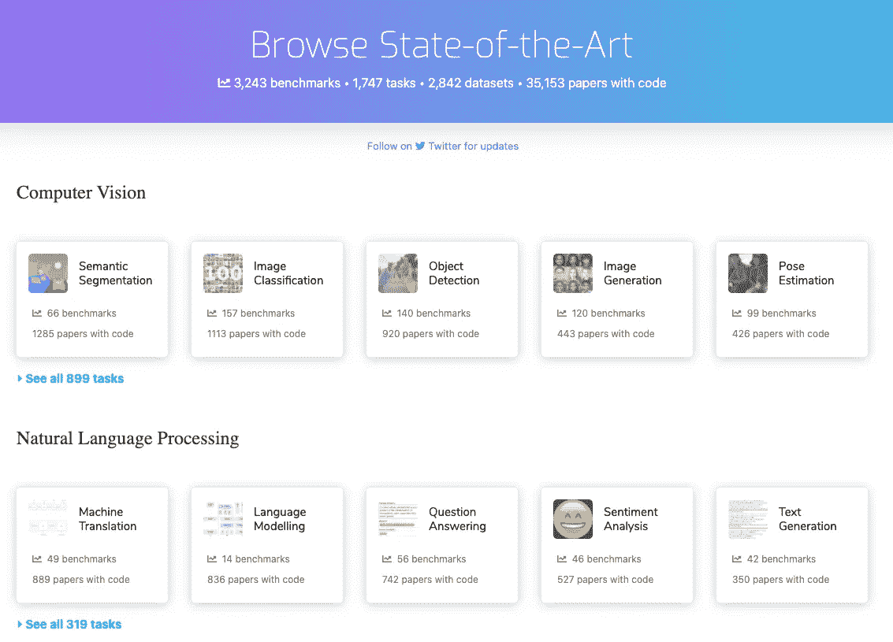
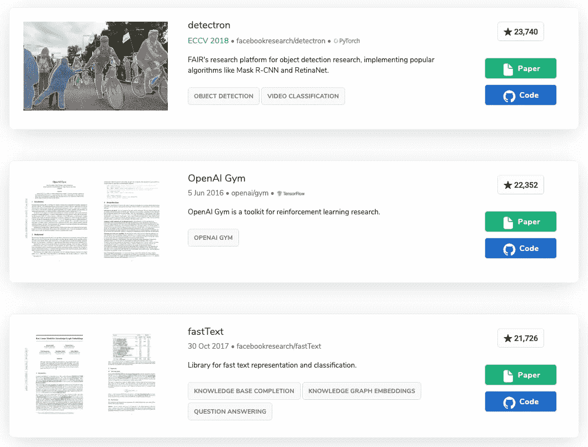
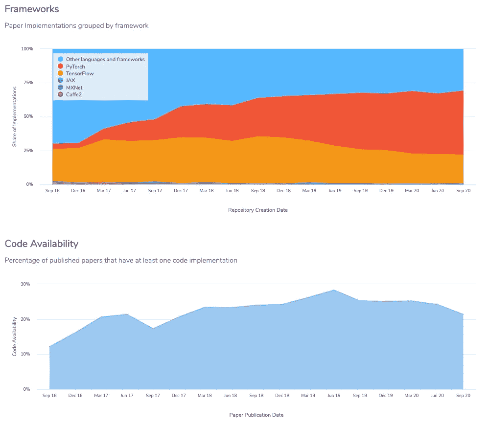
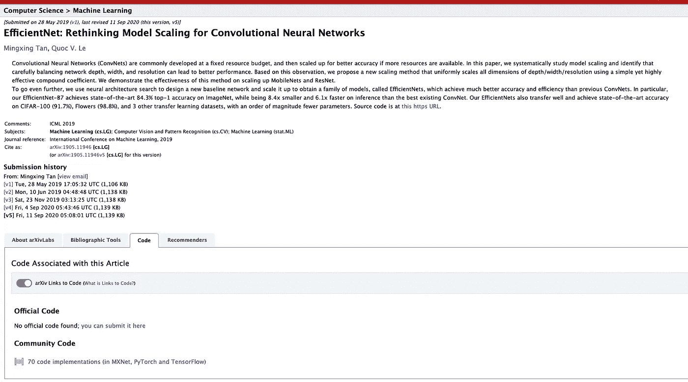

# 带代码的论文+ arXiv =可重复、有组织的研究

> 原文：<https://towardsdatascience.com/papers-with-code-arxiv-reproducible-organized-research-f5404eb6a22e?source=collection_archive---------44----------------------->

## 通过联合合作,《论文与代码》现在为 arXiv 数据库中的文章提供分类和代码参考

在有代码的纸上轻松浏览[最先进的机器学习代码](https://paperswithcode.com/sota)

# 摘要

数百万篇科学文章通过 [arXiv](http://arxiv.org/) 公开分享，这是一个康乃尔支持的网站，专注于开放研究。代码为的【T4 论文】网站上有学术论文，这些论文也共享它们的支持软件，因此实验可以被忠实地复制。通过联合合作,《论文与代码》现在为 arXiv 数据库中的文章提供分类和代码参考。

# arXiv 发布研究成果

我们都喜欢 arXiv。尽管这里或那里有些怪癖，前提是梦幻般的。该网站提供了物理学、数学、计算机科学、定量生物学、定量金融学、统计学、电子工程和系统科学以及经济学的开放式档案。截至 2020 年 10 月，该网站已发布超过 170 万篇文章。任何人都可以在任何时候免费获得这些文章。这使得知识能够以前几代人闻所未闻的速度被共享，同时仍然保持作者归属以用于学分分配目的。

以前，新的研究进展主要通过学术期刊传播，这些期刊是由人准备的，很可能不是免费的。虽然这个过程实现了信息的组织和共享，但是它是有偏见的，并且是排他的。由于准备期刊的工作人员的集体偏见，这个过程是有偏见的，接受一些，拒绝另一些。当然，这可能比它不工作更经常；然而，我相信它远非完美。此外，该过程具有排他性，因为它为获取信息贴上了价格标签。是的，世界在交换有价值的物品。这并不意味着价值必须是货币，也不意味着货币必须直接来自最终消费者。

arXiv 的发展有助于世界上更自由的信息流动。有了这个网站，突破性的研究现在可以以互联网电缆传输的速度向全世界传播。此外，由于网站的开放性，任何人都可以使用 [arXiv API](https://arxiv.org/help/api) 以编程方式阅读文章。一旦你有了一个 API。有一个数据集。一旦你有了一个数据集，你就有可能得到漂亮的可视化效果，比如这个。

[Paperscape](https://paperscape.org/) 的 arXiv 文章交互可视化的高级视图。

# 论文与代码分发研究成果的复制

arXiv 单独支持开放研究共享这一事实对全球研究社区来说是件好事。然而，现在科学领域的绝大多数新研究都有软件支持研究结果。未能提供该软件相当于未能提供验证研究所需的所有资产。在一个以信息为中心的世界里，大多数可用的数据[都是在过去几年里创建的](https://www.mediapost.com/publications/article/291358/90-of-todays-data-created-in-two-years.html)，使用软件独立证明研究结果有效的能力变得越来越重要。你可以读一篇论文并立即知道它的有效性的日子已经一去不复返了。随机优化算法和不同的数据源需要提供软件和数据，以便充分验证现代研究。

一些[排名最高的知识库](https://paperswithcode.com/greatest)都是关于论文和代码的。

PwC(papers with Code)是一个组织访问技术论文的网站，该网站还提供用于创建论文结果的软件，在过去几年中发展迅速。随着可公开获得的数据集的增加，现代研究已经开始向完全透明和可信的方向靠拢。普华永道也一直在改进自己的网站。通过按照任务(例如，对象检测、情感分析等)或者按照方法(例如，注意力、卷积)进行浏览，可以容易地浏览现有技术。此外，如下所示，普华永道还使用从论文中收集的数据来跟踪软件框架和代码可用性如何随时间变化的趋势。

这项服务使普通用户能够享受前所未有的机器学习艺术。想看看与[新冠肺炎](https://paperswithcode.com/task/covid-19-detection)有关的一些最好的模型吗？[文字嵌入](https://paperswithcode.com/task/word-embeddings)、[图像生成](https://paperswithcode.com/task/image-generation)或[语音识别](https://paperswithcode.com/task/speech-recognition)怎么样？一切触手可及。

基于时间的框架使用和论文代码可用性趋势，由代码为的[论文管理。](https://paperswithcode.com/trends)

# 普华永道 arXiv 使现代科学民主化

最大的成果是通过协作产生的，这两个网站也不例外。普华永道与 arXiv 合作，直接连接到他们的网站，为读者提供所有共享软件实现的链接。不再需要点击进入论文并搜索脚注和参考文献，希望神奇的“GitHub”关键字以其所有的威严出现。虽然看起来是一个微小的变化，但这种整合越来越鼓励作者在提交材料时提供这些额外的实验细节，以便读者可以更好地验证这些发现。我想任何被训练来预测论文价值的模型都会对 has_code 特性赋予很高的权重！

带代码论文链接的 [EfficientNet arXiv 页面](https://arxiv.org/abs/1905.11946)预览。

PwC 和 arXiv 之间的集成还提供了基于论文标题和摘要的论文自动分类。现在，作者将可以选择采用自动建议的论文类别，以便更好地组织内容和增加读者范围。延续开放存取的精神，他们已经公开了模型库[就在这里](https://github.com/arXiv/arxiv-classifier)。多棒啊。这个模型的前一个版本不可用，这导致了对其内部工作方式的许多困惑。这个问题现在已经解决了。

# 结论

由于现代技术研究的统计性质，研究结果现在需要软件和数据实验细节以及白皮书文档进行验证。信息生产的惊人速度也需要开放存取和自动化组织。arXiv 和有 Code 网站的报纸已经在这些领域取得了很大进展，从混乱中带来了秩序。在最近的一次合作中，我们现在可以享受这些服务之间的集成，以及它们的数据组合所带来的好处。整体绝对大于部分之和。

# 链接

*   [arXiv](http://arxiv.org/)
*   [arXiv API](https://arxiv.org/help/api)
*   [普华永道 arXiv 分类器](https://github.com/arXiv/arxiv-classifier)
*   [编号为](https://paperswithcode.com/)的文件
*   [纸景](https://paperscape.org/)
*   [来自普华永道的 Robert Stojnic 的公告](https://medium.com/paperswithcode/papers-with-code-partners-with-arxiv-ecc362883167)

# 不断学习

 [## Hello Danfo:用于 Javascript 的熊猫，来自 Tensorflow

### Tensorflow.js 刚刚获得了更多端到端

towardsdatascience.com](/hello-danfo-pandas-for-javascript-from-tensorflow-3d1d0ea3f3be)  [## 亚马逊想让你免费成为一名人工智能从业者

### 这家科技巨头计划通过公开其长期的内部材料来提高 ML 的熟练度

towardsdatascience.com](/amazon-wants-to-make-you-an-ml-practitioner-for-free-552c46cea9ba)  [## Deepnote 将成为 Jupyter 黑仔

### 旧金山的一个小团队 DeepNote 希望在你的数据科学工作流程中取代 Jupyter。

towardsdatascience.com](/deepnote-sets-course-to-become-the-jupyter-killer-d0cb6e3ca011) 

# 保持最新状态

这一个就到此为止。然而，在学术界和工业界，事情发生得很快！用 [LifeWithData](https://lifewithdata.org/) 博客、[Medium](https://medium.com/@anthonyagnone)上的文章和我的 [Twitter](https://twitter.com/@anthonyagnone) 让自己保持最新状态。

*原载于 2020 年 10 月 13 日 https://www.lifewithdata.org**的* [*。*](http://www.lifewithdata.org/blog/arxiv-papers-with-code-collaboration)