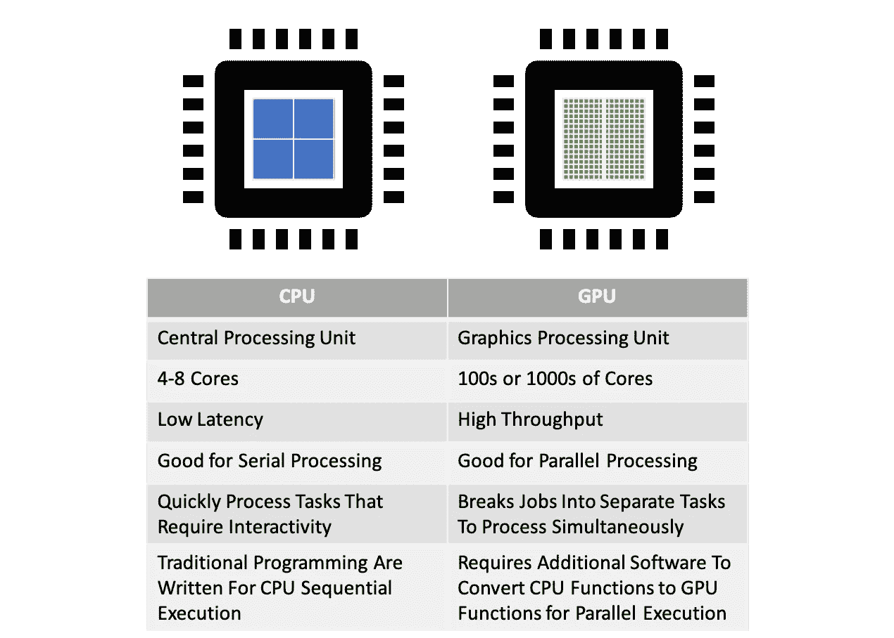
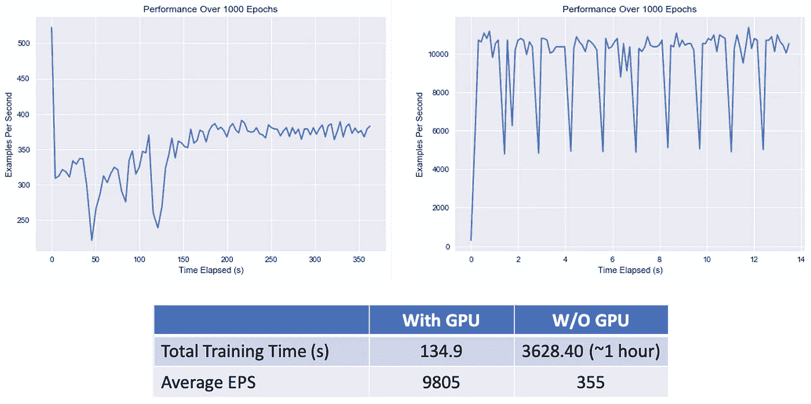

# 并行计算—利用 GPU 计算升级您的数据科学

> 原文：<https://towardsdatascience.com/parallel-computing-upgrade-your-data-science-with-a-gpu-bba1cc007c24?source=collection_archive---------18----------------------->

## GPU 如何加速数据科学工作流的研究

*<本文的代码可以在这里找到***>**

**

*照片由 [Pixabay](https://www.pexels.com/@pixabay) 在[像素](https://www.pexels.com/)上拍摄*

*GPU 比 CPU 快吗？这是一个非常复杂的问题，但简单的回答是不，不总是这样。事实上，对于大多数通用计算，CPU 的性能要比 GPU 好得多。这是因为 CPU 设计的处理器内核数量**比 GPU 上的处理器内核数量**少，但时钟速度**比 GPU 上的处理器内核速度**高，这使得它们能够非常快速地完成一系列任务。另一方面，GPU 有更多的内核，并被设计用于不同的目的。最初，GPU 的设计初衷是加速图形渲染的性能。这是通过允许 CPU 卸载繁重的计算并释放处理能力来实现的。GPU 比 CPU 更快地渲染图像，因为它的**并行处理架构**，这允许它同时跨数据流执行多个计算。CPU 是操作的大脑，负责向系统的其他部分发出指令，包括 GPU。如今，在额外软件的帮助下，GPU 的能力已经扩展到显著减少完成数据科学不同阶段所需的某些类型的计算所需的时间。需要强调的是，GPU 不会取代 CPU，而是作为一个协处理器来加速科学和工程计算。*

## *CPU 和 GPU 处理的比较:*

**

*GPU 与 CPU*

*如果你想看有趣的插图，这里有一个来自 2009 年的 [*视频*](https://www.youtube.com/watch?time_continue=93&v=-P28LKWTzrI&feature=emb_title)*

## ****面向数据科学的 GPU 并行处理****

**在过去几年 CPU 性能增长放缓的时候，GPU 提供了显著的速度提升(可悲的是**打破了摩尔定律**)。因此，预计未来几年对 GPU 计算的采用将会增加。这个特性在数据科学领域非常重要，它涉及到高效处理非常大的数据集(以**矩阵/向量**的形式)。 **SIMD** 设计，或**单指令/多数据**，意味着 GPU 计算可以用一条指令处理多个数据，就像**矩阵乘法**一样。例如，深度学习可以利用并行计算来减少训练周期中花费的时间，因为许多卷积运算都是重复的。事实上，数据科学工作流程中的许多步骤都可以通过 GPU 来处理(例如，数据预处理、特征工程和可视化)，但它们确实需要**额外的**功能来实现。由于传统的计算机编程不是为并行处理而写的，它们需要被转换成支持 GPU 的**。GPU 制造商非常热衷于**为开发者提供软件支持**以加速采用。****

## **量化收益**

**为了说明 GPU 计算对深度学习的影响，我在有和没有 GPU 的情况下重新训练了 **CIFAR-10 对象识别模型**(来自 TensorFlow)。CIFAR-10 CNN 模型通常用于基准测试。它通过 14 层 CNN 模型用 60，000 张 32x32 的彩色图像进行训练，以给出计算强度的一些观点。因为我主要关注的是计算速度，所以我的比较指标是每秒**个示例**和**个总训练时间**。结果显示，使用 GPU 进行训练时，性能提高了 27 倍。**

****

***使用英伟达 RTX 2080 Ti GPU (CUDA 10.0)训练的 CIFAR-10***

**GPU 实现了非常高的吞吐量，大大减少了训练时间。这直接转化为在时间和精力方面更低的成本。节省的时间意味着在模型开发周期中有更多的优化迭代(即**模型选择**和**特征调整**)。**

## **但是还有更多——云上的 GPU**

**GPU 云计算已经可以在微软 Azure、AWS、Google Cloud on-demand 等主流云平台上使用。尽管它并不总是和最先进的 GPU 工作站一样快。它提供了可访问性和便利性，无需投资昂贵的硬件和维护。**

## **摘要**

**GPU 在数据科学领域发挥着至关重要的作用。由于其并行架构的性质，他们可以同时对数据流快速执行计算，解决了人工智能和机器学习最棘手的挑战之一。现在是时候熟悉 GPU 计算了——通过云或者在你的本地机器上。**