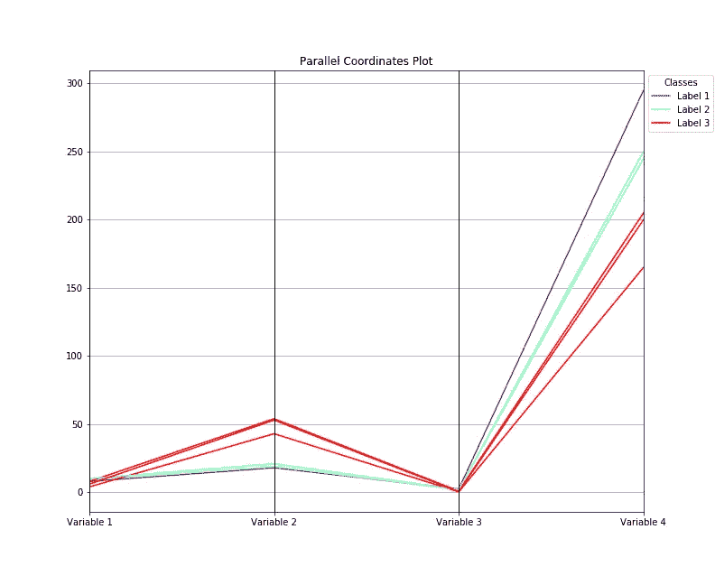
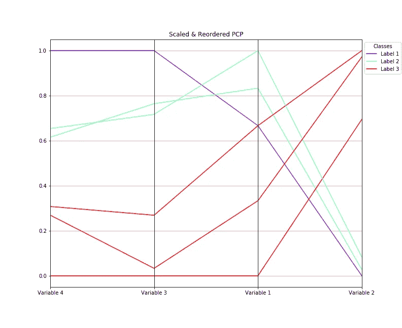
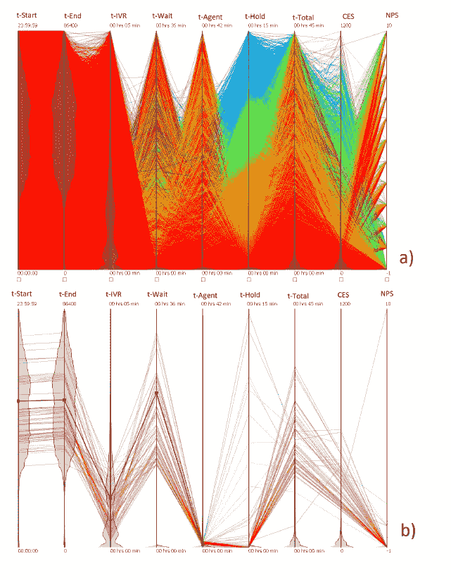
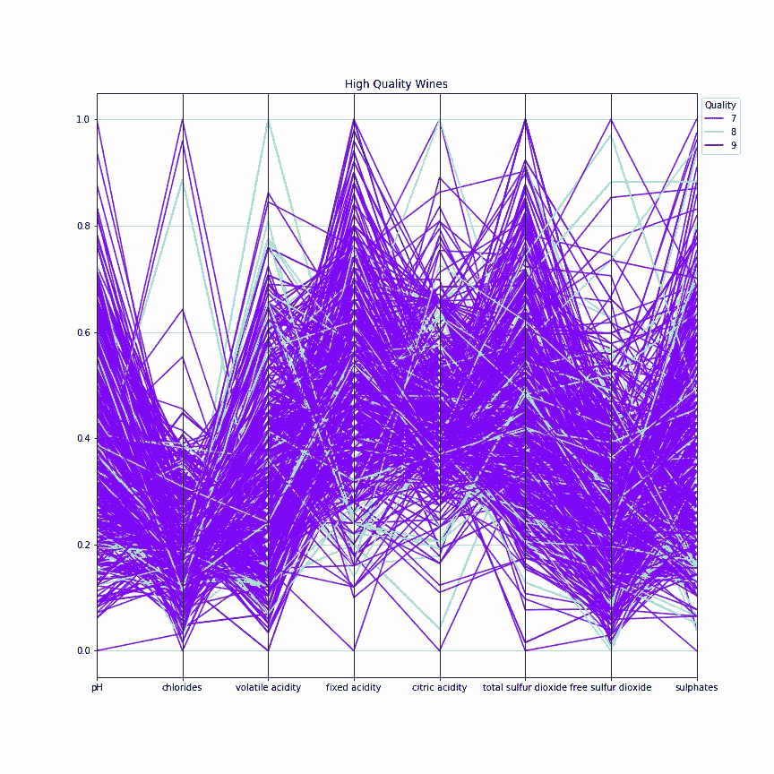
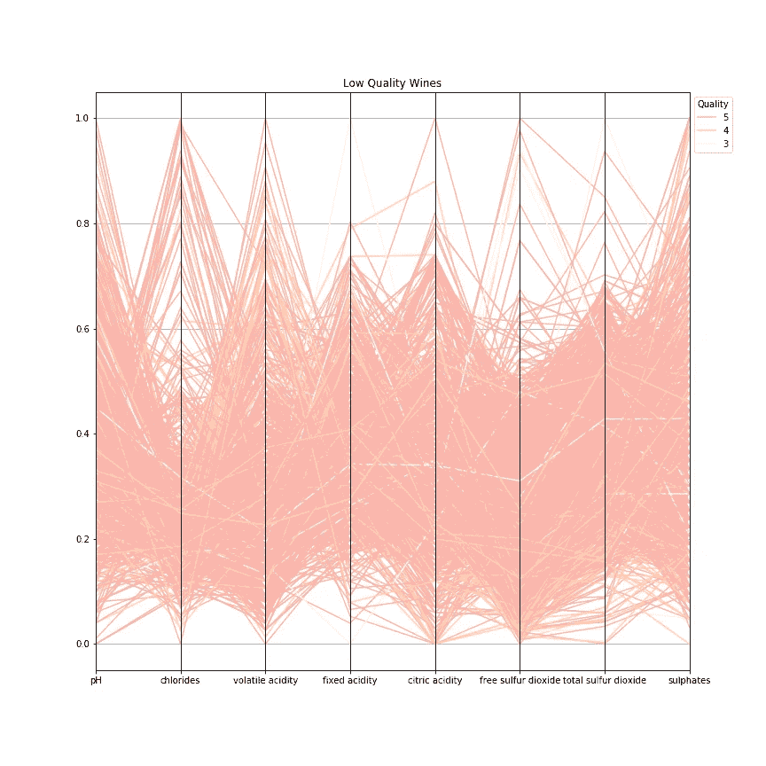

# 平行坐标图

> 原文：<https://towardsdatascience.com/parallel-coordinates-plots-6fcfa066dcb3?source=collection_archive---------26----------------------->

## 为什么&如何，用类比讲故事

图片来自 Unsplash 的 Mitchell Luo

**又名**:平行坐标、平行坐标图、平行图、剖面图

**为什么**:平行坐标图(PCP)是一种可视化技术，用于分析**多元数值数据。**它允许数据分析师**一起比较**许多量化变量，寻找它们之间的**模式**和**关系**。当这些变量具有不同的量值(不同的标度)和不同的测量单位时，它们适用于同时比较多个数值变量。其思想是在多维数据集中发现模式、相似性、聚类以及积极、消极或无特定关系。

第一个 PCP 出版于 1885 年(#1)，但它的流行是在一个世纪后通过 Inselberg (#2)的工作。它们被广泛使用，特别是在学术论文中，以克服与高维数据可视化相关的挑战。PCP 的 n 维能力使复杂的关系能够简单地绘制出来(#3)。

**如何**:这种表示法并没有显示经典的笛卡尔坐标平面，而是给每个数值变量赋予了自己的轴。如下图所示，所有轴**平行**，垂直，等距放置。数据集的每个数据元素通过**连接的线段**表示，从一组连接的点中导出，每个轴上一个点。我们最终得到一组线条，每一行都是每个数据记录的多轴表示。一般来说，许多平行线表示正相关，而许多交叉线(X 形状)表示负相关。

图 1:平行坐标图的示意图。该图形是用 Matplotlib 开发的。

我们的示例数据集有四个数值变量和与三个不同类相关的六条记录。所以我们得到四个平行的轴和六条线(图 1)。每条线都是从四个相连的点(每个轴上一个点)派生出来的。每一类都用一种特定的颜色来代表。我们正在寻找四个数字变量和不同类别之间的模式或关系。显然，我们有一个严重的问题:变量 4 与变量 1 和变量 3 之间的不同数量级不允许我们发现这些可能的模式。

为了解决这个问题，在绘制数据之前，我们必须执行**数据标准化任务**。请记住，原始数据不仅可能有不同的数量级，而且可能有不同的测量单位。标准化(缩放)将原始数据转换为新的尺度，使我们能够比较最初非常不同的量值。

有几种**缩放技术**。通常的做法，虽然不是最稳健的，是在其最小值和最大值之间缩放每个轴。在此过程中，最小值设置为 0，最大值设置为 1(或 100%)，中间的所有其他值也相应地进行转换。例如，使用此程序进行缩放后，您可以用一个 PCP 比较两个数值变量，其中一个变量最初在 0-10 范围内，另一个在 100 和 10000 之间。其他缩放技术使用平均值和标准偏差、中值或其他统计数据将原始数值转换为通用的比例。

图 2:缩放和重新排序的平行坐标图。该图形是用 Matplotlib 开发的。

图 2 使用与图 1 相同的数据，但是每个轴在 0 和 1 之间缩放。我们进行了一些重新排序(如下所述),直到我们注意到标签 1 和标签 2 共享某种积极的关系，而标签 3 显示了相反的模式。

除了缩放之外，为了发现变量之间的模式或关系，通常在 PCP 中使用三种其他技术:着色；重新排序；刷牙。

**着色**意味着用特定的颜色突出显示一条或一组线条，以便在视觉上将它们与其他线条区分开来。例如，当您必须将一种特定产品与列表中的其他产品进行比较时。

**重新排序**是改变垂直轴的顺序。其背后的原因是相邻变量之间的关系比不相邻变量之间的关系更容易可视化。然后，你可能不会发现某种模式或关系，仅仅因为变量彼此不相邻。此外，您可以通过改变一些轴的顺序并最小化它们之间的交叉数量来减少 PCP 的混乱。现代可视化工具允许我们沿着图拖动轴，以便于重新排序。一个聪明的分析师总是尝试重新排序，直到他增强了情节的可读性，并从显示中获得尽可能多的信息。

**刷**是一种通过应用*刷子*选择单个数据点的技术，用于高亮显示数据子集。选定的线条会被强调，而其他线条会被淡化。画笔就像一个过滤器，可以减少线条的数量，最大限度地减少混乱，并显示数据集中的模式。在 PCP 上刷是强制性的，以避免在分析大型数据集时过度绘制和遮挡。

下图清楚地显示了刷涂技术的效用:上图(a)显示了 PCP 过度绘制的数据；下图(b)显示了应用了画笔的同一个 PCP。原始数据集对应于由专门从事呼叫中心数据收集和分析的初创公司记录的电信行业(#3)。该数据集包含 500 万条与呼叫中心的客户交互(电话)相关的记录。有九个数值变量，每个变量在 PCP 中都有相应的轴。这种梳理让该公司能够识别那些无法长时间通话来解决任何问题的呼叫者，并为电信专家提供以前未观察到的模式。很明显，在最初过度绘制的五氯苯酚中无法观察到该模式。

图 3: a)刷牙前的五氯苯酚；b)刷牙后的 PCP，来源(#3)。

**警告**

对于非技术人员来说，平行坐标图通常难以理解。无法避免典型的线路混乱；

尽量不要同时显示多个数值变量。屏幕中超过十二个轴及其相应的线条(即使有刷)可能会使观众感到困惑；

这种显示的一个缺点是缩放后，我们会丢失每个变量的原始值。

PCP 不适用于**分类数据**。请记住，分类变量，也称为定性变量，通常采用有限数量的互斥类别或组的值。这些值可以是数字，但不代表数量，而是相互排斥的组(即婚姻状况:1-从未结婚；2-已婚；3-离异；4-丧偶)。您必须使用带有分类变量的**平行集图**；

雷达图(蜘蛛图、网络图)是显示三个或更多数量变量的[多元](https://en.wikipedia.org/wiki/Multivariate_statistics) [数据](https://en.wikipedia.org/wiki/Data)的另一种方法。雷达图的问题是它们基于非公共轴和圆周网格线，这使得比较任务非常困难。

用线条剧情很容易误导 PCP，但是他们讲的故事不一样。刷和重排序背后的思想是 PCP 特有的。此外，时间序列分析不适用于五氯苯酚，因为不可能重新排序。

**总之**:相邻轴之间的关系很容易看出来，但不相邻的轴之间就看不出来了。因此，揭示数据模式通常需要重新排序轴，并仔细选择彩色地图或画笔过滤器。当两个平行轴之间的线相互平行(X 形)时，两个变量之间存在正(负)关系。

# **平行坐标讲故事:化学性质影响葡萄酒质量**

在之前发表在《走向数据科学》的一篇文章中(“气泡图，为什么&如何，用气泡讲故事”，[https://Towards Data Science . com/Bubble-Charts-Why-How-f 96 D2 c 86d 167](/bubble-charts-why-how-f96d2c86d167))，我们分析了一场 Kaggle 比赛的数据，该比赛与葡萄酒质量探索和葡萄牙“Vinho Verde”葡萄酒的红色和白色变种分析有关。

数据可在 https://archive.ics.uci.edu/ml/datasets/Wine+Quality[获得，包括 4898 项记录，包括白葡萄酒和红葡萄酒的十种化学特性和一种物理特性。该项目的目的是评估以下哪些化学或物理特性影响葡萄酒的质量:固定酸度、挥发性酸度、柠檬酸、残糖、氯化物、游离二氧化硫、总二氧化硫、密度、pH 值、硫酸盐和酒精等级。这组葡萄酒由三位专家评估，他们为每种葡萄酒提供了 0(差)到 10(优)之间的质量分数。表 1 显示了数据集的前五条记录。](https://archive.ics.uci.edu/ml/datasets/Wine+Quality)

表 1:葡萄酒数据集的前五条记录

在文章的最后，我们声称酒精等级和残糖水平是区分低质量葡萄酒和高质量葡萄酒的两个最重要的参数。现在还有待观察，是否有任何其他化学参数在决定最终产品的质量中起主要作用。

为了回答这个问题，我们决定使用五氯酚，因为剩余的八种化学性质被记录为定量变量，我们希望同时分析它们。

我们开发了以下程序:

**首先安装 Anaconda，这是一个用于 Python 计算和数据分析等任务的跨平台 Python 发行版。然后导入以下库:Pandas、Numpy、Matplotlib、Scypy 和 Scikit-learn。使用 *read_csv()* 函数读取并解析文件。检查缺失的记录并寻找数据集的形状:有 4898 条记录和 13 列。十列对应化学性质(固定酸度、挥发性酸度、柠檬酸、残糖、氯化物、游离二氧化硫、总二氧化硫、pH、硫酸盐和酒精等级)。一栏对应物理属性(密度)，另一栏与质量分数相关，最后一栏表示红葡萄酒或白葡萄酒；

**接下来消除异常值(异常值),因为它们可能会在标准化过程中产生重大影响。使用 *scipy.stats.zscore()* ，用不同的阈值进行实验；

**将数据集分成高质量葡萄酒(质量分数为 7、8 和 9)和低质量葡萄酒(质量分数为 3、4 和 5)；

**利用 scikit-learn 方法 *MinMaxScaler* 进行缩放阶段。记住*最小最大缩放器*从原始值重新缩放数据，因此所有新值都在范围 0–1(# 4)内；

**使用 *parallel_coordinates* 绘图功能，Pandas 内置绘图功能，使用 Matplotlib 创建平行坐标图。必需的参数是*帧、class_column* 和*颜色图*。框架包括以下九列(质量分数+八个化学性质):质量、固定酸度、挥发性酸度、柠檬酸、氯化物、游离二氧化硫、总二氧化硫、pH 和硫酸盐。Quality 是 class_column(包含类名的列名)。选择两个不同的颜色图，一个用于高品质葡萄酒，另一个用于低品质葡萄酒地块；

**尝试重新排序。

我们得到了高品质葡萄酒的图 4 和低品质葡萄酒的图 5。高质量的葡萄酒显示出较低的氯化物和游离二氧化硫含量，较高的固定酸度和总二氧化硫含量。低质量的葡萄酒显示出较低的游离二氧化硫含量，较高的氯化物和挥发性酸度。

图 4:高品质葡萄酒的五氯苯酚。该图形是用 Matplotlib 开发的。

图 5:低品质葡萄酒的五氯苯酚。该图形是用 Matplotlib 开发的。

葡萄酒行业利用二氧化硫的抗氧化和抗菌特性，防止颜色变化，尤其是在白葡萄酒中。二氧化硫总量是衡量游离态和结合态二氧化硫的指标。二氧化硫还能改善口感，保留葡萄酒的果味和新鲜香气(#5)。由于消费者中不良反应的逐渐记录，二氧化硫的使用已成为一个有争议的问题，消费者可能对其存在轻度过敏(因此，在标签上注明其用途已成为一些葡萄酒法规的一部分)。

另一方面，中到高浓度的**氯化物**可能会给葡萄酒带来咸味，这可能会赶走潜在的消费者。**挥发性酸度**是由葡萄酒中发现的酸类化合物制成，呈现出一种香气，而不是在口感上发现的。过量的挥发性酸性物质会导致不良的感官效果(#5)。

几个化学特性决定了葡萄酒的感官特性。我们发现，二氧化硫、氯化物和挥发性酸度在决定最终产品质量方面起着重要作用。由于这些属性或多或少可以量化，五氯苯酚可以帮助生产商为更多的消费者开发高质量的葡萄酒。

如果你对这篇文章感兴趣，请阅读我以前的:

簇状和重叠条形图，为什么和如何

[https://towards data science . com/clustered-overlapped-bar-charts-94 f1 db 93778 e](/clustered-overlapped-bar-charts-94f1db93778e)

堆积条形图，为什么和如何，讲故事和警告

[https://towards data science . com/stacked-bar-graphs-why-how-f1 b 68 a 7454 b 7](/stacked-bar-graphs-why-how-f1b68a7454b7)

参考

# 1:M·德奥卡尼，“平行坐标和轴坐标:考虑平行坐标的几何变换方法和新的图形计算方法”。高迪尔-维拉尔斯，1885 年。

#2: A. Inselberg，“N 维坐标”，图片数据描述与管理，第 136 页，1980 年。

#3: R. Roberts 等，“平行坐标的智能刷图”，Latex 类文件学报，第 14 卷，第 8 期，2015 年 8 月。

#4: J. Brownlee，“如何在 Python 中使用 StandardScaler 和 MinMaxScaler 变换”，[https://machinelementmastery . com/standard scaler-and-minmax scaler-Transforms-in-Python/](https://machinelearningmastery.com/standardscaler-and-minmaxscaler-transforms-in-python/)

第五名:[https://www.decanter.com/](https://www.decanter.com/)