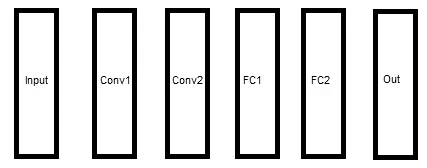
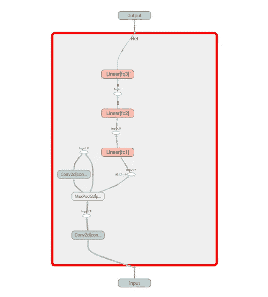
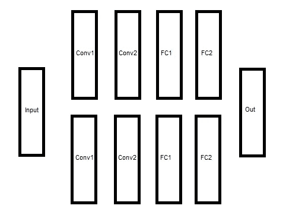
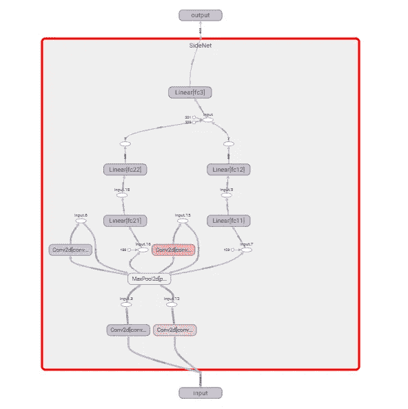
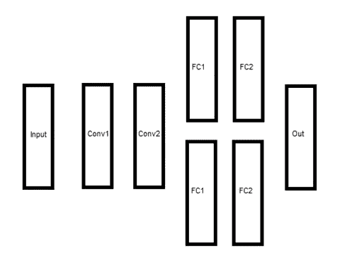
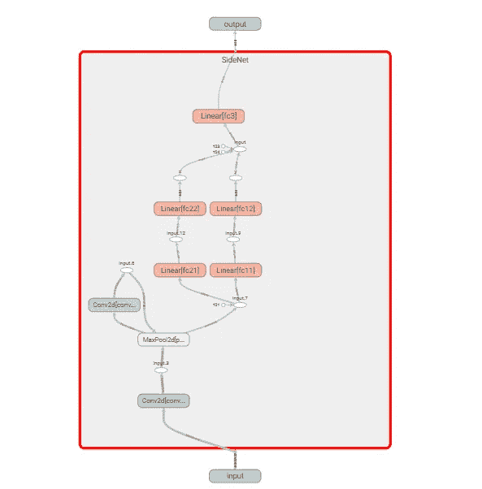

# 并行神经网络与迁移学习

> 原文：<https://towardsdatascience.com/parallel-neural-networks-and-transfer-learning-dbce24f2cf58?source=collection_archive---------19----------------------->

## 近距离观察迁移学习和一个有趣的用例

## 介绍

你好。这是我第一篇关于媒介的文章。我已经计划写这篇文章有一段时间了。我的主要动机是帮助简化，甚至可能提供一个模板，用于下一步构建复杂的神经网络，除了您可能已经构建的特定架构中的神经元之外，还涉及并行神经元。这是因为尽管在理论上看起来很简单，但构建、保存、加载和精炼(以后再训练)神经网络确实会在我们实际开始编码它们时形成绊脚石。希望这篇文章能帮助你更好地理解与这些相关的问题，并帮助你解决在开始深度学习时不时遇到的小问题。就这样，让我们开始我们的旅程。

对于那些刚开始学习或正在练习神经网络的人来说，你可能已经观察到，我们使用的大多数神经网络架构通常是前馈的，即张量从一层按顺序流向下一层。假设我们想要探索，在我们构建并训练我们的架构达到一定程度的满意后，如果我们在一个层中增加神经元的数量，会发生什么。这通常意味着从头再来，可能会浪费几个小时的训练时间。仅仅为了看到在特定层中添加几个神经元的效果，从头开始似乎是不合理的。这就是迁移学习的用武之地。简单地说，它的意思是，你想把你在学习一个特定任务时学到的东西转移到另一个任务中去。在神经网络的范式中，我们学习的东西是用训练后得到的权重值来表示的。

当我们开始更多地了解如何利用迁移学习时，大多数内置函数都有固定的神经架构，并包含用于重新加载权重并在新的上下文中更新它们的代码。要想弄清楚将它应用到您的定制模型的细节，很可能需要几个小时或几天的时间，仔细琢磨网上的多个例子。我自己已经这样做了，我相信将我所学的东西都集中在一个地方，肯定会帮助任何想要更多地实践迁移学习以及探索增强神经网络的另一种替代方法的人。就这样，让我们开始我们的例子。

我假设您熟悉 PyTorch 中关于构建神经网络的教程，可从以下链接获得:[https://py torch . org/tutorials/beginner/blitz/cifar 10 _ tutorial . html](https://pytorch.org/tutorials/beginner/blitz/cifar10_tutorial.html)。要了解现有流行架构的迁移学习基础，请参考链接:[https://py torch . org/tutorials/初学者/transfer _ learning _ tutorial . html](https://pytorch.org/tutorials/beginner/transfer_learning_tutorial.html)。我强烈建议您访问这些链接和其他可用的链接进行实践，并形成一个训练神经网络架构的全面的想法。

## 我们的场景

假设我们现在想要创建 CIFAR 10 教程中描述的网络的副本，并将其与我们的训练版本并行放置，为图像分类的相同问题创建一个更大的网络。我们当前的模型在概念上是这样的:



教程中简单的前馈神经网络。来源:这是我自己用 MS Paint 画的概念图。

该图的张量板描述揭示了以下内容:



我电脑上模型的张量板表示。

我们现在的目标是构建一个如下所示的神经网络架构:



并行前馈神经网络——本质上是并排放置的模型的核心。来源:这是我自己用 MS Paint 画的概念图。

我们还希望这个新结构的上部子部分包含与通过执行教程获得的权重相同的权重。

## 把它编码

让我们看看帮助我们实现这种结构的代码:

```
import torch
import torchvision
import torchvision.transforms as transformstransform = transforms.Compose(
    [transforms.ToTensor(),
     transforms.Normalize((0.5, 0.5, 0.5), (0.5, 0.5, 0.5))])trainset = torchvision.datasets.CIFAR10(root='./data', train=True,
                                        download=True, transform=transform)trainloader = torch.utils.data.DataLoader(trainset, batch_size=4,
                                          shuffle=True, num_workers=0)testset = torchvision.datasets.CIFAR10(root='./data', train=False,
                                       download=True, transform=transform)testloader = torch.utils.data.DataLoader(testset, batch_size=4,
                                         shuffle=False, num_workers=0)classes = ('plane', 'car', 'bird', 'cat',
           'deer', 'dog', 'frog', 'horse', 'ship', 'truck')import matplotlib.pyplot as plt
import numpy as np# functions to show an image
def imshow(img):
    img = img / 2 + 0.5     # unnormalize
    npimg = img.numpy()
    plt.imshow(np.transpose(npimg, (1, 2, 0)))
    plt.show()# get some random training images
dataiter = iter(trainloader)
images, labels = dataiter.next()# show images
imshow(torchvision.utils.make_grid(images))
# print labels
print(' '.join('%5s' % classes[labels[j]] for j in range(4)))import torch.nn as nn
import torch.nn.functional as Fclass Net(nn.Module):
    def __init__(self):
        super(Net, self).__init__()
        self.conv1 = nn.Conv2d(3, 6, 5)
        self.pool = nn.MaxPool2d(2, 2)
        self.conv2 = nn.Conv2d(6, 16, 5)
        self.fc1 = nn.Linear(16 * 5 * 5, 120)
        self.fc2 = nn.Linear(120, 84)
        self.fc3 = nn.Linear(84, 10)def forward(self, x):
        x = self.pool(F.relu(self.conv1(x)))
        x = self.pool(F.relu(self.conv2(x)))
        x = x.view(-1, 16 * 5 * 5)
        x = F.relu(self.fc1(x))
        x = F.relu(self.fc2(x))
        x = self.fc3(x)
        return xnet = Net()
PATH = './cifar_net.pth'
net.load_state_dict(torch.load(PATH))
```

到目前为止，我们已经重新创建了从教程中学习到的模型，并为我们训练和加载了权重，以复制到我们的新网络中。

下面的代码构建了我们需要的架构。

```
class SideNet(nn.Module):
    def __init__(self):
        super(SideNet, self).__init__()
        self.pool = nn.MaxPool2d(2, 2) self.conv11 = nn.Conv2d(3, 6, 5)
        self.conv12 = nn.Conv2d(6, 16, 5)

        self.conv11.weight.data.copy_( net.conv1.weight.data)
        self.conv12.weight.data.copy_(net.conv2.weight.data)

        self.conv21 = nn.Conv2d(3, 6, 5)
        self.conv22 = nn.Conv2d(6, 16, 5)

        self.fc11 = nn.Linear(16 * 5 * 5, 120)
        self.fc12 = nn.Linear(120, 84)

        self.fc11.weight.data.copy_(net.fc1.weight.data)
        self.fc12.weight.data.copy_(net.fc2.weight.data)

        self.fc21 = nn.Linear(16 * 5 * 5, 120)
        self.fc22 = nn.Linear(120, 84)

        self.fc3 = nn.Linear(168,10)
    def forward(self, x):
        y = self.pool(F.relu(self.conv11(x)))
        y = self.pool(F.relu(self.conv12(y)))
        y = y.view(-1, 16 * 5 * 5)
        y = F.relu(self.fc11(y))
        y = F.relu(self.fc12(y))

        x = self.pool(F.relu(self.conv21(x)))
        x = self.pool(F.relu(self.conv22(x)))
        x = x.view(-1, 16 * 5 * 5)
        x = F.relu(self.fc21(x))
        x = F.relu(self.fc22(x))

        out = self.fc3(torch.cat((x,y),dim=1))
        return out# create a new model
net1 = SideNet()
```

我们现在已经创建了我们的网络架构，并在类 SideNet()的 forward 函数中定义了网络中的张量流。

```
self.conv11.weight.data.copy_( net.conv1.weight.data)self.conv12.weight.data.copy_(net.conv2.weight.data)self.fc11.weight.data.copy_(net.fc1.weight.data)self.fc12.weight.data.copy_(net.fc2.weight.data)
```

这段代码片段在很多方面都很关键。你可能会立刻意识到这里发生了什么，因为这是迁移学习中基本发生的事情。我们刚刚将训练好的网络的权重复制到新结构的上部子部分。瞧啊。

我们现在可以选择保持这些权重不变，通过设置 requires_grad = False(实质上是冻结那些层的权重，这些层的权重是从我们训练的网络中复制的)或者在训练我们的新架构时更新它们。因为我只训练了几个纪元的网络，所以我将训练我们架构的两个子部分的权重。最初只训练一个时期的原因将在以后变得清楚。

```
#check weights
print(net.fc2.weight.data)
print(net1.fc12.weight.data)
print(net1.fc22.weight.data)#for param in net.parameters():
#    param.requires_grad = False
from torch.utils.tensorboard import SummaryWriter# default `log_dir` is "runs" - we'll be more specific here
writer = SummaryWriter('runs/temp')# write model to tensorboard
writer.add_graph(net1, images)writer.close()# train the new model
import torch.optim as optimcriterion = nn.CrossEntropyLoss()
optimizer = optim.SGD(net1.parameters(), lr=0.01)for epoch in range(1):  # loop over the dataset multiple timesrunning_loss = 0.0
    for i, data in enumerate(trainloader, 0):
        # get the inputs; data is a list of [inputs, labels]
        inputs, labels = data# zero the parameter gradients
        optimizer.zero_grad()# forward + backward + optimize
        outputs = net1(inputs)
        loss = criterion(outputs, labels)
        loss.backward()
        optimizer.step()# print statistics
        running_loss += loss.item()
        if i % 2000 == 1999:    # print every 2000 mini-batches
            print('[%d, %5d] loss: %.3f' %
                  (epoch + 1, i + 1, running_loss / 2000))
            running_loss = 0.0print('Finished Training')correct = 0
total = 0
with torch.no_grad():
    for data in testloader:
        images, labels = data
        outputs = net1(images)
        _, predicted = torch.max(outputs.data, 1)
        total += labels.size(0)
        correct += (predicted == labels).sum().item()print('Accuracy of the network on the 10000 test images: %d %%' % (
    100 * correct / total))
#check weights
print(net.fc2.weight.data)
print(net1.fc12.weight.data)
print(net1.fc22.weight.data)
```

这里，优化器的参数设置如下:学习率= 0.01，没有使用动量。我使用相同的参数来训练初始网络。这是因为当我们并排查看新网络和初始网络的权重时，我们需要检查旧网络的权重是否被复制，新网络的权重是否已被适当初始化，以及在训练新网络的权重时，初始网络的权重是否没有改变。最后一个短语是关键，有许多方法可以实现前一句中的前两个短语，但它们通常也会导致修改初始网络的权重！例如，如果使用以下代码片段:

```
self.conv11.weight.data = net.conv1.weight.dataself.conv12.weight.data = net.conv2.weight.dataself.fc11.weight.data = net.fc1.weight.dataself.fc12.weight.data = net.fc2.weight.data
```

让我们看看 TensorBoard 推断出的结构:



我电脑上模型的张量板表示。

它确实符合我们试图建立的东西。太好了！

## 验证我们对实际情况的理解

作为验证步骤，让我们打印两个网络的 FC2 层(全连接 2)的权重值:

```
print(net.fc2.weight.data) # before train
tensor([[-2.5432e-03, -6.9285e-02,  7.7019e-02,  ...,  2.8243e-02,
          4.9399e-02, -8.7909e-05],
        [-7.2035e-02, -1.2313e-03, -8.9993e-02,  ...,  1.8121e-02,
         -6.1479e-02, -3.8699e-02],
        [-6.3147e-02,  5.5815e-02, -6.0806e-02,  ...,  3.3566e-02,
          7.6486e-02,  7.3699e-02],
        ...,
        [ 1.9772e-03, -1.8449e-02,  6.8946e-02,  ..., -2.1011e-02,
          7.5202e-02,  4.1823e-02],
        [ 2.9912e-02, -7.9396e-02, -8.7561e-02,  ...,  4.6011e-02,
         -9.0685e-02,  4.1302e-02],
        [-1.8297e-02, -7.3356e-02,  4.7250e-02,  ..., -7.5147e-02,
         -6.4722e-02,  6.0243e-02]])print(net.fc2.weight.data) # after train
tensor([[-0.0151, -0.0470,  0.1057,  ...,  0.0288,  0.0280,  0.0171],
        [-0.0720, -0.0029, -0.0907,  ...,  0.0181, -0.0630, -0.0408],
        [-0.0417,  0.0548, -0.1226,  ...,  0.0335,  0.0679,  0.0900],
        ...,
        [ 0.0074, -0.0028,  0.0292,  ..., -0.0218,  0.0754,  0.0473],
        [ 0.0307, -0.0784, -0.0875,  ...,  0.0460, -0.0903,  0.0510],
        [-0.0252, -0.0824,  0.0380,  ..., -0.0744, -0.0741,  0.1009]])In our new model code, before train,
print(net.fc2.weight.data)
print(net1.fc12.weight.data)
print(net1.fc22.weight.data) tensor([[-0.0151, -0.0470,  0.1057,  ...,  0.0288,  0.0280,  0.0171],
        [-0.0720, -0.0029, -0.0907,  ...,  0.0181, -0.0630, -0.0408],
        [-0.0417,  0.0548, -0.1226,  ...,  0.0335,  0.0679,  0.0900],
        ...,
        [ 0.0074, -0.0028,  0.0292,  ..., -0.0218,  0.0754,  0.0473],
        [ 0.0307, -0.0784, -0.0875,  ...,  0.0460, -0.0903,  0.0510],
        [-0.0252, -0.0824,  0.0380,  ..., -0.0744, -0.0741,  0.1009]])
tensor([[-0.0151, -0.0470,  0.1057,  ...,  0.0288,  0.0280,  0.0171],
        [-0.0720, -0.0029, -0.0907,  ...,  0.0181, -0.0630, -0.0408],
        [-0.0417,  0.0548, -0.1226,  ...,  0.0335,  0.0679,  0.0900],
        ...,
        [ 0.0074, -0.0028,  0.0292,  ..., -0.0218,  0.0754,  0.0473],
        [ 0.0307, -0.0784, -0.0875,  ...,  0.0460, -0.0903,  0.0510],
        [-0.0252, -0.0824,  0.0380,  ..., -0.0744, -0.0741,  0.1009]]) tensor([[ 0.0864,  0.0843,  0.0060,  ...,  0.0325, -0.0519, -0.0048],
        [ 0.0394, -0.0486, -0.0258,  ...,  0.0515,  0.0077, -0.0702],
        [ 0.0570, -0.0178,  0.0411,  ..., -0.0026, -0.0385,  0.0893],
        ...,
        [-0.0760,  0.0237,  0.0782,  ...,  0.0338,  0.0055, -0.0830],
        [-0.0755, -0.0767,  0.0308,  ..., -0.0234, -0.0403,  0.0812],
        [ 0.0057, -0.0511, -0.0834,  ...,  0.0028,  0.0834, -0.0340]])After training,
print(net.fc2.weight.data)
print(net1.fc12.weight.data)
print(net1.fc22.weight.data)tensor([[-0.0151, -0.0470,  0.1057,  ...,  0.0288,  0.0280,  0.0171],
        [-0.0720, -0.0029, -0.0907,  ...,  0.0181, -0.0630, -0.0408],
        [-0.0417,  0.0548, -0.1226,  ...,  0.0335,  0.0679,  0.0900],
        ...,
        [ 0.0074, -0.0028,  0.0292,  ..., -0.0218,  0.0754,  0.0473],
        [ 0.0307, -0.0784, -0.0875,  ...,  0.0460, -0.0903,  0.0510],
        [-0.0252, -0.0824,  0.0380,  ..., -0.0744, -0.0741,  0.1009]])tensor([[-0.0322, -0.0377,  0.0366,  ...,  0.0290,  0.0322,  0.0069],
        [-0.0749, -0.0033, -0.0902,  ...,  0.0179, -0.0650, -0.0402],
        [-0.0362,  0.0748, -0.1354,  ...,  0.0352,  0.0715,  0.1009],
        ...,
        [ 0.0244, -0.0192, -0.0326,  ..., -0.0220,  0.0661,  0.0834],
        [ 0.0304, -0.0785, -0.0976,  ...,  0.0461, -0.0911,  0.0529],
        [-0.0225, -0.0737,  0.0275,  ..., -0.0747, -0.0805,  0.1130]])tensor([[ 0.0864,  0.0843,  0.0060,  ...,  0.0325, -0.0519, -0.0048],
        [ 0.0390, -0.0469, -0.0283,  ...,  0.0506,  0.0030, -0.0723],
        [ 0.0571, -0.0178,  0.0411,  ..., -0.0027, -0.0389,  0.0893],
        ...,
        [-0.0763,  0.0230,  0.0792,  ...,  0.0337,  0.0065, -0.0802],
        [-0.0756, -0.0769,  0.0306,  ..., -0.0235, -0.0413,  0.0810],
        [ 0.0048, -0.0525, -0.0822,  ...,  0.0019,  0.0785, -0.0313]])
```

因此，我们可以观察到，在训练新模型时，我们的初始模型的参数权重被复制，但没有改变。此外，复制了权重的层在训练后改变了权重，从而验证了我们的健全性检查。

我们现在已经建立了一个更复杂的模型，并且能够并行地重用我们的权重。当然，如果想要中间并行，只需要改变类 SideNet()的 forward 函数中张量的流向即可。

## 另一个例子

例如，假设我们希望保留卷积层，但在此之后引入两条平行路线。我们想要:



在神经网络之间引入并行性。来源:这是我自己用 MS Paint 画的概念图。

类 SideNet()现在看起来如下:

```
class SideNet(nn.Module):
    def __init__(self):
        super(SideNet, self).__init__()
        self.pool = nn.MaxPool2d(2, 2)self.conv11 = nn.Conv2d(3, 6, 5)
        self.conv12 = nn.Conv2d(6, 16, 5)

        self.conv11.weight.data.copy_(net.conv1.weight.data)
        self.conv12.weight.data.copy_(net.conv2.weight.data)

        self.fc11 = nn.Linear(16 * 5 * 5, 120)
        self.fc12 = nn.Linear(120, 84)

        self.fc11.weight.data.copy_(net.fc1.weight.data)
        self.fc12.weight.data.copy_(net.fc2.weight.data)

        self.fc21 = nn.Linear(16 * 5 * 5, 120)
        self.fc22 = nn.Linear(120, 84)

        self.fc3 = nn.Linear(168,10)def forward(self, x):
        y = self.pool(F.relu(self.conv11(x)))
        y = self.pool(F.relu(self.conv12(y)))

        z = y.view(-1, 16 * 5 * 5)
        y = F.relu(self.fc11(z))
        y = F.relu(self.fc12(y))

        x = F.relu(self.fc21(z))
        x = F.relu(self.fc22(x))

        out = self.fc3(torch.cat((x,y),dim=1))
        return out
# create a new model
net1 = SideNet()
```

TensorBoard 的描绘证实了我们想要建造的东西:



在我的电脑上对我们改进的并行神经网络的张量板描绘。

我希望所有这些例子能让你对编写复杂的神经网络充满信心，并成为你机器学习之旅中的关键垫脚石。感谢阅读:)