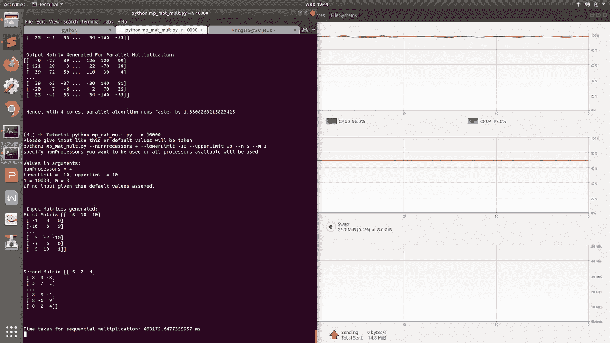

# 并行编程:Python 中的多重处理

> 原文：<https://towardsdatascience.com/parallel-programming-multiprocessing-in-python-61c596b366e0?source=collection_archive---------33----------------------->

*在这个计算能力贪婪的时代，我们往往会忘记在自己的电脑上使用我们可以利用的能力*

[PC](http://www.uberoffices.com/) via [Flickr](https://www.flickr.com/photos/117693452@N04/12547460924)

一般来说，程序员、游戏玩家、科学家、软件开发人员和大多数知道如何使用计算机的人对计算能力的渴望是巨大的。我们一直在寻找计算强度更低、效率更高的应用。这使我们能够更有效地利用我们的计算机设置。

然而，我们中的许多人并没有充分利用计算机上已经可用的计算能力。在需要的时候利用这种能力可以带来指数级的更好的性能，通常，通过一些代码的改变，你可以将进程运行速度提高 2-3 倍。你会问我们如何做到这一点？好吧，我们开始吧。

这个博客主要关注并行编程。即同时在多个处理器上运行程序。当你运行你的程序时，它通常使用你计算机中的一个内核。但是，大多数计算机都有多个内核。根据您的处理器，它可能是双核、四核、八核，或者可能包含更多内核。如果(比方说)你有一个四核处理器，只在一个内核上运行程序，你实际上放弃了其他三个内核，因此计算能力是你正在使用的三倍。理论上，使用所有这些内核可以将您的任务速度提高四倍。

[多重处理](https://techdifferences.com/difference-between-multiprocessing-and-multithreading.html)

然而，这并不简单，否则软件公司将一直使用所有的内核来获得更好的性能。如果你想提高程序的性能，你需要确保它可以并行化。也就是说，它可以同时在不同的内核上运行。

让我们举一个简单的例子来理解这一点。假设你要生产一个产品，你把它的生产分成四个阶段。如果只有在阶段 1 已经完成的情况下才能从阶段 1 进入阶段 2，然后只有在阶段 2 完成的情况下才能从阶段 2 进入阶段 3，以此类推。那么这个过程就是一个连续的过程，因为你必须遵循一个序列来执行你的指令。然而，如果你能把生产分成四个部分并分配给不同的工人，那么这个过程就可以并行化。例如，为一个玩具构建四个组件，这些组件一旦完成就可以连接起来。

一旦您确定您的程序可以并行化，下一步就是为它编写代码。我不会在这个博客中写代码，但是，这个博客的代码可以在这个 [Github repo](https://github.com/khansaadbinhasan/Parallel-Programming-MultiProcessing-in-Python/) 中找到。我选择 python 来编写代码，我使用了[多处理模块](https://docs.python.org/3.4/library/multiprocessing.html?highlight=process)来在多个处理器上运行程序。

 [## Khan saadbinhasan/Python 中的并行编程多处理

### 程序乘以 mXn 矩阵与单核以及多核。该计划产生两个随机…

github.com](https://github.com/khansaadbinhasan/Parallel-Programming-MultiProcessing-in-Python/blob/master/README.md) 

在本期节目中，我们将看到并行编程的两个应用。首先是矩阵乘法，它可以很容易地并行化，接下来我们将看到前缀和扫描，乍一看似乎是一个顺序问题，但可以并行化，以在多个处理器上运行。

# 矩阵乘法

将两个矩阵相乘相当简单，是大多数编程入门课程的一部分——从第一个矩阵中选择一行，从第二个矩阵中选择一列，将相应的元素相乘并相加，得到第一个元素，然后移到下一列，以此类推，得到下一个元素。

这里，人们可能会注意到，给定两个矩阵 A(mXn)和 B(nXr)以及它们的合成和矩阵 C(mXr)，为了得到元素 C(i，j ),人们只需要考虑矩阵 A 的第 I 行和矩阵 B 的第 j 列就可以得到所需的矩阵 C 的元素。因此，我们是否已经计算了元素 C(1，1)来计算元素 C(1，2)并不重要。

因此，可以将程序分成不同的进程，并在不同的处理器上运行。这可以导致程序运行速度的显著提高，因为矩阵乘法在许多应用中是如此重要的操作，例如机器学习、科学模拟、游戏等。回报是巨大的。

现在，尽管这听起来很简单，但在代码中实现时，我们仍然需要小心一些事情。首先要做的事情之一是决定哪些计算将在哪个内核上运行。您可以决定按行或按列划分矩阵。我们应该按顺序做。也就是说，首先，我们取第一个矩阵，取其一定数量的行，并将其与第二个矩阵中的所有列相乘，同时对不同内核上的不同行执行此操作。

例如，假设我们有 A(4X3)和 B(3X5)两个矩阵，我们将 A 的第一行的计算负载分布在一个处理器上，第二行分布在第二个处理器上，依此类推。但是，如果我们的行数超过了处理器的数量，那该怎么办呢？例如，A(7×4)和 B(4×5)，这里，我们为我们做一个除矩阵的函数。也就是说，它决定了矩阵如何被划分以在不同的处理器上运行。

实现该函数的一种方法是从 0 到 r 开始第一次除法，其中 r 可以通过整数除法(总行数/处理器数)来计算，然后是从 r 到 r +整数除法(总行数/处理器数)，其中现在的总行数是之前的总行数减去已经要执行的行数，我们少了一个处理器，以此类推。

让我们举个例子来理解这一点

> 然后，第一次除法将从 0 到(7/4)即 0 到 1现在 R = R-1 = 6，N = N-1 = 3因此，第二次除法将从 1 到 1+(6/3)即 1 到 3现在 R = R-2 = 4，N = N-1 = 2因此，第三次除法将从 3 到 3+ (4/2) i 3 到 5现在 R = R — 2 = 2，N = N — 1 = 1因此，第三次除法将是从 5 到 5+(2/1)即 5 到 7因此，除法将是从:(0 到 1)、(1 到 3)、(3 到 5)和(5 到 7)

**注:此处第一项是非包容性的，矩阵从索引 1 开始。因此，第一行在第一处理器上执行，而不是在第二处理器上执行。**

现在，我们可以将矩阵分成所需的行，并在不同的内核上执行。我在随机生成的 100X100 矩阵上运行上述程序，发现加速几乎是 2.75 倍。那么，加速到底是什么？

这是一种方法来衡量你的算法有多快，相比之下，一个类似的算法顺序运行。我们怎么做呢？我们首先计算执行顺序程序的时间和执行并行程序的时间。然后我们将第一次得到的时间除以第二次得到的时间，这就是我们的加速比，也就是说，我们的程序比顺序程序快多少。

从理论上讲，给定四个内核应该会将算法的性能提高四倍，但是，当我们试图并行运行这些进程时，会产生额外的开销。例如，我们必须生成多个进程并进行额外的处理，因为在这种情况下，我们将矩阵行划分为在不同的处理器上运行。此外，由于我们将写入一个公共内存阵列，因此在写入结果时可能会有冲突，这也可能会导致速度变慢。另一个原因可能是这些过程需要不同的时间来执行。例如，在上面的例子中，不是所有的行都有相同的大小，因此需要不同的时间来执行。

我建议你去我的 [GitHub repo](https://github.com/khansaadbinhasan/Parallel-Programming-MultiProcessing-in-Python/) 下载文件夹，按照说明运行程序。当你使用它的时候，在 ubuntu 中打开名为“系统监视器”的软件，或者在 windows 中打开名为“任务管理器”的软件。转到显示不同处理器使用情况的选项卡。当顺序程序运行时，它应该是这样的。

在顺序算法中仅使用一个内核

这表明当顺序乘法运行时，只有一个内核在使用。而运行并行计算会导致使用所有四个内核。你可以在下面的截图中看到。

并行算法中使用的所有内核

现在，我们已经执行了矩阵相乘的程序，并确保它可以在多个处理器上执行。我们现在将关注一个更反直觉的问题，即前缀求和。

# 前缀总和扫描

扫描可能是并行编程中最重要的主题之一。理解什么是扫描很简单，但是，很难找到一种方法来并行化它，因为它看起来本质上是顺序的。

给定 n 个元素的列表，第 I 个元素的扫描被定义为在它之前的所有 i-1 个元素的总和，根据扫描的类型包括或不包括第 I 个元素。在这篇博客中，我们将看到一个包含第 I 个元素的全面扫描。例如，列表[1，2，3，4，5，6，7，8]的扫描将是[1，3，6，10，15，21，28，36]。这个操作可能看起来非常简单，但它是相当常见的，它不限于加法，你可以应用大量的运算，因此你正在做的是找到一种方法来应用一些运算到一个数字列表，但不是顺序地做，而是并行地做。

计算扫描顺序是足够容易的，我们必须维护一个变量运行总和，并添加每个元素一个接一个，并取代它。然而，当试图并行化这个问题时，没有想到立即的解决方案。我们要看一个算法，对思考这个问题有帮助。这种算法以最早提出它的人的名字命名为希利斯-斯蒂尔斯算法。

从这个算法开始，首先，把第 I 个位置的每个元素加到第 i + 1 个位置的元素上，更新第(i+1)个元素的结果。如果没有元素替换该元素，则按原样复制它。在下一阶段，将第 I 个元素添加到第(i+2)个位置的元素，并更新第(i+2)个位置的元素。如果元素没有更新，请再次复制它。对第 I 个和第(i + 4)个元素再做一次，依此类推。

这里，我们在每个阶段取第 2^r 元素，其中 r 是从 r = 0 开始的阶段号。停止条件将是当我们不能再把元素加在一起，因为 2^r 大于或等于元素的数目。因此，总共有 log(N)个阶段，其中 N 是元素的总数。r 从 0 到 log(N)-1 不等，包括 0 和 log(N)-1。

这个算法为什么会起作用？好吧，让我们来看看下面这个来自 Udacity 并行编程课程的[精彩视频](https://www.youtube.com/watch?v=RdfmxfZBHpo)的例子。让我们以第 5 个(1 索引)元素为例，即 5。在包含和扫描中，其最终值将为 15(即 1 + 2 + 3 + 4 + 5)。

第一步，我们用 4 加 5，得到 5+4 = 9。在第二步中，由于我们已经将前面的元素添加到我们的元素中，现在我们需要在它之前添加元素。即 3、2、1 等。但是在上一步中，我们已经将 3 加到了 2，即 3+2 = 5。这个元素现在位于原始元素之前的两个位置。因此，如果我们把它加到 9，我们得到 9 + 5 = 14 或 5 + 4 + 3 + 2 = 14。现在，我们已经添加了 5，4，3，2。因此，我们需要更进一步，也就是说，在 1 之前增加元素 4 步，因此我们得到总和 15。

但是如果我们在 1 之前有更多的元素，在这种情况下，1 所在位置的元素将包含它之前 3 个元素的总和。因此，很容易看出这将如何导致先前没有添加的那些元素的添加，而在每个阶段，任何元素都包含在其之前的 2^r 元素的总和(包括其自身)。

希利斯-斯蒂尔斯扫描

这个算法对并行化有什么帮助？在每个阶段，我们只关心将一个元素添加到当前元素，而不关心它之前的所有元素，因为在每个阶段，我们添加到当前元素的元素包含关于它之前的一些元素的信息，而在下一个阶段，我们添加的元素将包含关于更多元素的信息，最终我们将获得关于当前元素之前的所有元素的信息。因此，在每个阶段，我们只能处理一些元素，而忽略其他元素。这可以在不同的内核上完成。

为了并行化该算法，我们将遵循与矩阵乘法类似的方法，首先，我们创建一个函数来划分列表，我们需要将它分布在不同的内核上。我们可以使用与矩阵乘法几乎相同的算法。然后，我们可以将第 I 个元素添加到(i — 2^j)th 元素，其中 j 是我们从 0 迭代到 lg(N)的迭代变量。然而，这个算法将只对偶数个元素起作用，因为您可以通过取奇数个元素来验证。处理这个问题的方法是在元素个数为奇数的末尾再填充一个元素，一旦计算完成，就删除最后一个元素。

要查看实际的实现细节，请访问包含代码的 [Github repo](https://github.com/khansaadbinhasan/Parallel-Programming-MultiProcessing-in-Python/) ，并按照 README.md 文件运行程序

为了更直观地理解这个算法，请看下面的视频，这个算法可以在[这里](https://en.wikipedia.org/wiki/Prefix_sum#Algorithm_1:_Shorter_span,_more_parallel)找到。

【https://khansaadbinhasan.blogspot.com】最初发表于**。**