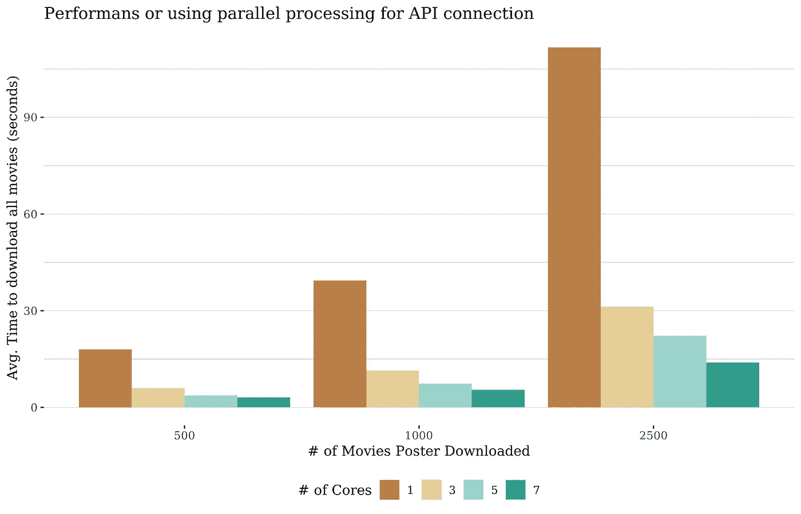

# R 中的并行 API 连接

> 原文：<https://towardsdatascience.com/parallel-web-scraping-and-api-connection-a-way-to-save-lots-of-time-part-i-r-bf740f6cfbd0?source=collection_archive---------39----------------------->

## 节省大量时间的方法。

创建新数据集是数据科学家和分析师目前面临的挑战之一。创建数据集的一种流行方式是网上冲浪，并根据需要从不同的网站收集信息。但是您可能知道，这非常耗时，因此在不使用多个虚拟机或集群的情况下加速这一过程是您的数据科学家工具集的一部分。在这里，我们将深入探讨如何使用 r 进行并行 API 连接。

这是一个关于如何使用并行计算的简单指南。这个想法是，你的计算机的每个线程/工作者/核心使用不同的连接来访问网络，因此，你不需要等待 API 响应或动态网站的加载来开始抓取另一个。只需将简单的命令添加到代码中，并以巧妙的方式包装它，就可以加快速度，节省大量时间。

# 并行 API 连接

我们将从并行使用 R 和 API 连接开始。这将允许我们更有效地下载信息，就像在你的网络浏览器中打开多个标签一样。对于我们的例子，我们将使用 [OMDB API](http://www.omdbapi.com/) 。这个 API 让您可以访问许多关于电影的信息，对于我们的测试，我们使用了 Poster API 来下载电影海报并将其保存在本地，以便我们可以在以后处理它们。

## 1.-加载库

第一步是加载所有需要的库。对于并行设置我们的代码，我们将使用， *future。*这个库设置了我们将要使用的并行方法。对于并行功能，我们选择， *furr* 包。这个包是 *purrr* 包的未来版本。

```
library(RCurl)
library(curl)
library(future)
library(furrr)
```

## 2.-创建一个函数

其次，我们需要创建一个新功能。这个函数将是我们进行 API 连接和下载的地方。在这里，我们可以将 API 连接代码更改为 web 抓取代码。

为了演示如何做，该函数将打开一个与 Poster API 的 *curl* 连接，并将一个图像下载到一个名为 *images* 的新目录中。

```
imgAPI <- '[http://img.omdbapi.com/?apikey=*[your-own-api-key]*'](http://img.omdbapi.com/?apikey=9c9e16a&i=tt')
rootDir <- 'images/'
get_img <- function(id){
  url <- paste0(imgAPI,str_pad(id, 7, pad = "0"))
  if(url.exists(url)){
    curl_download(url = url ,destfile = paste0(rootDir,'tt',id,'.png'))
  }
}
```

使用并行连接和传统的并行处理之间的一个区别是，您几乎可以肯定您的代码能够并行运行，因为通常连接本质上是独立的。

## 3.-在所有连接上运行 future_map

最后，我们需要在我们的链接列表上运行我们之前创建的函数。为了实现这一点，我们使用了 *future_map* ，一个并行版本的 map 函数。这就是并行连接发生的地方。

```
#load file with list of movie ids to create API links
links <- read_csv('links.csv')future_map(links,get_img)
```

**重要**:为了让我们的代码知道它需要并行运行，我们需要告诉它如何去做，以及它应该使用多少个不同的内核。未来库中有两个函数允许我们这样做:*【可用资源()* & *【计划()*。第一个读取关于我们的计算机有多少内核的信息，第二个告诉代码有多少内核以及如何并行化*未来的*功能。

```
n_cores <- availableCores() - 1
plan(multiprocess, workers = cores)
```

为不属于您代码的其他计算机进程留出一个空闲的内核总是一个好的做法。

## 4.-测试和结果

使用之前定义的代码，我们将运行一个小测试，看看这些并行连接如何提高我们的下载速度。对于该测试，我们使用 4 种不同的配置:

*   完全没有平行，使用正常的*映射*功能。
*   多重处理计划和设置 3 个核心。
*   多重处理计划和设置 5 个核心。
*   多重处理计划和设置 7 个核心。

内核数量是根据 8 个内核的机器选择的，至少有 1 个内核空闲。

为了进行测试，我们在 3 个不同的场景中运行每个配置，以检查卷如何影响性能。这些场景基于我们将要下载的电影海报数量(500，1000，2500)。在每个场景中，我们运行 5 次，取下载所有电影的平均时间。

结果如下图所示。



作者图片

# 结论

该测试向我们展示了使用并行计算从 web 访问信息可以极大地丰富我们的工具包。作为数据科学家，我们有很多关于访问 API 以访问信息的项目，这是一种加速这一过程的方法。即使这个过程不是那么庞大，改进也是巨大的。

您可以在这个 [GitHub 链接](https://github.com/gody/ParallelScraping)中访问该实验的代码。