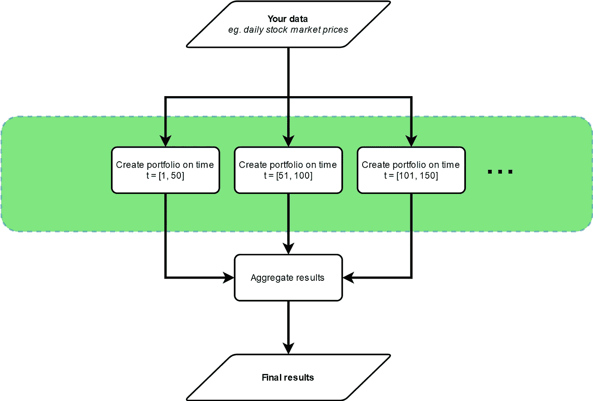

# R #1 中的并行化警告:性能问题

> 原文：<https://towardsdatascience.com/parallelization-caveats-in-r-1-the-basics-multiprocessing-and-multithreading-performance-eb584b7e850e?source=collection_archive---------13----------------------->

## R 中的多处理的介绍，以及一些很难注意到但可能严重影响性能的缺陷。

> **关于这部作品**。我以一篇独立的文章开始这篇文章，总结我在研究项目中遇到的并行处理问题。在看到这篇文章变得相当长之后，我决定将它分成多个部分，每个部分涵盖一种特定的陷阱，在最好的情况下，这些陷阱会导致错误，或者在最坏的情况下，会导致明显的糟糕性能或看不见的后果。因此，您将[有希望]看到多篇文章，这些文章涵盖了这些陷阱以及我已经成功应用于解决我的问题的解决方案。本文讨论基本的设置和可能的性能问题。


[手工摄影](https://unsplash.com/@artisanalphoto)在 [Unsplash](https://unsplash.com) 拍摄

我们大多数人在工作中都遇到过代码速度不够快的情况，因为它只使用了一个 CPU 内核，需要几个小时才能完成。为了解决这个问题，我们求助于传统的多重处理技术，希望它能弥补我们计算的缓慢。然后，在快得多的 30 分钟的运行结束时，我们看到一个错误，它根本没有告诉我们哪里出错了，可能类似于`Error reading from connection 7`(如果您来自搜索引擎，这不是涵盖这个特定错误消息的文章)。在本系列中，我将总结我在 R 中的并行性经验，并尝试指出在并行计算中可能会出错的地方。我不会深入讨论并行处理是如何工作的——尽管我将尝试至少定义我所使用的概念——本系列旨在收集在决定切换到并行模式时需要考虑和注意的事情。

在第一部分中，我将谈论*为什么*我们会转向并行工作流(只是为了给我们一点动力)，然后我将展示一些在 R 中实现它的技术，最后我们将开始组合它们以在我们的计算机上释放完全的混乱，我们将看到为什么这个或那个不应该一起使用，或者为什么以某种方式做某事会减慢您的计算。好吧，也许我有点太戏剧化了，但是我最近设法冻结了一个 32 核服务器，给了它太多的事情去做——当然是不情愿的。

最终，我决定写这些文章，因为我自己在编写代码时遇到了这些问题，而且没有现成的食谱(至少我还没有找到一本)可以指出我犯的错误——有些可能是语言或特定于包的错误，但大多数错误很难找出——并给我一些如何解决它们的建议。虽然本系列的大部分内容包含特定于 R 的建议，但我将要讨论的一些问题是语言不可知的，这意味着如果您使用 MATLAB 或 Python 或 Assembly (hah)来做类似的工作，您可能会面临与我相同的问题。还要注意，我不是并行化大师(既不是*也不是*的 R 大师)，所以如果您发现什么不正确的地方或者需要更好的解释，请不要犹豫，告诉我！


四个任务的顺序执行和并行执行的简化(理想)图(图片由作者提供)

# 简介:“为什么还要并行？”

你是否尝试过执行一个包含一些复杂数学运算的长循环？就像一系列的矩阵求逆，其结果被相乘，多个函数被调用，甚至可能解决一些二次优化问题，等等？如果你在代码运行的时候打开了任务管理器(或者在你喜欢的操作系统上打开了它),你可能会发现 R 进程并没有完全使用你的全部处理能力，而只是使用了一小部分。CPU 使用百分比可以从大约 50%(在 2 核 CPU 上)到 4–5%(在 24 个[逻辑]核上)不等。你可能会问一个关键的问题:

> 如果 R 使用了我 100%的 CPU，我的计算不会运行得更快吗？

答案很不幸只是:*大概是*。看，在我们开始让我们的代码使用更多的 CPU 之前，我们必须了解一些关于我们如何计算的事情，更重要的是，*我们的计算结果是否相互依赖*。一般来说，如果你有两个相互依赖的任务，那些*不能*并行执行(如果没有第一个的结果，第二个会怎么做？).否则，如果你的任务不相互依赖，它们可能*并行运行。你也可以把你的任务想象成一个`for`循环的主体:如果你需要来自前一次迭代的数据，那就不能并行运行。*

为了创建一个更实际的例子，我们将计算矩阵行的总和。是的，有一个叫做`rowSums`的函数可以更快地完成这项工作(你应该使用它来代替下面的实现)，但是这个例子应该足够简单来帮助我们理解基础知识。有一种方法可以做到这一点:

这段代码将计算矩阵中每一行的总和，并将其存储在`results`向量中(请尽量避免像这样分配向量，因为它们将不得不动态增长，这是很昂贵的，一个额外的提示是使用`results = numeric(nrow(bigMatrixWithLotsOfData))`来代替——假设您*知道*结果将是数字)。因此，我们将依次计算每一行*的总和*，一个接一个。但是事情是，**对于任何一个** `**i**` **我们不需要任何其他迭代的结果**！因此，如果我们的计算不相互依赖，我们可以*理论上*并行运行它们，将一些工作交给我们的其他 CPU 内核！

> 顺便说一下，我会经常提到`for`循环，因为 R 中一个流行的并行解决方案也使用它们——不过，我们不要太超前了。现在，关于什么有助于无错并行(线程安全等等)，将有更多的讨论，但这不是一个一般的并行计算讲座，而是关于 ***当进行并行处理时，什么可能出错*** 。

好的，那么并行计算行和需要什么呢？有几种方法可以实现它，但是所有的解决方案都涉及到立刻开始*多重、* ***独立*** *计算*(就像为每个`i`创建一个 R 实例)当它们都完成时，就把它们的结果粘在一起。现在，我将向您展示如何做到这一点。

## R 中的并行处理:使用“foreach”的多处理

在 R 中，进行并行计算的一种典型方式是借助于`foreach`包([这里有更多关于如何使用它的信息](https://cran.r-project.org/web/packages/foreach/vignettes/foreach.html))。它提供了一种便捷的方式将您的任务( *jobs* )分配给多个进程，而不需要考虑如何以及何时将某个任务安排给某个进程。当这些过程完成时，这个包还会帮助您将结果连接成一个列表或向量(或者实际上是任何东西)。就其本身而言，这可能还不够，因为您需要提供所谓的*并行后端*(处理进程的创建和销毁，以及它们之间的通信)。包`doParallel`提供了一个这样的后端。无需深入了解它们是如何工作的，这里有一段代码为我们做了并行行求和:

我插入了一些更长的注释来说明这些指令的用途。该代码片段将让您快速了解如何使用该包来运行并行计算。通常，您会希望以`item = theListToProcess`的形式向`foreach`结构提供一个列表，然后您可以在您的子流程中用`item`变量引用列表的当前元素——您可以为它选择(几乎)任何名称。

不幸的是，我们现实生活中的计算很少这么容易实现。也许我们正在运行复杂的模拟(计算多个矩阵的协方差，解决线性规划问题等等)，我们的结果只有在执行了一些函数后才会出现。也许您已经创建了顺序运行的代码，现在您想让它并行运行。也许你让你的代码并行运行，但实际上比顺序运行要慢(是的，这可能发生，我们会看到)。很多事情都可能出错，但是如果你注意其中的几个，你就可以编写出引起麻烦的几率更低的代码。

## 首先，我可以并行化什么？

如果您已经有了一些代码，并且正在考虑通过并行执行来使它更快，那么停下来想想它计算最终结果的步骤是一个好主意。创建一个简单的流程图也很有帮助——看看下面的速写:



处理每日股票市场价格的程序的简化流程图(图片由作者提供)。

该图显示了从数据集的某些部分组装投资组合的过程(例如，基于 2020 年 6 月 1 日和 2020 年 6 月 5 日之间的数据创建投资组合，然后基于 2020 年 6 月 8 日和 2020 年 8 月 12 日之间的数据创建投资组合，以此类推),并汇总这些操作的结果。在绿色区域，我们可以看到组装投资组合的过程**不*而*相互依赖**，只依赖于预先获得的数据，因此我们可以重新安排它们并行运行。一般来说，`for`循环是开始观察的好地方:如果您没有将数据从一个迭代传递到另一个迭代(并且您也没有在循环之外修改数据*，您应该可以让那个循环并行运行(尽管尝试并行化一切很容易，请参见*性能*部分)。*

如果您已经嵌套了 for 循环，并希望将其中一个循环转换为并行任务，请确保您执行的是仍然可以独立运行的最外层循环(如果它不止循环几次)。

这可能是一项令人生畏的任务，而且真的没有通用的方法来做到这一点:你必须做出决定，将一些事情变成平行的，或者保持现状。或者，您可能需要重构代码，使其更易于并行化。现在——在这个*冗长的*介绍之后——让我们直入主题:

> 什么可能出错(第 1 部分)？

# 无意中问了太多你的 CPU 也就是性能问题

在本文的剩余部分，我们将看看一些看似微妙的问题，这些问题不一定会使 R 会话崩溃或抛出错误，而是会悄悄地削弱您的计算性能，甚至可能使您的计算机进入无响应状态。首先，我将讨论并行化的开销，这种开销随着并行执行的性能增长而慢慢减少。然后我们将了解为什么混合多种并行化技术是一个坏主意，最后我将向您展示两个边缘案例，如果与其他一些问题结合起来，可能会导致更多问题。

## 并行化不是免费的:开销

很容易将并行化视为解决所有性能问题的金锤。事实上，

> 为什么我不应该并行运行所有的事情呢？

问得好，但原因如下。很容易从上面的例子中得出结论，说“嗯，我有一个长度大于 100 的向量，让我们把它扔到 32 个进程上来计算一些东西”。问题是创建进程**不自由**，它们之间的通信也不自由。它们中的每一个都需要启动(至少在不分叉的时候),并且它们有自己的内存空间(Windows 上的一个基本 R 实例可以占用 30-50 MiB RAM，乘以 12 个进程就已经是 480-600 MiB 了——我们甚至还没有在它们上面加载包和数据！).如果您需要访问所有进程上的整个大型数据框架，那么需要将数据加载到所有进程上——不过，只需将真正需要的变量移动到您的进程上。如果您使用具有大量依赖项的包，它们将使用大约 12 倍多的 RAM——在我们的 12 进程示例中。您很快就会明白为什么我们需要将数据加载到我们所有的流程中。


还记得文章开头的这张图吗？这离现实又近了一步(图片由作者提供)。

因为我在 32 个内核的 Linux 服务器上使用了一个“SOCK”集群(即我没有分叉我的进程)，我必须等到所有 32 个进程都正确初始化，这导致了大约 45 到 90 秒的等待时间:每个进程都必须加载多个包并调用一些函数来准备处理。在这种情况下，最好重新考虑启动时间(和增加的内存使用)是否真的值得多处理带来的性能提升。对我来说，这绝对是值得的，因为我解决了成千上万的二次规划问题:这里开销和并行执行时间的总和仍然比顺序运行时低得多。然而，对于小任务，选择更少的进程或者根本不并行会更有效率。

在下一节中，我们将看到另一种提高速度的方法，而不必求助于多重处理，以及它是如何引起更多麻烦的。

## 多线程×多处理=不好

如果你想让数学运算更快，从 base R 转换到[微软 R Open (MRO)](https://mran.microsoft.com/open) 可能是个不错的选择。它是 R 的一个略微修改的版本，依赖于一个不同的库([英特尔数学内核库(MKL)](https://software.intel.com/content/www/us/en/develop/tools/math-kernel-library.html) )来进行数学计算。了解微软 R Open 很重要的一点是:( 1)它与 base R 兼容，更重要的是,( 2)由于采用了英特尔 MKL，它通过以*多线程*的方式执行矩阵乘法和类似的矢量化任务，实现了更快的速度——可以在这里[看到微软进行的性能比较](https://mran.microsoft.com/documents/rro/multithread)。坚持住。什么，现在？

从概念上讲，所做的事情与我们在上面的行求和示例中所做的非常相似。*多线程*工作流，然而，创建单独的*线程*，而不是单独的*进程*(如同*多重处理*)。如果你不介意的话，我不会深入研究具体的技术差异，但我们也不要在这里留下一个黑洞。在*多线程*环境中，内存通常在计算(*线程*)之间共享，而在多处理环境中，每个进程都有自己的内存。如果您还记得上一节，这就是为什么我们必须初始化集群中的每个 R 进程:因为它们是独立的进程(实例),有自己的内存，所以每个进程都作为一个空的 R 实例启动，没有加载额外的包。一个进程可以有多个线程，所以这里也有一个层次结构，但就像我说的，这不是一个并行计算或操作系统大师级。

在高层次上，创建线程通常比创建进程便宜(CPU 和内存方面也是如此)，但是对于线程，您必须非常小心内存，因为您可能会覆盖另一个线程正在处理的内容。但是在进程的情况下，由于独立的内存空间，这不是问题，但是您必须处理进程之间的通信(这是由并行后端和`foreach`完成的)。每一种都有它们的优点和缺点，但是知道**你可能会在不知情的情况下使用它们**和**可能会导致速度大幅下降**就足够了。我们能把这叫做*过度平行化*吗？

**我们来数一数**。您正在使用 MRO (Microsoft R Open ),因为它在顺序工作流中更快，但是您注意到您的代码的一部分可以并行执行，所以您将并行`foreach`放入其中。您有一个 4 核 CPU (4 个逻辑核，没有超线程)，因此您会产生 4 R 个进程。但是，您没有意识到的是，您正在创建 4 个 *MRO 进程*，这些进程可能没有被告知并行情况，因此它们每个都决定使用 4 个线程来进行计算。你开始进行大量矩阵求逆或乘法的并行计算，却突然意识到。只是。*慢*。这怎么可能？

事实是，你实际上使用了 **4*4 = 16** 个线程！**CPU 能够同时运行的线程数量的四倍**。结果，你的 CPU 在这些线程之间来回切换，大大降低了矩阵运算和并行执行的速度。它可能会减慢到顺序执行会更快完成的程度。

为了避免这个问题，您应该使用 MRO 的命令(`setMKLthreads`)将每个子进程上使用的线程数限制为 1。我将给你一个使用`doParallel`包实现这一点的完整例子。确保在实际的`foreach`计算之前运行下面的代码片段**！**

很好。试着再次运行你的计算，你可能会注意到它们变得更快了，就像我一样。哦，顺便说一下，`clusterEvalQ`只是在你所有的子进程上执行相同的代码([文档在这里，](https://www.rdocumentation.org/packages/parallel/versions/3.6.2/topics/clusterApply)我稍后会谈到)。它可用于在您的流程上进行一些设置工作，如加载包和调整设置。

错过这一点的有趣之处在于*你可能甚至不会注意到背景中发生的事情。您不会得到任何错误，但在某些时候，您的计算可能会大大减慢。只要您的进程没有同时碰到一些繁重的多线程部分，您可能会没事，但是一旦它们碰到了，您会发现您的进度条(如果您正在使用的话)停止了，只是盯着监视器，心想“嗯，它似乎不能再快了”。我的模拟似乎也停止了，我想这是因为我使用了 500×500 的矩阵——它们在 50×50 的矩阵下运行良好！一旦我告诉 MRO 停止在它的每个进程上使用多线程，我的并行执行甚至可以在大(500×500)矩阵上运行！我在 32 核服务器上运行这些，所以我实际上产生了 *32*32 个线程*，太棒了。*

即使你不使用 MRO，你仍然可能遇到这个问题。看，例如`data.table`包也是多线程的，但是当[文档](https://www.rdocumentation.org/packages/data.table/versions/1.12.8/topics/setDTthreads)说它可以检测它是否运行在一个*分叉*进程上并切换回单线程操作时，我有点担心明确提到的*分叉*。分叉是创建集群时的另一种方法，它克隆进程(在 Linux 上传递`type = "FORK"`到`makeCluster`),但它在 Windows 上不起作用，所以我使用“SOCK”集群——我在 Windows 上开发我的代码，并在 Linux 服务器上运行它，这是最好的办法。为了扩展前面的代码，我们可以改为执行以下代码:

这应该足以让你开始多线程和多处理。请记住，您需要确保您在子进程上使用的每个包都以单线程模式运行。软件包通常会告诉你它们是否像`data.table`一样使用多线程。

顺便说一下，如果您想知道 MRO 在单线程上的性能，当切换到单线程操作时，它不会变得无用。它仍然使用英特尔的 MKL，即使在一个线程上，它也比 base R 的 BLAS/LAPACK 库快得多(参见我之前提到的基准测试，[这里](https://mran.microsoft.com/documents/rro/multithread))。

**TLDR。**你真的不想同时使用这两种类型的并行性，小心多处理环境中的多线程部分！

## “嘿，我们还在运行”——不是停止集群，或者只是认为已经停止了集群

关于性能还有一件事要提。看，我遇到过这样的问题，我几乎冻结了一台 32 核服务器。原来错误不仅仅是我生成了太多的线程，而是当我强行告诉主进程停止时，子进程没有退出(使用每个人都喜欢的组合键，`CTRL + C`)。由于我在 Windows 机器上工作，我天真地认为事情在 Linux 机器上应该以大致相同的方式运行我的子进程:用`CTRL + C`从控制台关闭主进程也应该停止子进程——只是看起来不是在 Linux 机器上。

这些子进程处于*过度并行化*的情况中:每个线程都在争夺 CPU (1024 个线程争夺 32 个内核！)，所以他们的预计完成时间基本上是*从来没有*。现在，由于我没有意识到这一点，我实际上重新启动了几次计算(在不断更新代码之后)，所以运行的子进程和线程比我想象的要多——这就是为什么您至少应该运行`top`,如果不是`htop`来从命令行检查您的服务器的性能。

为了确保你的过程确实停止，在你开始计算之前，你可以做一些事情。r 提供了一个名为`on.exit` (此处为[文档](https://www.rdocumentation.org/packages/base/versions/3.6.2/topics/on.exit))的函数，这是一个方便的小工具，当函数退出时，它会执行代码，即使是在发出`CTRL + C`的时候。我们可以使用它来尝试关闭我们的集群，而不管我们是否已经成功执行完当前函数:

但那是两个停止命令，不是吗？是的，但是我真的想确保我的集群被正确关闭——它最终关闭了。我还将代码包装在一个`try`块中，以防其中一个出错(例如，因为集群已经停止)。这两个命令是否都是必要的，我无法验证，但是尽管发出多个 stop 命令看起来很难看，但我从未遇到过这方面的问题。就像我说的，在 Windows 机器上你可能也不会有(如果你的主进程退出，子进程也会被关闭)，但是一旦你完成了对集群的处理并处理了异常关闭，显式地停止集群总是一个好主意。

## "多几百兆字节的内存怎么样？"—观看集群呼叫

虽然使用`clusterCall`代替我们之前使用的`clusterEvalQ`可能同样容易——以至于它们*看起来*是可交换的——但是这个函数有一个有趣的副作用，你可能没有意识到。为了进行模拟，我生成了一个巨大的表达式列表(占用了几百 MiB 的内存),然后将它馈送给并行的`foreach`循环——集群的进程然后评估这些表达式，给我最终的结果。表达式列表是在我设置集群之前生成的，所以我在确定任务中没有错误之前不会启动集群。这个生成过程完成时没有出现错误(从 base R 进程的内存使用量的大幅增加可以看出)。然后为了设置我的集群，我从使用名为`.packages`的`foreach`参数切换到使用`clusterCall()`来加载我需要的包，并为 MKL 和`data.table`设置子进程的线程数。

这一切都很好，直到我突然注意到，每个子进程的内存使用量开始从 40–50 MiB 上升到大约 6–900 MiB(准确地说，每个子进程的大小大致相同)，并且这种情况一个接一个地发生:进程产生，进程#1 在几秒钟内从 40 MiB 上升到大约 670 MiB，然后进程#2 也这样做，以此类推。我花了相当多的调试时间来弄清楚到底发生了什么——我甚至没有在子进程上执行任何东西*,只有一个空的`clusterCall`,内存仍然增加到这个荒谬的高数量。如果您想知道，这是导致问题的一行代码:*

```
clusterCall(cl = parallelCluster, function () { }) # do nothing
```

很奇怪吧。这怎么可能呢？此外，更好的是，当我从控制台执行*同样的代码行*时，这个内存使用问题没有发生:内存使用保持在 40 MiB 左右。当我从控制台而不是在函数中发出命令时，我可以在集群上加载包，而不会增加几乎 1gb 的内存使用。

鉴于本节的上下文，您可能会怀疑这个问题，但是我从未看到任何迹象表明`clusterCall` **首先将当前函数的所有局部变量复制到子进程上**。这可能是一个方便的特性，可以在其上计算函数，而不必先显式地复制变量(在`clusterExport`的帮助下)，但这仍然很令人头疼。

所以，**确保不要把太多(大)变量放入你从**调用 `clusterCall` **的同一个函数中！相反，您可以尝试创建一个单独的函数，调用`clusterCall`来设置您的集群，或者确保您在函数开始时调用这个函数，但是在发出`makeCluster`之后(我相信所有的局部变量都会复制过来，所以如果您将一个巨大的数据帧作为参数传递给函数，它也可能会被复制到子进程)。有一个更简单的方法，尽管是**，因为你可能不想用`clusterCall`来做设置工作(比如加载包)。

我推荐的另一个选择是用`clusterEvalQ`**代替**，特别是在初始化的时候。后者不接受函数作为第二个参数，而是接受一个表达式作为第二个参数(语法上类似)，并且不会导致将局部变量复制到集群中。如果您愿意，您仍然可以使用`clusterExport`手动(显式)将变量移动到您的子流程中。所以用这个代替:****

**尽管如此，还是有它的用处！如果您想使用当前函数中的多个局部变量，并且不想在一个`clusterExport`调用中显式地列出它们，这将非常方便。**

**有趣的事实。根据[文档](https://www.rdocumentation.org/packages/parallel/versions/3.6.2/topics/clusterApply)(以及源代码)`clusterEvalQ`在后台调用`clusterCall`。这乍一看似乎很奇怪，因为`clusterEvalQ`不会导致复制变量，但是我有一个答案，如果你还在阅读的话！由于`clusterCall`被包装在`clusterEvalQ`中，只有`clusterEvalQ`的局部变量会被复制(除了表达式本身之外，没有局部变量)，所以没有额外的变量被复制到集群中。下面是`clusterEvalQ`的源代码(代码取自包的[源代码，我只是重新格式化了它——点击侧边栏上的`ClusterApply.R`查看相关文件):](https://www.rdocumentation.org/packages/parallel/versions/3.6.2/source)**

```
clusterEvalQ <- function(cl = NULL, expr) {
  clusterCall(cl, eval, substitute(expr), env=.GlobalEnv)
}
```

**至此，我们已经结束了这个话题。虽然本文没有触及所有的并行化主题(比如多线程的 OpenMP 和`Rcpp`),但我希望它提供的信息足以帮助您避免一些狡猾的陷阱。我也希望 20 分钟的阅读时间没有把你吓跑——我很容易过度解释自己。下一次，我将尝试涵盖一些确实会带来错误消息的问题(这样它们更容易被检测到)，但是这些消息可能不是很有帮助，并且可能很难调试和找到它们的根本原因——就像*偶尔*(即。*随机*得到一个`Error reading from connection`错误。**

**如果你有任何建议或更正，请在评论中添加！**

****以下是我在本文中涉及或触及的主题(供参考)****

*   **如何用`foreach`在 R 中进行多重处理，为什么你会想使用它**
*   **对于较小的任务，多处理的成本(称为开销)可能会超过并行处理的优势**
*   **将多处理与多线程工作结合起来会意外地导致速度大幅下降**
*   **Microsoft R Open 是使用多线程加速计算的一个很好的选择，尤其是在不使用多重处理的时候。它可能是 base R 版本的一个很好的替代品**
*   **按下`CTRL + C`不一定会终止集群的进程，只会终止您的主进程:确保您也能处理意外退出**
*   **`clusterCall`可以用你不想加载的数据填充你的子进程的内存，而你可能没有意识到这一点。如果您不需要您的变量在您的流程中神奇地变得可用，请使用`clusterEvalQ`。**