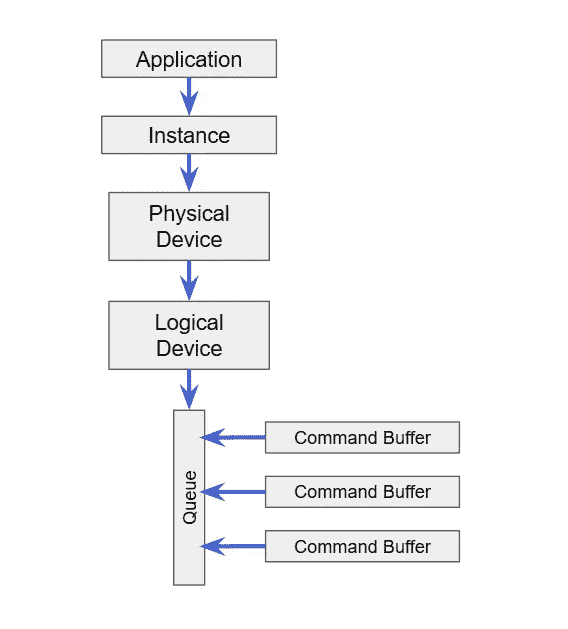
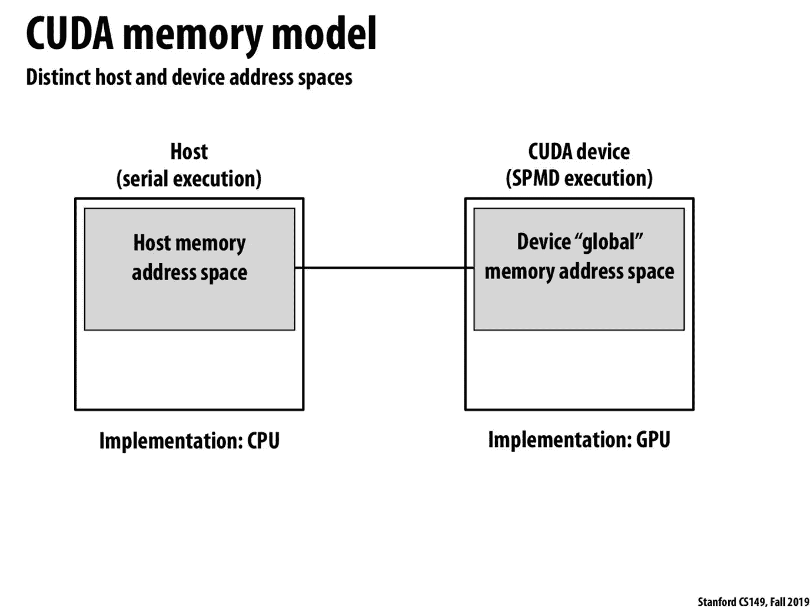
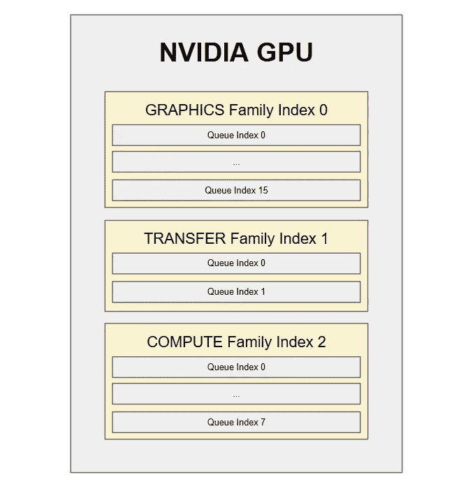
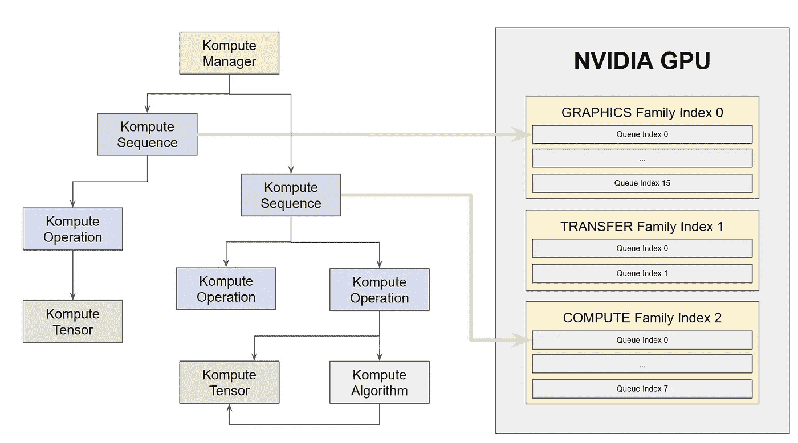

# 使用 Kompute 和 Vulkan 通过多队列操作并行处理 GPU 密集型工作负载

> 原文：<https://towardsdatascience.com/parallelizing-heavy-gpu-workloads-via-multi-queue-operations-50a38b15a1dc?source=collection_archive---------17----------------------->

## 通过使用 Kompute 和 Vulkan SDK 利用多队列操作并行性，在 GPU 密集型工作负载上实现 2 倍以上的性能提升

博文视频版(Kompute 部分 13:33 开始)

GPU 已经证明[对于高度并行的数据处理用例](https://arxiv.org/abs/1802.09941)非常有用。例如，在机器学习&深度学习中发现的计算范式非常适合[图形卡提供的处理架构](http://cs149.stanford.edu/fall19/lecture/gpuarch/)。

然而，当涉及到多个 GPU 工作负载时，人们会认为这些工作负载会被并发处理，但事实并非如此。虽然单个 GPU 计算工作负载在众多 GPU 核心上实现了并行化，但多个工作负载是按顺序逐一运行的。那当然是**直到最近显卡架构的改进**，现在支持跨多个工作负载的硬件并行化。这可以通过将工作负载提交给支持并发的不同底层物理 GPU“队列系列”来实现。受益于此的机器学习实用技术包括[模型并行](https://mxnet.apache.org/versions/1.7/api/faq/model_parallel_lstm)和[数据并行](https://en.wikipedia.org/wiki/Data_parallelism)。

在本例中，我们将展示如何通过简单地跨两个队列系列提交多个工作负载，使这些工作负载并行运行，从而在同步示例上实现 2 倍的性能提升。

这是一项重要的优化技术，因为最近在本文档第 19 页的 NVIDIA Ampere GA10x 架构规范[中概述的公告](https://www.nvidia.com/content/dam/en-zz/Solutions/geforce/ampere/pdf/NVIDIA-ampere-GA102-GPU-Architecture-Whitepaper-V1.pdf)将实现**3 倍的性能提升**(即跨一个图形队列和两个计算队列的并发性)**，**表明这一趋势只会继续带来该领域的进一步优化改进。

我们将使用 Vulkan 和 [Kompute 框架](https://github.com/EthicalML/vulkan-kompute)来实现这一点。更具体地说，我们将涵盖:

*   GPU 处理中“异步”和“并行”的歧义消解
*   我们将在此基础上构建一个基本的同步示例
*   扩展异步工作负载提交示例的步骤
*   扩展并行多队列 GPU 处理示例的步骤

你可以在这个文件 中找到 [**的完整代码——关于如何使用 CMAKE 运行完整套件的说明可以在**](https://github.com/EthicalML/vulkan-kompute/blob/0b221c9ebd3c8d7c8a81ef2ce80627c9460ec9c2/test/TestAsyncOperations.cpp#L10)**[主 Kompute 库构建部分](https://github.com/EthicalML/vulkan-kompute#build-overview)中找到。**

# 关于 Vulkan 和 Kompute

Khronos 成员(图片由 Vincent Hindriksen 通过 [StreamHPC](https://streamhpc.com/blog/2017-05-04/what-is-khronos-as-of-today/) 提供)

[**Vulkan SDK**](https://en.wikipedia.org/wiki/Vulkan_(API))**是由 [**Khronos Group**](https://www.khronos.org/) 领导的一个开源项目，能够实现高度优化的跨厂商/跨平台 GPU 处理。**

**[**Kompute**](https://github.com/axsaucedo/vulkan-kompute#vulkan-kompute) 是一个构建在 Vulkan SDK 之上的框架，它抽象了所需的数千行样板代码，介绍了展示 Vulkan 核心计算能力的最佳实践。Kompute 是 [GPGPU 计算框架](https://en.wikipedia.org/wiki/General-purpose_computing_on_graphics_processing_units)，我们将在本教程中使用它来构建核心异步和并行代码实现。**

****

**来自 [Kompute Repo](https://github.com/EthicalML/vulkan-kompute) 的“电脑”(图片由作者提供)**

# **异步与并行处理**

**在深入研究代码之前，有必要澄清两个概念，即**异步工作负载提交**和**并行工作负载处理**。**

****

**简化的 Vulkan 建筑(图片由作者提供)**

**使用 **Vulkan SDK** 到 **GPU 队列**提交并行工作负载进行处理的方式。这可以在简化的 Vulkan 架构图中看到(为简单起见，省略了管道和描述符组件)。**

## **异步工作负载提交**

**异步处理包括 CPU 主机端能够在 GPU 处理工作负载的同时执行其他工作的能力。“其他工作”可以包括调用其他 C++函数，甚至向相同或其他 GPU 队列提交进一步的工作负载。当 CPU 想要检查 GPU 工作负载是否完成时，它可以使用一个 **Vulkan“栅栏”**，这基本上是一个信号量资源，允许 CPU 在 GPU 工作负载完成时得到通知。**

**值得注意的是，当多个工作负载被提交到同一个队列时，即使这些是从多个 C++线程中完成的，预期的执行顺序仍然是连续的——至少在今天的 GPU 架构中是这样。**

## **并行工作量处理**

**并行工作负载处理由 GPU 同时执行两个或更多工作负载组成。更具体地说，如果您有两个 GPU 任务，每个任务需要 10 秒钟来处理，理论上两个任务的并行执行仍然需要 10 秒钟，因为它们将同时执行。**

**为了实现并行工作负载处理，底层 GPU 必须首先支持这一点。这一点之所以重要，是因为即使您要跨不同的 GPU 队列提交工作负载，处理仍可能由底层硬件基于其限制按顺序完成。**

# **基本顺序处理示例**

**我们现在来看一下将在本文中使用的代码。代码的第一个版本将是顺序流——我们将能够将其转换成异步代码，并最终转换成并行代码。我们将基本上运行一个工作负载，在该工作负载中，我们将执行以下操作:**

1.  **创建一个 Kompute 管理器来协调所有的 GPU 工作**
2.  **在将用于处理数据的 CPU 主机中创建 Kompute 张量**
3.  **将 Kompute 张量映射到 GPU 设备内存中**
4.  **定义计算着色器，让 GPU 忙碌几个 100 毫秒**
5.  **使用张量在 GPU 中运行计算着色器进行数据处理**
6.  **将 Kompute 张量的结果映射回 CPU 主机内存**
7.  **验证操作是否成功**

**为了测量时间，我们将使用标准库中的`<chrono>`。我们将主要使用它来计算使用`std::chrono::high_resolution_clock::now()`检索的开始和结束时间之间的差异，如下所示:**

**您可以在这个文件中找到[的可运行代码，它是 Kompute 测试套件的一部分。](https://github.com/EthicalML/vulkan-kompute/blob/1053cde1f0d27799f0d7dbd8043919656498f8bf/test/TestAsyncOperations.cpp#L8)**

## **1.创建一个 Kompute 管理器来协调所有的 GPU 工作**

**首先我们必须创建 Kompute 管理器，它执行所有需要的内存管理并创建所有需要的 Vulkan 资源。默认情况下，Kompute 管理器将选择 GPU 设备 0，但是您可以传递您想要初始化的特定设备索引，如果您已经有 Vulkan 应用程序，您可以传递您的 Vulkan 资源。**

## **2.在 CPU 主机中创建将用于处理数据的 Kompute 张量**

**我们现在将能够创建一组 Kompute 张量。我们首先在 CPU 主机中初始化数据，该数据由长度为 10 的零数组组成。我们将使用两个张量，因为我们将运行两个算法执行。我们将能够在最后检查这些 Kompute 张量，以确认执行已经成功。**

## **3.将 Kompute 张量映射到 GPU 设备内存中**

****

****斯坦福 CS149 课程** [**2019 幻灯片**](http://cs149.stanford.edu/fall19/lecture/gpuarch/slide_038)**

**我们现在能够将 Kompute 张量的主机数据复制到 GPU 设备内存中。**

**这是一个重要的步骤，因为默认情况下，Kompute 张量使用仅设备可见的内存，这意味着 GPU 操作需要用 staging tensor 复制它。**

**Kompute 允许我们创建缓冲区和 GPU 内存块，以及通过`kp::OpTensorCreate`操作使用分段缓冲区执行复制。**

## **4.定义计算着色器，让 GPU 忙碌几个 100 毫秒**

**我们创建的计算着色器有一个相对较大的循环来模拟“昂贵的计算”。它基本上为`100000000`次迭代执行一个单位加法，并将结果加到输入张量上。**

## **5.使用张量在 GPU 中运行计算着色器进行数据处理**

**现在我们能够通过`kp::OpAlgoBase`操作提交计算着色器来执行。这基本上允许我们用各自的张量执行着色器的提交。这个初始实现同步运行执行，所以它将首先用`tensorA`运行着色器的执行，然后用`tensorB`运行同一个着色器的执行。**

## **6.将 Kompute 张量的结果映射回 CPU 主机内存**

**最后，我们希望将 GPU 设备内存中的结果检索到 CPU 主机内存中，这样我们就可以从 C++中访问它。为此，我们可以使用`kp::OpTensorSync`操作。**

## **7.验证操作是否成功**

**最后，我们可以检查两个结果`kp::Tensor`都包含了`100000000`的预期值。**

# **扩展异步工作负载提交**

**在这种情况下，我们需要为异步提交扩展的步骤非常少。我们唯一需要做的就是用`evalOpDefault`函数代替`evalOpAsyncDefault`函数，然后使用`evalOpAwaitDefault(<timeInNanoSecs>)`等待任务完成。这基本上如下所示:**

**正如您所看到的，我们能够异步提交两个任务进行处理，然后使用 Await 函数等待它们完成。**

**值得指出的是，每次我们调用`evalOpAsyncDefault`时，它都会创建一个新的托管序列，而`evalOpAwaitDefault`只等待最近的默认序列。这意味着在上面的代码片段中，我们只等待第二个异步操作。对于我们的例子来说，这不是问题，但是如果我们现在知道的话，这可能会引入错误。正确的方法是使用显式创建的“命名序列”——我们将在下一节中这样做。**

# **扩展并行工作负载处理**

**现在我们知道我们能够异步执行多个工作负载，我们能够扩展这一点，以利用 GPU 中的多个队列来实现工作负载的并行执行。**

## **在 NVIDIA 1650 显卡上运行**

**为了展示一个有用的例子，我们将深入探讨如何在 [NVIDIA 1650 显卡](http://vulkan.gpuinfo.org/displayreport.php?id=9700)中实现这一点。您可以通过检查视频卡的设备报告(即可用的队列系列和并行处理功能)来亲自尝试。**

****

**NVIDIA 1650 中队列的概念性概述(图片由作者提供)**

**NVIDIA 1650 GPU 有 3 个队列系列。NVIDIA 1650 使用`G`进行图形处理，使用`T`进行传输，使用`C`进行计算，其`familyIndex 0`中的`G+T+C`系列有 16 个队列，`familyIndex 1`上的`T`系列有 2 个队列，`familyIndex 2`上的`T+C`系列有 8 个队列。**

**截至今天(2020 年 10 月)，当工作跨同一系列内的多个队列提交时，NVIDIA 不支持并行处理工作负载。但是，当跨队列系列提交工作负载时，它支持并行化。这意味着图形和计算系列队列之间的工作负载可以并行化，我们将在实施中使用这一知识。**

## **并行工作流执行的实现**

**到目前为止，我们已经将所有 GPU 工作负载提交到一个队列，即使用底层队列索引 0 的图形`familyIndex 0`。在我们使用 GPU 1650 的情况下，如果我们跨图形系列和计算系列提交工作负载，我们将能够实现并行处理。下面的图表应该为我们将要做的事情提供一个直觉。**

****

**通过多个系列队列并行执行操作(图片由作者提供)**

**为了做到这一点，我们需要修改三个关键的东西:**

1.  **我们用相应的可用队列初始化 Kompute 管理器**
2.  **我们创建了两个 Kompute 序列，每个序列都分配了相应的队列**
3.  **我们在每个队列上运行操作**

**我们将深入研究这三点。**

## **1.我们用相应的可用队列初始化 Kompute 管理器**

**当初始化一个管理器时，我们能够传递一个包含我们想要获取的队列的数组。在这种情况下，我们只获取一个图形队列和一个计算队列，但是，根据 NVIDIA 1650 的硬件规格，我们将能够请求多达 16 个图形队列(familyIndex 0)、2 个传输队列(familyIndex 1)和 8 个计算队列(familyIndex 2)。**

## **2.我们创建了两个 Kompute 序列，每个序列都分配了相应的队列**

**现在，我们能够显式初始化两个托管序列，每个序列都分配到不同的队列，引用我们在上一步中传递的数组的索引。**

## **3.我们在每个队列上运行操作**

**现在，我们能够运行提交到各个队列的操作。在这种情况下，并行提交两个 GPU 工作负载。**

# **并行工作负载执行结果**

**运行上面提供的代码时，我们可以看到由于并行系列队列提交工作负载，执行时间提高了 2 倍。您还可以看到，如果我们从图形或计算队列提交到额外的队列，我们将不会看到任何进一步的速度提升，因为该 NVIDIA 1650 卡不支持队列内并行化。**

**你可以在这个文件中找到完整的代码并运行它——关于如何使用 CMAKE 运行完整套件的说明可以在[主 Kompute 库](https://github.com/EthicalML/vulkan-kompute)中找到。**

**这是一个特别重要的结果，因为根据 NVIDIA 最近发布的 300x 显卡，Ampere GA10x 架构有所改进，允许同时处理两个计算工作负载。相对于上面的示例，这意味着如果我们使用一个图形队列和两个计算队列，我们可以看到 3 倍的性能提升(以及使用传输队列进行传输操作的额外性能)。**

# **后续步骤**

**恭喜你，你一路走到了最后！虽然这篇文章涵盖了广泛的主题，但是也有大量的概念被浏览过。其中包括底层的 Vulkan 概念、GPU 计算基础和更高级的 Kompute 概念。幸运的是，网上有资源可以扩展你在这些方面的知识。以下是我推荐的一些进一步阅读的链接:**

*   **"[利用 Kompute 简化移动设备中的机器学习&跨供应商 GPU&Vulkan](/machine-learning-and-data-processing-in-the-gpu-with-vulkan-kompute-c9350e5e5d3a)文章，深入探讨理论和概念**
*   **[Kompute 文档](https://axsaucedo.github.io/vulkan-kompute/)了解更多细节和更多示例**
*   **[移动设备中的机器学习&利用 Kompute 简化跨厂商 GPU&Vulkan](/machine-learning-and-data-processing-in-the-gpu-with-vulkan-kompute-c9350e5e5d3a)**
*   **[用 GPU 加速你的移动应用程序使用安卓 NDK & Kompute](/gpu-accelerated-machine-learning-in-your-mobile-applications-using-the-android-ndk-vulkan-kompute-1e9da37b7617) 加速机器学习**
*   **[GPU 使用 Godot 引擎和 Kompute 加速 ML](/supercharging-game-development-with-gpu-accelerated-ml-using-vulkan-kompute-the-godot-game-engine-4e75a84ea9f0)**
*   **[Vulkan SDK 教程](https://vulkan-tutorial.com/)深入了解底层 Vulkan 组件**