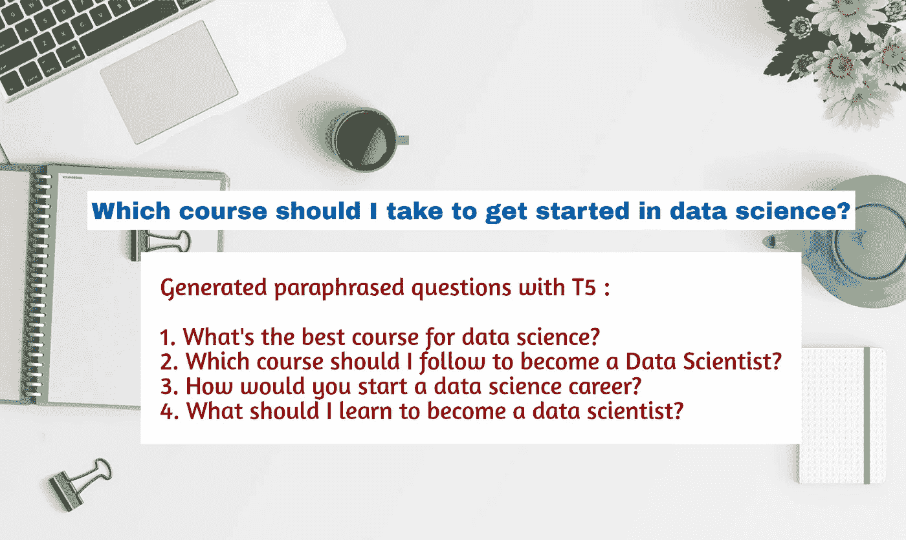

# 用 T5(文本到文本转换转换器)解释任何问题—提供预训练模型和训练脚本

> 原文：<https://towardsdatascience.com/paraphrase-any-question-with-t5-text-to-text-transfer-transformer-pretrained-model-and-cbb9e35f1555?source=collection_archive---------15----------------------->



来自 [Pixabay](https://pixabay.com/) 的背景图像

## 投入

我们节目的输入将是任何你能想到的**一般性问题**

```
**Which course should I take to get started in data Science?** 
```

## 输出

输出将是**转述**同一个问题的版本。转述一个问题意味着，你创造一个新的问题，用一个不同的词语选择来表达相同的意思。

```
**Paraphrased Questions generated from our T5 Model** ::
**0: What should I learn to become a data scientist?
1: How do I get started with data science?
2: How would you start a data science career?
3: How can I start learning data science?
4: How do you get started in data science?
5: What's the best course for data science?
6: Which course should I start with for data science?
7: What courses should I follow to get started in data science?
8: What degree should be taken by a data scientist?
9: Which course should I follow to become a Data Scientist?**
```

正如您所看到的，我们生成了大约 10 个问题，这些问题是对原问题的复述——“我应该学习哪门课程来开始学习数据科学？”

今天我们将看看如何从 [Huggingface 的变形金刚](https://github.com/huggingface/transformers)库中训练一个 T5 模型来生成这些转述的问题。我们还将了解如何使用提供的**预训练模型**来生成这些转述问题。

## 实际使用案例


来自[平面图标](https://www.flaticon.com/authors/monkik)的图标

想象一个中学老师正在为班级准备一个测验。不是给每个学生一个固定的问题，而是他/她可以生成一个给定问题的多个变体，并分发给学生。学校也可以用这种技术用一个给定问题的几个变体来扩充他们的题库。

让我们开始吧—

## 资料组


来自[平面图标](https://www.flaticon.com/authors/freepik)的图标

我使用了[**Quora 问题对**](https://www.quora.com/q/quoradata/First-Quora-Dataset-Release-Question-Pairs) 数据集来收集所有标记为**重复**的问题，并准备了训练集和验证集。重复的问题有助于我们获得**释义**对。

我们会详细讨论你如何-

1.  使用我的**预先训练的**模型为任何给定的问题生成转述问题。
2.  使用我的**训练**代码和数据集在你自己的 **GPU** 机器上复制结果。

## 训练算法— T5


用[扁平图标](https://www.flaticon.com/authors/freepik)生成的图标

T5 是 Google 的一个新的 transformer 模型，它以端到端的方式进行训练，将**文本作为输入**，将修改后的**文本作为输出**。你可以在这里了解更多关于[的信息。](https://ai.googleblog.com/2020/02/exploring-transfer-learning-with-t5.html)

它使用在大型文本语料库上训练的文本到文本转换器，在多个自然语言处理任务上实现了最先进的结果，如摘要、问题回答、机器翻译等。

我用**原句**作为**输入**和**转述**(来自 Quora 问题对的重复句)句子作为**输出**来训练 T5。

## 密码

使用**“使用预训练模型”**部分中的 Google Colab 链接对此进行测试。使用给定数据训练模型的所有代码可从以下网址获得-

[](https://github.com/ramsrigouthamg/Paraphrase-any-question-with-T5-Text-To-Text-Transfer-Transformer-) [## ramsrigouthamg/Paraphrase-any-question with-T5-Text-To-Text-Transfer-Transformer-

### 用 T5(文本到文本转换转换器)解释任何问题-提供预先训练的模型和训练脚本…

github.com](https://github.com/ramsrigouthamg/Paraphrase-any-question-with-T5-Text-To-Text-Transfer-Transformer-) 

## 使用预先训练的模型

Google Colab notebook[t5-pre trained-question-paraphraser](https://colab.research.google.com/drive/1SdUHXDc6V3jxji1ef2NmE-vsStO35Adr?usp=sharing)包含以下代码。

首先，安装必要的库-

```
 !pip install transformers==2.8.0 
```

将任何问题作为输入进行推理，并查看解释的结果。

上述代码的输出是-

```
device  cpu

**Original Question ::**
Which course should I take to get started in data science?

**Paraphrased Questions ::** 
0: What should I learn to become a data scientist?
1: How do I get started with data science?
2: How would you start a data science career?
3: How can I start learning data science?
4: How do you get started in data science?
5: What's the best course for data science?
6: Which course should I start with for data science?
7: What courses should I follow to get started in data science?
8: What degree should be taken by a data scientist?
9: Which course should I follow to become a Data Scientist?
```

# 训练你自己的模型

同样，所有用于训练的训练代码和数据集都可以在前面提到的 Github repo 中获得。我们将经历我用来训练模型的步骤。

## 1.数据准备

首先我下载了这个[链接](https://www.quora.com/q/quoradata/First-Quora-Dataset-Release-Question-Pairs)中提到的 Quora 问题对 tsv 文件(q[uora _ duplicate _ questions . tsv](http://qim.fs.quoracdn.net/quora_duplicate_questions.tsv))。

仅提取具有 **is_duplicate =1** 的行，因为它们是复述的疑问句。然后，我将数据分成训练集和验证集，并将它们存储在单独的 CSV 文件中。

最后，每个 CSV 文件都有两列“**问题 1** ”和“**问题 2** ”。“问题 2”是“问题 1”的意译版本。由于 T5 期望一个文本作为输入，我给了 **"question1"** 作为**输入**源，并要求它生成 **"question2"** 作为目标**输出**。

用于生成训练和验证 CSV 文件的代码如下所示。CSV 文件位于 Github repo 中的 [paraphrase_data](https://github.com/ramsrigouthamg/Paraphrase-any-question-with-T5-Text-To-Text-Transfer-Transformer-/tree/master/paraphrase_data) 文件夹下。

```
filename = "**quora_duplicate_questions.tsv**"
import pandas as pd
question_pairs = pd.read_csv(filename, sep='\t')
question_pairs.drop(['qid1', 'qid2'], axis = 1,inplace = True)question_pairs_correct_paraphrased = question_pairs[**question_pairs['is_duplicate']==1**]
question_pairs_correct_paraphrased.drop(['id', 'is_duplicate'], axis = 1,inplace = True)from sklearn.model_selection import train_test_split
train, test = train_test_split(question_pairs_correct_paraphrased, test_size=0.1)train.to_csv('**Quora_Paraphrasing_train.csv**', index = False)
test.to_csv('**Quora_Paraphrasing_val.csv**', index = False)
```

## 2.培养

感谢 [Suraj Patil](https://madewithml.com/@patil-suraj/) 给了我们一个神奇的 [Colab 笔记本](https://colab.research.google.com/drive/176NSaYjc2eeI-78oLH_F9-YV3po3qQQO?usp=sharing#scrollTo=SDVQ04fGRb1v)来训练 T5 完成任何文本到文本的任务。我从 Colab 笔记本上借用了大部分训练代码，只更改了数据集类和训练参数。我根据 Quora 问题对数据集修改了数据集类。

Github Repo 中的培训代码为 [train.py](https://github.com/ramsrigouthamg/Paraphrase-any-question-with-T5-Text-To-Text-Transfer-Transformer-/blob/master/train.py) 。

你需要做的就是**在任一台 **GPU** 机器上克隆**repo，安装 **requirements.txt** ，运行 **train.py** 来训练 T5 模型。

在 **p2.xlarge** (AWS ec2)上训练该模型 2 个纪元(默认)花费了大约 20 个小时。

数据集类如下所示—

关键是我们如何向 T5 模型培训师提供我们的输入和输出。对于数据集中任何给定的问题对，我给 T5 模型输入(源)和输出(目标)，如下所示

**输入格式到 T5 进行训练**

```
**paraphrase: What are the ingredients required to make a perfect cake? </s>**
```

**输出格式到 T5 进行训练**

```
**How do you bake a delicious cake? </s>**
```

就是这样！你手里有一个最先进的问题解释器。

也许这是第一个从任何给定的问题中产生转述问题的作品。

编码快乐！

# 使用自然语言处理的问题生成——教程

我推出了一个非常有趣的 Udemy 课程，名为“使用 NLP 生成问题”,扩展了这篇博文中讨论的一些技术。如果你想看一看，这里是[链接](https://www.udemy.com/course/question-generation-using-natural-language-processing/?referralCode=C8EA86A28F5398CBF763)。

祝 NLP 探索愉快，如果你喜欢它的内容，请随时在 Twitter 上找到我。