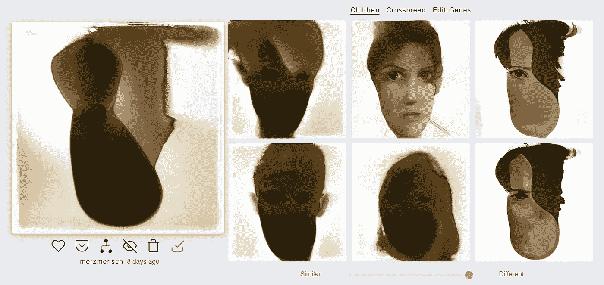
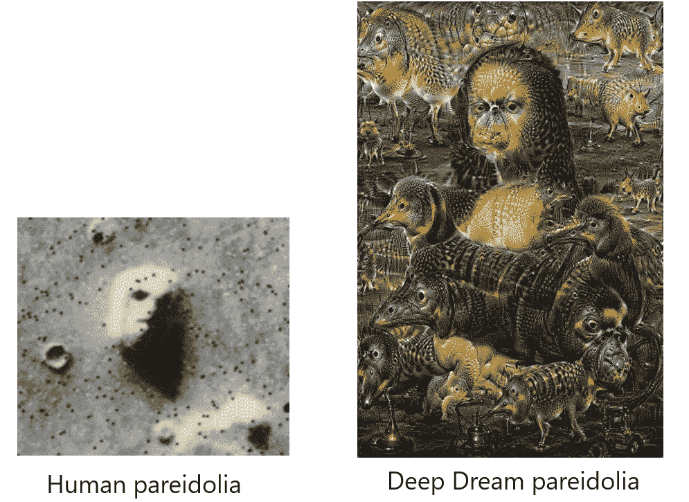
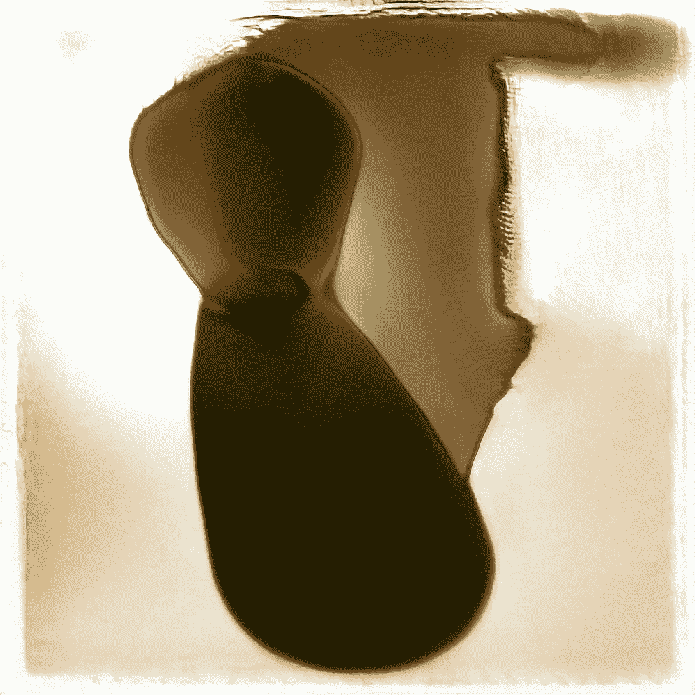
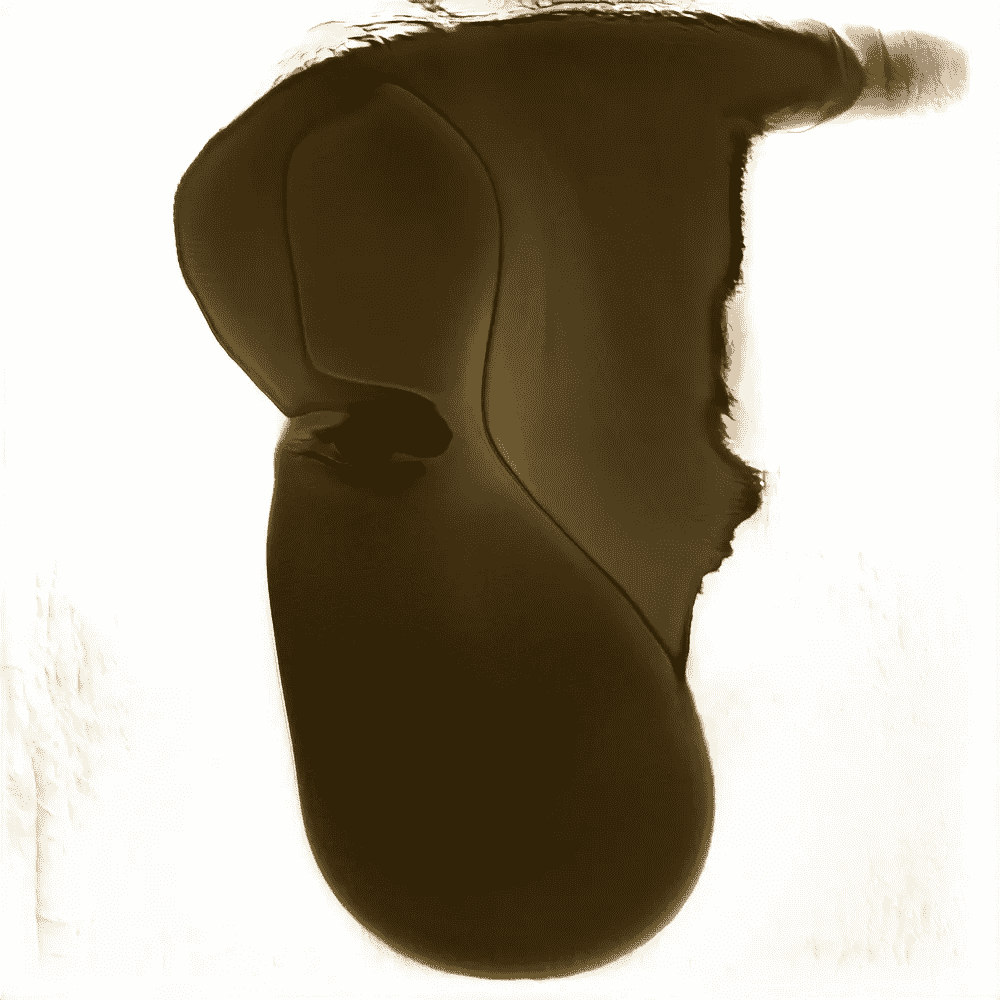
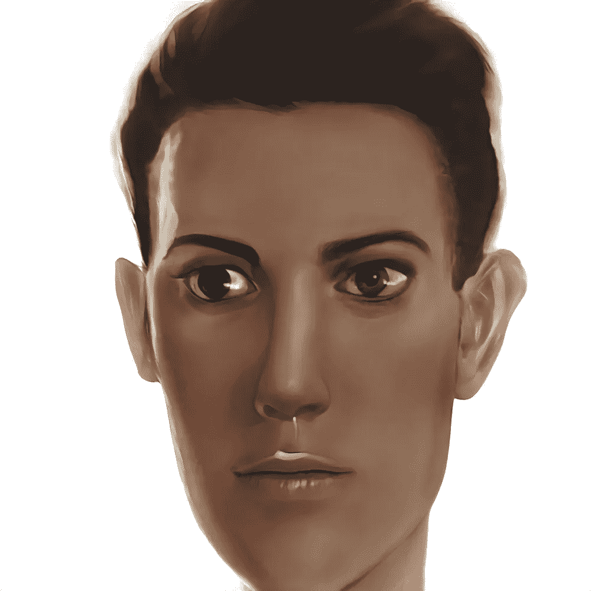
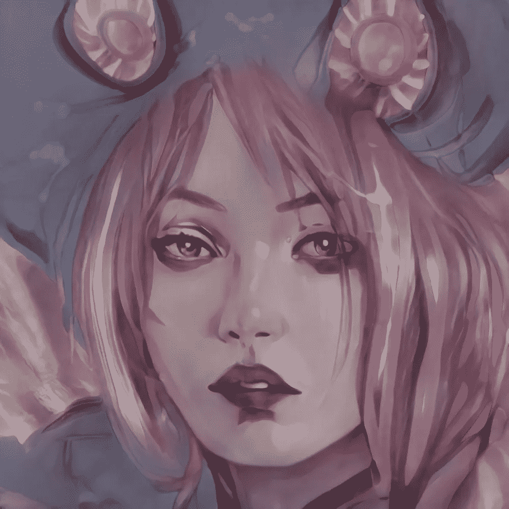
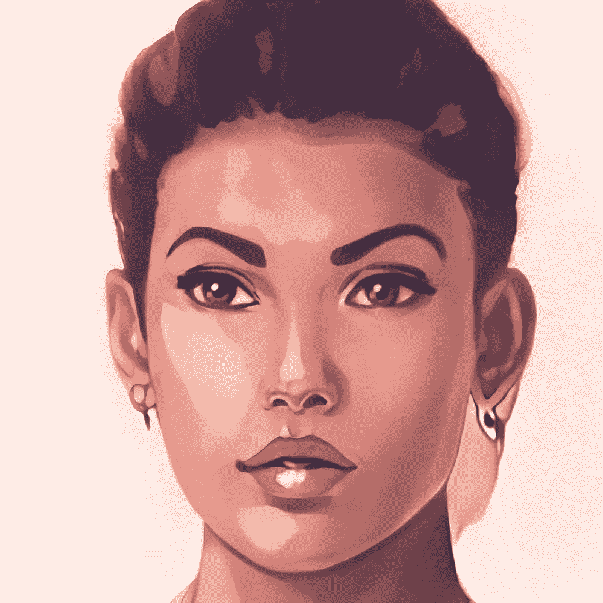

# 艾的幻觉

> 原文：<https://towardsdatascience.com/pareidolia-of-ai-dba7cf44bfde?source=collection_archive---------41----------------------->

## 人工智能的失败之美

上传了一杯咖啡的照片和 style gan 2(art breader)对它的各种解读。截图:Merzmensch

# 作为预训练数据集的生存本能。

我是来保护我们的。让我们变得谨慎。**幻想症**。这是一个众所周知的现象，当我们看到不存在的面孔时。我们在火星上看到[的面孔](https://en.wikipedia.org/wiki/Cydonia_(Mars)#%22Face_on_Mars%22)，我们在烤面包中看到[耶稣](https://www.livescience.com/45414-brain-face-pareidolia.html)，我们在任何地方都能看到它。嗯，它会影响我们的大脑，我们的大脑受过生物识别训练:眼睛、鼻子、嘴巴=当一切都在正确的位置时，那就是一张脸。

它起源于我们的过去——当我们漫步在树林里猎杀长毛象的时候。再一次混淆丛林和老虎，总比忽视树林间真正的捕食者要好。生存本能。

神经网络也有类似的行为。他们认识到他们所接受的训练。最好的例子是 [StyleGAN2 投影](/stylegan2-projection-a-reliable-method-for-image-forensics-700922579236?source=friends_link&sk=52f792fa0bd8913c7abf184b5b1f9513)，其中潜像与上传的图像并置，并检查其来源(稍后将详细介绍)。

这是一个人为和人为的幻觉的例子:

西多尼亚地区的一小部分，由 [*维京 1*](https://en.wikipedia.org/wiki/Viking_1) 轨道飞行器拍摄，由[美国宇航局](https://en.wikipedia.org/wiki/NASA) / [JPL](https://en.wikipedia.org/wiki/Jet_Propulsion_Laboratory) 于 1976 年 7 月 25 日发布([来源](https://commons.wikimedia.org/wiki/File:Martian_face_viking.jpg)，公共领域)//达芬奇的《蒙娜丽莎》，用谷歌深度梦境修改(来源:[尼克斯敦](https://imgur.com/NthTJOb))。

虽然我们的人眼在一些随机的岩层中看到一张脸，但早期版本的**谷歌深度梦**的卷积神经网络可以识别狗。到处都是。对“为什么是狗”这个问题的解释显而易见:

> 在 Deep Dream 的案例中，数据集来自 ImageNet，这是一个由斯坦福大学和普林斯顿大学的研究人员创建的数据库，他们建立了一个包含 1400 万张人类标记图像的数据库。但是谷歌没有使用整个数据库。相反，他们使用了 2012 年发布的 ImageNet 数据库的一个较小的子集，用于一场比赛…这个子集包含“120 个狗子类的精细分类”
> (来源: [FastCompany](https://www.fastcompany.com/3048941/why-googles-deep-dream-ai-hallucinates-in-dog-faces) )

这是有偏神经网络的第一次可视化，在有限的数据集上进行训练。人工智能无法识别未经训练的物体，这不是它的错。这取决于我们。

# 失败的美妙之处

但是如果用于实验目的，这个缺陷可以成为一个优势。

您已经看到了 [StyleGAN2 投影功能](/stylegan2-projection-a-reliable-method-for-image-forensics-700922579236?source=friends_link&sk=52f792fa0bd8913c7abf184b5b1f9513)。

该函数的主要任务是将给定的图像与潜在空间(StyleGAN 的隐藏层，所有唯一的图像种子在被修改之前位于该层)中的种子进行比较。其中，匹配的图像可以指出深层的伪造(用于犯罪学家的图像取证)。

在我实验的某个时候，我尝试了除了外貌图片之外的其他图像。

它带来了一些令人惊讶的结果:

或者甚至是令人不安的(说到恐怖谷):

我在这个实验中使用了**基于 StyleGAN2 的神经网络**，在来自 FlickrDataset 的人脸上进行训练，在 1024×1024 的 FFHQ 数据集上使用 [StyleGAN2。](https://github.com/NVlabs/stylegan2)

相同的数据集在 web 应用程序[art breader](/artbreeder-draw-me-an-electric-sheep-841babe80b67?source=friends_link&sk=2fff2b9e102ce632d725e58bfa4c67dd)中实现。使用上传功能，您可以用新图像来增加潜在空间。但是它们与 StyleGAN2 训练的网络对齐，并使用投影特征以兼容的方式修改。

有时，将特定的非潜像添加到潜像空间会产生有趣的效果。在一个案例中，StyleGAN2“纠正”了一位艺术家的照片，他开玩笑地用一张纸碟遮住了自己的眼睛:

尝试有限的识别技能(这是由有限的训练造成的)可以带来迷人的结果。

它开始于我试图上传一个物体的照片。没有任何面部表情或生物特征。我的动机是检验 StyleGAN2 能够以何种方式识别和分类随机主题(而不是照片肖像)。

所以我上传了我一杯咖啡的照片。虽然是随机的。

左图:原始图像(Merzmensch 拍摄)//右图:由 ArtBreeder 上传并投射到潜在空间的这张图像

使用各种神经层(特定面部特征)的进一步修改，生成了新的肖像。如你所见，艾既不能认出这幅画，也不能模仿它的外貌风格和特征。但是结果却是独一无二的。

正如你所看到的，在第一张图像中，黑点被 AI 识别为一只眼睛——面部的其他部分也跟着识别。

只有四张脸由 StyleGAN2 驱动网络//由 Merzmensch 生成

在运动中，你可以更好地看到面部神经层之间的转换。但是你永远找不到一杯咖啡的任何痕迹。

我的系列“[偶像崇拜](https://medium.com/merzazine/paraidolia-in-video-and-image-92970e112d6f?source=friends_link&sk=03a1fab1e3ec59c1469e50f84dfcc40f)”中的一集

# 实验的结果

这个实验以非常直观的方式证明了:

> ML 识别模型的质量高度依赖于它被训练的数据集。这些数据集的质量取决于人工标记和准备。

在我们信任人工智能之前，我们应该让这种信任发生在我们自己身上。检查数据集及其出处，跳出框框思考(“如果”会发生什么)，并意识到**到 AGI** 还有很长的路要走。