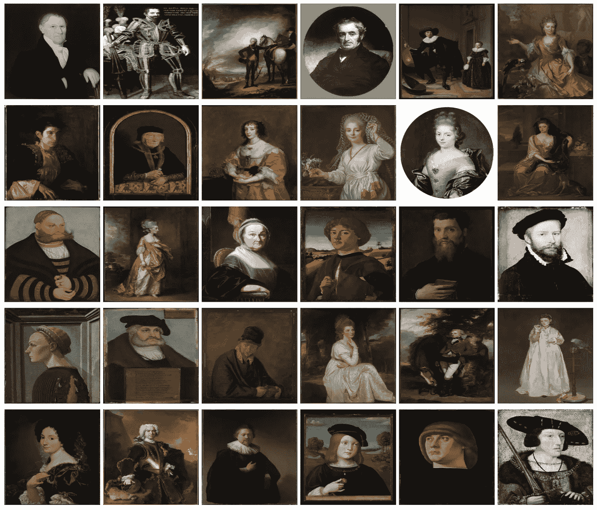

# pareidolia——向人工智能教授艺术

> 原文：<https://towardsdatascience.com/pareidolia-teaching-art-to-ai-d78889406bd1?source=collection_archive---------32----------------------->

## Pareidolia 是我们在外星智能保护伞下的第一个人工智能艺术项目。

在 [*外星智能*](https://www.alienintelligence.org/) ，我们探索自己教 AI 艺术的能力；让它产生一些理解的证据，然后分析和解释它的反应。我们从一个简单的“教训”开始，并计划在一个迭代的过程中逐渐发展它的内容和复杂性。交互的质量和各自的结果将取决于人工智能的技术能力，以及我们人类在与它交流时的独创性/局限性。

# 幻觉——看到人类是人之常情

*幻视症是对观察者已知的刺激作为物体、模式或意义的不正确感知的倾向，例如在云中看到形状，在无生命物体或抽象模式中看到面孔，或在音乐中听到隐藏的信息。* [维基百科](https://en.wikipedia.org/wiki/Pareidolia)

幻觉——你看到了什么？(谷歌图片搜索)

在这个项目中，我们的目标是向人工智能传达某些艺术作品是对现实世界中的物体和想法的感知或解释。作为第一类这样的物体，我们选择了最人性化的物体——人脸。

更具体地说，我们首先从展示照片中捕捉到的人工智能“真实”人脸开始。接下来，我们向它展示肖像绘画中对人脸的艺术描绘——从写实，一直到抽象表现。

然后，我们探索人工智能的“理解”:我们向它展示它以前从未见过的新肖像绘画，并要求它生成一张捕捉艺术作品中面部本质的逼真照片(是的，相反的方向)。我们很想知道它会产生什么。我们从现实主义绘画开始，但我们的意图是进一步扩展到抽象，立体，超现实主义，以及 3D 作品。最后，在真正的“Pareidolia”时尚中，我们将给予它不是人脸的物体的照片，并探索它如何将它们投影为人脸的真实照片。

我们的目标是探索一个结合点，它不仅扩展了人工智能理解和表达艺术的能力，还扩展了我们人类在与人工智能交流我们的目标并与之合作方面的局限性。

# 所有的魔法都是有代价的

在这种入门水平上，让人工智能艺术教学变得神奇的是，不需要向它提供什么是脸、什么是肖像画以及它们如何相互关联的精确定义和复杂解释。相反，我们只是给它(许多)两者的例子，它就不知何故地学会了。听起来很刺激？好吧，小心！所有的魔法都有代价。

在我们的例子中，这个价格源于 AI 缺乏任何关于面部、肖像或艺术的先验知识。事实上，它几乎缺乏任何关于我们、我们的历史和我们的堕胎的先验知识。也不是我们生活的世界。它所拥有的唯一信息，就是它所显示的图像中存储的内容。尤其是，它无法接触到我们在看肖像和照片时认为理所当然的许多概念和事实。

例如，脸是人体的一部分，有某些普遍的共性，如头的一般形状，眼睛，耳朵，鼻子和嘴的存在和位置。事实上，人类来自不同的性别、种族和年龄，以及一系列的基因变异——所有这些都是面部的可见属性。还有更微妙的事实，如头发和面部毛发的可变性，以及面部表情。此外，什么是人脸的“自然”方向，以及从上面看或从侧面看如何的知识。正是这种先验知识让我们人类能够毫不费力地识别和分析人脸，并区分真实的人脸和看起来像人脸的东西。

区分真脸和看起来像真脸的东西的能力

同样，也有与肖像相关的概念和事实。例如，细致入微的理解是肖像试图捕捉一张脸，但不一定像镜子那样以直接和准确的方式捕捉。相反，有内在的限制和有意的改编——使用的技术，艺术陈述和议程，执行的时间和地点，以及艺术作品的组成和设置。

这些都是我们认为理所当然的知识，对于学习照片和肖像之间的关系至关重要。人工智能无法接触到的知识。

诚然，人们可以想出复杂的方法来将这些信息传达给人工智能。例如，为图像和肖像提供标签——明确详细说明性别、种族、年龄、表情和其他面部特征(秃顶、有胡子、小胡子、金发、长鼻子、浓眉等)。然而，我们做了一个有意识的决定，不使用这些，看看我们仅仅用这些未标记的照片和肖像能走多远。我们想让我们与人工智能的对话保持简单。

# 来自火星的肖像和来自金星的照片

到目前为止，我们用作训练样本的图像的重要性肯定是显而易见的，因为它们封装了 AI 可以访问的所有信息。让我们仔细看看。

在理想的世界中，我们会给 AI 提供成对的图像:一张人脸的照片，以及同一个人的匹配肖像。不幸的是，这样的数据集并不存在。我们拥有的大部分肖像是在照相机发明之前的，我们拥有的大部分照片是那些觉得没有必要画肖像的人。

此外，[公开的人脸照片数据集](http://mmlab.ie.cuhk.edu.hk/projects/CelebA.html)通常基于网络上的名人照片。这些照片主要偏向于年轻、白皙、好看、时尚、微笑的面孔，这些照片是从最佳的正面位置拍摄的。这与我们在肖像中发现的年龄、表情、位置和纹理的分布形成了巨大的对比(除了它们大多是白色物体)。这一点可以通过例子得到最好的说明:

画像

照片

这种看似简单的差异给我们的人工智能带来了巨大的挑战。因为这两个数据集(照片和肖像)实际上代表了人类的两种非常不同的观点。这确实对人工智能的学习、理解和输出有非常明显的(和预期的)影响。

同样，有很多方法可以尝试解决这个问题。从使用[更具代表性的照片数据集](https://deepai.org/publication/fairface-face-attribute-dataset-for-balanced-race-gender-and-age)(说起来容易做起来难，通常是以牺牲质量为代价)，一直到创造“合成肖像”。也就是说，通过算法从照片中制造出“艺术”肖像，并将其配对使用。

然而，像以前一样，我们决定在这个阶段坚持简单，不使用合成肖像。

合成生成的肖像(【https://deepart.io/latest/】T4)

现在，我们终于完成了这个冗长的介绍，让我们看看我们的项目，以及我们实际上产生了什么。

# Pareidolia 项目

我们认为这将是深刻的和有趣的艺术过程，并有我们的输出是基于肖像合成的“现实”照片，而不是相反。此外，我们不希望人工智能“简单地”在原始肖像上应用风格过滤器，并使它看起来更像照片。相反，我们希望捕捉肖像的语义，并将其重新创建为看起来像现实照片的“艺术投影”。

为了实现这一点，我们开始训练人工智能，使其能够将照片和肖像的语义与它们的风格分开，并将这些语义映射到一个共享的“面部”空间。

然后，我们探索了人工智能在这项任务中的成功程度，要求它根据从未见过的肖像生成一张新的合成照片。

我们认为这将是对“理解”的深刻展示——既包括肖像，也包括人脸。

# 轻度技术插曲(阅读风险自担)

尽管如上所述，我们希望输入尽可能简单和真实，但我们仍然必须应用一些简单的修改。具体来说，脸裁剪。作为人类，我们自然会被肖像中的脸所吸引。然而，从下面可以看出，在现实中——人脸只占据了肖像的一小部分。其余的是身体，mise-en-scène，主要是背景。虽然我们可能不会被它困扰，但它为缺乏任何背景和先验知识的人工智能提供了大量分散注意力的信息。所以，为了把重点放在重要的事情上，我们把两个系列的脸都剪了。

肖像——脸部只占整幅画的一小部分

肖像—裁剪过的脸

照片—裁剪的面孔

既然我们已经对输入示例进行了排序，我们必须选择与我们的目标相匹配的 AI 方法。

由于我们不想应用“简单”的过滤器，我们决定不采用[风格转换](https://www.fritz.ai/style-transfer/)的方法。我们也不想使用机器学习模型来查看源人像和目标合成照片之间的像素级相似性。因此，我们寻找对图像语义进行操作的 GAN 模型(GAN 代表生成性对抗网络——一种基于博弈论思想的机器学习技术，可以生成符合预期标准的输出)。由于我们有两个独立分布的额外约束(这意味着，我们没有成对的照片肖像来训练，而是两个独立的集合)，我们用更广泛的 [Cycle-GAN](https://arxiv.org/abs/1703.10593) 家族的不同成员进行了实验。我们尝试了不同的选项和修改，最终找到了稍微修改过的版本 [MUNIT](https://arxiv.org/abs/1804.04732) (10 个纪元* 100k 次迭代)。

# 击鼓:结果和结束语

下面是结果！这是 3 个调色板，每个包含 24 对(每行 4 个 x 6 行)。每一对都是由左边的原始肖像和右边的合成照片组成的。

有些照片出奇的好，有些差的要命。有一点很清楚:人工智能是我们通过“名人”照片训练集强加给它的偏见的受害者。在照片的世界里，人们都是 20-30 岁，直视镜头，面带微笑，拥有完美的皮肤和直发。太老或太年轻，面部毛发，卷发，或稍微意想不到的角度——都不太好。然而，考虑到这是在没有背景或解释的情况下完成的，这是发人深省的。

每个调色板包含 24 对原始肖像和生成的“照片”

人工智能懂艺术吗？我们的绝对没有。绝对不是以人类的方式。然而，它所产生的肯定是有趣的和令人鼓舞的。一些结果似乎指出了理解上的根本差距，然而另一些结果却出人意料地好，令人兴奋。此外，当我们对这个项目进行实验时，我们提出了许多如何使它变得更好的想法。然而关键是这是否是一次值得的旅行。我们能通过这种对话——通过尝试向人工智能教授艺术——来学习关于我们世界的新见解，以及关于我们对世界的感知吗？我们计划继续探讨这个问题。

**享受？看看我们的下一个项目——**[**玫瑰色人工智能**](https://link.medium.com/VXhfp0lSVhb)