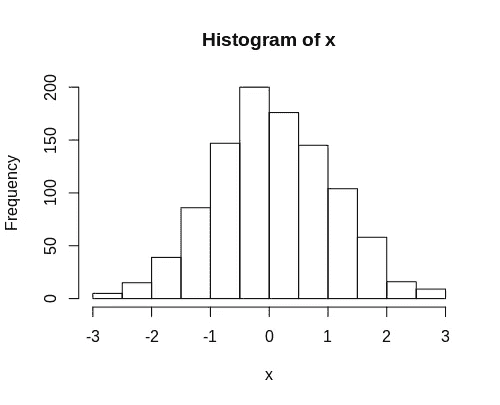
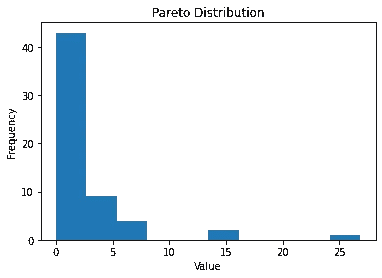
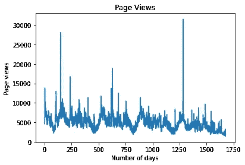
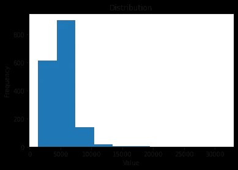
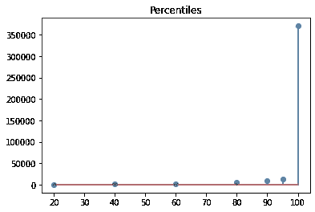
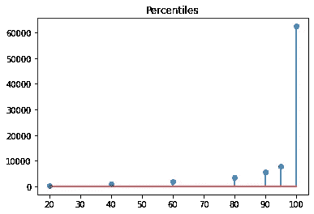
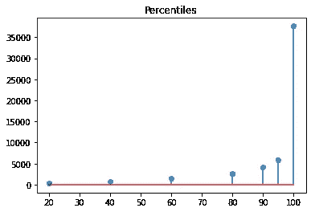

# 帕累托分布和蒙特卡罗模拟

> 原文：<https://towardsdatascience.com/pareto-distributions-and-monte-carlo-simulations-bee46113211d?source=collection_archive---------44----------------------->

## 用帕累托分布模拟网页浏览

帕累托分布无处不在。它也被称为 80/20 法则。举几个例子:

*   20%的网站获得了 80%的流量。
*   全球收入最高的 20%的人赚了 80%的收入。
*   你 80%的时间穿 20%的衣服。

传统上，我们认为统计范围的假设分布是一个**正态分布**，即*均值=中位数=众数*的分布。



资料来源:RStudio

然而，我们在周围观察到的许多现象往往更接近帕累托分布。



来源:Jupyter 笔记本输出

在这个特定的例子中，我们可以看到一个严重右尾的分布，即大多数具有较低值的观察值(如 x 轴所定义的)倾向于图表的左侧，而少数具有较高值的观察值倾向于图表的右侧。

# 用蒙特卡罗模拟法模拟网页浏览

让我们以一段时间内的网页浏览量为例。这是一个曲线图，显示了 2016 年 1 月至 2020 年 8 月“地震”一词随时间的波动，来自维基媒体 Toolforge:



来源:维基媒体工具锻造

我们可以看到，在某些时段，页面浏览量会出现“峰值”——可能是在世界上某个地方正在发生地震的时候。

这正是我们所期待的——这是一个搜索词的例子，它在某些时候有更高的页面浏览量。事实上，许多网页遵循这种模式，流量或多或少遵循一种稳定的模式——伴随着突然的“峰值”。

让我们画出这个数据的直方图。



来源:Jupyter 笔记本输出

在上面的例子中，我们看到某一天的大部分页面浏览量都低于 **10，000** ，但也有极少数情况超过了这个数字。

在选定的时间段内，某一天的最大页面浏览量为 **31，520** 。这很接近帕累托分布。

试图用传统的时间序列工具如 ARIMA 来预测页面浏览量是徒劳的。这是因为不可能提前知道特定的流量高峰将在何时出现，因为它严重依赖于外部环境，而与过去的数据无关。

一个更有意义的练习是运行模拟来预测假设帕累托分布的情况下人们可能期望看到的流量范围。

帕累托分布在 Python 中的调用如下:

```
numpy.random.pareto(*a*, *size=None*)
```

**a** 表示分布的形状，size 设置为**10000**，即从分布中产生 10000 个随机数用于蒙特卡洛模拟。

计算原始时间序列的平均值和标准偏差。

```
mu=np.mean(value)
sigma=np.std(value)
```

时间序列的均值为 **5224** ，标准差为 **2057** 。

使用这些值，可以使用这些参数以及来自假设的帕累托分布的随机采样来生成蒙特卡罗模拟。

```
t = np.random.pareto(a, 10000) * (mu+sigma)
t
```

如上所述， **a** 的值取决于分布的形状。让我们首先将它设置为 **3** 。

以下是以百分位数表示的分布记录值:



来源:Jupyter 笔记本输出

我们可以看到 **a = 3** 时记录的最大值超过 35 万，远远高于时间序列记录的最大值。

如果我们设置 **a = 4** 会发生什么？



来源:Jupyter 笔记本

我们现在看到记录的最大值现在超过了 **60，000** ，这仍然比时间序列记录的最大值高很多。

我们试试 **a = 5** 。



来源:Jupyter 笔记本输出

# 解释

最大页面浏览量刚刚超过 35，000，这更符合我们在原始时间序列中看到的情况。

然而，在这种情况下，我们只查看 2016 年以后的时间序列数据。许多最严重的地震实际上发生在 2016 年之前。

例如，让我们假设像 2004 年印度洋地震和海啸那样严重的地震将在今天发生——我们有理由预计对术语**“地震”**的页面浏览兴趣将比我们自 2016 年以来观察到的大得多。

如果我们假设帕累托分布有 **a = 3** ，那么模型表明这个词的页面浏览量可能会超过 **350，000** 。

在这方面，蒙特卡洛模拟允许我们检查超出已记录的时间序列数据界限的情况。

地震(不幸的是)比互联网存在的时间要长得多——因此我们没有办法测量在记录最强烈地震的时候这个搜索词的页面访问量会是什么样的。

也就是说，结合对最接近的理论分布的建模进行蒙特卡罗模拟，可以允许对特定情况下时间序列**的界限**进行强场景分析。

# 结论

在本文中，您已经看到:

*   什么是帕累托分布
*   如何在 Python 中生成这样的分布
*   如何将帕累托分布与蒙特卡洛模拟结合起来

非常感谢你的时间。一如既往，非常感谢任何反馈、想法或问题。请随意在评论区留下它们。

*免责声明:本文是在“原样”的基础上编写的，没有任何担保。本文旨在提供数据科学概念的概述，不应以任何方式解释为专业建议。*

# 参考

*   [机器学习掌握:概率的蒙特卡罗抽样](https://machinelearningmastery.com/monte-carlo-sampling-for-probability/)
*   [Numpy v1.14 手册:numpy.random.pareto](http://pageperso.lif.univ-mrs.fr/~francois.denis/IAAM1/numpy-html-1.14.0/reference/generated/numpy.random.pareto.html)
*   [堆栈溢出:Matplotlib —从 x 轴到点画线](https://stackoverflow.com/questions/8441882/matplotlib-draw-lines-from-x-axis-to-points)
*   [走向数据科学 Python 中的蒙特卡罗模拟:分析网页浏览量](/monte-carlo-simulations-in-python-analysing-web-page-views-b6dbec2ba683)
*   [Wikimedia Toolforge:浏览量分析](https://pageviews.toolforge.org/?project=en.wikipedia.org&platform=all-access&agent=user&redirects=0&start=2015-07-01&end=2020-08-02&pages=Earthquake)