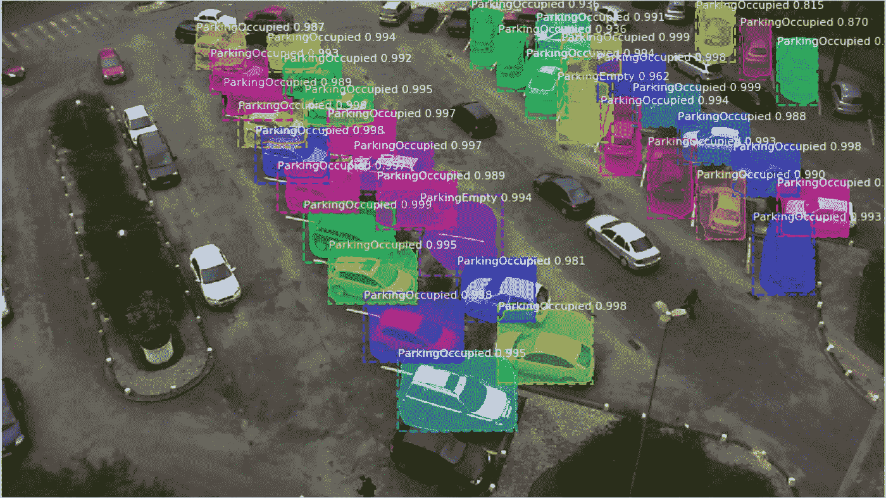
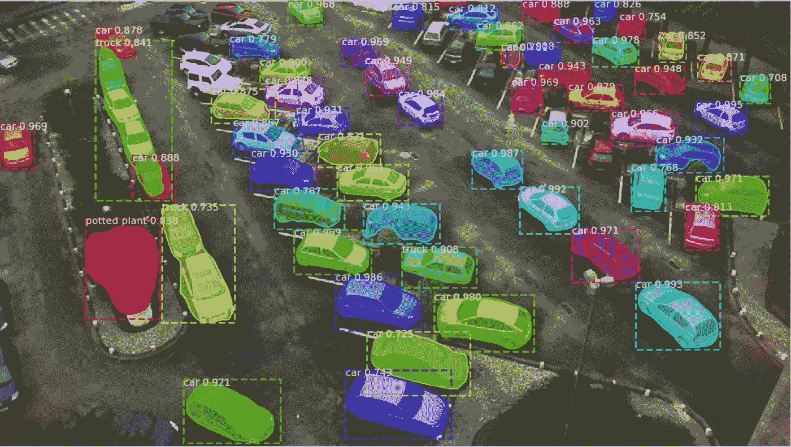
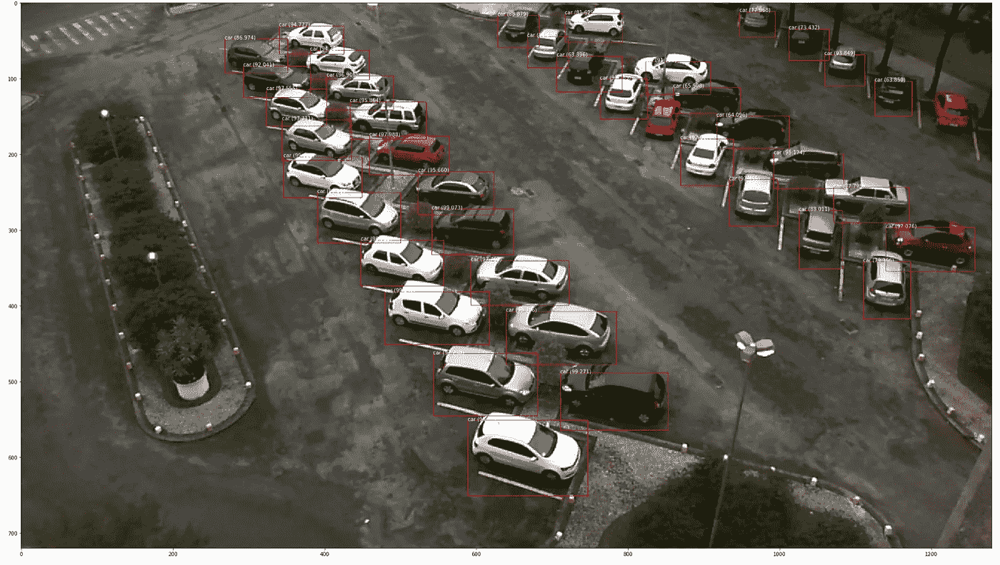
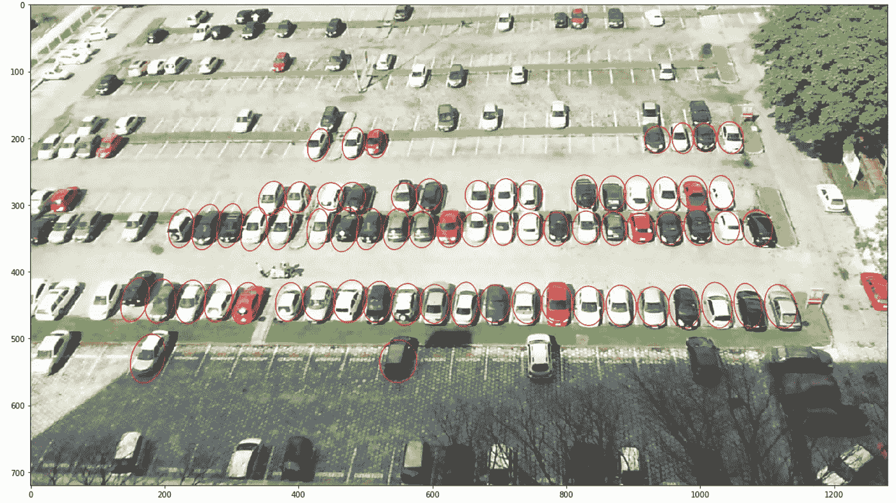
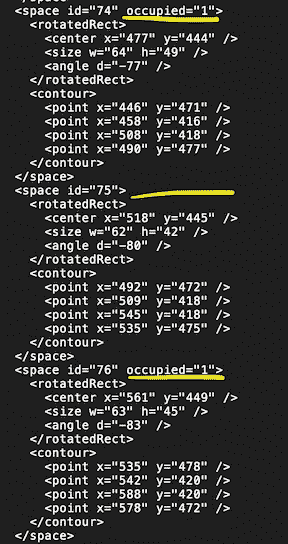
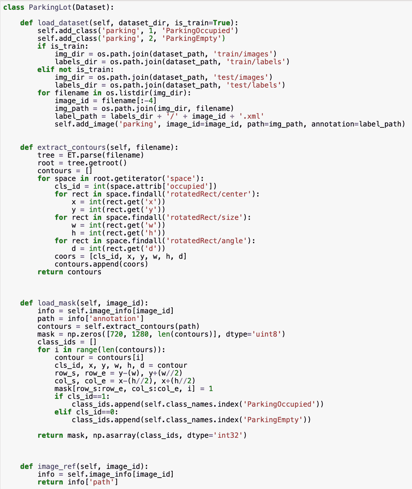
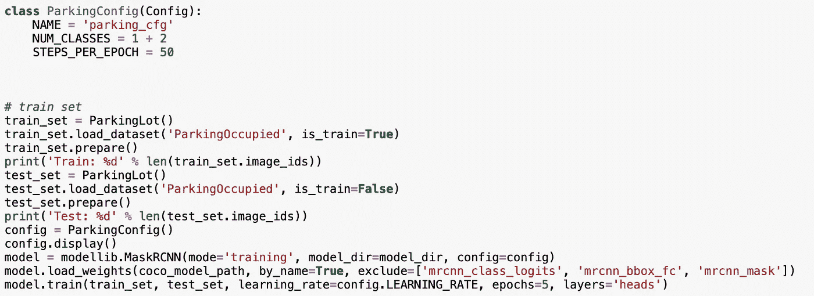
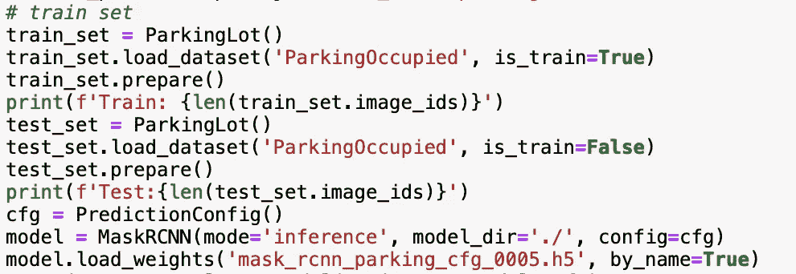
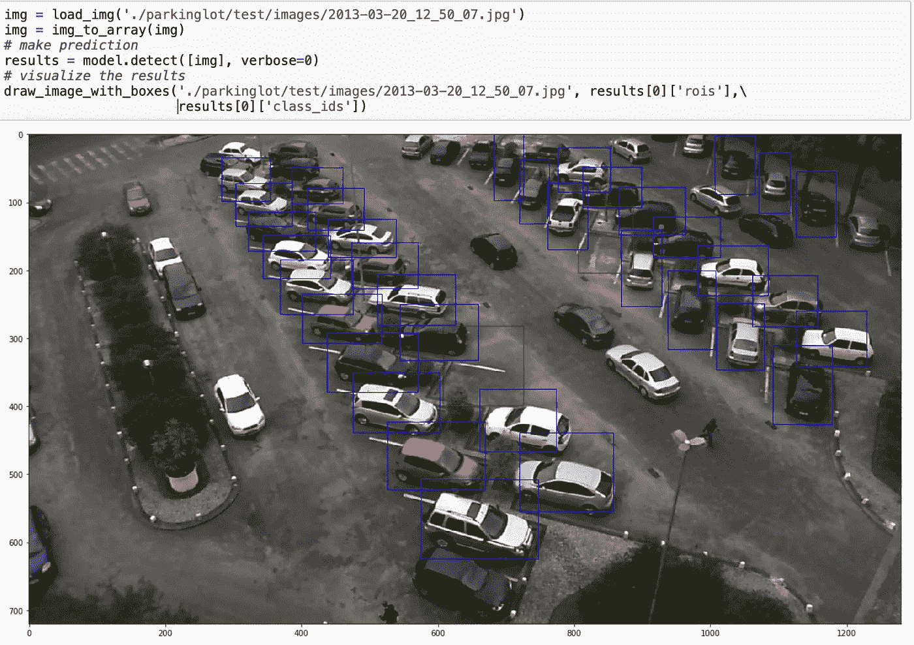
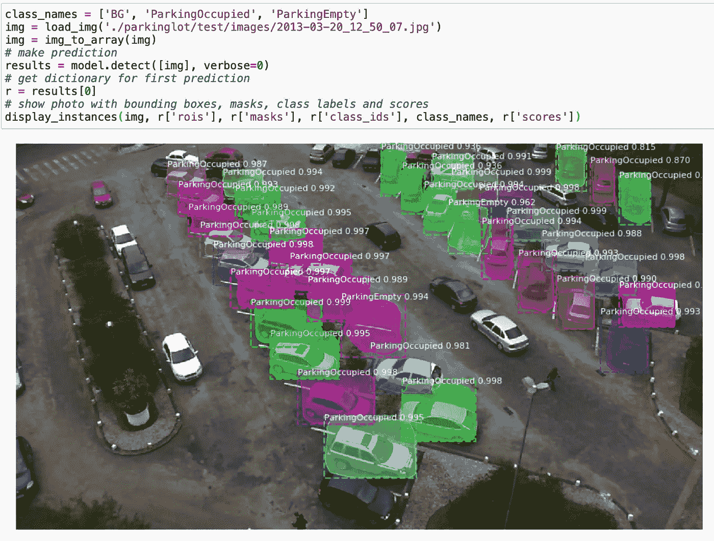

# 基于 Mask-RCNN 的停车位检测

> 原文：<https://towardsdatascience.com/parking-spot-detection-using-mask-rcnn-cb2db74a0ff5?source=collection_archive---------15----------------------->

## 如何使用 Mask-RCNN 检测停车位的可用性？

空的/被占用的停车位

我最近在做一个项目，根据安全视图摄像头的照片来检测停车位是否可用或被占用。我的工作有局限性，我将进一步深入探讨，但一旦这些问题得到解决，这个项目可能是优化停车可用性的低成本解决方案。这个项目当然有可能简化在给定区域寻找停车位的过程，因为大多数停车场都安装了安全摄像头，这样停车场就不需要安装任何额外的设备。

让我详细说明一下我在这个项目中使用的资源。Kaggle 上有一个停车场数据集，它有足够的数据点来训练深度学习模型和 xml 文件，这些文件带有关于停车位是否被占用的注释。你可以在这里访问数据集停车场[数据集](https://www.kaggle.com/blanderbuss/parking-lot-dataset)。对于这个模型，我使用了最先进的对象检测和分割掩模-RCNN 模型，它表现令人惊讶，可以通过这个[链接访问。](https://github.com/matterport/Mask_RCNN)

正如你所看到的，Mask-RCNN 在 COCOdataset 模型上进行预训练，在对象检测和分割方面表现出色。尽管在某些情况下，它会将汽车误分为火车和卡车。

掩模-RCNN 目标检测和分割

顺便说一下，我还尝试了 YOLO-v3，其性能相同，所以我没有进一步使用 YOLO 模型，但如果你正在寻找替代 YOLO 是一个用于对象检测的可怕模型，这里有[链接](https://pjreddie.com/darknet/yolo/)。

YOLO 模型检测停车场上的汽车

首先，我使用 Mask-RCNN 模型来检测停车位上的车辆，并根据给定的停车位数量来计算空位。我们的模型不需要所有的 COCO 类，所以我将这些类限制在汽车、卡车和摩托车上。但是，在 COCOdataset 模型上预先训练的模型在检测小对象方面做得并不出色，即使我尝试调整阈值和边界框，那些被错误分类为火车的汽车也没有被检测到。这里绘制的是边界框，而不是模型的 visualize 方法提供的遮罩。

使用绘制的边界框而不是遮罩的遮罩-RCNN 模型预测

鉴于上述性能，我决定训练 COCO 模型的顶层，不仅从预训练的模型中转移知识，而且还根据我们的数据集改进预测，这样我们就有两个类来预测该位置是被占用还是空着。

该停车场数据集的约束条件是，照片仅从两个视角拍摄，这导致了训练模型的过度拟合问题，并且不允许更好地概括。第二，每个停车点的注释不完整，因此在训练期间产生异常，此外，不是照片上所有可用的停车点都被注释，这也导致模型的较差性能。我会告诉你我的意思，下面的照片只是显示了有多少停车位被标注:

并非所有的停车位都有标注

许多 xml 文件没有填充占用类:

注释文件中缺少信息

信息缺失的停车位数量可能上升至 10-15 个左右。我以为这可以手动修复，但是在运行了一些代码之后:

要修复的文件太多了，为了只训练模型的顶层，避免这些文件更容易。为了解析 xml 文件，我使用了 XML.etree.ElementTree 内置 python 包。同样值得注意的是，边界框的坐标是以一个中心点的角度给出的，所以如果我们想正确地解析和创建边界框，一些调整是必要的。

函数解析 xml 文件并提取停车场的轮廓

由于 Mask-RCNN 使用掩码来训练类，以类似于袋鼠检测文章的方式，可以在这里访问[，我使用边界框来创建掩码。这篇文章实际上在理解如何使用 Mask-RCNN 模型和机器学习掌握方面帮助了我很多，一般来说，对于许多机器学习应用程序来说，这是一个很好的资源。所以，如果你还没看过的话，就去看看吧。主要的区别是，我们将检测 2 个类别，而不是一个，从而根据已占用的类别以及边界框的计算方式来创建遮罩。](https://machinelearningmastery.com/how-to-train-an-object-detection-model-with-keras/)

函数从边界框中创建遮罩，并创建两个类来检测

至于数据集的组织，我们必须为训练和测试数据创建两个目录，每个目录包含 image 文件夹和 matching label 文件夹，其中每个 xml 文件都有相同的文件名，只是扩展名不同。而其余部分实际上遵循一般实践来训练 Mask-RCNN 的顶层。你可以在 Matterport GitHub 上查看不同的样本代码。

我们必须创建一个类 ParkingLot，它将加载数据集，通过解析 xml 注释文件提取边界框的轮廓，根据提取的轮廓创建遮罩，我们需要一个图像引用函数，它将返回注释 xml 文件的路径。

创建 ParkingLot 类

然后，我们需要根据我们希望模型接受训练的类来指定配置类，加载训练和测试数据集，使用“训练”模式加载模型并开始训练。

ParkingConfig 类

该模型将在每个时期后保存在 logs 文件夹中，这样一旦训练完成，您就可以继续加载该模型以评估其性能。使用 Mask-RCNN 的方法是创建新的配置类来限制我们预测的范围

预测配置类

使用“推理”模式加载模型，从日志文件夹加载模型:

由于 Mask-RCNN 可视化了检测到的对象及其类的遮罩，我们将使用此函数来绘制边界框:

函数绘制检测到的对象的边界框

因此，如果我们加载任何随机图像，检测可用和已占用的停车位，使用我们的函数来绘制它们，结果将是这样:

检测到可用停车位

绿色方框是可用的停车位，蓝色边框是已占用的停车位。看起来模型性能还不错，虽然还是检测不到小型车/停车点。数据集中有意忽略了停在人行道旁的汽车，以便模型在训练时不会将这些汽车考虑在内。这是使用 Mask-RCNN 的 visualize 方法得到的结果:

Mask-RCNN 检测可用停车位

鉴于这一结果，似乎该模型的性能真的很好。但是在我们的数据集中，我们只有停车场的两个角度，因为我只训练顶级模特，所以我只使用了数据集的一部分。那么，为什么不看看停车场的另一张照片，上面有一个类似的摄像头，但不是这个数据集的一部分。我们的模型会有多好？

哇！这太糟糕了。很明显，该模型过度适合我们的停车场数据集，这意味着它在相同的数据集上表现良好，我没有说训练，因为训练和测试照片实际上是停车场中不同汽车的相同照片，虽然技术上没有泄漏测试数据，但在某种意义上它们是相同的。开箱即用的预训练 Mask-RCNN 将在检测车辆方面表现得更好。

考虑到这些结论和我前面提到的局限性，下一步可以采取什么措施来改进模型或向前发展呢？嗯，我们可以使用整套数据从头开始训练模型，看看它的表现如何，尝试调整检测阈值。我不妨试着这样做，也许这可以成为这篇文章的第二部分？但理想情况下，更多变化的数据集是必不可少的，完整的注释是创建准确的停车点检测模型的基础。此外，为了建立不仅准确而且鲁棒的检测模型，我认为考虑正在移动但尚未停放的车辆，即未经授权停放的车辆非常重要。这些可能是未来需要进一步研究的问题。

感谢您花时间阅读我的帖子！