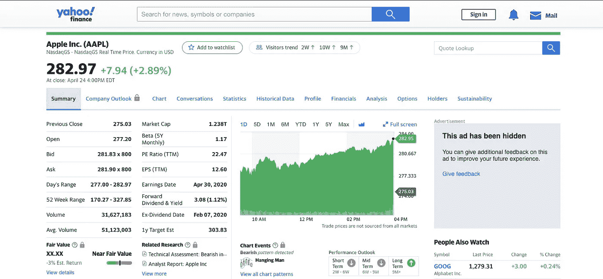
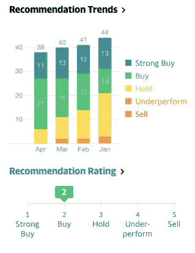

# 使用 Python 在几分钟内解析数千份股票推荐！

> 原文：<https://towardsdatascience.com/parse-thousands-of-stock-recommendations-in-minutes-with-python-6e3e562f156d?source=collection_archive---------12----------------------->

## 了解如何在不到 3 分钟的时间内解析顶级分析师的数千条建议！

如果你和我一样，你可能已经想了很多次什么股票是最热门的，分析师如何轻松地发现这些股票。我会经常在雅虎财经页面上随意查找一些股票，看看它们的评级是否很高。我也知道必须有一个更好的方法来找到这些随机股票，所以我用不到 40 行代码创建了这个简单的解析器。

照片由[杰米街](https://unsplash.com/@jamie452?utm_source=unsplash&utm_medium=referral&utm_content=creditCopyText)在 [Unsplash](https://unsplash.com/?utm_source=unsplash&utm_medium=referral&utm_content=creditCopyText)

在我进入编码方面之前，我想快速了解一下雅虎财经页面上的这些推荐内容和位置。如果你转到[页面](https://finance.yahoo.com/)并输入一只股票，你会看到类似我下面的图片。该页面包括股票表现和关键统计数据的交互式图表，如市盈率、每股收益、Beta 值、股息信息等。你甚至可以在左下角看到这只股票目前是被低估了，还是被高估了，或者处于合理的价值。然而，这不是建议的位置。

苹果的雅虎财经页面

如果你继续向下滚动，页面右侧会出现一个类似下图的图表，概述了分析师在过去几个月对特定股票的建议。

雅虎财经股票分析师推荐图

股票分析师将股票分为 1-5 级，1 级表示强烈买入，5 级表示强烈卖出。推荐的平均值是底部的推荐评级(苹果的评级为 2)。我的算法解析给定列表中每只股票的值，然后将数据下载到 CSV 文件中。下面的 GitHub 要点包含了所有的代码。

解析算法的所有代码。

首先，我们必须导入依赖项，然后定义两个变量。跑马灯列表目前设置为包含标准普尔 500 的所有跑马灯符号，但可以根据您的喜好进行更改。如果您要增加代码列表，我建议取消注释第 31 行中的“time.sleep(0.5)”代码。建议变量被设置为一个空列表，这样我们就可以用它来存储我们从即将到来的 for 循环中收集的值。

for 循环实际上包含解析算法，该算法允许 Python 访问每只股票的雅虎财经页面，并收集其各自的推荐评级。任何没有有效评级值的公司都将以值 6 保存到列表中。

最后，将创建一个熊猫数据框架，其中包含每个股票及其推荐。然后，数据帧将作为 CSV 文件下载到您的计算机上。

我希望这个程序将来会对你有用。非常感谢您的阅读！

*免责声明:本文材料纯属教育性质，不应作为专业投资建议。自行决定投资。*

**参考文献:**

 [## 解析雅虎财经

### 感谢贡献一个堆栈溢出的答案！请务必回答问题。提供详细信息并分享…

stackoverflow.com](https://stackoverflow.com/a/42237860/11915680) 

如果你喜欢这篇文章，可以看看下面我写的其他一些 Python for Finance 文章！

 [## 用 Python 进行股票新闻情绪分析！

### 对财经新闻进行秒级情感分析！

towardsdatascience.com](/stock-news-sentiment-analysis-with-python-193d4b4378d4)  [## 用 Python 制作股票筛选程序！

### 学习如何用 Python 制作一个基于 Mark Minervini 的趋势模板的强大的股票筛选工具。

towardsdatascience.com](/making-a-stock-screener-with-python-4f591b198261)  [## 在 3 分钟内创建一个财务 Web 应用程序！

### 了解如何使用 Python 中的 Streamlit 创建技术分析应用程序！

towardsdatascience.com](/creating-a-finance-web-app-in-3-minutes-8273d56a39f8)