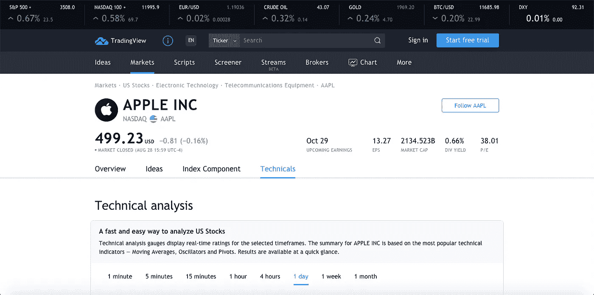
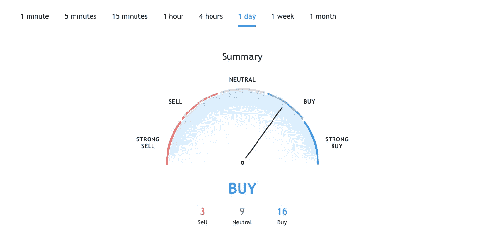
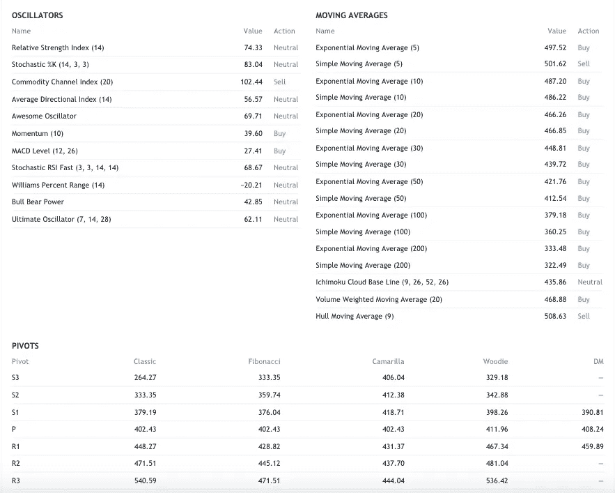
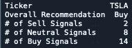

# 几秒钟内解析 TradingView 股票推荐！

> 原文：<https://towardsdatascience.com/parse-tradingview-stock-recommendations-in-seconds-1f4501303b21?source=collection_archive---------20----------------------->

## 了解如何使用 Python 解析任意时间间隔的实时建议！

在我之前的一篇文章中，我们讨论了如何解析来自雅虎财经的顶级分析师对任何股票的建议。虽然他们提供了股票未来走势的验证，但他们每月只更新一次，并且没有提供任何关于评级背后的理由的信息。

幸运的是，从那以后，我偶然发现了一个很棒的网站 [TradingView](http://tradingview.com/) 。如果你不熟悉这个网站，他们提供的一个功能是短至 1 分钟或长达 1 个月的实时推荐。这些建议纯粹基于技术指标，包括移动平均线、振荡指标和枢轴，你可以直接在页面上看到计算结果！

因此，我没有每次需要推荐时都访问网站，而是用不到 50 行代码创建了这个简单的解析器。


照片由[尼克冲](https://unsplash.com/@nick604?utm_source=unsplash&utm_medium=referral&utm_content=creditCopyText)在 [Unsplash](https://unsplash.com/s/photos/stock-market?utm_source=unsplash&utm_medium=referral&utm_content=creditCopyText) 上拍摄

# TradingView 简介

在我进入编码方面之前，我想快速介绍一下 TradingView 上的这些推荐内容和位置。如果你转到这个[页面](https://www.tradingview.com/symbols/NASDAQ-AAPL/technicals/)，你会看到一些类似于我下面的图片。该页面包括关键统计数据，如市盈率、每股收益、市值、股息信息等。你甚至可以点击概览来获得一个全面的比率表，以及一个交互式图表和最近的新闻。然而，这不是建议的位置。



苹果交易视图页面顶部

如果你继续向下滚动技术面页面，会有多个图表，如下图所示，列出了信号背后的建议和统计数据。



TradingView 推荐图表(我们将收集的内容)



交易视图技术指标统计

建议范围从强买到强卖，正如你在第二张图中看到的，它们完全依赖于技术指标信号。我们将建立的算法将很快分析买入信号、中性信号、卖出信号的数量，以及总体建议。下面的 GitHub gist 包含了所有的代码！

# 使用 Python 抓取 TradingView

解析算法的所有代码。

## 设置

如果您没有安装 [Selenium](https://pypi.org/project/selenium/) 或 [Pandas](https://pypi.org/project/pandas/) ，您可以访问它们各自的链接，并使用终端中的 pip 下载它们！我们还需要一个 chromedriver(模拟的 chrome 浏览器 Selenium 控件),要使用 Python 下载它，你可以使用 PyPi 中的 [webdriver-manager](https://pypi.org/project/webdriver-manager/) 包。

此外，只要安装了必要的依赖项，就可以使用任何支持 Python 的 IDE 或文本编辑器。我个人会推荐通过 [Anaconda](https://www.anaconda.com/) 下载 Visual Studio 代码或者 Spyder。

## 让我们进入代码

现在所有的东西都应该已经安装在你的机器上了，你也知道我们要抓取什么了，让我们开始写代码吧！

首先，我们必须导入程序其余部分所需的依赖项。在这种情况下，我们将需要内置的时间模块、Pandas 和 Selenium。

时间模块将允许我们让程序休眠几秒钟，以便模拟的浏览器可以完全加载。熊猫将允许我们用我们收集的数据创建一个数据框架。最后，我们将需要 selenium，这样我们就可以创建/控制浏览器窗口并抓取 JavaScript 呈现的信息。

接下来，我们可以创建两个变量，一个用于 ticker，另一个用于我们特别抓取的区间。间隔可以是我在下面代码栏中包含的任何一个。

```
#===================================================================
# Intervals: 
# 1m for 1 minute
# 15m for 15 minutes
# 1h for 1 hour
# 4h for 4 hours
# 1D for 1 day
# 1W for 1 week
# 1M for 1 month
# ==================================================================
```

在我们包含了导入和参数之后，我们可以设置 chromedriver 了。Options 类将允许我们添加 headless 这样的参数来定制模拟的浏览器。添加 headless 告诉浏览器在每次运行程序时不要弹出。我们可以将可执行路径设置为您之前下载 chromedriver 的路径。在这种情况下，我将它直接下载到我的目录中，但您不必这样做。

我们可以在一个 try/except 块中添加我们的抓取脚本来捕捉程序中断时的错误。首先，我们必须使用 webdriver.get(URL)打开浏览器，刷新以正确加载页面的各个方面，然后添加 time.sleep(1)使程序慢一秒钟，直到浏览器完全渲染完毕。

使用。通过 selenium.webdriver 中的 find_by_class_name 方法，我们可以精确定位我们想要清除的部分。例如，只有建议具有以下类“speedometerSignal-pyzN-tL”我们可以通过 Chrome DevTools 中的 inspect 元素来检索这些类名。打开 DevTools，你可以右击你想解析的部分，然后按“inspect ”,得到类似下图的结果！


Chrome 开发工具

我们可以使用方法检索“Buy”。get_attribute('innerHTML ')，它将存储 HTML 标记内的文本。

同样，我们可以检索买入、中性和卖出信号的数量，方法是找到所有这些信号之间相似的类名，然后使用方法。按类名查找元素。因为这次我们调用的是元素，而不是元素，所以这个方法将返回一个包含我们指定的类名的 HTML 标签列表。

最后，我们可以将所有信号附加到一个列表中，并使用。from_records 方法，我们可以将数据元组和列列表转换成 DataFrame。最后，我们可以通过为 ticker 添加一列，将该列设置为索引，并为我们的最终产品转置(旋转)数据帧来清理它。



程序输出

现在，在几秒钟内，您应该会得到与上图类似的输出。我希望这个算法将来对你有用。非常感谢您的阅读！

*免责声明:本文材料纯属教育性质，不应作为专业投资建议。自行决定投资。*

如果你喜欢这篇文章，可以看看下面我写的其他一些 Python for Finance 文章！

[](/parse-thousands-of-stock-recommendations-in-minutes-with-python-6e3e562f156d) [## 使用 Python 在几分钟内解析数千份股票推荐！

### 了解如何在不到 3 分钟的时间内解析顶级分析师的数千条建议！

towardsdatascience.com](/parse-thousands-of-stock-recommendations-in-minutes-with-python-6e3e562f156d) [](/making-a-stock-screener-with-python-4f591b198261) [## 用 Python 制作股票筛选程序！

### 学习如何用 Python 制作一个基于 Mark Minervini 的趋势模板的强大的股票筛选工具。

towardsdatascience.com](/making-a-stock-screener-with-python-4f591b198261) [](/creating-a-finance-web-app-in-3-minutes-8273d56a39f8) [## 在 3 分钟内创建一个财务 Web 应用程序！

### 了解如何使用 Python 中的 Streamlit 创建技术分析应用程序！

towardsdatascience.com](/creating-a-finance-web-app-in-3-minutes-8273d56a39f8)