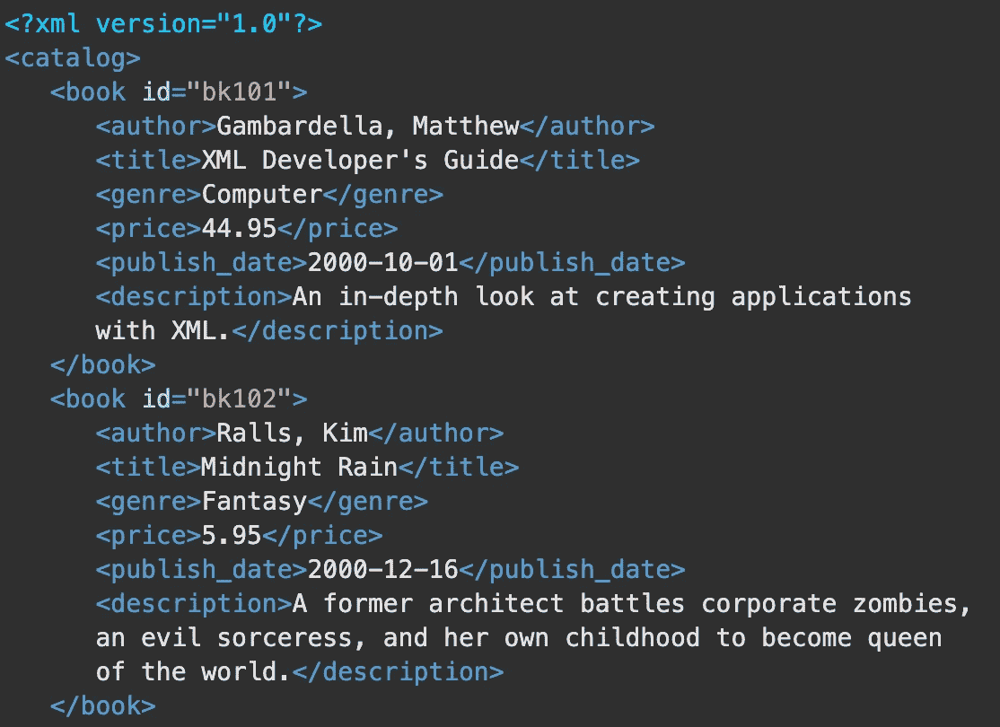
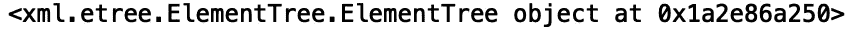
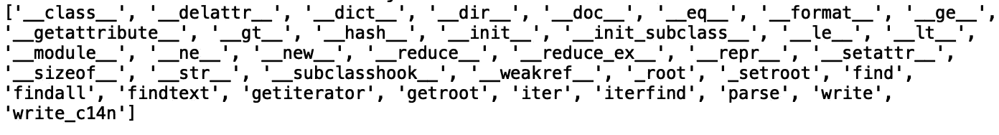
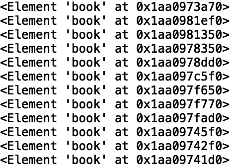
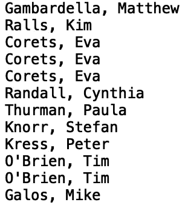
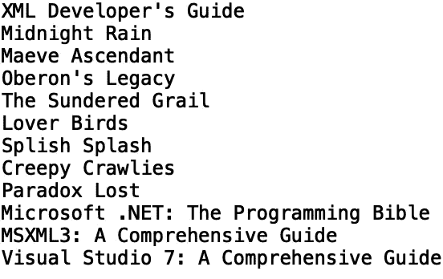
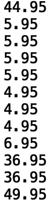
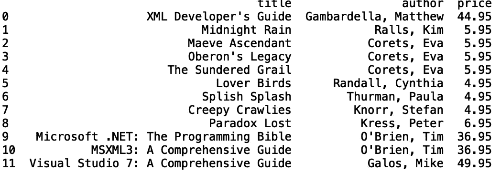
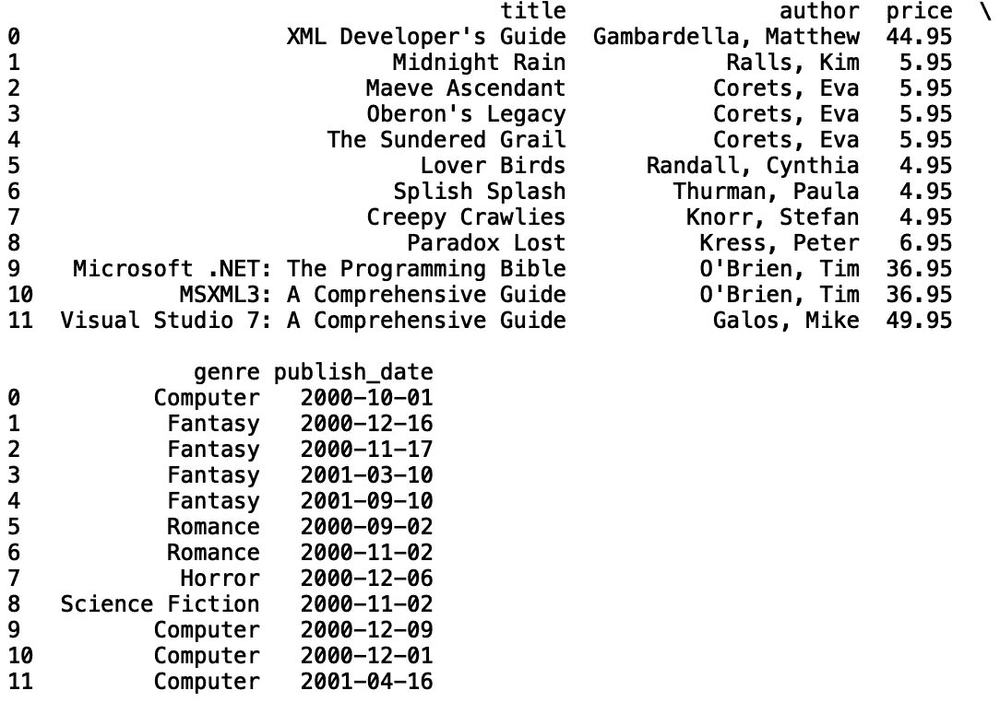
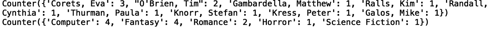

# 用 Python 解析 XML 数据

> 原文：<https://towardsdatascience.com/parsing-xml-data-in-python-da26288280e1?source=collection_archive---------3----------------------->

## 在熊猫数据框架中存储 XML 数据


[来源](https://www.pexels.com/photo/close-up-photography-of-colorful-yarns-635002/)

可扩展标记语言(XML)是一种以人类和机器可读的格式编码数据的标记语言。XML 在各种程序中用于构造、存储和传输数据。Python 包含几个处理 XML 数据的接口。在本帖中，我们将讨论如何使用 python“xml”库中的“ElementTree”模块来解析 XML 数据并将数据存储在 Pandas 数据框中。

我们开始吧！

出于我们的目的，我们将使用一个样本“xml”文件，“books.xml”，它可以在[这里](https://docs.microsoft.com/en-us/previous-versions/windows/desktop/ms762271(v%3Dvs.85))找到。该文件包含各种书籍的信息，如书名、作者姓名和价格。

首先，让我们从 python“XML”库中的“ElementTree”模块导入“parse ”:

```
from xml.etree.ElementTree import parse
```

现在，让我们看看“books.xml”中的文件标签:



我们可以通过将文件名传递给“parse()”方法来定义一个已解析的“XML”文档对象:

```
document = parse('books.xml')
```

如果我们打印对象，我们会看到在指定的内存地址有一个“ElementTree”对象:

```
print(document)
```



让我们使用内置的“dir()”方法来看看该对象可用的方法和属性:

```
print(dir(document))
```



让我们使用方法“iterfind()”来返回一个生成器，我们可以在“for-loop”中对其进行迭代。我们需要在“iterfind()”方法中指定一个路径参数。让我们选择“图书”路径:

```
for item in document.iterfind(‘book’):
    print(item)
```



我们看到，我们有几个“元素簿”对象存储在不同的内存地址。我们可以使用“findtext()”方法从这些对象中提取信息。让我们提取“作者”标签中的信息:

```
for item in document.iterfind('book'):
    print(item.findtext('author'))
```



我们还可以提取标题:

```
for item in document.iterfind('book'):
    print(item.findtext('title'))
```



让我们看看价格:

```
for item in document.iterfind('book'):
    print(item.findtext('price'))
```



接下来，我们可以初始化用来存储这些值的列表:

```
author = []
title = []
price = []
```

在 for 循环中，我们可以追加值:

```
for item in document.iterfind('book'):
    author.append(item.findtext('author'))
    title.append(item.findtext('title'))
    price.append(item.findtext('price'))
```

然后，我们可以将这些列表存储在一个数据框中。让我们首先导入熊猫库:

```
import pandas as pd 
```

接下来，让我们定义一个包含每本书的“标题”、“作者”和“价格”的数据框:

```
df = pd.DataFrame({'title': title, 'author':author, 'price':price})
```

接下来，让我们打印结果数据框:

```
print(df)
```



我们还可以将“流派”、“发布日期”和“描述”添加到数据框中:

```
genre = []
description = []
publish_date = []for item in document.iterfind('book'):
    ...
    genre.append(item.findtext('genre'))
    description.append(item.findtext('description'))
    publish_date.append(item.findtext('publish_date'))
```



既然我们在数据框中有了所有的信息，我们可以做一些事情，例如将“价格”字符串转换为“浮点型”，并计算“价格”列的平均值:

```
df['price'] = df['price'].astype(float)
print("Mean price: ", df['price'].mean())
```


让我们也将“publish_date”转换为“datetime”对象，并提取年、月和日的值:

```
df['publish_date'] = pd.to_datetime(df['publish_date'])
df['year'] = df['publish_date'].dt.year
df['month'] = df['publish_date'].dt.month
df['day'] = df['publish_date'].dt.day
print(df.head())
```


我们还可以使用 collections 模块中的“Counter()”方法来查看作者和流派的分布情况:

```
from collections import Counter
print(Counter(df['author']))
print(Counter(df['genre']))
```



我就讲到这里，但是您可以随意使用数据并自己编码。

# 结论

总之，在这篇文章中，我们讨论了如何使用 python 中的“xml”库解析 XML 数据。我们展示了如何使用“iterfind()”方法来定义一个生成器对象，我们可以在“for-loop”中迭代该对象。我们还展示了如何使用“findtext()”方法访问元素标记信息。然后，我们将 XML 信息存储在用于定义 Pandas 数据框的列表中。我希望你觉得这篇文章有用/有趣。这篇文章的数据和代码可以在 [GitHub](https://github.com/spierre91/medium_code/blob/master/xml_parsing/intro_to_xml_parsing.py) 上找到。感谢您的阅读！