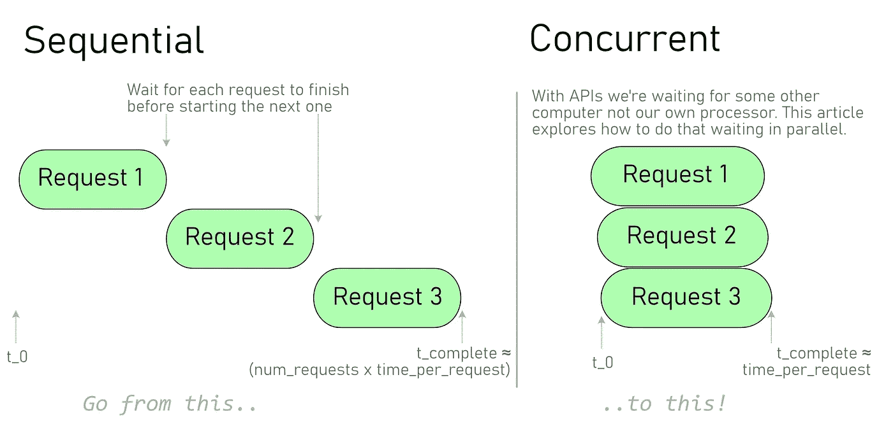
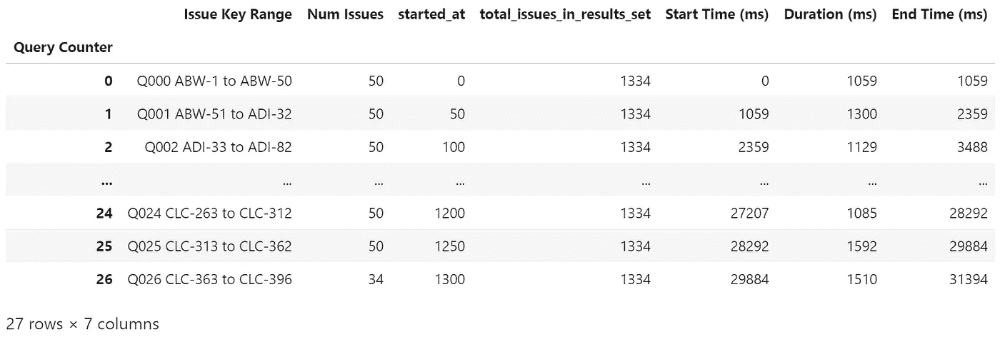
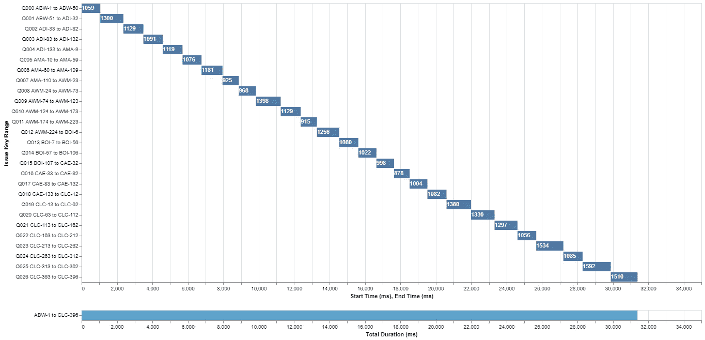

# 第 1 部分:用 Python 定义和计时 API 函数

> 原文：<https://towardsdatascience.com/part-1-defining-and-timing-an-api-function-with-python-b0849775e961?source=collection_archive---------28----------------------->

## Python 中并发性的图形化探索

## 探索 Python 中的并发性以加速从远程 API 检索数据的系列文章。

# 问题是

使用 API 时，大部分时间都花在等待响应上。当从外部服务大量收集信息时，这会导致大量时间浪费。本文探索了如何使用 Python 的**多处理**、**线程**和**异步**特性从顺序请求转变为并发请求。



# 介绍

在[之前的文章](https://levelup.gitconnected.com/jira-api-with-python-and-pandas-c1226fd41219)中，我们编写了一个简单的函数，它可以处理单个查询返回的问题数量的吉拉 API 限制。这解决了问题，但即使只有几千个结果，检索所有问题的时间也可能会在几分钟内完成。

> *一个 JQL 查询返回 1334 个问题，每个请求 50 个问题(27 个请求)，耗时* ***31 秒。*** *使用并发通过* ***改变 7 行代码*** *，我们可以将此减少到* ***2.5 秒。***

**为什么？**

使用 Jupyter 内置的`%time`魔法的一个快速简介显示了为什么有这么大的改进空间。

```
CPU times: user 672 ms, sys: 125 ms, **total: 797 ms**
Wall time: **31.4 s**
```

在 31.4 秒的运行时间中，顺序执行请求只占用了 797 毫秒的 CPU 时间。所以在这 31 秒中，*比***多 97%的时间都花在了* ***等待*** *的网络呼叫上。**

# ***提高性能***

*本质上有两类性能问题:*

1.  *我一直在等待网络/磁盘/数据库/其他进程做一些事情，同时也想用 CPU 做一些有用的事情。 **Python 解决方案:线程化还是异步化。***
2.  *我正在做一些计算量很大的事情，希望尽可能使用所有的 CPU / GPU 时间。 **Python 解决方案:多重处理或降至 c 语言***

*如上面的`%time`示例所示，API 调用牢牢地属于第一类。这是需要记住的重要一点:*

> **我们* ***难道*** *想方设法让* ***各自的要求走得更快。****
> 
> ****改为*** *我们试图将* ***【等待并行】*** *所以* ***整套要求*** *完成得更快。**

*由于我们的 CPU 做的工作很少，为了让单个请求运行得更快，我们需要查看网络层并升级连接。相反，我们可以通过分批启动请求并组合结果来加快整个请求集的速度。*

# *方法*

*在本系列中，我们将从最慢的情况开始，即顺序请求，然后尝试三种加快速度的方法:*

1.  ***序贯，**我们的基础案例参考点。*
2.  ***多重处理，**与`**multiprocessing.Pool()**`多重处理并不完全适合这个问题，但仍然提供了很大的改进，这是一个有趣的比较。*
3.  ***穿线，**同`**concurrent.futures.ThreadPoolExecutor()**` 。*
4.  ***异步，**与`**asyncio.gather()**` 使用`async`和`await`以及`httpx`模块来支持异步 HTTP 请求。*

> *注意:本系列中的计时代表了测试设置中每种方法的平均值，而不是严格意义上的基准。我们对绝对性能的技术之间的比较更感兴趣*

*我们使用吉拉 API 作为示例，但是这些解决方案可以很容易地扩展到其他用例，其中您的应用程序花费大量时间等待其他计算机/网络/磁盘/进程做一些工作并返回结果。*

*在这个系列中，我们将讨论两个函数。*

1.  *`**jira_query()**` 接受一个吉拉 URL，JQL 查询字符串，一个指示要检索结果的“页面”的整数。*
2.  *一个函数，给定一个 JQL 查询，计算出检索所有结果需要多少个请求，并使用`**jira_query()**` 将所有结果以及相关的计时数据收集到一个列表中。在这里，我们将试验不同的并发方法(在每一节中显示)。*

## *`jira_query()`*

*函数在给定起始页(查询号)、URL、JQL 查询字符串和要检索的结果数的情况下，检索吉拉问题列表。*

> ****侧边栏:用 perf _ counter _ ns()*** *函数计时在整个系列中，我们将使用* `*time.perf_counter_ns()*` *函数来记录开始和结束时间。这将从系统相关的参考时间返回以纳秒为单位的当前时间。来自文档:**
> 
> *返回值的参考点是未定义的，因此只有连续调用的结果之差才是有效的。*
> 
> **因此，我们不能跨系统比较时间，或者系统重启，但是即使请求发生在不同的进程/线程上，我们* ***也可以*** *比较相对的开始和结束时间，精确度很高。这有助于可视化不同并发模块中发生的事情。**

# *顺序请求*

*下面的函数使用`jira_query()`建立一个结果列表，给出一个吉拉 URL、JQL 查询(例如`Project = CAE ORDER BY key Asc`)和每个请求返回的结果数。*

*按顺序从 JQL 查询结果集中检索所有问题。*

*调用这个函数会返回一个由`jira_query()`返回的字典列表。通常我们会对实际产生的问题感兴趣，但这里我们更感兴趣的是关于检索了多少个问题以及花费了多长时间的元数据，因此实际的问题列表嵌套在`issue_list`键中。*

*调用顺序版本，将结果加载到数据帧中进行显示和绘图。*

*产生的数据帧显示了相对于`**t_0**` (第一个请求开始的时间)的开始和结束时间。如您所见，我们最终收到 27 个请求，检索 1334 个问题，一次最多 50 个。*

**

*绘制结果真正说明了顺序行为。请记住，在每个蓝条期间，CPU 仅在大约 2–3%的时间内工作。剩下的时间用来等待网络请求返回。*

**

*检索 1334 个问题，每批 50 个，有连续请求。总时间为 31.4 秒，平均请求时间为 1.16 秒。*

*在下一节中，我们保持`jira_query()`不变，但是使用`multiprocessing.Pool()`来调整协调功能，这样可以大大加快速度。*

# *系列地图*

*   *[***第 1 部分:在 Python 中定义和定时一个 API 函数(你在这里)***](https://medium.com/@dmort.ca/part-1-defining-and-timing-an-api-function-with-python-b0849775e961)*
*   *[第 2 部分:用 Python 多重处理 API 请求](https://medium.com/@dmort.ca/part-2-multiprocessing-api-requests-with-python-19e593bd7904)*
*   *[第 3 部分:用 Python 线程化 API 请求](https://medium.com/@dmort.ca/part-3-threading-api-requests-with-python-10b2117cd805)*
*   *[第 4 部分:使用 Python 和 httpx 的异步 API 请求](https://medium.com/@dmort.ca/part-4-async-api-requests-with-python-and-httpx-9dcd630bc9b5)*
*   *[第 5 部分:API 请求时序比较——顺序、多处理、线程和异步](https://medium.com/@dmort.ca/part-5-api-request-timing-comparison-sequential-multiprocessing-threading-and-async-c4f699552ab3)*