# 圣地亚哥每小时能耗预测— I

> 原文：<https://towardsdatascience.com/part-1-time-series-analysis-predicting-hourly-energy-consumption-of-san-diego-short-term-long-3a1dd1a589c9?source=collection_archive---------32----------------------->

## 我们将涵盖从不同来源导入和合并数据集、重采样、数据清理、EDA 和推理。


马克斯·本德在 [Unsplash](https://unsplash.com?utm_source=medium&utm_medium=referral) 上的照片

本文的第 1 部分将讨论能源(电力)消耗的基础知识，如何导入、重新采样和合并从不同来源(EDA)收集的数据集，并从圣地亚哥的能源消耗数据中得出一些基本推论。如果你只对建模部分感兴趣，那么请直接跳到这篇文章的[第二部分](https://medium.com/@Pratha_P/part-2-time-series-analysis-predicting-hourly-energy-consumption-of-san-diego-ii-f09665796c9)。

[](/part-2-time-series-analysis-predicting-hourly-energy-consumption-of-san-diego-ii-f09665796c9) [## 圣地亚哥每小时能源消耗预测(短期和长期预测)——II

### 时间序列基础&使用傅立叶级数处理多重季节性。使用(S)ARIMA(X)与线性预测…

towardsdatascience.com](/part-2-time-series-analysis-predicting-hourly-energy-consumption-of-san-diego-ii-f09665796c9) 

在这些文章(第一部分和第二部分)中，我们将涵盖短期(一小时前和一周前)和长期(几个月前)预测。

nbviewer 上 Jupyter 笔记本的链接:
1。[数据导入和 EDA](https://nbviewer.jupyter.org/github/pratha19/Springboard_capstone_project_1/blob/master/SDGE_energy_EDA.ipynb#4) (本帖涵盖)
2。[构建 ML 模型和预测](https://nbviewer.jupyter.org/github/pratha19/Springboard_capstone_project_1/blob/master/SDGE_energy_ML.ipynb#8)(在第 2 部分帖子中讨论)

整个项目的 Github 链接:[小时 _ 能耗 _ 预测](https://github.com/pratha19/Hourly_Energy_Consumption_Prediction)。

## 介绍

电力公司需要努力提前规划其发电厂中发电机组的分配，以匹配其区域能源需求，因为如果需求高于发电量，则可能导致几次停电，从而导致巨大的经济损失；另一方面，如果发电量高于需求，额外的电力将被浪费，并且还会在输电线路上产生不必要的负载。

因此，对于公用事业来说，预测能源消耗以便能够分配适当的资源来满足其需求是非常重要的。一年、一个月或一天的预测可以帮助电力公司规划更长的时间范围，但对于更平稳的日常操作，每小时(甚至更好)的预测可能非常有用。例如，如果电厂运营商得到下一个小时的高能源预测，他们可以通过打开更多的电厂来增加能源供应。

在这个项目中，我们将分析 [SDGE](https://www.sdge.com/) 电力公司过去 5 年的每小时能耗数据，以发现一天中的小时、一周中的天、一年中的季节等的能耗趋势。，并检查外部温度和该地区的太阳能装置等因素是否会影响能源消耗。

电力公司可以利用开发的预测模型来有效地规划他们的发电操作，并平衡需求和适当的供应。

## 一些能源术语

*   瞬时负载也称为需求，以瓦特(W、kW、MW、GW 等)为单位。).
*   一段时间内消耗或产生的能量以瓦特小时(Wh、kWh、MWh、GWh 等)计量。)
*   因为我们将使用的数据是 1 小时间隔数据，所以在该间隔期间的需求和能量将是相同的。因此，我们将在本文中交替使用能源和需求术语。如果你想潜得更深，请参考这个[链接](https://www.ovoenergy.com/guides/energy-guides/what-is-a-kwh-kw-and-kwh-explained.html)。
    注:峰值或最大负荷决定了一个电网所需的容量。例如，假设一个城市在 365x24 小时内的平均负荷是 10MW，但是在这 365x24 小时内的任何时刻观察到或可能观察到的最大峰值负荷是 20MW，那么该城市的发电厂基础设施(包括所有电源)的内置容量应该至少是 20MW。因此，平均而言，任何地区的发电装机容量都远大于该地区的平均预期需求。

术语说够了，让我们把剩下的“我们的能量”用于构建一些时间序列模型。

## 导入圣地亚哥地区的能耗数据

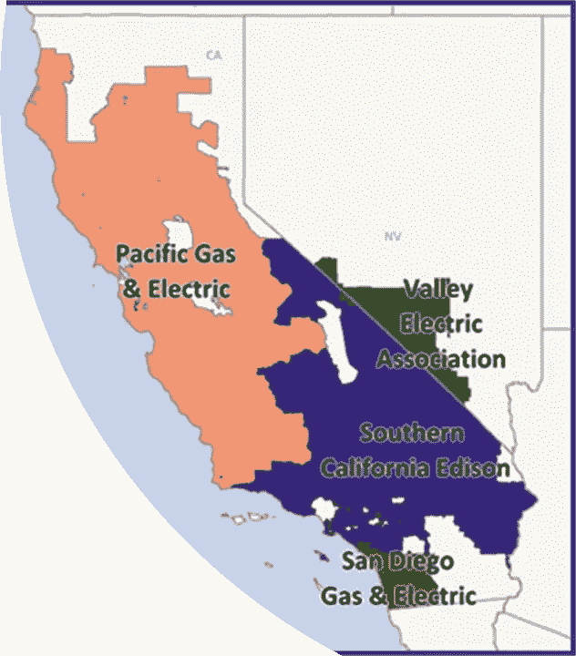

[加州参与的公用事业地图](https://westerngrid.net/wcea/wp-content/uploads/2016/07/governance-figure1-CAISO-util.png)(对于这个项目，我们将关注底部标记为圣地亚哥天然气和电力— SDGE 的红色区域)

导入数据:

该代码导入在 [CAISO](http://www.caiso.com/Pages/default.aspx) 地区运行的所有电力公司的每小时能耗数据，即 PGE、SCE、SDGE 和 VEA。它还包括 CAISO 总消耗量数据。

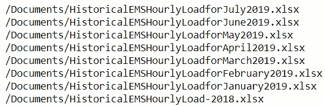

检查数据是否已正确导入。

同样，我们也可以检查 2014-2017 年的数据。

注意:在项目进行的时候，数据只提供到 2019 年 7 月，但如果你现在检查(2020 年 5 月)，2019 年所有月份的数据都在网站上提供。这篇文章中显示的分析只考虑了 2014-2018 年的全年数据，但使用相同的代码可以很容易地添加 2019 年的剩余月份。

> N 注:(2022 年 5 月更新)。我注意到 2019 年之前数据的存档链接不再活跃，我也无法在网站上找到更新的链接。但是自 2020 年以来，产生了更多的数据，并且[链接](http://www.caiso.com/planning/Pages/ReliabilityRequirements/Default.aspx)中的“EMS 的历史每小时负荷数据”部分具有从 2019 年 1 月到 2022 年年中的数据，这对于该项目来说应该足够了。

从网站上读入数据并存储在字典中。然后组合字典中的所有关键字以生成单个数据帧。

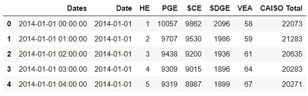

原始数据框架，包括所有 CAISO 参与设施的每小时能耗值。

上述代码将为我们提供 4 家 [CAISO](http://www.caiso.com/Pages/default.aspx) 公用事业公司(即 PGE、SCE、SDGE 和 VEA)过去 5 年的每小时能耗值。它还会给出 CAISO 总数。稍后，我们将只提取这个项目的 SDGE 数据。

以下是在上述*小时 1418* 数据帧上执行的一些操作:

*   “日期”列已经是 datetime 格式，所以我们可以直接对该列使用 Datetime 操作。
*   将能耗值转换成数字；在转换为 numeric 时，注意到列中的一些值是字符串，因此将 errors = ' compete '参数传递给 pd.to_numeric 方法。此外，在转换之后，检查该列是否有空值。
*   “日期”列数据中的某些值的格式为“201x-xx-xx yy:59:59.992”，因此使用 dt.floor 将其转换为“201 x-xx-xx YY:00:00”；这将使“日期”列中的日期时间行保持一致。

日期时间格式和转换为数值

*   发现 dataframe 只有 3 个丢失的值，所以通过使用*errors = ' constrate '*我们没有丢失很多数据，这证明了这里使用' constrate '方法的合理性。我只是想警告一下，*错误= '强制'*并不是每次都可以使用的最好方法，你必须在使用它之前检查你的数据，否则它会导致很多空值。

处理缺失的能量值

圣地亚哥地区的原始能量时间序列如下所示。

以上 *hourly1418* 数据帧保存为' *hourly1418CA.csv'* 文件以备后用。我们将继续仅使用 SDGE 能耗值。

```
hSDGE1418 = pd.read_csv('hourly1418CA.csv',usecols=['Dates','SDGE'], parse_dates=['Dates'])
```


圣地亚哥能源消耗时间序列(y 轴代表每小时的能源消耗，单位为 MWh)。有关交互式 Plotly 图和查看 CAISO 内所有公用设施的能耗图，请参阅 EDA 和 ML 笔记本。

*   43824 小时的数据(以兆瓦时为单位的能耗= 10⁶瓦时)
*   平均值:2364.92，中位数:2298.0
*   最小值:1437.08
*   最大:4867.0

我们可以看到能源消耗在夏季有更高的峰值，并且有很强的多季节性模式。这意味着，能源消耗有每日、每周以及季节性的模式。我们稍后还将分析数据的趋势。

其他日期时间参数已添加到数据帧中，如下所示:

添加日期时间功能的代码

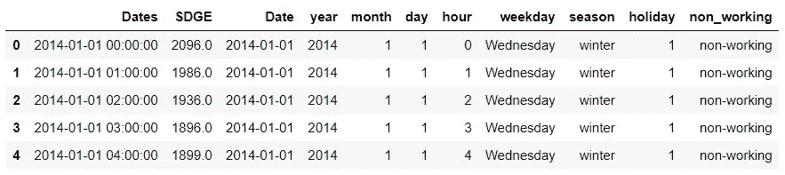

添加了日期时间功能的能耗数据框

*非工作日:当天不是联邦假日就是周末
季节:11-5 月:冬季和 6-10 月:夏季(根据 SDGE* [*链接*](https://www.sdge.com/whenmatters#how-it-works) *)*

## 导入天气数据

为了查看天气(特别是温度)对能耗的影响，我们将从 [gov.noaa.ncdc](https://www.ncei.noaa.gov/metadata/geoportal/rest/metadata/item/gov.noaa.ncdc:C00684/html) 导入每小时的温度数据。圣地亚哥有两个或更多的气象站记录了天气数据。由于机场的天气数据通常更准确，不会受到附近建筑和工业的影响，因此我们将使用圣地亚哥国际机场的数据来进行这个项目。(从此[链接](https://www.ncdc.noaa.gov/cdo-web/datatools/lcd)，选择*圣地亚哥县>圣地亚哥国际机场*和*添加到购物车*，即可下载所需数据)。

下载的天气数据有许多列，但我们将只关注'*hourly dry bulb temperature*'这是以华氏度为单位的室外温度。

天气数据每 7 分钟捕获一次，而能源消耗数据是每小时的数据，因此我必须在将天气数据与能源数据合并之前，通过计算每小时的平均温度，以每小时的间隔对天气数据进行重新采样。

```
hourly_weather = weatherdf_air.set_index('DATE').resample('H').mean()wehSDGE1418 = pd.merge(hSDGE1418, hourly_weather, how = 'outer', left_on = 'Dates', right_on= 'DATE')
```

## 太阳能/光伏安装数据

据观察，圣地亚哥的能源消耗在过去几年中总体上有所下降，并且在白天时间下降更为明显。因此，我们可以测试这一理论，也许圣地亚哥地区安装的太阳能容量在这些年里有所增加，因此当太阳出来时，越来越多的客户使用更少的能源，导致能源消耗的总体减少。我们可以通过导入 SDGE 地区的太阳能装置数据来检验这一理论。

太阳能装置数据从加州分布式
发电统计站点([直接数据链接](https://www.californiadgstats.ca.gov/download/interconnection_nem_pv_projects/))导入。该数据集包含许多参数，但我们将重点关注:
-*批准日期*:表示系统连接到电网开始运行的日期，以及
-*系统大小 AC':* ，表示安装在现场的太阳能电池板的总交流千瓦功率。

要获得有关数据的更多细节，您可以在我的报告中查看此[工作簿](https://github.com/pratha19/Hourly_Energy_Consumption_Prediction/blob/master/NEM_CurrentlyInterconnectedDataKey.b29667e204f3.xlsx)。

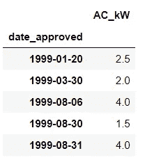

光伏安装数据框 *SDGEPV* 。每天总共有多少千瓦的 PV 被激活。

*   出于建模目的，我们对一天安装了多少光伏容量不感兴趣，而是想知道在任何特定的一天，该地区当前运行的光伏系统的总容量是多少。因此，使用累积的系统规模，我们希望看到该地区的总太阳能容量是如何整体增加的。

```
SDGEPVM['cum_AC_kW'] = SDGEPVM['AC_kW'].cumsum()##Truncating the PV installation data to the min and max dates' ##limits of the 'weather+energy' data - 'wehSDGE1418' and storing it ##as SDGEPVTSDGEPVT = SDGEPVM.loc[wehSDGE1418.Date.min():wehSDGE1418.Date.max(), ['AC_kW','cum_AC_kW']].reset_index()
```

基本上，这个想法是，如果客户有更多的光伏产品，他们将减少对电网供电的依赖(至少当太阳出来时)，从而降低整体能源需求。因此，我们正在考虑在客户场所安装光伏(如住宅、商业建筑等)。).

让我们将 PV 数据集合并到之前合并的天气+能源数据帧中。

```
df = pd.merge(wehSDGE1418, SDGEPVT, left_on = 'Date', right_on = 'date_approved', how = 'left')*# dropping duplicate date columns*
df.drop(['DATE', 'date_approved'], axis=1, inplace=**True**)
```

*   由于在 5 年内(2014-18 年)并不一定每天都安装太阳能电池板，因此 *SDGEPVT* 数据帧并不具有与能量数据帧 *wehSDGE1418* 匹配的所有行，这导致 *AC_kW* 和 *cum_AC_kW* 列中的值缺失。
*   我们可以在“ *AC_kW* ”栏中用 *0* 代替 *NaN* 来表示当天的 *0* 安装。
*   并且由于累积安装的太阳能系统大小应该保持不变，直到遇到下一个非 *NaN* 值，使用*向前填充*方法来填充“ *cum_AC_kW* 列。

```
df['cum_AC_kW'] = df['cum_AC_kW'].fillna(method='ffill')
```

*   *Forward fill* 对除了前几行之外的所有行都有效，因为 SDGEPVT 的数据不是从 2014–01–01 00:00:00 开始作为我们的能源和天气数据，所以我们必须使用不同的方法来填充前几个缺失的值。所以，基本上初始缺失值应该等于第一个非 NaN(*cum _ AC _ kW*'*减去*'*AC _ kW*')。

在日光数据中填入 NaN 值

## 让我们探索一下阳光之城是如何用电的

绘制一些图表，从数据中获得洞察力。可以回答的一些问题是:

*   检查整个时间段内任何特定一天的平均能耗变化。典型的日平均负荷曲线是一条在晚上达到峰值的曲线，因为大多数人晚上下班回家，打开灯、电视、空调等..
*   绘制月平均负荷曲线。圣地亚哥夏天很热，但是冬天不冷，所以我们可以预计夏天的负荷会更高，因为商业和住宅建筑的冷负荷。
*   查看每小时与工作日的能源消耗图，了解典型一周的总体消耗模式。
*   温度对能耗有什么影响？
*   用户电表后太阳能装置数量的增加是否导致了整个 SDGE 地区总能耗的下降？

1.  绘制整个 2014 年至 2018 年期间的平均每小时负荷曲线

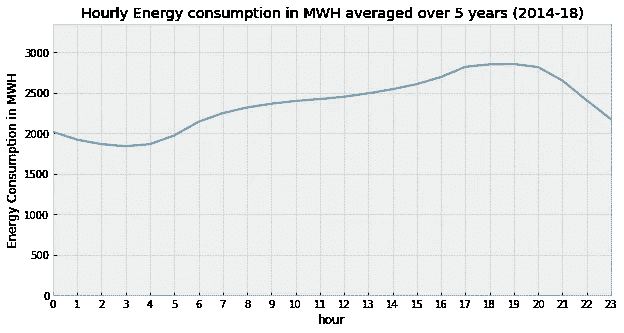

从平均每小时负载曲线图中，我们可以观察到负载如何在夜间保持较低，然后随着人们醒来而开始增加，然后在办公时间继续增加，并在晚上每个人回家并打开电器时达到峰值。

2.每小时与工作日的能耗对比，以了解某一周的能耗变化情况

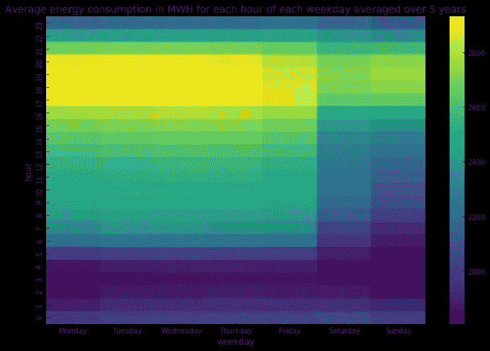

可以看出，周一至周五的平均消费在夜间低于 2000 英镑，在白天有所增加，在晚上达到峰值(> 2800 英镑)，然后再次下降到夜间。在周末也可以观察到同样的模式，但周末的总消费似乎比预期的工作日低，因为大多数商业建筑在周末不营业。

> 来自 SDGE 的网站:“如果客户可以将他们的一些能源使用转移到下午 4 点至晚上 9 点以外的低成本时段，他们就可以降低电费，并在更容易获得的时候，更好地利用更清洁的可再生能源，如风能和太阳能。”

3.可视化不同年份的能量值分布

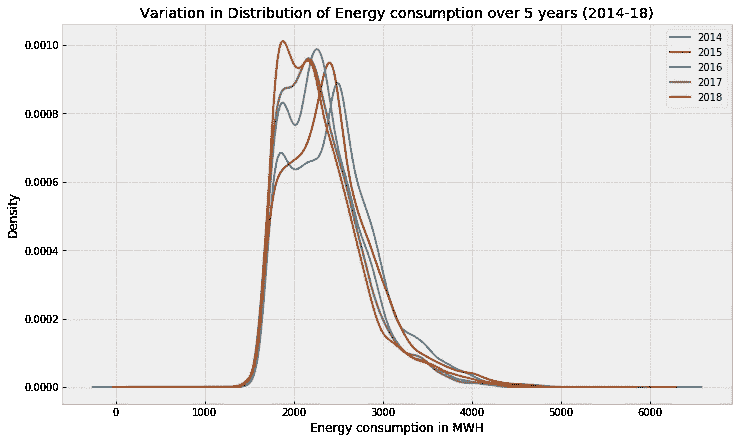

从 2014 年到 2018 年，所有年份的分布都是双模态的，能耗的模态值每年都向左移动(朝向较低的能源负荷)。

这种峰值左移可以被认为是由客户站点(称为电表后)可再生能源装置的增加以及客户对需求响应计划的参与增加导致电网峰值需求降低引起的。

3.1.绘制相同的分布图，但仅在晚上 12 点

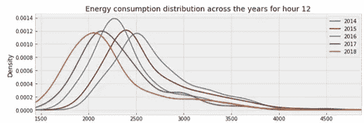

从上图中我们可以看到，从 2014 年到 2018 年，能源消耗分布已经明显向更低的能源消耗值转移，这种影响在早上 8 点到下午 5 点的白天时段更加明显(所有时段见 [EDA 笔记本](https://nbviewer.jupyter.org/github/pratha19/Springboard_capstone_project_1/blob/master/SDGE_energy_EDA.ipynb#4))。

*   在白天时段发生这种转变的原因之一可能是在用户电表后面增加了更多的可再生能源，如太阳能。我们将在后面看到，在过去的 5 年里，SDGE 的太阳能装置有了相当大的增长。导致这种下降的因素有很多，包括参与能源效率和需求响应计划的人数增加等。但是我们将只关注这个项目的太阳能装置。

4.一起探索能源和天气数据

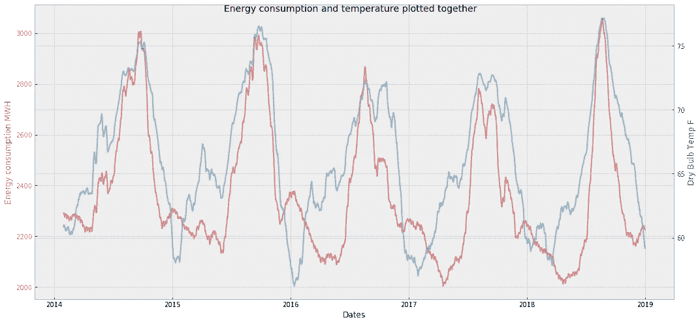

多年来能源消耗(红色)随干球温度(蓝色)的变化

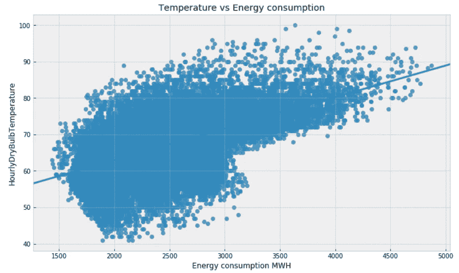

温度与能耗

*   正如之前所怀疑的，我们可以看到能耗和温度确实是相互影响的，而且它们之间似乎有某种程度的相关性。
*   更重要的是，我们可以看到最高能耗值出现在最高温度下。这可能是因为温度较高时空调负荷较高，在夏季需要更多空调负荷。在圣地亚哥，冬天并不寒冷，但是夏天会非常热，所以人们在冬天不怎么使用加热器，因为他们在夏天会使用空调。

```
**for** season **in** SDGE_t_pv['season'].unique():
    corrcoef, pvalue = scipy.stats.pearsonr(SDGE_t_pv[SDGE_t_pv['season'] == season]['SDGE'], \
                                            SDGE_t_pv[SDGE_t_pv['season'] == season]['HourlyDryBulbTemperature'])
    print('pearson correlation coefficient and pvalue for '+season, corrcoef, pvalue)
```

*冬季皮尔逊相关系数和 p 值:0.32
夏季皮尔逊相关系数和 p 值:0.65*

如上文第 3.1 节所述，从 2014 年到 2018 年，白天的能源消耗似乎有所下降。现在，这可能是由于更严格的能源效率措施被强制执行，或者对不同类别的纳税人(住宅、商业、农业等)的激励增加。)安装太阳能、风能等自发电资源。和/或能量存储，以避免更高的能量需求。据观察，多年来能源消耗的减少在白天更为明显，因此我们可以测试这一理论，即安装在公用事业区域的太阳能容量可能在多年来有所增加，正如我们将在下面看到的那样。

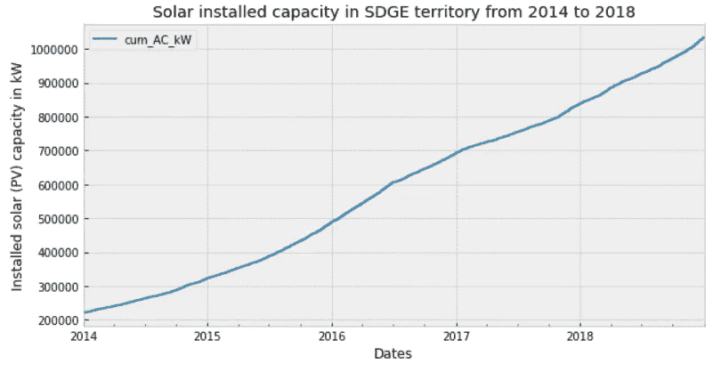

2014 年至 2018 年圣地亚哥累计太阳能装机容量(客户位置)

历年白天最大能耗与历年光伏装机累计装机容量之间的相关系数。还绘制了光伏安装与 6 个月滚动最大能耗的关系

```
**>> Energy consumption vs PV installed capacity: pearson correlation coefficient and pvalue for winter -0.515, 0.0
>> Energy consumption vs PV installed capacity: pearson correlation coefficient and pvalue for summer -0.338, 0.0**
```

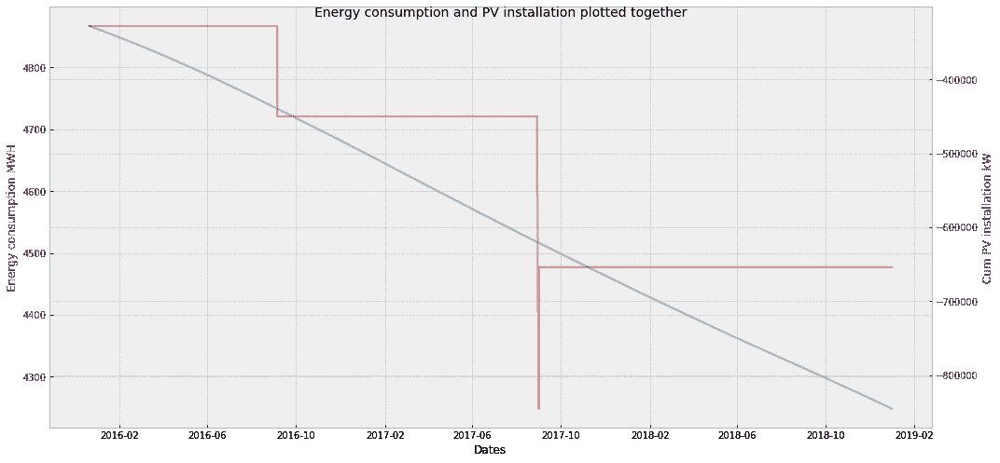

光伏安装(蓝色)与 6 个月滚动最大能耗(红色)。请注意，轴值不是从零(0)开始。

*   这种相关性似乎对两个季节都很重要，对冬季月份更强。这有点违反直觉，但较冷的温度实际上比温暖的温度更有利于太阳能电池板。这种关系适用于大多数类型的太阳能电池板——与安装过程本身无关。在世界各地的实验室进行的研究清楚地表明，温度的升高对测试的太阳能电池板的总太阳能输出有相反的影响。换句话说，温度越高，太阳能光伏系统的效率就越低。
*   因此，在所有条件相同的情况下，你在六月、七月、八月的月水电费节省会比十二月、二月和一月少。ref:[https://www . sunline energy . com/solar-PV-power-output-San-diegos-winter-months/](https://www.sunlineenergy.com/solar-pv-power-output-san-diegos-winter-months/)

> *还有，*“圣地亚哥，美国另一个日照最好的城市，冬天比夏天拥有更多的阳光”。([参考链接](https://www.currentresults.com/Weather-Extremes/US/sunniest-cities.php))

## 结论

我们已经看到了温度和光伏装机容量对圣地亚哥市能源需求的影响。由于气温较高，夏季的能源需求明显高于冬季。安装的太阳能电池板容量似乎也对这些年的能源消耗有轻微的(减少的)影响。而且，能源消耗有多种季节模式。

在这篇文章的第二部分，我们将从使用传统的预测算法如 SARIMAX 和线性回归建立简单的短期预测模型开始。然后，我们还将尝试使用非线性方法进行长期预测，如随机森林、XGBoost 以及集合模型(XGBoost + FB Prophet)。

感谢阅读。第 2 部分见。

免责声明:我在所有公用事业中选择了圣地亚哥，因为，I .它服务的区域比其他公用事业小，所以我们可以使用来自单一来源的温度数据，而不会有太大的变化(实际上圣地亚哥的天气模式变化很大，但对于本项目，我们将忽略这一点); ii .我是加州大学圣迭戈分校的校友。