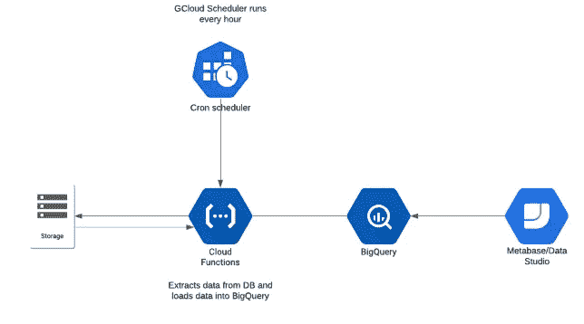
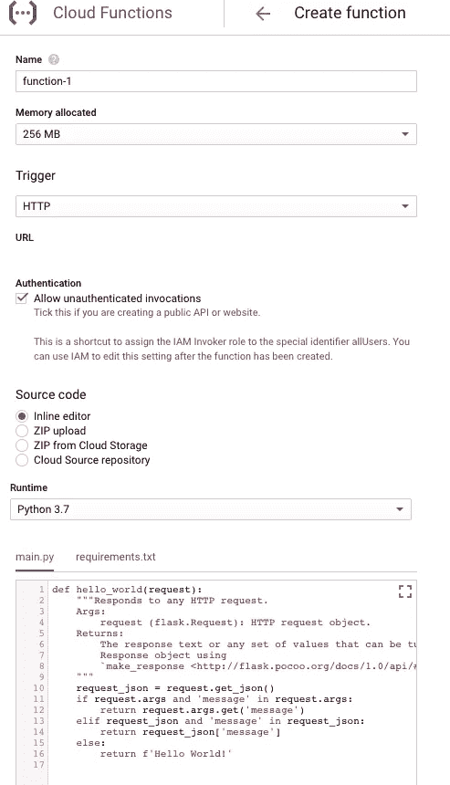
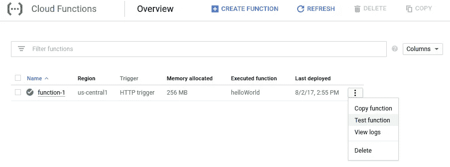
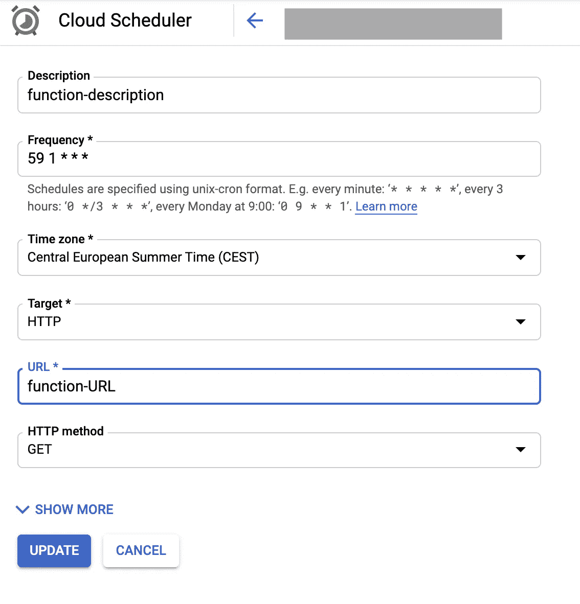

# 第 2 部分:用 Python 和 Google Cloud 函数构建一个简单的 ETL 管道——MySQL 到 BigQuery(通过 SSH)

> 原文：<https://towardsdatascience.com/part-2-building-a-simple-etl-pipeline-with-python-and-google-cloud-functions-mysql-to-bigquery-4e1987f9f89b?source=collection_archive---------20----------------------->

## 使用 Google Cloud 函数从 MySQL 数据库中提取数据并加载到 Google BigQuery 中

在[第 1 部分](/building-a-simple-etl-pipeline-with-python-and-google-cloud-platform-6fde1fc683d5)中，我们看了如何从 FTP 服务器提取 csv 文件，以及如何使用云函数将其加载到 Google BigQuery 中。在本文中，我们将做同样的事情，但这一次，我们将从 MySQL 数据库中提取数据。

有很多 ETL 工具，有时它们可能会让人不知所措，特别是当你只想将文件从 A 点复制到 b 点时。所以今天，我将向你展示如何使用 **python 3.6** 和谷歌云功能从 MySQL 数据库中提取数据(extract)、修改数据(Transform)并将其加载到谷歌 BigQuery 表(load)中。

在本文中，我们将做以下工作:

*   设置云功能
*   提取数据
*   转换数据
*   加载数据
*   自动化我们的管道

# 首先，什么是 ETL？

*提取、转换、加载(ETL)是将数据从一个或多个源复制到目标系统的一般过程，目标系统以不同于源的方式或在不同于源的上下文中表示数据。—维基百科*

这是我们的 ETL 管道最终的样子:

ETL 管道(使用 [Lucidchart](https://www.lucidchart.com/pages/examples/uml_diagram_tool) 创建)

**Google Cloud Functions**:[Cloud Functions](https://cloud.google.com/functions/)(CF)是 Google Cloud 的无服务器平台，用于执行响应特定事件的脚本，如 HTTP 请求或数据库更新。CF 的替代方案是 [AWS Lambda](https://aws.amazon.com/lambda/) 或 [Azure Functions](https://azure.microsoft.com/en-us/services/functions/) 。

**设置您的云功能**

*   [进入云功能概述页面](https://console.cloud.google.com/functions/list)。
    确保您启用了云功能的项目被选中。
*   单击创建函数。
*   说出你的函数。
*   在触发器字段中，选择 HTTP 触发器。
*   在源代码字段中，选择内联编辑器。在本练习中，我们将编写一些自定义代码，因此您可以在编辑器中删除默认代码。
*   使用运行时下拉列表选择运行时。
*   认证:在本例中，我们将“允许未经认证的调用”，但建议使用服务帐户来访问云函数，并在我们将使用的云调度器服务帐户上授予云函数的“[权限调用程序](https://cloud.google.com/functions/docs/reference/iam/roles)”。更多详情在文末。

确保您的运行时设置为“Python 3.7”，并在“高级选项”下将区域更改为离您最近的区域。在撰写本文时，CF 并不是在每个谷歌数据中心区域都可用，所以请点击这里的[查看哪里启用了云功能。](https://cloud.google.com/functions/docs/locations)

完成这些步骤后，您的显示应该如下所示:

截图来自 [GCP 控制台](https://cloud.google.com/)

# **我们的自定义代码**

一个云函数有两个文件；一个 *main.py* 和一个 *requirements.txt* 文件。后者托管我们脚本工作所需的所有文件依赖项，因此单击 *requirements.txt* 选项卡，并确保编辑器中包含这些依赖项，如下所示:

# 提取

现在在 *main.py* 选项卡中，您可以开始包含下面的代码。我们创建了一个名为“ *handler* 的函数，以后用 HTTP 请求访问云函数时会用到这个函数。然后，我们使用必要的凭证登录到 MySQL 服务器，在第 30 行，编写从数据库中提取数据所需的 SQL 查询。

获得正确的 ssh 隧道细节很重要，这样就不会遇到认证问题。SSHTunnel 是一个很好的 Python 库。

> 注意:为了保护你的秘密管理者证书，请遵循这个[指南](https://medium.com/geekculture/secure-your-credentials-in-google-cloud-functions-with-secret-manager-22a4a1b3788a)。

# 改变

因为我们现在有一个名为“*df”*的熊猫数据框架，我们可以像这样操作熊猫数据:

*df . group by([' Name '])[[' Orders ']]。agg('sum')*

这将对“orders”列中的所有订单进行汇总，并根据数据帧的“name”列中的每个唯一名称进行分组。在这个特殊的例子中，我没有包含任何转换，但是如果需要的话，您可以在第 30 行之后这样做。

# 负荷

现在，确保您[创建了您的 BigQuery 表](https://cloud.google.com/bigquery/docs/tables)。然后我们简单地使用下面的代码将转换后的 CSV 文件加载到您创建的 BigQuery 表中。

*   ***auto detect = True***:-由于我们启用了“[自动检测](https://cloud.google.com/bigquery/docs/schema-detect)”，所以在将数据加载到表中时，我们不需要提供模式，因为它将基于 Dataframe 中的数据进行推断。
*   ***WRITE _ disposition = " WRITE _ TRUNCATE "***:-该作业将截断表数据并从头开始写入。
*   **source _ format=*big query。source format . NEWLINE _ DELIMITED _ JSON***
*   ***load _ table _ from _ data frame****:-*一个不错的 BigQuery 函数，可以将数据从一个`**pandas.DataFrame**`加载到一个`[**Table**](https://googleapis.dev/python/bigquery/latest/generated/google.cloud.bigquery.table.Table.html#google.cloud.bigquery.table.Table)`。

当您完成编写脚本时，您可以通过单击“创建”来部署云功能。当该功能成功部署后，您应该会看到一个绿色的复选标记。

[来源](https://cloud.google.com/functions/docs/quickstart-console)

# 使自动化

现在剩下要做的就是创建一个 cron 作业(Cloud Scheduler ),它将在某个预定义的时间间隔自动调用 CF。好消息是，在谷歌云平台上创建 cron jobs 非常简单，也是最简单的部分。你可以在这里按照****的指示或者复制下图。****

********

****[来源](https://cloud.google.com/functions/docs/quickstart-console)****

********

****截图自 GCP****

****这里的“频率”字段将在每天凌晨 1:59 运行我们的脚本。****

> *****你可以使用这个很酷的* [*站点编辑器*](https://crontab.guru/) *进行简单的 cron 调度表达式。*****

****既然我们的数据已经存放在数据仓库中，我们可以将它连接到任何可视化工具并对其进行分析。****

# ****后续步骤****

****如果您不想允许未经身份验证的调用，请为 Cloud Scheduler 设置 HTTP 目标身份验证。如果您设置了具有适当凭据的关联服务帐户，云调度程序可以调用需要身份验证的 HTTP 目标。点击阅读更多[。](https://cloud.google.com/scheduler/docs/http-target-auth)****

****就是这样。希望这对你有帮助。这是一种非常简单的开发 ETL 的方法，任何人都可以在其上进行构建。****

> *****你可以* [*成为中等会员*](https://medium.com/@tobisam/membership) *享受更多这样的故事。*****

****你可以在 [**Github**](https://github.com/togobingi/google_cloud_function) 上找到完整脚本的链接。****