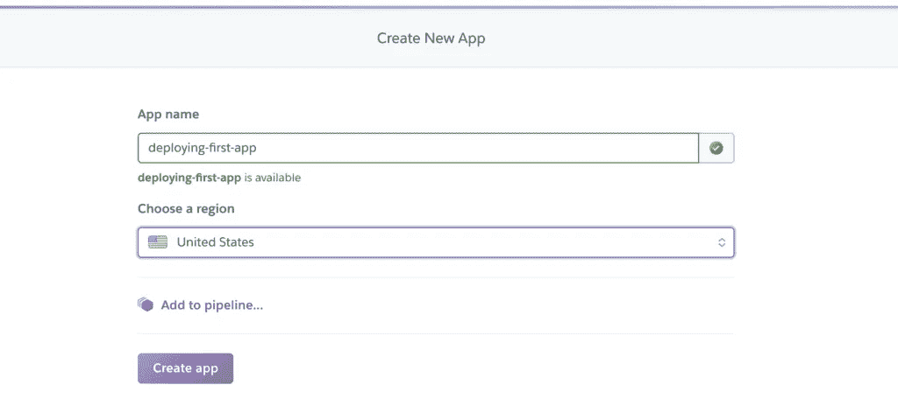
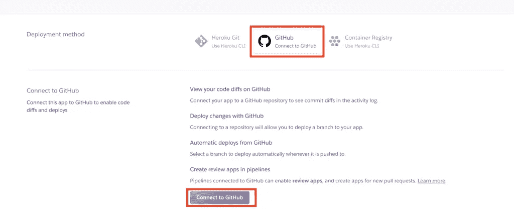
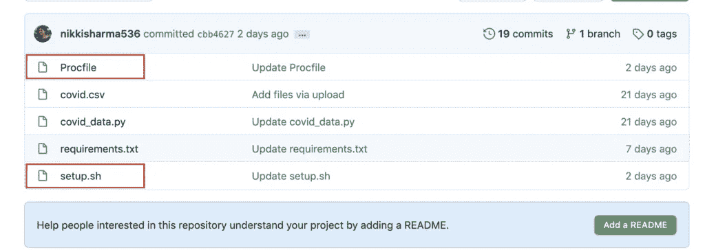
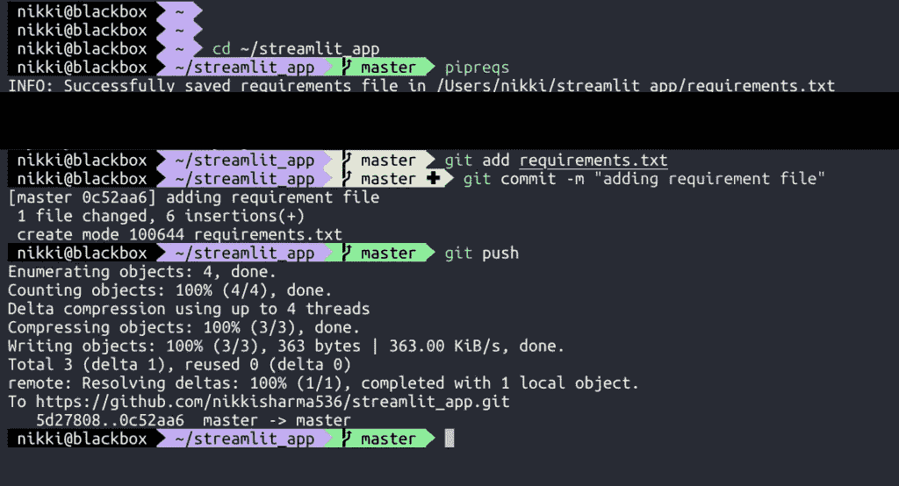
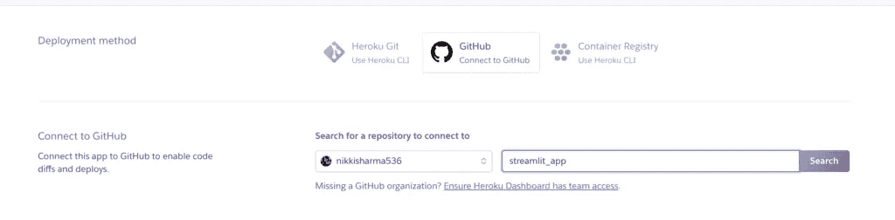
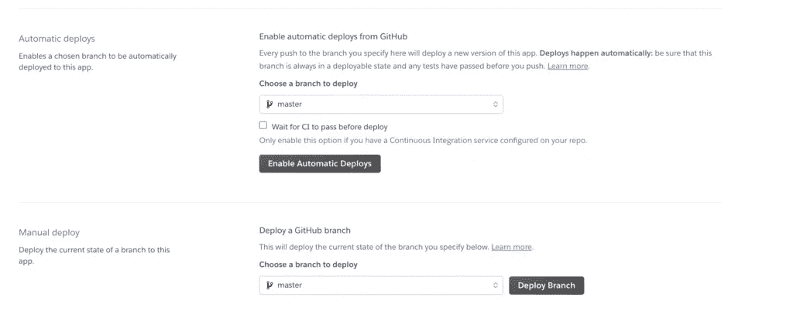
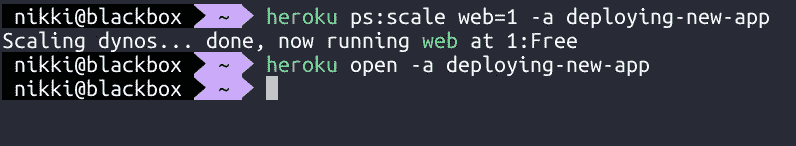
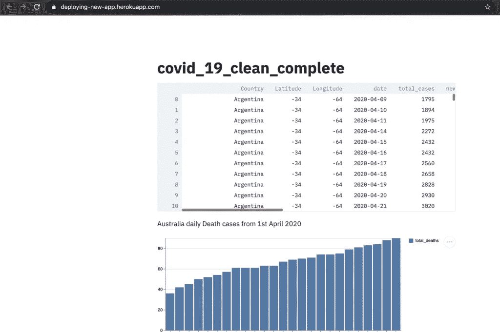

# 第 2 部分—使用 Python 和 Heroku 创建实时交互式仪表盘

> 原文：<https://towardsdatascience.com/part-2-create-live-interactive-dashboards-with-python-and-heroku-b74701a75746?source=collection_archive---------55----------------------->

## 在 Heroku 云平台上部署您的 Streamlit 应用程序的简单说明


斯蒂芬·道森在 [Unsplash](https://unsplash.com/s/photos/dashboard?utm_source=unsplash&utm_medium=referral&utm_content=creditCopyText) 上拍摄的照片

# 介绍

如果你想在云平台上部署一个交互式仪表盘或你的投资组合作为一个网页，Heroku 是一个部署你的仪表盘的好应用。在我们之前的帖子中，我们讨论了[如何使用 Streamlit](/how-to-build-interactive-dashboards-in-python-using-streamlit-1198d4f7061b) 在 Python 中构建交互式仪表盘。在这里，我们将在云平台中部署我们的 streamlit 应用程序。

# 赫罗库

Heroku 是一个云平台，在虚拟容器(Dynos)中运行我们的应用程序，这些应用程序在运行时环境中执行。这些容器支持许多不同的语言，如 Ruby、Scala、Python、Java 等。它还提供定制的构建包，我们可以用它来部署任何其他语言的应用程序。

# 设置 Heroku

*   在 Heroku 中创建一个帐户，然后在那里创建一个新应用程序。



*   我们可以用不同的方式部署我们的应用程序，但在这篇文章中，我们将看到如何通过 Github 部署我们的代码。我们可以把 Github 账户和 Heroku 联系起来。



# Heroku 的设置文件

现在我们已经准备好将 Github 代码部署到 Heroku 了。现在我们需要在代码中添加额外的文件来帮助我们自动运行代码。为此，我们需要在 Github 文件夹中添加两个额外的文件。



*   **概要文件** —我们需要创建一个名为 **Procfile** 的文本文件，没有任何扩展名。它是一个声明如何运行以及运行什么命令的文件。

格式:

```
web: sh setup.sh && streamlit run <filename>.py
```

示例:

```
web: sh setup.sh && streamlit run covid_data.py
```

*   **setup.sh** —我们还需要创建一个名为 **setup.sh** 的文件，我们将在其中写入配置，并为 streamlit 创建一个文件夹。我们只需要将下面的命令粘贴到文件中。

```
mkdir -p ~/.streamlit/
echo "\[server]\n\ 
headless = true\n\ 
port = $PORT\n\ 
enableCORS = false\n\ 
\n\ 
" > ~/.streamlit/config.toml
```

如果我们的文件夹中没有 **requirement.txt** 文件。我们可以使用 pipreqs 包来创建它。

```
$ cd ~/<folder_path>\ 
$ pipreqs
$ git add requirements.txt 
$ git commit -m "requirements.txt" 
$ git push
```



# 通过 Github 部署 Heroku

现在我们开始部署我们的项目。连接我们要部署的 Github 库，然后部署 branch。如果我们想要自动部署我们所做的每一个变更/提交，我们需要点击按钮"**Enable Automatic deployments**"



# 如何经营 Heroku

现在我们的 Streamlit 应用程序已经部署好了，我们需要运行 Heroku。

```
$ heroku ps:scale web=1 -a <app_name> $ heroku open -a<app_name>
```



最后，我们可以在云平台中看到我们的 Streamlit 应用程序



**注意**:在阅读下面这篇文章时，该 URL 可能没有激活。

# 所有的代码

这里是 Github repo 的所有代码，包括我们在这个博客中使用的所有代码。

这个帖子到此为止。希望对你有帮助。敬请关注新的有趣博客。

*原载于 2020 年 7 月 2 日*[*【https://confusedcoders.com】*](https://confusedcoders.com/random/deploying-website-using-heroku)*。*