# 探索寻路图算法

> 原文：<https://towardsdatascience.com/part-2-exploring-pathfinding-graph-algorithms-e194ffb7f569?source=collection_archive---------21----------------------->

## [旅游的游客](https://towardsdatascience.com/tagged/traveling-tourist)

## 深入探究 Neo4j 图形数据科学库中可用的寻路算法

在[系列的第一部分](/traveling-tourist-part-1-import-wikidata-to-neo4j-with-neosemantics-library-f80235f40dc5)，我们从 WikiData API 构建了一个位于西班牙的古迹的知识图。现在我们将戴上[图形数据科学护目镜](https://imgur.com/a/eR1t5Sk)，探索 [Neo4j 图形数据科学](https://neo4j.com/docs/graph-data-science/current/)库中可用的各种寻路算法。更重要的是，我们来看看圣诞老人问题的强力解决方案。现在，你可能想知道圣诞老人问题是什么。这是旅行推销员问题的一个变种，除了我们不要求解决方案在开始的同一个城市结束。这是因为圣诞老人有弯曲时空连续体的能力，一旦他送完东西，就会立刻飞回北极。

## 议程

1.  推断古迹的空间网络
2.  用 cypher projection 加载内存中的投影图
3.  弱连通分量算法
4.  最短路径算法
5.  Yen 的 k-最短路径算法
6.  单源最短路径算法
7.  最小生成树算法
8.  随机行走算法
9.  旅行推销员问题
10.  结论

## 推断古迹的空间网络

目前，我们在图表中的纪念碑之间没有直接的关系。然而，我们有他们的 GPS 定位，这使我们能够识别附近的纪念碑。这样，我们可以推断出一个纪念碑的空间网络。

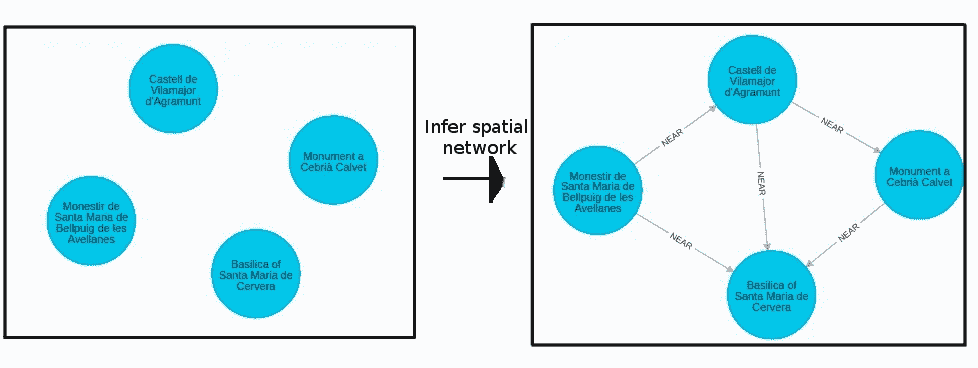

过程非常类似于推断相似性网络。我们通常不希望得到一个完整的图，其中每个节点都与所有其他节点相连。这将违背演示寻路算法的目的，因为任何两个节点之间的最短路径将总是直线，这将被表示为两个节点之间的直接关系。在我们的例子中，我们将把每个纪念碑连接到距离不到 100 公里的五个最近的纪念碑。这两个数字完全是任意的。您可以根据自己的情况选择其他选项。

```
MATCH (m1:Monument),(m2:Monument) 
WHERE id(m1) > id(m2) 
WITH m1,m2, distance(m1.location_point,m2.location_point) as distance 
ORDER BY distance ASC
WHERE distance < 100000
WITH m1,collect({node:m2,distance:distance})[..5] as nearest 
UNWIND nearest as near 
WITH m1, near, near.node as nearest_node 
MERGE (m1)-[m:NEAR]-(nearest_node) SET m.distance = near.distance
```

## 用 cypher projection 加载内存中的投影图

让我们快速回顾一下 GDS 图书馆是如何工作的。

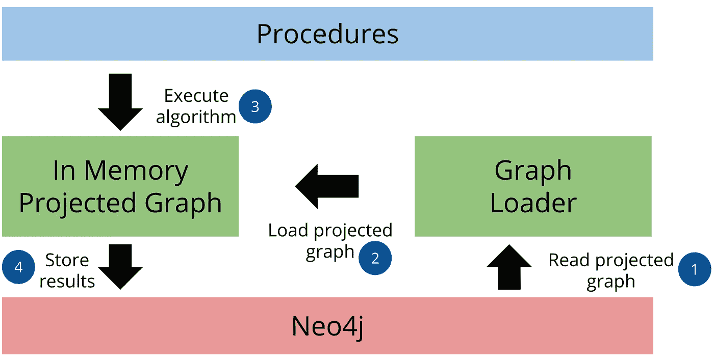

图片借用自[官方文档](https://neo4j.com/docs/graph-data-science/current/common-usage/)。

图表分析管道由三部分组成。在第一部分中，图形加载器从 Neo4j 中读取存储的图形，并将其作为内存中的投影图形加载。我们可以使用[本地投影](/exploring-the-graph-catalog-feature-of-neo4j-graph-data-science-plugin-on-a-lord-of-the-rings-d2de0d0a023)或 [cypher 投影](/how-to-use-cypher-projection-in-neo4j-graph-data-science-library-on-a-lord-of-the-rings-social-b3459138c4f1)来加载投影图。第二步，我们按顺序执行图算法。我们可以使用一个图算法的结果作为另一个图算法的输入。最后但同样重要的是，我们将结果存储或流回 Neo4j。

这里，我们将使用 cypher 投影来加载内存中的图形。我建议你看一下[官方文档](https://neo4j.com/docs/graph-data-science/current/management-ops/cypher-projection/)了解更多关于它如何工作的细节。在 node 语句中，我们将描述图中的所有纪念碑，并添加它们的架构风格作为节点标签。添加一个定制的节点标签将允许我们在算法执行时按照架构风格过滤节点。在关系声明中，我们将描述纪念碑之间的所有链接，并包括距离属性，我们将使用该属性作为关系权重。

```
CALL gds.graph.create.cypher('monuments',
  'MATCH (m:Monument)-[:ARCHITECTURE]->(a) 
   RETURN id(m) as id, collect(a.name) as labels',
  'MATCH (m1:Monument)-[r:NEAR]-(m2:Monument) 
   RETURN id(m1) as source, id(m2) as target, r.distance as distance')
```

## 弱连通分量算法

尽管[弱连通分量](https://neo4j.com/docs/graph-data-science/current/algorithms/wcc/)算法不是寻路算法，但它是几乎所有图形分析的一部分。它用于在我们的图中查找不连接的组件或岛。我们将从运行算法的`stats`模式开始。

```
CALL gds.wcc.stats('monuments') 
YIELD componentCount, componentDistribution
```

结果

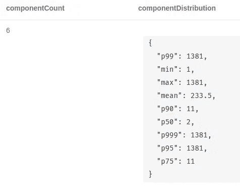

弱连通分量统计结果

我们的古迹网络有六个独立的组成部分。这些结果是真实世界数据集的典型结果。我们有一个包含 98%的节点和几个漂浮在周围的小岛的超级组件。让我们检查较小的组件。

```
CALL gds.wcc.stream('monuments')
YIELD nodeId, componentId 
WITH componentId, gds.util.asNode(nodeId) as node
OPTIONAL MATCH (node)-[:IS_IN*2..2]->(state)
RETURN componentId, 
       count(*) as component_size,
       collect(node.name) as monuments, 
       collect(distinct state.id) as state
ORDER BY component_size DESC 
SKIP 1
```

结果

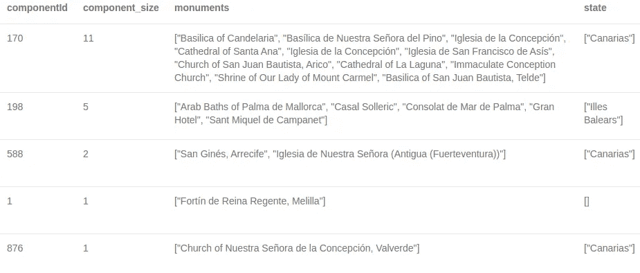

较小的弱连通分量成员

五个较小的部分中有三个位于加那利群岛，一个位于巴利阿里群岛，特别是在马略卡岛。通过由 Estelle Scifo 开发的 Neomap 应用程序，我们可以在地图上看到加那利群岛的组成部分。

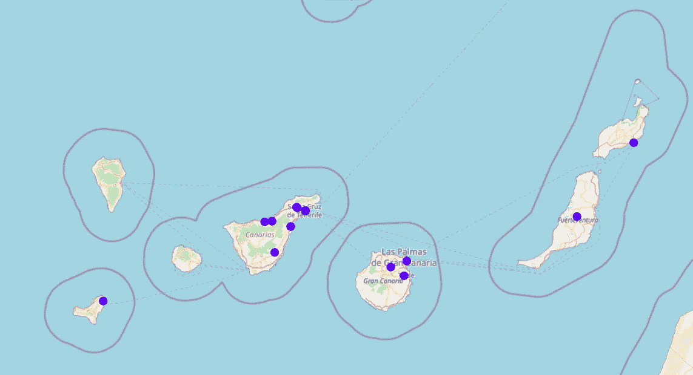

其中一个部分横跨 Fuerteventura 和 Lanzarote 的两个纪念碑。第二个由位于特内里费岛和大加那利岛的几个纪念碑组成。在左边，埃尔耶罗岛上有一座单独的纪念碑。它们是独立的组件，因为它们之间没有联系。组件之间没有连接意味着距离超过 100 公里，因为这是我们推断空间网络时选择的阈值。

*又及:如果你喜欢水上活动，我强烈推荐你去加那利群岛。*

## 最短路径算法

我们将使用的第一个寻路图算法是[最短路径算法](https://neo4j.com/docs/graph-data-science/current/alpha-algorithms/shortest-path/)。它查找两个节点之间的最短加权路径。我们定义开始节点和结束节点，并指定在计算最短路径时算法应该考虑哪个关系权重属性。

```
MATCH (s:Monument{name:'Iglesia de Santo Domingo'}),  
      (e:Monument{name:'Colegiata de Santa María de Piasca'})
CALL gds.alpha.shortestPath.stream('monuments',{
  startNode:s,
  endNode:e,
  relationshipWeightProperty:'distance'})
YIELD nodeId, cost
RETURN gds.util.asNode(nodeId).name as monument, cost
```

结果

成本以米为单位的距离来表示。我们可以用 Neomap 稍加修改的版本来可视化最短路径。我已经定制了纪念碑的弹出窗口，包括它的图像和建筑风格。

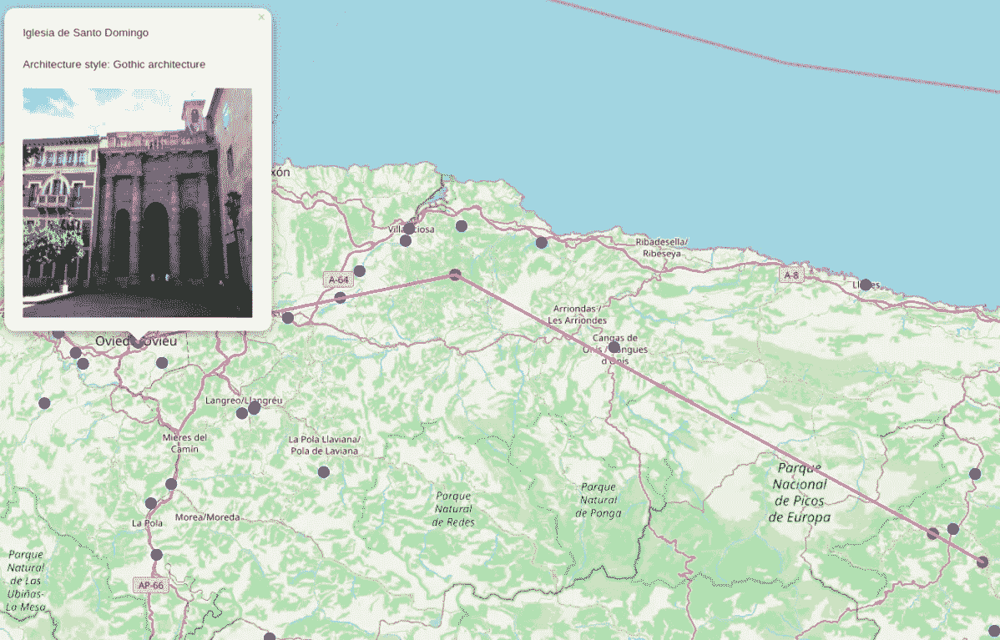

你可能会注意到，我们忽略了圣克鲁斯·德·坎加斯·德·昂尼斯纪念碑，它位于图片的中间偏右。从 Iglesia de San Emeterio 到 Santo Toribio de Liébana，稍微绕一点路就会比直线行驶的路程长。

如果我们想为一堂建筑课计划一次旅行，并且沿途只参观受哥特式或罗马式建筑影响的纪念碑，会怎么样？利用 GDS 图书馆，计划这样的旅行是非常容易的，因为我们可以用参数`nodeLabels`过滤算法可以访问的节点。

```
MATCH (s:Monument{name:'Iglesia de Santo Domingo'}),  
      (t:Monument{name:'Colegiata de Santa María de Piasca'})
CALL gds.alpha.shortestPath.stream('monuments',{
  startNode:s,
  endNode:t,
  relationshipWeightProperty:'distance',
  nodeLabels:['Gothic architecture','Romanesque architecture']}) 
YIELD nodeId, cost
RETURN gds.util.asNode(nodeId).name as monument, cost
```

结果

这次的路线有点不同，因为算法只能访问受哥特式或罗马式建筑风格影响的纪念碑。

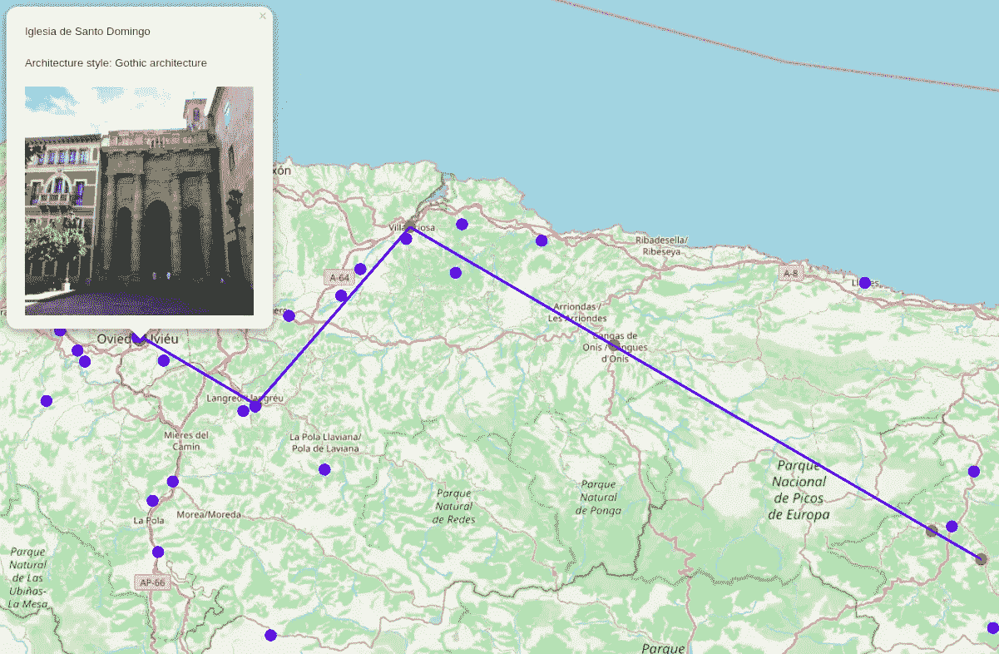

## Yen 的 k-最短路径算法

我们已经学习了如何计算一对节点之间的最短加权路径。如果我们是更谨慎的游客，想要找到前三条最短路径，会怎么样？有一个后备计划，以防途中可能会发生意想不到的事情，这总是一个好主意。在这个场景中，我们可以使用 Yen 的 [k-shortest path 算法](https://neo4j.com/docs/graph-data-science/current/alpha-algorithms/yen-s-k-shortest-path/)。语法几乎与最短路径算法相同，除了添加的`k`参数，该参数定义了我们希望找到多少条最短路径。

```
MATCH (s:Monument{name:'Iglesia de Santo Domingo'}),
      (t:Monument{name:'Colegiata de Santa María de Piasca'})
CALL gds.alpha.kShortestPaths.stream('monuments',{
  startNode:s,
  endNode:t,
  k:3,
  relationshipWeightProperty:'distance'}) 
YIELD index,nodeIds,costs
RETURN index,[nodeId in nodeIds | gds.util.asNode(nodeId).name] as monuments,apoc.coll.sum(costs) as total_cost
```

结果

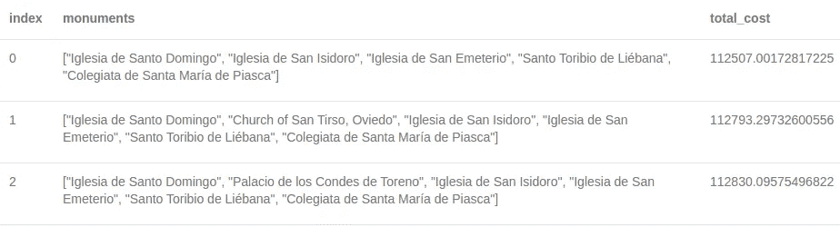

Yen 的 k-最短路径算法结果

这三条路几乎一样长，只差几百米。仔细看，三个变体中只有第二站不一样。如此小的差异可归因于我们的空间网络和示例节点对的性质。

## 单源最短路径算法

使用[单源最短路径算法](https://neo4j.com/docs/graph-data-science/current/alpha-algorithms/single-source-shortest-path/)，我们定义起始节点，并搜索到网络中所有其他节点的最短加权路径。我们将检查一个加那利组件，以将最短路径的数量限制到一个合理的数量。

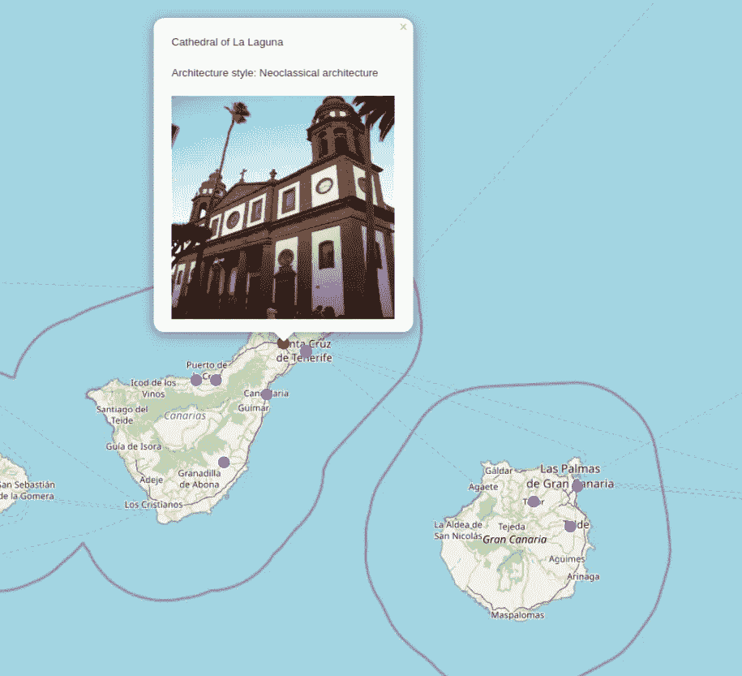

我们将检查特内里费岛—大加那利岛部分，并选择拉古纳大教堂作为起点。该算法试图找到到网络中所有其他节点的最短路径，如果不存在这样的路径，它将返回无穷大值作为结果。我们将使用`gds.util.isFinite`过程过滤掉不可到达的节点。

```
MATCH (start:Monument{name:’Cathedral of La Laguna’})
CALL gds.alpha.shortestPaths.stream(‘monuments’,
 {startNode:start, relationshipWeightProperty:’distance’})
YIELD nodeId, distance
WHERE gds.util.isFinite(distance) = True
RETURN gds.util.asNode(nodeId).name as monument,distance
ORDER BY distance ASC
```

结果

离拉古纳大教堂最近的纪念碑是康塞普西翁大教堂，只有 420 米远。在特内里费岛上似乎有两座康塞普西翁大教堂，我们可以观察到它在我们的搜索结果中出现了两次。在我们的网络中，距离拉古纳大教堂最远的纪念碑是圣胡安包蒂斯塔大教堂。

如果我们想找到从拉古纳大教堂到所有可到达的新古典主义纪念碑的最短路径的成本，我们可以通过`nodeLabels`参数轻松实现。

```
MATCH (start:Monument{name:'Cathedral of La Laguna'})
CALL gds.alpha.shortestPaths.stream('monuments',
 {startNode:start, relationshipWeightProperty:'distance',    
  nodeLabels:['Neoclassical architecture']})
YIELD nodeId, distance
WHERE gds.util.isFinite(distance) = True
RETURN gds.util.asNode(nodeId).name as monument,
 distance
ORDER BY distance ASC
```

结果

在特内里费岛和大加那利群岛上似乎只有四座新古典主义纪念碑。

## 最小重量生成树算法

[最小权重生成树](https://neo4j.com/docs/graph-data-science/current/alpha-algorithms/minimum-weight-spanning-tree/)算法从一个给定的节点开始，计算连接所有可达节点的生成树，其关系权重之和最小。例如，如果我们想用光缆或电缆连接特内里费岛和大加那利岛的所有古迹，我们将使用最小重量生成树算法。

```
MATCH (start:Monument{name:’Cathedral of La Laguna’})
CALL gds.alpha.spanningTree.minimum.write(‘monuments’,{
 startNodeId:id(start),
 relationshipWeightProperty:’distance’,
 weightWriteProperty:’cost’})
YIELD effectiveNodeCount
RETURN effectiveNodeCount
```

结果

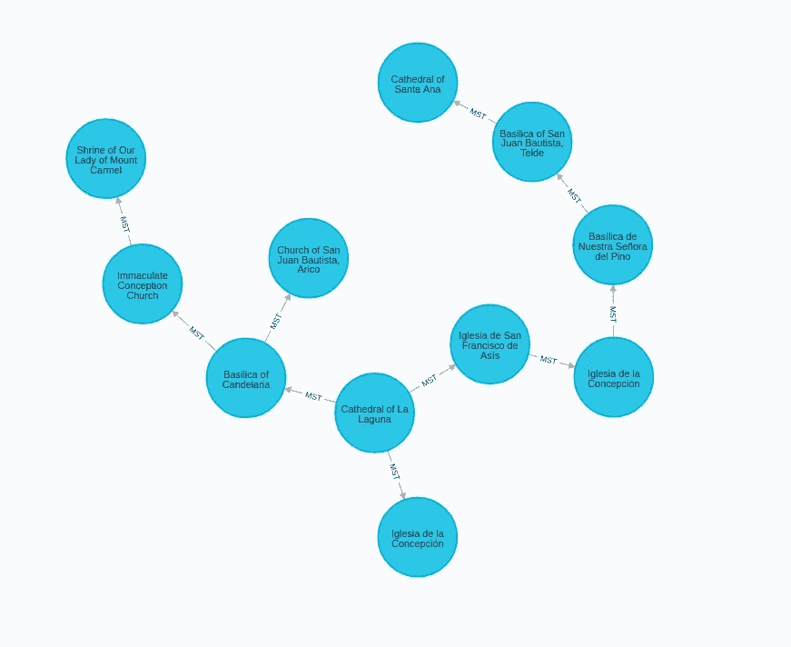

最小重量生成树算法结果在 Neo4j 浏览器中可视化

目前只有算法的`write`模式可用。我们可以用 Neomap 可视化我们潜在的电缆路径。

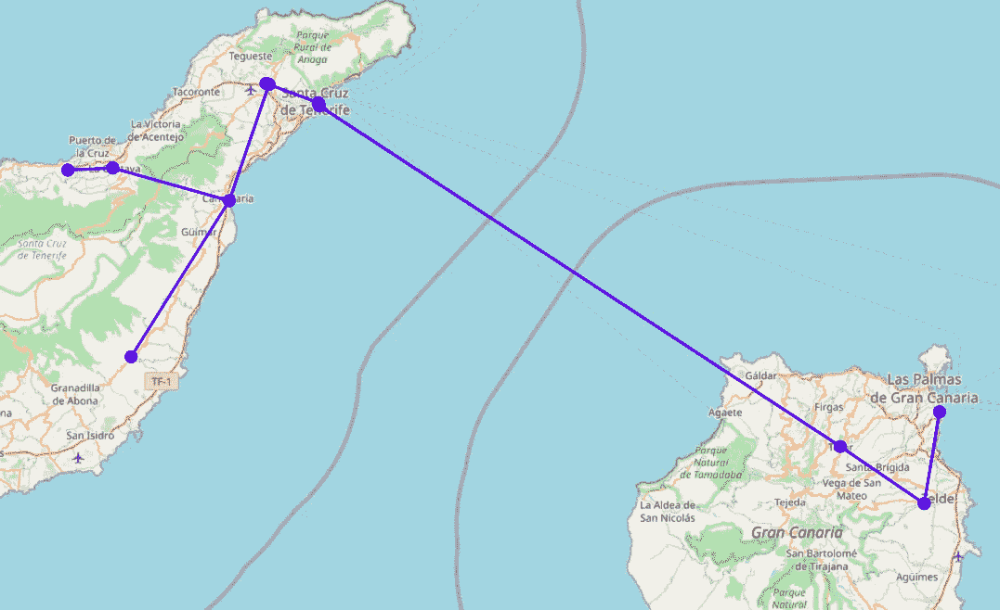

## 随机行走算法

我们可以想象[随机漫步](https://neo4j.com/docs/graph-data-science/current/alpha-algorithms/random-walk/)算法试图模仿喝醉的人群穿越网络。他们可能向左，或向右，向前两步，向后一步，我们永远不知道。要看人群醉到什么程度了。我们可以使用这种算法来提供随机的旅行建议。想象一下，我们刚刚参观了巴塞罗那大学历史建筑，但不确定接下来应该看哪些古迹。

```
MATCH (m:Monument{name:"University of Barcelona historical building"})
CALL gds.alpha.randomWalk.stream('monuments',
  {start:id(m), walks:3, steps:5})
YIELD nodeIds
RETURN [nodeId in nodeIds | gds.util.asNode(nodeId).name] as result
```

结果

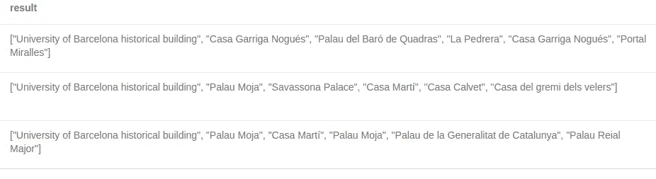

随机行走算法结果

记住，我们提到过随机行走算法试图模仿一个喝醉的人穿越网络。一个喝醉的人可能会两次参观同一个纪念碑而不在乎。例如，在第一个和第三个建议中，一个纪念碑出现了两次。幸运的是，我们有一些选项可以用以下两个参数来影响算法在 node2vec 模式下如何遍历网络:

> return:该参数控制遍历中立即重新访问节点的可能性。将它设置为较高的值(> max(inOut，1))可以确保我们不太可能在接下来的两步中对已经访问过的节点进行采样。
> 
> inOut:该参数允许搜索区分“向内”和“向外”节点。如果 inOut > 1，则随机游走偏向靠近节点 t 的节点，相比之下，如果 inOut < 1, the walk is more inclined to visit nodes that are further away from the node t.

*则两个参数的定义是从* [*原 Node2vec 论文*](https://cs.stanford.edu/~jure/pubs/node2vec-kdd16.pdf) *中总结出来的。*

我们想推荐离我们的起点很近的纪念碑，所以我们选择参数`inOut`大于 1。我们当然希望避免在遍历过程中重新访问已经访问过的节点，所以我们选择`return`参数大于`inOut`参数。

```
MATCH (m:Monument{name:"University of Barcelona historical building"})
CALL gds.alpha.randomWalk.stream('monuments',
  {start:id(m), walks:3, steps:5, 
   mode:'node2vec', inOut:5, return:10})
YIELD nodeIds
RETURN [nodeId in nodeIds | gds.util.asNode(nodeId).name] as result
```

结果

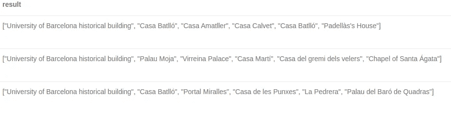

node2vec 模式下的随机游走算法

不幸的是，`return`参数确保我们不太可能在接下来的两步中对已经访问过的节点进行采样。这意味着我们不能确定重复的东西不会在我们散步的时候出现。在我们的例子中，Casa Batlló在第一个建议中出现了两次。我们可以通过创建更长的步行建议并在向用户显示结果之前过滤掉重复的建议来解决这个问题。在下面的查询中，我们计算九步长的步行，过滤掉重复的，只返回前五个结果。

```
MATCH (m:Monument{name:"University of Barcelona historical building"})
CALL gds.alpha.randomWalk.stream('monuments',
  {start:id(m), walks:3, steps:9, 
   mode:'node2vec', inOut:5, return:10})
YIELD nodeIds
RETURN apoc.coll.toSet([nodeId in nodeIds | gds.util.asNode(nodeId).name])[..5] as result
```

结果

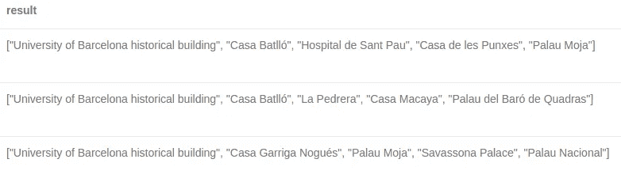

移除重复项后的随机游走算法结果

通过这种方式，我们可以确保结果不包含重复项。现在，我们可以用我们的旅行推荐应用程序来可视化结果。

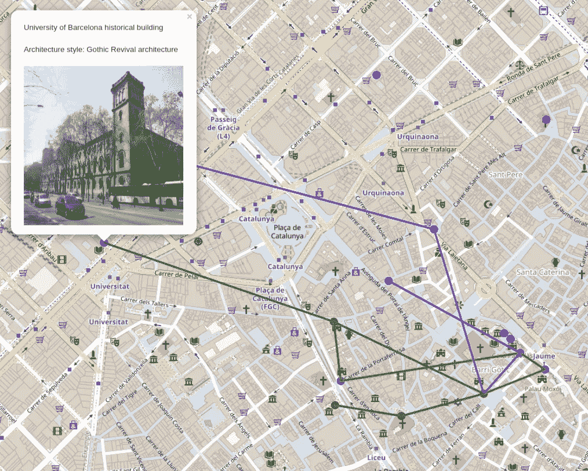

## 旅行推销员问题

最重要的是，我们将解决旅行推销员问题的圣诞老人变体。如前所述，唯一的区别是我们省略了在起始位置结束的要求。我在大卫·巴顿写的[游戏圣诞市场](https://medium.com/neo4j/gaming-the-christmas-market-a70963bec154)帖子中找到了这个问题的灵感。我把所有的荣誉都归功于大卫·巴顿，是他想出了这个解决方案。我的贡献是更新它，以便与 Neo4j 4.0 和 GDS 图书馆一起工作。

比方说我们想找到这座纪念碑之间的最佳路线:

```
:param selection => ["Castell de Santa Pau","Castell de Sant Jaume","Castell de Vilaüt","Castell de Sarraí","Castell de Solius","Portal d'Albanyà","Castell de Sant Gregori","Casa Frigola"]
```

我们把解决方案分成两步。首先，我们使用`gds.alpha.shortestPath`算法计算所有选定纪念碑对之间的最短路径，并将结果存储为给定节点对之间的 **SHORTEST_ROUTE_TO** 关系。我们将总成本和沿最短路径的所有中间节点保存为 **SHORTEST_ROUTE_TO** 关系的属性。

```
WITH $selection as selection
MATCH (c:Monument)
WHERE c.name in selection
WITH collect(c) as monuments
UNWIND monuments as c1
WITH c1,
    [c in monuments where c.name > c1.name | c] as c2s,
    monuments
UNWIND c2s as c2
CALL gds.alpha.shortestPath.stream('monuments',{startNode:c1,endNode:c2,relationshipWeightProperty:'distance'})
YIELD nodeId, cost
WITH c1,
     c2,
     max(cost) as totalCost,
     collect(nodeId) as shortestHopNodeIds
MERGE (c1) -[r:SHORTEST_ROUTE_TO]- (c2)
SET r.cost = totalCost,
    r.shortestHopNodeIds = shortestHopNodeIds
```

完成第一步后，我们创建了所选纪念碑之间的 **SHORTEST_ROUTE_TO** 关系的完整图表。

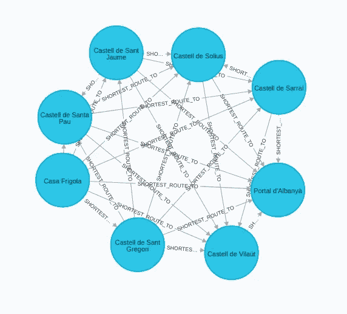

旅行推销员问题第一步

在第二步中，我们将使用`apoc.path.expandConfig`过程。它使我们能够执行可变长度的路径遍历，并对遍历进行细粒度控制。查看[文档](https://neo4j.com/labs/apoc/4.1/graph-querying/expand-paths-config/)了解更多详情。

我们允许程序仅遍历带有`relationshipFilter`参数的 **SHORTEST_ROUTE_TO** 关系，并仅访问带有`whitelistNodes`参数的选定纪念碑。我们通过定义遍历的跳数或级别数(`minLevel`和`maxLevel`)并使用`uniqueness`参数来确保所有选择的节点必须被恰好访问一次。我知道这很难理解，如果你需要帮助，我建议你在 Neo4j 社区网站上提问。然后，我们选择具有最小关系权重和的路径作为解决方案。因为我们计算了所选古迹之间所有可能的路线，所以这是旅行商问题的一种蛮力解法。

```
WITH $selection as selection
MATCH (c:Monument) 
WHERE c.name in selection
WITH collect(c) as monuments
UNWIND monuments as c1
WITH c1,
    [c in monuments where c.name > c1.name | c] as c2s,
    monuments,
    (size(monuments) - 1) as level
UNWIND c2s as c2
CALL apoc.path.expandConfig(c1, {
  relationshipFilter: 'SHORTEST_ROUTE_TO',
  minLevel: level,
  maxLevel: level,
  whitelistNodes: monuments,
  terminatorNodes: [c2],
  uniqueness: 'NODE_PATH'}) 
YIELD path
WITH path,
    reduce(cost = 0, x in relationships(path) | cost + x.cost) as totalCost
ORDER BY totalCost LIMIT 1
WITH path,
     totalCost,
     apoc.coll.flatten([r in relationships(path) | r.shortestHopNodeIds]) as intermediate_stops,
     [n in nodes(path) | id(n)] as node_ids
RETURN  [n in nodes(path) | n.name] as path,
        round(totalCost) as total_distance,
        [optional in intermediate_stops where not optional in node_ids | gds.util.asNode(optional).name] as optional_stops
```

结果

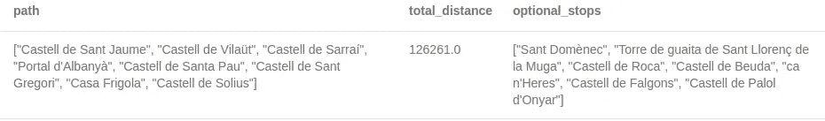

圣诞老人解决方案

在结果的“路径”列中，我们有一个有序排列的要参观的选定古迹。我们的旅行将从卡斯特尔德圣豪梅开始，继续到卡斯特尔德维拉乌特等等。我们可以称之为西班牙城堡参观之旅，因为我们选择了六个城堡，我们可以选择沿途参观四个。该路径的总空中距离为 126 公里。让我们用旅行推荐应用程序来可视化结果。

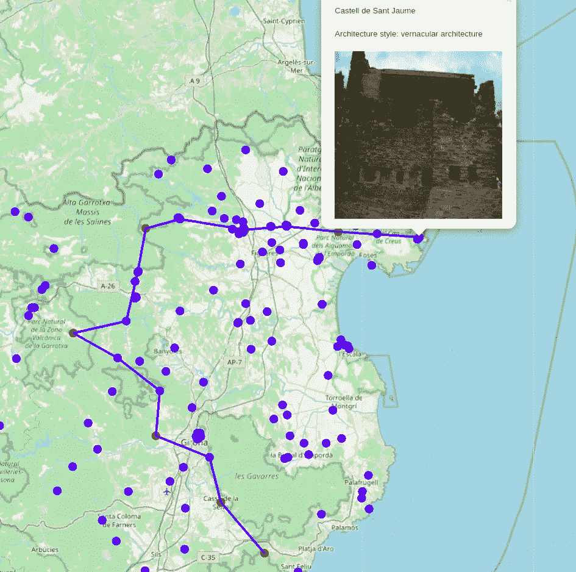

红色标记是选定的纪念碑，蓝色标记是沿途可选的停靠点。

## 结论

我们已经用一些真实世界的用例展示了 Neo4j 图形数据科学库中可用的大多数寻路算法。这个系列剩下的唯一难题是完成旅行推荐应用程序。我计划在本系列的第三部分展示这个应用程序。在那之前，我鼓励你尝试各种 GDS 库算法，或者尝试在一个 [Neo4j 沙盒实例](https://neo4j.com/sandbox/)上重现这个系列。如果您有任何进一步的问题，在 [Neo4j 社区网站](http://community.neo4j.com)上有一群 Neo4j 专家随时可以帮助您。

和往常一样，代码可以在 [GitHub](https://github.com/tomasonjo/blogs/blob/master/Traveling_tourist/Part%202%20-%20Exploring%20Pathfinding%20Graph%20Algorithms.ipynb) 上获得。