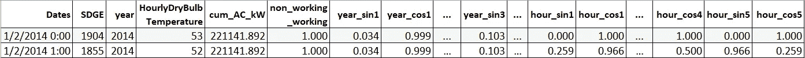
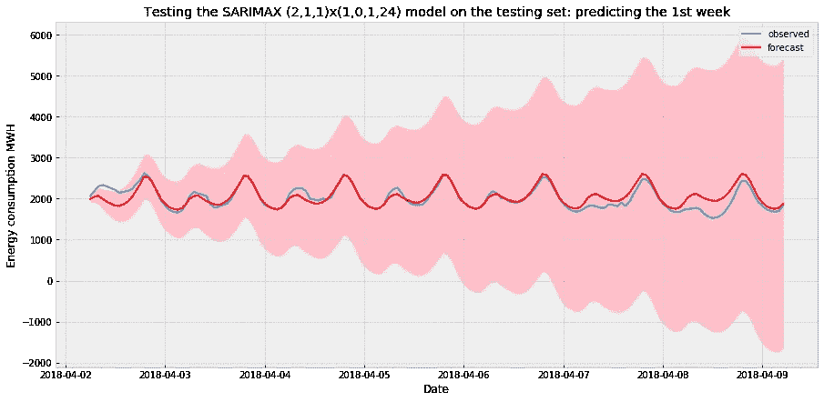

# 圣地亚哥每小时能耗预测—ⅱ

> 原文：<https://towardsdatascience.com/part-2-time-series-analysis-predicting-hourly-energy-consumption-of-san-diego-ii-f09665796c9?source=collection_archive---------8----------------------->

## 时间序列基础&使用傅立叶级数处理多重季节性。使用 ARIMA(X)与线性回归、随机森林、XGBoost 和 FBProphet+XGB 进行预测。


卢卡斯·戴维斯在 [Unsplash](https://unsplash.com?utm_source=medium&utm_medium=referral) 上的照片

[这篇文章的第 1 部分](https://medium.com/@Pratha_P/part-1-time-series-analysis-predicting-hourly-energy-consumption-of-san-diego-short-term-long-3a1dd1a589c9)讲述了能源(电力)消耗的基础知识，如何导入、重采样和合并从不同来源和 EDA 收集的数据集。从 San Deigo 的能源消耗数据以及温度和太阳能电池板安装数据中也提取了一些推论。

[](/part-1-time-series-analysis-predicting-hourly-energy-consumption-of-san-diego-short-term-long-3a1dd1a589c9) [## 预测圣地亚哥的每小时能源消耗(短期和长期预测)— I

### 在第 1 部分中，我们将介绍从不同来源导入和合并数据集、重采样、数据清理、EDA 和…

towardsdatascience.com](/part-1-time-series-analysis-predicting-hourly-energy-consumption-of-san-diego-short-term-long-3a1dd1a589c9) 

在这篇文章中，我将探讨一些时间序列模型，如持续预测(作为基线)，ARIMA 和 FB 先知；然后扩展我的方法，包括线性回归、随机森林、XGBoost 和一个集合模型，看看这些线性和非线性方法是否能准确地模拟我们的时间序列。

nbviewer 上 Jupyter 笔记本的链接:
1。[数据导入和 EDA](https://nbviewer.jupyter.org/github/pratha19/Springboard_capstone_project_1/blob/master/SDGE_energy_EDA.ipynb#4) (包含在第 1 部分中)
2。[构建 ML 模型和预测](https://nbviewer.jupyter.org/github/pratha19/Springboard_capstone_project_1/blob/master/SDGE_energy_ML.ipynb#8)(在本文中讨论)

如果你想要一个非常详细的时间序列数据处理的解释，建模和有效地可视化时间序列数据，那么请参阅上面列出的第二个笔记本。说了这么多，我还是会尽量涵盖本帖的重要话题。

整个项目的 Github 链接:[小时 _ 能耗 _ 预测](https://github.com/pratha19/Hourly_Energy_Consumption_Prediction)。

# 能耗数据

以下是上一篇文章中的数据和一些新增功能:

```
#Import the 5 years of hourly energy consumption data previously #cleaned, explored, and stored as 'hourly1418_energy_temp_PV.csv' in # Part 1sdge = pd.read_csv('hourly1418_energy_temp_PV.csv', index_col = 'Dates', parse_dates=['Dates', 'Date'])
```


用于预测的数据

*   *SDGE:我们的目标变量，圣地亚哥的每小时能耗(MWh )(也是每小时负荷或需求)*
*   *非工作日:如果当天是周末或假日，则为 0(二进制)*
*   *每小时干球温度:在圣地亚哥机场测量的干球温度，单位为华氏度*
*   *cum_AC_kW:客户现场太阳能电池板的累计安装容量(直到索引栏中给出的日期),单位为 kW*


圣地亚哥能源消耗时间序列(y 轴代表每小时的能源消耗，单位为兆瓦时)。有关交互式 Plotly 图和查看 CAISO 内所有公用设施的能耗图，请参见上面列出的 EDA 和 ML 笔记本。

从前面第 1 部分的分析中观察到的一些情况:

*   *43824 小时(行)的数据(2014-2018 年 5 年)*
*   *SDGE:最小值:1437.08，平均值:2364.92，中间值:2298.0，最大值:4867.0*
*   *时间序列有多种季节模式——每天、每周和每年。*
*   *略有下降趋势，与太阳能装机容量成反比*
*   *能耗与温度高度相关。*

*我使用了从 2014 年 1 月 1 日到 2018 年 3 月 31 日的时间序列作为我的训练数据。并预测了 2018 年 4 月 1 日至 12 月 31 日的每小时能耗值(整个数据的约 15%)。*

# 最终目标

> 该项目的最终目标是:“电力公司可以利用开发的预测模型来有效地规划其发电运营，并通过适当的供应平衡需求。有效的预测对于电力公司规划其日常运营、满足其客户的能源需求以及避免任何过量发电非常有用。"

***基本上，我们希望将 ML 模型拟合到我们的每小时能源消耗时间序列中，并使用它来预测圣地亚哥未来的能源消耗。***

**预测窗口** 在任何时间序列问题中，预先定义预测的窗口是非常重要的。在这里，我测试了未来 1 小时、1 周和 8 个月的模型。

**使用的误差指标** 我已经为训练集和测试集的每个模型计算了 *R2 得分、MAE、RMSE 和 MAPE* 。在这 4 个指标中，[***MAPE***](https://en.wikipedia.org/wiki/Mean_absolute_percentage_error)将被选中，选出最佳型号。MAPE 帮助我们理解绝对值的%误差，并且对时间序列的绝对量级漠不关心。

**假设** 

*   未来的太阳能电池板安装和温度数据对我们来说很容易获得，我们不需要为它们运行单独的预测(我希望！).在现实世界中，我们需要使用这些独立变量的预测值(或者至少使用温度的平均期望值和基于过去数据的估计未来太阳能安装量)。但是为了简单起见，我在这个项目中使用了这些变量的实际观察值。

*事不宜迟，让我们把精力集中在时间序列预测问题上。*

# 那么，时间序列有什么特别之处呢

时间序列是按时间顺序进行的一系列观察。任何时间序列数据都有以下组成部分: [ref link](https://machinelearningmastery.com/time-series-forecasting/)

*   **级别:**如果是直线，则为系列的基线值。
*   **趋势:**系列随时间变化的可选且通常线性增加或减少的行为。
*   **季节性:**行为随时间的可选重复模式或周期。
*   **噪声:**模型无法解释的观测值的可选可变性。

大多数时间序列的另一个重要特征是，时间上接近的观测值往往是相关的(序列相关)。这种特征也被称为自相关，正如我们将在后面看到的，它构成了自回归综合移动平均( [ARIMA](https://www.machinelearningplus.com/time-series/arima-model-time-series-forecasting-python/#:~:text=ARIMA%2C%20short%20for%20'Auto%20Regressive,used%20to%20forecast%20future%20values.) )等传统时间序列建模技术的一个重要方面。

*   **平稳性:**当均值、方差和自相关性随时间恒定时，时间序列是平稳的，并且没有季节性或周期性模式。在使用任何基于线性回归的模型如 ARIMA(基于 Y 滞后值的回归)之前，使时间序列平稳是非常重要的。一个时间序列通常是平稳的，方法是将该序列与其自身进行差分。关于平稳性的两篇好文章— [1](https://machinelearningmastery.com/remove-trends-seasonality-difference-transform-python/#:~:text=Making%20Series%20Data%20Stationary&text=Should%20you%20make%20your%20time,train%20models%20on%20the%20residuals.) 、 [2](https://www.analyticsvidhya.com/blog/2018/09/non-stationary-time-series-python/) 。

由于以上所有的特点，时间序列建模涉及到的方法与常规的 ML 问题略有不同。[这里的](https://www.datascience.com/blog/time-series-forecasting-machine-learning-differences)是解释主要区别的一个很好的链接。

[这里的](https://github.com/Yorko/mlcourse.ai/blob/master/jupyter_english/topic09_time_series/topic9_part1_time_series_python.ipynb)是深入研究时间序列预测建模技术的另一个好资源。

*   **时间序列交叉验证:(**[**Ref**](https://github.com/Yorko/mlcourse.ai/blob/master/jupyter_english/topic09_time_series/topic9_part1_time_series_python.ipynb)**)**
    时间序列的交叉验证有点不同，因为人们不能在保留时间结构的同时随机混合一个文件夹中的值。***随着随机化的进行，观测值之间的所有时间依赖关系都将丢失。这就是为什么我们必须在优化模型参数时使用更复杂的方法，例如“滚动交叉验证*”。这个想法相当简单——我们从开始直到某个 *t* 的一小段时间序列上训练我们的模型，对下一个 *t+n* 步骤进行预测，并计算误差。然后，我们将我们的训练样本扩展到 *t+n* 值，从 *t+n* 直到*t+2∫n*进行预测，并继续移动我们的时间序列测试段，直到我们遇到最后一个可用的观测值。这可以使用`*sklearn.model_selection's*` `TimeSeriesSplit`模块来建立。我们将使用这种技术来计算验证集误差。**


来源: [Yorko/mlcourse.ai](https://github.com/Yorko/mlcourse.ai/blob/master/jupyter_english/topic09_time_series/topic9_part1_time_series_python.ipynb)

# 比较我们的模型的基线模型

*   **短期提前一小时预测**

```
**""" Error metrics for hour ahead forecasts when simply repeating last hour's values """** ***#* error_metrics(predicted_values, true_values) is a function that I *#* built to calculate the errors for a given model's predictions**_ = error_metrics(sdge_lin.loc[X_test.index.shift(-1, freq='H'), 'SDGE'], y_test)>> RMSE or Root mean squared error: 122.27
>> Variance score: 0.94
>> Mean Absolute Error: 99.23
>> Mean Absolute Percentage Error: 4.21 %
```

*   **未来约 8 个月的长期预测**

```
**""" Error metrics on months ahead forecast when simply repeating last year's values """*****# the data is hourly and one year = 8760 hours***_ = error_metrics(sdge_lin.loc[X_test.index.shift(-8760, freq='H'), 'SDGE'], y_test)>> RMSE or Root mean squared error: 330.74
>> Variance score: 0.55
>> Mean Absolute Error: 224.89
>> Mean Absolute Percentage Error: 9.23 %
```


基准预测，其中能源消耗的预测值与去年相应的日、小时和月的值相同。

*在能源预测领域，获得正确的每日最大需求更为重要，因为这可以决定电厂运营商是否需要启动调峰(主要是燃气)电厂。所以，也要计算误差。*

```
*"""****Resampling both the y_test and predictions at a 24 hours period and using the max as the aggregate function****"""*_ = error_metrics(sdge_lin.loc[X_test.index.shift(-8760, freq='H'), 'SDGE'].resample('24h').max(), y_test.resample('24h').max())>> RMSE or Root mean squared error: 389.37
>> Variance score: 0.22
>> Mean Absolute Error: 264.44
>> Mean Absolute Percentage Error: 8.60 %
```

> “我们现在已经准备好建立预测未来的模型了。”

*注:通常用于时间序列预测的一些经典时间序列模型是自回归综合移动平均(ARIMA)、带外生回归量的季节自回归综合移动平均(SARIMAX)、带外生回归量的向量自回归移动平均(VARMAX)、简单指数平滑(SES)、霍尔特温特指数平滑(HWES)等等。你可以在* [*这篇*](https://machinelearningmastery.com/time-series-forecasting-methods-in-python-cheat-sheet/#:~:text=This%20cheat%20sheet%20demonstrates%2011,Autoregression%20(AR)&text=Seasonal%20Autoregressive%20Integrated%20Moving%2DAverage,Average%20with%20Exogenous%20Regressors%20(SARIMAX)) *中找到更多关于各款车型的细节。在本帖中，我们将只尝试 SARIMAX，然后尝试传统的线性和非线性 ML 模型。*

# 带滞后的简单回归模型(提前一小时预测)

> *那么，我们为什么还要考虑使用传统的 ML 回归模型进行时间序列预测呢？*

*   因为，在某些情况下，如销售预测或能源预测， *y* 变量强烈依赖于外部因素，如能源消耗情况下的*温度*。因此，与时间序列预测相比，它更像是一个回归问题，而且监督 ML 模型可以帮助我们在这种严重依赖外生变量的数据中找到更好的模式。
*   像 SARIMAX 这样的传统时间序列模型无法处理多重季节性。它们还需要大量历史数据才能准确预测，并且在进行超参数调整时更加耗时。
*   传统 ML 回归模型用于销售预测的用例请参见[【3】](https://www.mdpi.com/2306-5729/4/1/15/htm)。
*   此外，这篇[【4】](http://cs229.stanford.edu/proj2011/CarsonChenGlover-ElectricityDemandPredictionInCalifornia.pdf)论文证明了使用简单的基于回归的 ML 模型来预测电力需求是可能的，并且误差与更复杂的模型相当。

能源消耗值也可以预期依赖于其先前的**滞后值**，因为一个地区的能源消耗在接下来的几个小时内不应该有太大的变化，除非发生任何意外或不幸的事件。因此，我们将添加能耗的滞后值作为 *X* 参数，并检查我们是否可以使用过去的值进行更好的预测(除了我们已经添加的变量)。

```
***""" Adding max 24 lags; lag1 is the value of the energy consumption in the previous hour, lag2 is the value of energy consumption*
*2 hours before the current value and so on.****"""*

***# Creating the lag variables*****for** i **in** range(24):
    sdge1_lin['lag'+str(i+1)] = sdge1_lin['SDGE'].shift(i+1)***""" Since the first 24 values won't have any 24th lag, they will be NaN. So dropping the NaNs """***
lag_sdge = sdge1_lin.dropna()
```


请注意，我将小时划分为时间变量，将月份划分为季节，将工作日划分为非工作日或工作日。

## 有滞后的弹性净回归


对有滞后的数据进行拟合时，弹性网络回归模型的系数图。我们可以看到前一个小时的值有多重要。

```
plot_predvstrue_reg(elastic_net_lag.predict(X_test_lag), y_test_lag)
```


观察值与预测图


使用弹性网和随机森林回归分析观察到的与预测的能源需求值

```
**Error metrics for model Elastic net with all lags**
>> RMSE or Root mean squared error: 50.75
>> Variance score: 0.99
>> Mean Absolute Error: 37.36
>> Mean Absolute Percentage Error: 1.58 %
```

我们可以从图表和误差中看到，与基线相比，弹性网络模型在所有误差指标上都表现得更好。

*   RMSE 仅为 50.75 兆瓦，而基准型号为 122 兆瓦。
*   MAPE 也从 4.21%降至 1.58%。
*   因此，这个模型表现非常好，但它有一个限制—我们只能用它来预测下一个小时的值。即它能准确预测的最大时间窗口是 1 小时。因此，如果这是应用情况，那么应该使用具有先前滞后值的弹性网络模型。

# 长期预测:用傅立叶级数处理多重季节性

*   如前所述，像 SARIMAX 这样的传统时间序列模型无法处理多重季节性。
*   有两种有趣的时间序列预测方法，称为 BATS 和 TBATS，能够模拟具有多个季节的时间序列，请查看[链接](https://medium.com/intive-developers/forecasting-time-series-with-multiple-seasonalities-using-tbats-in-python-398a00ac0e8a)。但是，它们的计算速度很慢，而使用傅立叶级数处理多个季节性的 SARIMAX 模型的性能与 TBATS 模型一样好。

> 这种特征转换背后的主要驱动点是，我们不能只将 0，1，2，…22，23 小时输入到模型中，因为我们需要让模型明白，0 和 23 小时实际上与 0 小时和 1 小时一样接近。工作日和年份也一样。

**添加小时、年和周周期的傅立叶循环序列**


m & n 可以是离散的。基于对训练集的一些试验和测试来选择 m=n=5。每日-> T = 24，每年-> T = 365.25，每周-> T= 7

```
***""" as said above the k terms for each yearly, weekly and daily seasonalities could be chosen by optimizing on the AIC values..*
*but after some research on energy consumption time series k= 5 was chosen for each seasonality """***add_fourier_terms(lag_sdge, year_k= 5, week_k=5 , day_k=5)***# Visualizing the new variables on week seasonality***_ = (1-lag_sdge.loc['01-01-2014':'01-09-2014', [col **for** col **in** lag_sdge **if** col.startswith('week')]]).sum(axis = 1).plot()
```


***可视化新傅立叶变量对周的季节性。***

*从上面的图中，我们可以看到离散的工作日值是如何转换成更连续的变量模式的。每小时和每年的变量也是如此。*

```
sdgecyc.head(2)
```



将日、周和年变量作为傅立叶级数添加的数据

## **上述傅立叶级数上的 SARIMAX 模型增加了数据集**

*   用先前时间的相同序列的值计算的时间序列观测值的相关性被称为序列相关，或自相关(ACF)。它用于确定 ARIMA(p，d，q)模型的移动平均(MA 或 q)项。
*   偏自相关(PACF)是时间序列中的观测值与先前时间步长的观测值之间关系的总结，其中插入的观测值之间的关系已被移除。它用于确定 ARIMA(p，d，q)模型的自回归(AR 或 p)项。
*   ARIMA(p，d，q)中的 d 是使时间序列平稳所需的差分次数。
*   SARIMAX 是 ARIMA 的扩展，用于处理季节性项(S)和外生变量(X)。SARIMAX 模型的基本架构由 SARIMAX(p，D，q)x(P，D，Q，s)给出，其中 P，D，Q 如上文所定义，而(P，D，Q，s)分别是 AR 参数、差异、MA 参数和周期的模型的季节性组件。s 是一个整数，表示周期(季节中的周期数)，对于季度数据，通常为 4；对于月度数据，通常为 12。默认情况下没有季节性影响。

*SARIMAX 模型接受许多输入，需要进行一些调整才能选择最佳的模型参数。* `*pmdarima*` *package 的* `*auto_arima*` *模块自动完成这项任务，并通过接受一些输入范围给我们提供最佳模型，类似于 gridsearchcv。*


我们可以从分位数和直方图中看出拟合度很好，但不是很好。右下角的图，也称为 ACF 图，显示残差不自相关。任何自相关都意味着在模型中没有解释的残差中存在某种模式。



测试集上的 SARIMAX 预测仅显示到第一周，因为该模型无法很好地预测此后的情况。

```
**Error metrics for model SARIMAX(2,1,1)x(1,0,1,24) with Fourier terms 1 week ahead forecast on test set**
RMSE or Root mean squared error: 150.46
Variance score: 0.68
Mean Absolute Error: 103.46
Mean Absolute Percentage Error: 5.33 %
```

*   我们看到，第一周的预测非常好，但即使在第一周结束时，预测性能也会下降，置信区间值会变得更大，超出能耗值的范围。因此，SARIMAX 模型无法捕捉长期趋势，但在 1 周预测中表现良好。
*   前面没有使用(dynamic=True)为 SARIMAX 模型计算 1 小时提前预测的误差，因为我们使用滞后变量对 1 小时提前预测使用弹性网络回归得到了极好的结果，并且它比 SARIMAX 拟合速度快得多。

# FB 先知

让我们尝试使用 FBProphet 解决我们的问题。FBProphet 提供了一个分解回归模型，它是可扩展的，并且可以用可解释的参数进行配置。Prophet 将预测问题框定为曲线拟合练习，而不是明确地查看时间序列内每个观察值的基于时间的相关性。与 SARIMAX 类似，我们也可以向模型中添加额外的回归项，如温度数据。(参考[链接 1](https://www.digitalocean.com/community/tutorials/a-guide-to-time-series-forecasting-with-prophet-in-python-3) 、[链接 2](https://dius.com.au/2018/09/04/time-series-forecasting-with-fbprophet/) 、[链接 3](/forecasting-with-prophet-d50bbfe95f91) )

其核心是，Prophet 是一个附加模型，包含以下组件:

> y(t)=g(t)+s(t)+h(t)+ϵₜy(t)=g(t)+s(t)+h(t)+ϵₜ

***【g(t)***模型趋势
**s(t)** 模型季节性与傅立叶级数
**h(t)** 模型节假日或大型活动的影响
**ϵₜ** 代表不可约的误差项

*   *在使用 Prophet 时，仅使用“SDGE”、“HourlyDryBulbTemperature”、“累计 _AC_kW”、“非工作 _ 工作”列，因为* ***Prophet 与 SARIMAX 不同，可以很好地处理多个季节。*** *所以，我们不需要在傅立叶项中单独传递。*
*   *FB Prophet 可以通过假日功能传递，但是由于我们已经在‘non _ working _ working’列中捕获了假日和周末，所以我们不会将单独的假日列表传递给 Prophet。*


FB Prophet 对训练集和测试集的预测


我们数据的 FB Prophet 分解模型。它似乎很好地模拟了我们数据的多重季节性——每天、每周和每年。在最底部的图中，额外的回归变量附加项包括温度、non_working_working 和 cum_AC_kW 变量。我们以波动的形式看到温度和工作日的影响，而累计 AC kW 的总体影响是能源的下降趋势(正如预期的那样，因为客户站点安装的光伏越多，对电网的需求就越低)。如果我们将这一趋势与第一行图的整体趋势相结合，那么整体趋势会下降。

```
**Error metrics for FB Prophet w/ auto seasonality 1 week ahead**
RMSE or Root mean squared error: 203.21
Variance score: 0.76
Mean Absolute Error: 164.76
Mean Absolute Percentage Error: 7.66 %**Error metrics for FB Prophet w/ auto seasonality 8 months ahead**
RMSE or Root mean squared error: 262.74
Variance score: 0.72
Mean Absolute Error: 201.06
Mean Absolute Percentage Error: 8.55 %
```

***因此，尽管该模型的误差高于其他模型，但无论是一周预测还是数月预测，看起来 FB Prophet 已经很好地捕捉到了我们数据的多重季节性和趋势。***

# 使用傅立叶项的回归模型(长期预测)

## **随机森林和弹性净回归(长期预测)**

这里我只提一下随机森林的错误。弹性净回归在长期预测中表现不佳。

```
**Error metrics for Tuned Random forest with fourier terms**
RMSE or Root mean squared error: 196.99
Variance score: 0.84
Mean Absolute Error: 137.41
Mean Absolute Percentage Error: 5.73 %
```

*   *添加傅立叶项后，随机森林表现良好。它很好地捕捉了多重季节性，并且给出了仅 5.76%的 MAPE，而基线 MAPE 为 9.23%。*
*   *弹性网络回归没有随机森林那样捕捉到更高的能耗值。*
*   *Random forest 更好的性能为在数据上尝试基于树的 XGBoost 模型铺平了道路。*

## **带傅立叶项的 XGBoost(长期预测)**

*   XGBoost(极限梯度增强)属于增强算法家族，其核心使用梯度增强(GBM)框架。它是一个优化的分布式梯度增强库。
*   众所周知，XGBoost 提供了比其他机器学习算法更好的解决方案。它通常不用于时间序列，特别是如果使用的基础是树木，因为很难捕捉树木的趋势，但由于我们的数据没有非常显著的趋势，而且由于它具有多个季节性(使用傅立叶级数建模)并显著依赖于外部变量，我们可以尝试 XGboost，看看它在能源消耗的时间序列数据上的表现如何。

```
**Error metrics for Tuned XGBoost with Fourier terms**
RMSE or Root mean squared error: 172.21
Variance score: 0.88
Mean Absolute Error: 121.19
Mean Absolute Percentage Error: 5.08 %
```


XGBoost 预测值和真实观察值一起绘制


XGBoost 预测值与真实观察值


XG 增强参数重要性。正如所料，温度是最重要的预测因素。

*   整个模型在大约 2 分钟内被调整和适应。
*   ***它似乎已经很好地学习了数据模式和多个季节。与 9.23 %的基线相比，约 8 个月的预测误差仅为 5.08%。此外，与基线的 55%相比，R2 拟合度为 88%。***

# 集合模型(XGBoost + FB Prophet 趋势，长期预测)

> *为什么要考虑这个？*

*   如前所述，要对时间序列数据建模，它需要是静态的。因此，理想的情况是取消数据趋势，然后将其输入 ML 模型，然后将趋势添加到预测结果中。尽管如此，由于 2014 年至 2018 年的能源消耗数据具有非常弱的趋势，并且傅立叶项很好地处理了多个季节性，因此在没有消除趋势的情况下获得了上述良好结果。
*   或者，可以使用 FB Prophet 对总体数据趋势以及 *cum_AC_kW* 的影响(即迄今为止的累计光伏安装量)进行建模，然后与 XGBoost 的预测进行合并。任何像 XGBoost 这样的基于树的回归模型都不能轻松地处理像 *cum_AC_kW* 这样的 *X* 变量，因为它是一个不断增长的变量，并且测试数据总是具有模型在训练集中看不到的更高的量值。
*   我已经从 *FB Prophet* 模型中提取了趋势和 *cum_AC_kW* 对能源的影响，并从我们的主数据框架中减去了这两个分量和所有傅立叶项。然后，这种消除趋势的能耗数据被传递到 *XGBoost* 模型，并将 *XGBoost* 预测结果添加回总趋势，以获得最终预测。

下面是来自我们之前训练的 FBProphet 模型的 cum_AC_kw 的趋势和效果。


来自 FBProphet 的趋势信息

我们将采用以下架构来创建我们的新模型:


XgBoost + FBProphet 趋势


XGBoost + FBProphet 预测值与实际值的比较


XGBoost + FBProphet 预测值与实际值的比较

```
**Error metrics for XGBoost with detrend Prophet, Fourier terms**
RMSE or Root mean squared error: 212.97
Variance score: 0.81
Mean Absolute Error: 170.77
Mean Absolute Percentage Error: 7.30 %
```

*   *由于 FB Prophet 高估了趋势和 cum_AC_kW 对能耗的影响，特别是在时间尺度的末尾，组合模型的表现比单独的 XGBoost 差，从上面 forecast . trend+forecast . cum _ AC _ kW 的图中可以看出，该图显示了末尾的突然下降。这似乎会导致能源消耗预测不足，并影响总体结果。但是，与基线相比，该模型的表现仍然很好，由于上面讨论的原因，就稳定性而言，该模型是比单独使用 XGboost 更好的时间序列模型。*

# 结论

*   尝试了不同的模型来预测加利福尼亚州圣地亚哥煤气和电力(SDGE)公用事业区每小时的能源需求，以兆瓦为单位。
*   能源消耗高度依赖于外部温度，并具有强烈的多重季节性——每天、每周和每年。该地区越来越多的 PV(光伏)装置( *cum_AC_kW* )似乎带来了能源消耗的下降趋势，因为客户设施中更多的可再生能源意味着电力公司的负荷减少。请注意，可能有其他因素导致这种下降趋势，如客户设施中的储能装置、家用和商用设备的电力效率提高、人们越来越意识到它们的使用(道德上或通过公用事业激励)等。
*   捕捉趋势的最佳方式是让模型在很长一段时间内学习趋势，这是上述所有因素的组合，也许更多。季节性是预测一个地区能源消耗的重要组成部分，因此正确预测这一部分对于提高模型的性能也至关重要(这是通过使用傅立叶级数实现的)。
*   测试集上提前一小时预测的误差项


测试集上的误差项短期提前一小时预测

*   测试集上未来几个月预测的误差项


*   具有傅立叶项的 XGBoost 模型表现非常好，预测了未来 8 个月的预测窗口。对于具有多个季节性的每小时数据，这是一个相当令人印象深刻的结果。
*   对于长期预测，大多数模型的表现优于基线持续性模型，最佳模型( *XGBoost* )给出了 5.08%的 MAPE，而测试集的基线误差为 9.23%。RMSE、R2 和 MAE 值也大大低于基线模型。例如，RMSE 与基线模型的差异几乎是 160 MW，这是非常显著的。为了帮助人们更好地理解这一点，燃气联合循环电厂的平均规模是[500 兆瓦](https://www.eia.gov/todayinenergy/detail.php?id=38312#:~:text=Since%202014%2C%20the%20average%20size,of%20820%20MW%20in%202017.)。
*   FB Prophet 在识别数据的趋势和多重季节性方面做得非常好。它可以与 XGBoost 配合使用，从而获得更可靠的长期预测。

**谢谢！如果您有任何问题或想要提出任何改进或更正的建议，请随时联系我。**

节约能源，拯救地球。