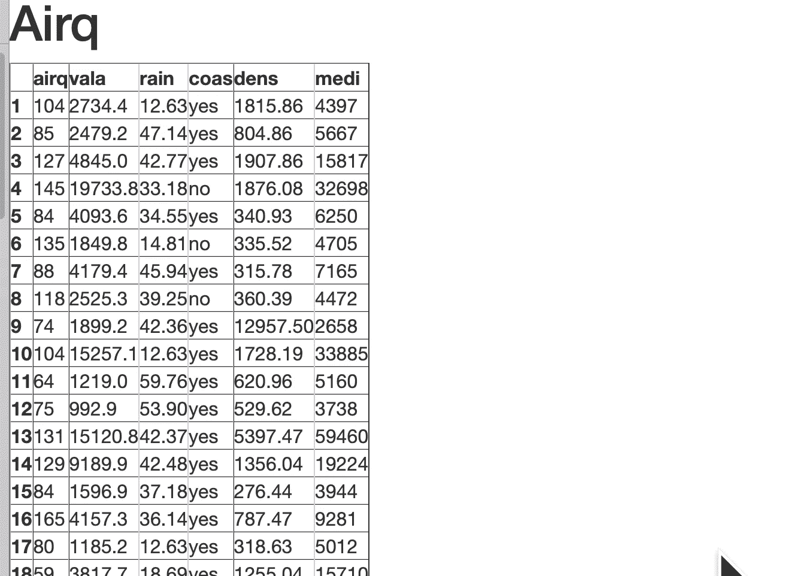

# Streamlit 会导致 Flask 灭绝吗？

> 原文：<https://towardsdatascience.com/part-2-will-streamlit-cause-the-extinction-of-flask-395d282296ed?source=collection_archive---------22----------------------->

## 可能对于机器学习(ML)和深度学习(DL)来说。对于其他全栈应用，大概不会！

我们还没有遇到一个基于 ML 或 DL 的 [**Flask**](https://www.fullstackpython.com/flask.html) 的微服务不能被重构为[**Streamlit**](https://www.streamlit.io/)**服务。**

**挑战在于保持**精简**微服务的规模，只需替换 2 到 3 个基于 **Flask** 的微服务。**

****

**烧瓶熄灭？**

**我曾在 20 多家公司工作或咨询过，我很幸运能在两家大公司工作，这两家公司非常有远见，不断改进，并把创新作为公司战略的一个组成部分。**

**我为一家公司工作，该公司的管理层欣赏新的开源软件包的快速发展，并让我评估它们是否可能被采用。**

**目前，我正在将 **Flask** 微服务重构为 **Streamlit** 微服务。这些重构的原型，如果被证明在维护费用上更好(并通过我们的测试金字塔)，就允许投入生产。**

**通过更换工作**烧瓶**微服，我们违反了 ***【不破，不修】*** 教义。**

**我认为用 **Streamlit** 到 ***代替未破的******非常具有前瞻性和创新性(不过话说回来，我也很偏颇)。时间会证明这是否是一种进步。*****

# *****较早的帖子被重新访问*****

*****在早先的帖子中，我用简单的 *hello World 比较了**烧瓶**和**流线**！*举例。我们发现 **Flask** 需要 7 行代码，而 **Streamlit** 需要两行代码。*****

*****[](https://medium.com/swlh/part-1-will-streamlit-kill-off-flask-5ecd75f879c8) [## Streamlit 会杀死 Flask 吗？

### 好吧，标题有点戏剧性。怎么样… Streamlit 将取代许多基于烧瓶的应用程序。

medium.com](https://medium.com/swlh/part-1-will-streamlit-kill-off-flask-5ecd75f879c8) 

我将两个微服务都放在一个 **Docker** 容器中，其环境是 **Python 3.7** 。我使用 **Docker** 以便我们可以将**烧瓶**与 **Streamlit、**进行比较，并且我的示例可以在您的平台**上轻松复制。**

[](https://medium.com/rate-engineering/using-docker-containers-as-development-machines-4de8199fc662) [## 使用 Docker 容器作为开发机器

### 我们是如何做到的，我们学到了什么

medium.com](https://medium.com/rate-engineering/using-docker-containers-as-development-machines-4de8199fc662) 

我们发现为**烧瓶**或 **Streamlit 创建 **Docker** 容器的努力没有差别。**任何一个都可以作为本地 web 服务或您的云提供商的生产微服务。

注意:在本文中，我没有使用生产服务器，比如 [**Heroku**](https://www.heroku.com/) **。**

# 概述

我们将一起旅行，创建一个比 *Hello-world 更复杂的微服务！。* **Flask** 和 **Streamlit** 将比较具有输入、 **pandas** dataframe 显示和绘图的 web-app 实现。

我们将再次使用 **Docker** ，以便我们可以将 **Flask** 与 **Streamlit、**进行比较，并且可以在您的平台上轻松复制示例。

# 引入烧瓶

当建立网站时，你应该有一个健壮的框架来处理所有类型的功能。在 **Python** 全栈软件工程师中最受欢迎的微服务框架之一是 **Flask** 。

烧瓶的一些参考资料包括:

[](https://medium.com/fintechexplained/flask-host-your-python-machine-learning-model-on-web-b598151886d) [## Flask —在 Web 上托管您的 Python 机器学习模型

### 了解如何使用 Python Flask 将您的机器学习模型转化为业务

medium.com](https://medium.com/fintechexplained/flask-host-your-python-machine-learning-model-on-web-b598151886d) 

> 可以把 Flask 想象成一个软件包的集合，它可以帮助你轻松地创建一个 web 应用程序。这些组件可以被组装和进一步扩展。

[](https://blog.miguelgrinberg.com/post/the-flask-mega-tutorial-part-i-hello-world-legacy) [## 烧瓶大型教程，第一部分:你好，世界！

### 这是我将记录我用 Python 编写 web 应用程序的经历的系列文章的第一篇…

blog.miguelgrinberg.com](https://blog.miguelgrinberg.com/post/the-flask-mega-tutorial-part-i-hello-world-legacy) [](https://scotch.io/bar-talk/processing-incoming-request-data-in-flask) [## 处理 Flask 中的传入请求数据

### 在任何 web 应用程序中，您都必须处理来自用户的请求数据。Flask 和任何其他 web 框架一样，允许…

scotch.io](https://scotch.io/bar-talk/processing-incoming-request-data-in-flask) 

# 介绍 Streamlit

[**Streamlit**](https://www.streamlit.io/) 是一个开源的 **Python** 框架，使我们能够开发和部署基于 web 的应用程序。

[](https://www.streamlit.io) [## Streamlit -构建定制 ML 工具的最快方法。

### Streamlit 是一个面向机器学习和数据科学团队的开源应用框架。在…中创建漂亮的数据应用程序

www.streamlit.io](https://www.streamlit.io) [](/how-to-write-web-apps-using-simple-python-for-data-scientists-a227a1a01582) [## 如何为数据科学家使用简单的 Python 编写 Web 应用？

### 无需了解任何 web 框架，即可轻松将您的数据科学项目转换为酷炫的应用程序

towardsdatascience.com](/how-to-write-web-apps-using-simple-python-for-data-scientists-a227a1a01582) 

> Web 框架很难学。为了一些看似简单的事情，我仍然会对所有的 HTML、CSS 和 Javascript 感到困惑。

在本文中，我们会继续发现，我们需要成为一名称职的 **Python** 全栈 **Flask** 软件工程师。我们需要知道如何使用 **Javascript** ， **HTML，**[**wt forms**](https://wtforms.readthedocs.io/en/stable/)**，**和/或[**Bootstrap**](https://pythonhosted.org/Flask-Bootstrap/)**和/或 **Flask-RESTful** 和/或(非常非常多的打包机会)。**

**我发现烧瓶是一个健壮的框架。所有的扩展使它更加强大。更重要的是，它通过提供适合您的包扩展来适应您的编程风格。**

**一个好的全栈**烧瓶**程序员会有多年的经验。然而，一个优秀的 **Streamlit** 黑客(就像机器学习科学家)需要数周的经验来设计、开发和部署一个生产就绪的基于网络的仪表板。**

**如果我们是**Python**Streamlit 机器学习或者深度学习科学家，我们做*不是*需要知道 **Javascript** 、 **HTML** 、 **CSS 等..、**和堆栈中不同的 **POST/GET URL** 包。相反，我们的软件栈由 **Streamlit (** 和可能是 **Docker)** 组成。就是这样！**

**[](https://medium.com/better-programming/2020-001-full-stack-pronounced-dead-355d7f78e733) [## 全栈宣告死亡

### 欢迎 2020 堆栈

medium.com](https://medium.com/better-programming/2020-001-full-stack-pronounced-dead-355d7f78e733) 

> 结果是专业化。前端开发人员处理 HTML、CSS 和 JavaScript。后端开发人员处理主机操作系统、HTTP 服务器和数据库。精通这两种语言的开发人员被称为全栈开发人员。
> 
> 专业化是一件好事。直到它不是。一方面，这意味着团队可以并行工作以缩短开发周期。另一方面，这意味着我们必须额外努力沟通初始需求和变更单规范，否则我们将冒着失去并行工作成果的风险。
> 
> 因此，拥有一个全栈开发团队，没有可区分的前端/后端组，似乎是一个好主意。

# 更快的满足感(再次)

在您选择的目录中完成以下操作:

```
[git clone https://github.com/bcottman/webApps.git](https://github.com/bcottman/webApps.git)
```

在另一篇博客中，我们创建了包含所有代码的`/webApps`目录树。在不同于上次的不同父目录中使用`git clone`，以获得更新(或者使用相同的父目录并覆盖您对原始代码*所做的任何更改)。或者…我将让您决定如何管理您的文件系统*。

## 1.输入和数据帧显示的 Flask 实现

对于我们的 Flask 微服务的第一个实现，我将显示一个熊猫数据帧。

来自浏览器 URL 的`dataset`参数被返回并分配给运行在服务器上的`dataviewer1.py`中的`dataset_name`。这是服务器代码中非常基本的变量设置(即`[http://localhost:5000/show?dataset=Airq](http://localhost:5000/show?dataset=Airq).)` [)。](http://localhost:5000/show?dataset=Airq).)

```
import pandas as pd
from pydataset import datafrom flask import Flaskapp = Flask(__name__)
app.debug = True@app.route('/show', methods=['GET'])
def dataViewer_1():
    dataset_name = request.args.get('dataset')
    if dataset_name == None:
        dataset_name = 'Aids2'  #default if no arg passed if type(data(dataset_name)) != pd.core.frame.DataFrame:
        return('Bad dataset name:{}'.format(dataset_name)) return data(dataset_name).to_html(header="true", table_id="table")if __name__ == "__main__":
    app.run()################# requirements.txt file
Flask>=1.1.1
pandas 
pydataset
```

输出[=>]:


使用 df.to_html 部分显示 Airq 数据集

## 2.用 HTML 实现熊猫数据帧显示

感谢[https://stack overflow . com/questions/22180993/pandas-data frame-display-on-a-网页/22233851](https://stackoverflow.com/questions/22180993/pandas-dataframe-display-on-a-webpage/22233851) ，免去了我学习 **HTML** 和 **Bootstrap** (毕竟我是一个没有耐心的 ML 科学家)。 **Bootstrap** 是**烧瓶**提供的大量扩展之一。

```
## dataViewer-2.py
import pandas as pd
from pydataset import data
from flask import Flask, request, render_template
from flask_bootstrap import Bootstrapapp = Flask(__name__)
app.debug = True
Bootstrap(app)@app.route('/show', methods=['GET'])
def dataViewer_2():
    dataset_name = request.args.get('dataset')
    if dataset_name == None:
        dataset_name = 'Aids2' if type(data(dataset_name)) != pd.core.frame.DataFrame:
        return('Bad dataset name:{}'.format(dataset_name)) df = data(dataset_name) return render_template("df.html", name=dataset_name, data=df.to_html())if __name__ == "__main__":
    app.run()### df.html

<h1>{{name}}</h1>
{{data | safe}}
################# requirements.txt file
Flask>=1.1.1
pandas 
pydataset
flask_bootstrapoutput[=>]:
```



使用 HTML 和 bootstrap/base.html 部分显示 Airq 数据集显示

使用我们自己的 HTML 模板，我们可以定制网页布局。

我将留给读者用 **CSS** 或任何你可能使用的 **Flask** 扩展来进一步定制。

## 3.抵御 CSRF 攻击的 Flask 实现

我将使用 **wtform** 包来抵御[跨站请求伪造](http://en.wikipedia.org/wiki/Cross-site_request_forgery) (CSRF)攻击。我们将使用`WTForm app.config['SECRET_KEY'].`您控制台中的命令是:

```
$  python -c 'import os; print(os.urandom(16))'
```

我将生成的密钥放在我的`dataView-3.py`文件的顶部。

```
from flask import Flaskapp = Flask(__name__)
app.debug = True
app.config['SECRET_KEY'] = '\xbfx\x02\xf7\xeao\ro\rp&Q\xa1\xbdV\xd9'#<more code...>
if __name__ == '__main__':
   app.run(debug=True, host='0.0.0.0')
```

我没有在`@app.route` I .结果是:

输出[=>]:

```
Not Found
The requested URL was not found on the server. If you entered the URL manually please check your spelling and try again
```

## 3.将所有这些与 pandas 数据帧图的 Flask 实现放在一起。

```
# !/usr/bin/env python
# -*- coding: utf-8 -*-

__author__ = "Bruce_H_Cottman"
__license__ = "MIT License"

import pandas as pd
from pydataset import data
from flask import Flask, request, render_template, session
from flask_bootstrap import Bootstrap
from bokeh.plotting import Figure
from bokeh.models import ColumnDataSource
from bokeh.embed import components
from bokeh.resources import INLINE
from bokeh.util.string import encode_utf8
from bokeh.palettes import Spectral11

app = Flask(__name__)
app.debug = True
app.config['SECRET_KEY'] = '\xbfx\x02\xf7\xeao\ro\rp&Q\xa1\xbdV\xd9'
Bootstrap(app)

@app.route('/show', methods=['GET'])
def dataViewer():
    dataset_name = request.args.get('dataset')
    if dataset_name == None:
        dataset_name = 'Aids2'

    if type(data(dataset_name)) != pd.core.frame.DataFrame:
        return('Bad dataset name:{}'.format(dataset_name))

    df = data(dataset_name)
    session['dataset_name'] = dataset_name

    return render_template("df.html", name=dataset_name, data=df.to_html())

@app.route('/plot')
def dataViewer_4():

    dataset_name = session['dataset_name']

    if dataset_name == None:
        dataset_name = 'Aids2'

    if type(data(dataset_name)) != pd.core.frame.DataFrame:
        return('Bad dataset name:{}'.format(dataset_name))

    if type(data(dataset_name)) != pd.core.frame.DataFrame:
        return('Bad dataset name:{}'.format(dataset_name))

    # get dframe by name
    df = data(dataset_name)
    # Create a ColumnDataSource object

    bp_df = ColumnDataSource(df)
    # Create  plot as a bokeh.figure object
    plot = Figure(height=400,
                       width=400,
                       title=dataset_name,
                       )

    x_ax = [str(i) for i in range(df.shape[0])]
    palette_ = Spectral11[0:len(df.columns)]

    for n, cname in enumerate(df.columns):
       plot.line(x=x_ax, y=list(df[cname].values)
                 , color=palette_[n]
                 , legend='line')

    # grab the static resources
    js_resources = INLINE.render_js()
    css_resources = INLINE.render_css()

    # render template
    script, div = components(plot)
    html = render_template(
        'index_.html',
        plot_script=script,
        plot_div=div,
        js_resources=js_resources,
        css_resources=css_resources,
    )
    return encode_utf8(html)

if __name__ == "__main__":
    app.run(debug=True, host='0.0.0.0')### df.html

<h1>{{name}}</h1>
{{data | safe}}
################# index_.html
<!doctype html>
<html lang="en">
  <head>
    <meta charset="utf-8">
    <meta http-equiv="content-type" content="text/html; charset=utf-8">
    <title>Embed Demo</title>
    {{ js_resources|indent(4)|safe }}
    {{ css_resources|indent(4)|safe }}
    {{ plot_script|indent(4)|safe }}
  </head>
  <body>
    {{ plot_div|indent(4)|safe }}
  </body>
</html>################# requirements.txt file
Flask>=1.1.1
flask_bootstrap
pandas
bokeh
pydataset
```

输出[=>]:


**散景**数据集 **Airq** 图嵌入**烧瓶**

我使用工具栏中的**散景的**缩放来放大数据集中的线条。我用散景创建很棒的交互式图形，避免直接使用 Javascript

# 简化`dataViewer.py`的实施

在这个`dataViewer.py,`的实现中，我将使用 **Streamlit** 。我真的不需要把这个实现分成几个步骤，因为这个`dataViewer.py`只是 **python** ，一些 **Streamlit** 函数和 **pandas** 包。

```
import streamlit as st
import pandas as pd
from pydataset import datadf_data = data().sort_values('dataset_id').reset_index(drop=True)
st.dataframe(df_data)  #choicesoption = st.selectbox(
    'select a dataset do you like best?', df_data['dataset_id'])dataset = data(option)if isinstance(dataset, (pd.core.frame.DataFrame,   pd.core.series.Series)):
    st.dataframe(dataset)
    st.line_chart(dataset)
```

输出[=>]:


显示和绘制 airq 的简化选择。

**Streamlit** 实现需要引用包的 **Python** 代码的 10 个语句行: **streamlit** 、 **pandas** 和 **pydataset** 。

包 **pydataset** 包含超过 750 个数据集。

在您的实现中，`dataset_ids`(数据集名称)在显示顶部的描述框和下拉选择框中按字母升序排序。

请注意当您单击选择框时，它是如何展开的。

您选择的数据集显示在从上往下数的第三个框中。 **Streamlit** 的一个特点是数据集的呈现是动态的，每一列的值都是升序或降序排序。此外，如果显示框的宽度或高度不足以显示所有的列或行，则它会在水平轴或垂直轴上滚动。

在最后一个框中，我们可以看到数据集的折线图。每行对应于数据集的一个数字列(要素)。

在这个 **Streamlit** 微服务的实际现场实现中(与这里显示的静态截图相反)，您可以水平或垂直拖动来改变水平或垂直比例。您也可以放大和缩小来更改大小。

在 **Streamlit** 的掩护下，在 **Javascript** 、 **HTML** 、 **CSS、JSON、**的网页的选定端口上输出，并进行 web 通信。虽然我已经放弃了一些底层控制，但我已经获得了一个将 **python** 脚本转换成全功能 web 应用程序的强大机制。

在许多方面，我们在这里比较的东西类似于使用第四代高级语言( **Streamlit** )来机器汇编( **Flask、** **Javascript** 、 **HTML** 、 **CSS、JSON、post/get 等)。).**

我将把它作为一个编程练习，让您扩展这个实现，为不同图表的选择提供一个选择框。

# 流线型`dataView.py in Docker Container`

Dockerfile…

```
**FROM** python:3.7
#EXPOSE 8501
**WORKDIR /**dataViewer
**COPY** requirements.txt .**/**requirements.txt
**RUN** pip3 install **-**r requirements.txt
**COPY** . .
**CMD** streamlit run dataViewer.py
```

要构建容器…

```
$ docker build -f Dockerfile -t dataviewer-streamlit:latest ..
```

其中`requirements.txt`是…

```
streamlit
pandas
pydataset
```

要运行容器…

```
$ docker run -p 8501:8501 dataviewer-streamlit &
```

**的**码头**集装箱与`dataViewer.py and HelloWorld.py are` 的**的区别在于`requirements.txt.`中的集装箱名称和条目

# Docker 的问题

如果你得到任何这些信息，你需要启动或重启 **Docker** 。我在一台 **Mac** 上，所以我只是重启**Docker**桌面。

```
Cannot connect to the Docker daemon at unix:///var/run/docker.sock. 
Is the docker daemon running?.**<or>**ERRO[0050] error waiting for container: EOF
```

通过在`:5000.`港运行不同的集装箱，你会遇到这个很难理解的问题

```
docker: Error response from daemon: pull access denied for 5000, repository does not exist or may require ‘docker login’: denied: requested access to the resource is denied.
```

修复如下所示，并在您的终端窗口中键入。(我确定还有更好的。)

```
docker stop $(docker ps -a -q)
docker rm $(docker ps -a -q)# remove port assignments
```

1.  找出占用您想要释放的端口号(例如`5000`)的进程 ID (PID)。(为您的操作系统确定合适的命令)

```
sudo lsof -i :5000
```

第二步。使用其`<PID>.`终止当前正在使用该端口的进程

`sudo kill -9 <PID0> ... <PIDn>`

# 摘要

在本文中，我们比较了基于 **Flask-** 的和基于 **Streamlit-** 的web 应用程序，使用了一个具有输入、交互式数据集显示和数据集数值列的折线图的示例。我们发现**烧瓶**需要大约 *100 行代码*而**流线型**需要*十行代码*。

我们发现创建**烧瓶**微服务至少需要知道如何使用 **HTML** 和 **CSS** 。

我们可以将两个微服务放在一个 **Docker** 容器中，该容器的环境是一个 **Python rc(发布候选)**。其中任何一个都可以用作本地 web 服务或您的云提供商的生产微服务。

# 参考

[](/streamlit-101-an-in-depth-introduction-fc8aad9492f2) [## Streamlit 101:深入介绍

### 利用 Airbnb 数据深入了解 Streamlit

towardsdatascience.com](/streamlit-101-an-in-depth-introduction-fc8aad9492f2) [](https://gilberttanner.com/blog/turn-your-data-science-script-into-websites-with-streamlit) [## 使用 Streamlit 将您的数据科学脚本转变为网站

### 展示你的数据科学/机器学习实验的发现可能很困难。而在过去，一个…

gilberttanner.com](https://gilberttanner.com/blog/turn-your-data-science-script-into-websites-with-streamlit) [](/how-to-write-web-apps-using-simple-python-for-data-scientists-a227a1a01582) [## 如何为数据科学家使用简单的 Python 编写 Web 应用？

### 无需了解任何 web 框架，即可轻松将您的数据科学项目转换为酷炫的应用程序

towardsdatascience.co](/how-to-write-web-apps-using-simple-python-for-data-scientists-a227a1a01582) [](https://blog.miguelgrinberg.com/post/the-flask-mega-tutorial-part-xix-deployment-on-docker-containers) [## 烧瓶大型教程第十九部分:Docker 容器上的部署

### 这是 Flask 大型教程系列的第 19 部分，其中我将把微博部署到…

blog.miguelgrinberg.com](https://blog.miguelgrinberg.com/post/the-flask-mega-tutorial-part-xix-deployment-on-docker-containers) [](/python-plotting-api-expose-your-scientific-python-plots-through-a-flask-api-31ec7555c4a8) [## Python 绘图 API:通过 flask API 展示您的科学 python 绘图

### 在我作为数据科学家的日常工作中，我经常需要将相对复杂的情节集成到后台…

towardsdatascience.com](/python-plotting-api-expose-your-scientific-python-plots-through-a-flask-api-31ec7555c4a8) 

# 展望未来

在第 3 部分中，我们将一起开发一个更复杂的微服务，它有一个完整的机器学习管道。在第 3 部分中，我们将通过使用 **Streamlit** 来避免成为全栈 **Flask** 开发者。

在以后的文章中，我将比较 **Dash** 和 **Streamlit。**

 [## 部署

### 若要共享 Dash 应用程序，您需要

dash.plot.ly](https://dash.plot.ly/deployment) 

> [Dash Enterprise](https://plot.ly/dash/pricing/) 是 Plotly 的商业产品，用于在您公司的服务器或 AWS、谷歌云或 Azure 上部署 Dash 应用程序。它提供了一个企业范围的 Dash 应用程序门户、基于 git 的简单部署、自动 URL 命名空间、内置 SSL 支持、LDAP 认证等等。

公平地说，**脸书**等人还不能将 **Streamlit** 用于他们面向公众的网站，然而，正如我们将在第 3 部分中看到的，作为一个大部分时间都在用 **Python** 库编码的机器学习科学家， **Streamlit** 提供了一个简单的 **Python** API。

我能够在 4 天内设计、编码、测试、部署一个基于 T21 的 ML 仪表板。我的首席技术官把它放在了他的桌面上。(*好吧，我是应他的要求做的*。)他喜欢。

我们的全栈团队使用 **Flask** 需要大约三周时间(使用 **Django** 需要一周时间)来将新的 ML 应用程序投入生产。

**Streamlit** 不需要你学习几个新的范式和语言，比如 **HTML** 、 **CSS** 、 **JSON** 、 **JavaScript。**它不需要你知道使用什么**烧瓶**分机。我应该使用**自举**还是 **WTForms** 还是其他什么或者它们的组合？

我已经在**烧瓶**中编程几个月了。我现在理解了一个全栈程序员在生产一个基于**烧瓶**的微服务时所使用的大量知识。我敬畏他们。

如果你是一个 **Streamlit** 黑客(像我一样)，你需要**而不是**知道 **Javascript** 、 **HTML** 、 **CSS、JSON** ，以及栈中不同的 **POST/GET URL** 包。相反，你的筹码将由 **Streamlit (** 和也许是 **Docker)** 组成。就是这样！

我希望你发现 Streamlit 上的这篇博客很有用。我期待着在这方面写一篇博客，我希望你也是！*******