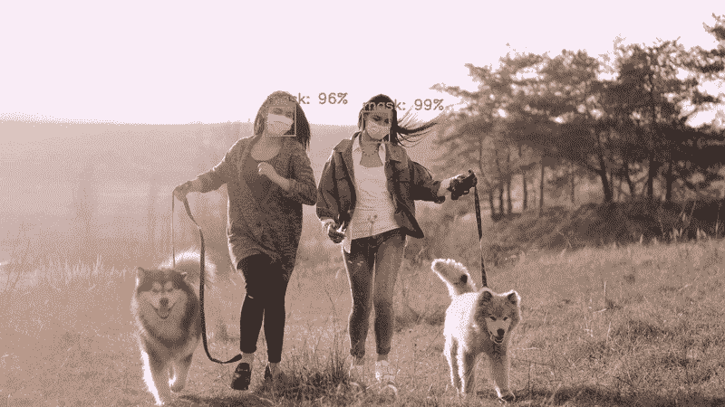
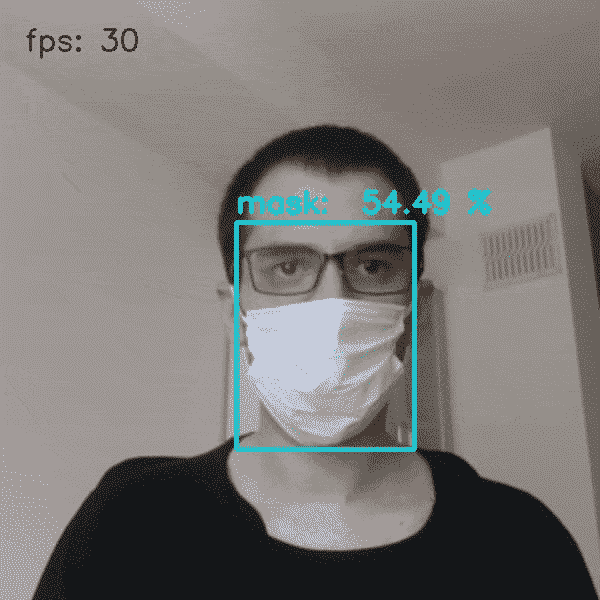

# 第 2 部分—又一个面具检测器… (OpenCV 空间人工智能竞赛之旅)

> 原文：<https://towardsdatascience.com/part-2-yet-another-face-mask-detector-opencv-spatial-ai-competition-journey-91dfaf96c6e8?source=collection_archive---------27----------------------->



来自 [Pexels](https://www.pexels.com/photo/women-with-face-masks-walking-dogs-4267745/?utm_content=attributionCopyText&utm_medium=referral&utm_source=pexels) 的[古斯塔沃·福林](https://www.pexels.com/@gustavo-fring?utm_content=attributionCopyText&utm_medium=referral&utm_source=pexels)对视频进行面具检测

## 盲人社交距离反馈系统中不同面具检测模型的比较。

*本文是系列文章的一部分，我将记录我在 OpenCV 空间竞赛中为盲人开发社交距离反馈系统的旅程。查看完整系列:* [***第一部***](/opencv-spatial-ai-competition-journey-part-1-e76593d456fe) ***，*** [***第二部***](https://medium.com/@ibaiGorordo/part-2-yet-another-face-mask-detector-opencv-spatial-ai-competition-journey-91dfaf96c6e8) *。*

# 为什么要做口罩检测？

正如该系列的第一部分 中提到的，这个项目的目标是为盲人开发一个 ***反馈系统，帮助他们使用 OAK-D*** 保持与周围人的社交距离(顺便祝贺 [Luxonis LLC](https://medium.com/u/6979f836a183?source=post_page-----91dfaf96c6e8--------------------------------) 和 [Satya Mallick](https://medium.com/u/d19d774b0c8?source=post_page-----91dfaf96c6e8--------------------------------) 成功开展了【Kickstarter 活动！)。在这篇文章中，我将重点关注使用深度学习模型对周围人的检测，以便与这些人保持距离。

对用户周围的人的检测可以以多种方式来完成，一种选择可以是训练用于**行人检测**的模型，如在 [**这个库**](https://github.com/YonghaoHe/A-Light-and-Fast-Face-Detector-for-Edge-Devices/tree/master/pedestrian_detection) 中。另一个可能的选择是**只检测脸部**而不是检测整个身体。人脸检测模型的好处是，由于人脸的独特特征，即使不需要深度学习模型，也更容易检测人脸。例如，在本 OpenCV 教程 的 [**中，使用了基于 Haar 特征的级联分类器方法，即使在低计算设备中也能实时检测人脸。**](https://opencv-python-tutroals.readthedocs.io/en/latest/py_tutorials/py_objdetect/py_face_detection/py_face_detection.html)

然而，在这个特定的应用中，我们还想知道周围的人是否戴着面罩。然后，最好的选择将是仅使用一个检测人在哪里以及他们是否使用面罩的模型，即面罩检测器。

# 面罩检测器过多

由于当前疫情中面罩使用的增加，许多人已经开发了面罩检测系统。在 **Github** 中快速[搜索“面具检测”](https://github.com/search?q=face+mask+detection)会返回大约 700 个关于这个主题的知识库。同样，在 **Youtube** 中[搜索相同的术语，会返回一个没完没了的视频列表，显示人脸检测模型的实现。](https://www.youtube.com/results?search_query=face+mask+detection)

因此，有了这么多可用的例子，我希望很容易找到一个对深度为 ( **OAK-D** )的 **OpenCV AI 套件来说足够快的例子，并且即使在现实生活环境中也具有良好的准确性。**

> 但是，**我们应该选择哪个人脸面具检测实例呢？**

首先，我决定看看 **Github 中排名靠前的面具检测库。**下表总结了其中一些存储库中使用的数据集和模型列表。

面罩检测示例概述

正如可以观察到的，有两种主要的方法来执行人脸面具检测: **1 .人脸检测+对每个检测到的人脸进行面罩分类**或 **2。直接进行面罩检测**。第一种方法可能具有更好的准确性，因为已经可用的人脸检测模型已经在成千上万的人脸图像中被训练。相比之下，如表中所示，人脸遮罩检测数据集具有较少的用于训练的图像，其中 [**AIZOOTech 数据集**](https://github.com/AIZOOTech/FaceMaskDetection) 具有较多的图像。

然而，大多数先前的人脸检测模型是在大多数情况下未被覆盖的人脸上训练的。由于这个原因，在脸部被遮罩覆盖的情况下，脸部检测模型可能会错过脸部的检测(如 pyimagesearch.com 中非常详细的文章 [**中所解释的)。**](https://www.pyimagesearch.com/2020/05/04/covid-19-face-mask-detector-with-opencv-keras-tensorflow-and-deep-learning/)

# 基于 OAK-D 的人脸面具检测

在分析前面提到的例子之前， [**Luxonis**](https://luxonis.com/) 的人已经提供了一个使用 OAK-D 进行面具检测的 [**演示。演示中的模型是一个在 Google Colab 中训练过的**](https://github.com/luxonis/depthai-experiments/tree/master/coronamask) **[**MobileNetV2 (SSD)。**](https://colab.research.google.com/github/luxonis/depthai-ml-training/blob/master/colab-notebooks/Medical_Mask_Detection_Demo_Training.ipynb)**

> 注:尽管不包括在演示中，他们也提供了另一个 [**Google Colab** 脚本，用于训练一个 **YOLOv3-tiny** 模型用于**人脸面具检测**](https://colab.research.google.com/github/luxonis/depthai-ml-training/blob/master/colab-notebooks/Easy_TinyYolov3_Object_Detector_Training_on_Custom_Data.ipynb) 。

要运行演示，需要安装 DepthAI Python 模块。正如 [**第一部**](/opencv-spatial-ai-competition-journey-part-1-e76593d456fe) 中提到的，Windows 版本仍然是实验性的。然而，最近这个过程已经被更新了，这样按照**Luxonis 讨论**中最后一个评论的 [**步骤安装库就容易多了。**](https://discuss.luxonis.com/d/39-depthai-sneak-peak-into-windows-support/3)

然而，截至今天，面罩检测演示配置为与旧版本的 **DepthAI 库**一起工作。因此，我修改了演示程序，使其能够与当前版本的 **DepthAI** 一起工作，该程序可以在我的[**Github 资源库中找到。要运行该演示程序，需要按照前面的说明安装 **DepthAI** 库，并将 DepthAI 文件夹添加到系统的 PYTHONPATH 中。接下来，打开命令并运行以下命令:**](https://github.com/ibaiGorordo/Social-Distance-Feedback/tree/master/Part%202%20-%20Mask%20Detection)

```
git clone [https://github.com/ibaiGorordo/Social-Distance-Feedback.git](https://github.com/ibaiGorordo/Social-Distance-Feedback.git)
cd "Social-Distance-Feedback\Part 2 - Mask Detection"
python demo_mask_detector.py
```

demo_mask_detector.py 是一个脚本，用于配置 **OAK-D** 在 RGB 摄像机上执行人脸遮罩检测，并显示来自 **OAK-D** 的图像和检测。

下面的视频显示了 OAK-D 对 **MobileNetV2 (SSD)** **面罩检测模型**的推理输出(使用 [DepthAI 的 Google Colab s](https://colab.research.google.com/github/luxonis/depthai-ml-training/blob/master/colab-notebooks/Medical_Mask_Detection_Demo_Training.ipynb)script 训练)。



使用 OAK-D (SSD-MobileNetV2)的人脸面具检测

# 人脸面具检测模型在野外是如何表现的？

前面的例子类似于许多教程，以使用网络摄像头进行推理的例子结束。然而，我的系统的目标是在日常生活中使用，特别是在户外。因此，该系统在不同的光照条件下，甚至在周围有多人时，都应该是鲁棒的。

出于这个原因，我决定看看不同的人脸面具检测模型在更真实的环境中表现如何。出于这个目的，我使用了这段来自 pexels.com 的公开视频，记录了人们在夜市 中行走的场景。下面的视频显示了使用 [**DepthAI 的 Google Colab 脚本**](https://colab.research.google.com/github/luxonis/depthai-ml-training/blob/master/colab-notebooks/Medical_Mask_Detection_Demo_Training.ipynb) 训练的 **SSD-MobileNetV2** 与 **YOLOv3-tiny** 模型的面罩检测的比较。 [**推理程序的代码可以在我的 Github 资源库这里找到**](https://github.com/ibaiGorordo/Social-Distance-Feedback/tree/master/Part%202%20-%20Mask%20Detection/Face%20Mask%20Detection%20Inference%20Comparison) **。**

使用 SSD-MobileNetV2 和 YOLOv3-tiny 模型在真实生活环境中检测面具的比较

可以观察到， **SSD-MobilenetV2 型号**具有更高数量的检测，但结果是，更高数量的这些检测是错误的检测。即使将置信度阈值提高到 0.7(如上面的视频所示)，SSD-MobilenetV2 型号仍然有大量的错误检测。

另一方面， **YOLOv3-tiny 型号**错过了一些人脸(特别是距离较远的人脸)，但具有更稳定的检测，置信度阈值为 0.5。由于我们的应用程序只需要检测靠近用户的人(在 3 米或更近的距离)，因此 **YOLOv3-tiny 模型**似乎是两个模型中最有希望的模型。

# YOLOv4 呢？

最近，Alexey Bochkovskiy 展示了一个[**新 YOLO 版本(YOLOv4)**](https://github.com/AlexeyAB/darknet) ，它提供了比以前版本更高的性能。在下面的视频中，有一个来自 [Mladen Zamanov](https://medium.com/u/98bdf6f463d7?source=post_page-----91dfaf96c6e8--------------------------------) 的例子，可以看出 YOLOv4 即使周围有很多人，也可以进行人脸面具检测。

YOLOv4 面罩检测推断由[姆拉登扎马诺夫](https://medium.com/u/98bdf6f463d7?source=post_page-----91dfaf96c6e8--------------------------------)

在我们的应用程序中使用 **YOLOv4** 的问题是，为了将模型传递给 **OAK-D** ，需要将模型转换为**。blob 文件**将由 **OAK-D** 中的 **Myriad X** 运行。但是，为了转换模型，需要使用 **OpenVINO toolkit 的模型优化器**，目前官方支持到 **YOLOv3** 为止。

尽管由于 TNTWEN 的 [**库，可以使用最新 **OpenVINO (2020.4)版本**的模型优化器，但是 **depthAI 模块**仍然不支持它。结果，到今天为止，似乎 **YOLOv4** 无法用于内置摄像头的 **OAK-D** 。**](https://github.com/TNTWEN/OpenVINO-YOLOV4)

无论如何，我决定试一试 YOLOv4，以防在不久的将来它可以用于 OAK-D。我特别关注新的 **YOLOv4-tiny** 版本，因为它应该更适合在计算能力较低的设备中进行实时推理(实际上 **YOLOv4** 的[作者已经能够在 **OAK-D** 内部的同一芯片中运行 **full YOLOv4** 的修改版本，如此处所示](https://github.com/AlexeyAB/darknet/issues/5079#issuecomment-620852457))。

为此，我在 **Google Colab** 中使用**这个脚本** **(下面的代码)**训练了 **YOLOv4-tiny** 模型，它是基于 DepthAI 的原始脚本。在同一个脚本中，我还添加了代码来检测我用来比较 **SSD-MobileNetV2** 和 **YOLOv3** 的同一视频上的面具。

在下面的视频中，我展示了 **YOLOv3-tiny** 与 **YOLOv4-tiny** 对 f **ace mask 检测**的结果比较。

使用 YOLOv4-tiny 和 YOLOv3-tiny 模型在真实生活环境中检测面具的比较

可以看出，两种模型的结果非常相似。在某些情况下， **YOLOv4-tiny** 能够检测到 **YOLOv3-tiny** 不能检测到的人脸，但总的来说结果几乎是一样的。

总之，我可能会继续使用 **YOLOv3-tiny** 进行面具检测，除非有新的支持 **YOLOv4** 。在下一部分中，我将重点关注深度和对象检测数据的组合。

这一部分和下一部分的所有代码都可以在我下面的库中找到:[https://github.com/ibaiGorordo/Social-Distance-Feedback](https://github.com/ibaiGorordo/Social-Distance-Feedback)。