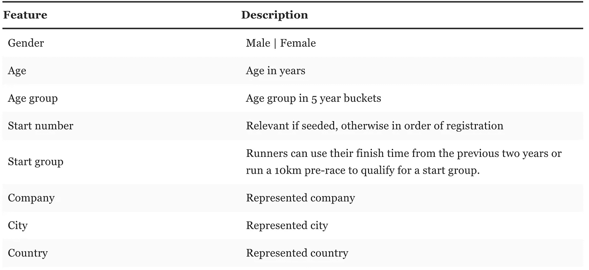
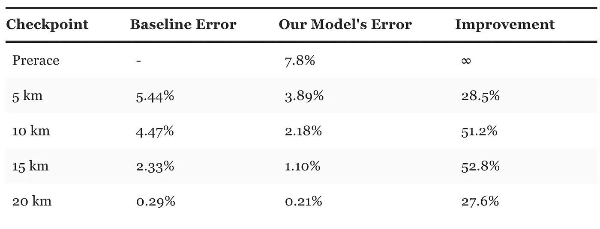
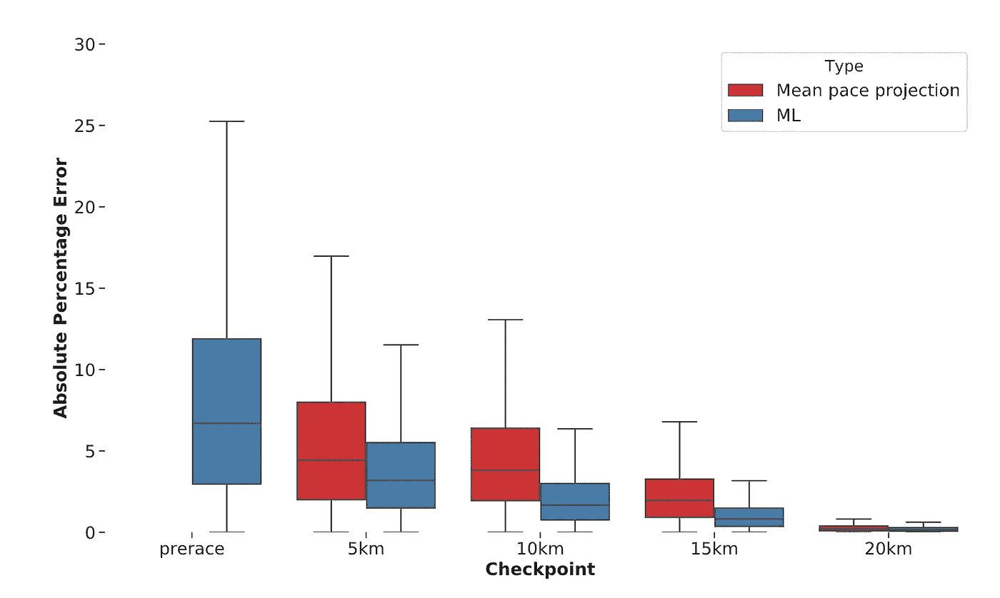

# 第 3/3 部分——预测我的半程马拉松完成时间，误差小于 45 秒。

> 原文：<https://towardsdatascience.com/part-3-3-predicting-my-half-marathon-finish-time-with-less-than-45-seconds-error-9d43d6fadf01?source=collection_archive---------56----------------------->

## 跑步的机器学习——机器学习和结果。

坎德拉·温纳塔在 [Unsplash](https://unsplash.com?utm_source=medium&utm_medium=referral) 上的照片

这是教育结束时间预测系列的第 3 部分:

*   [**第一部分—数据分析**](/half-marathon-finish-time-prediction-part-1-5807760033eb?source=your_stories_page---------------------------)
*   [**第二部分—狂妄分析**](/predicting-my-half-marathon-finish-time-with-less-than-45-seconds-error-part-two-9cf6bb930e79)
*   **第三部分——跑步者完成时间预测**(你在这里)

在这篇文章中，我将向你展示我是如何在比赛开始前预测自己的完成时间(1:40:34)，误差不到 45 秒。我们将利用第一部分的一些发现来:

*   为我们的模型实现特性
*   训练 5 个不同的模型来预测比赛中每个关卡的完成时间
*   评估我们的结果

# 为什么我们需要机器学习

在第 2 部分中，我们得出结论，跑步者度量的平均值可以用来粗略估计他们的完成时间。随着我们使用更多的指标(特征)进行分组，预测会变得更好——如果我们使用第 5 组所有 28 岁男性的平均值，而不是只查看所有 28 岁男性，预测会变得更好。

然而，随着我们向分组依据添加更多指标(比如我们为第一站添加国家、城市和速度)，每组中的跑步者数量会减少到一个点，即一组中可能只剩下一名跑步者。举个例子:

*你认为有多少 28 岁的隆德男子在 23:20 内跑完第一个 5 公里？*

只有一个。

# 机器学习

在机器学习中，我们将多维空间中的所有特征结合起来，并为我们的数据点拟合一个函数。我们称这个函数为模型。在训练阶段，模型从每个由特征(如年龄、性别等)表示的数据点(跑步者)中学习，以估计目标变量(完成时间)。模型如何学习取决于训练算法。

机器学习，图片来自 [xkcd](https://xkcd.com/1838/)

*数据是关于跑步者的信息。答案是跑步者的完成时间。搅拌就是机器学习算法。我们不停地搅拌，直到我们无法再提高预测的平均误差。*

# 培训计划

我们的数据集分为训练集(80%的跑步者)和测试集(20%的跑步者)。我们不是随机分组，而是分组，这样每组中每个起跑组都有公平比例的选手。该模型在训练集上进行训练，然后在测试集上进行评估。模型预测的是跑步者的完成时间。

*来自测试集的预测用于评估我们模型的性能。*

我训练了五个模型来模拟现实，因为比赛中每个检查站都有更多的信息。见下文。

*随着跑步者在比赛中的进步，更多的信息将会出现。我们逐渐使用更多的功能，并训练五个不同的模型—每个检查点一个。*

请注意，这种类型的培训(仅使用当年的数据)在现实世界中是不可能的。它要求训练集跑步者在我们可以在测试集上进行预测之前进行比赛。理想情况下，我们应该有用于训练的历史数据，然后在最近的比赛中测试该模型。当然，一旦注册数据可用，我们可以根据所有数据进行训练，并对下一年进行预测——但这样做无法评估模型今天的实际表现。

# 预测误差和基线

预测是跑步者估计的完成时间。

为了评估模型给出的预测的准确性，我们将比较测试集中每个跑步者的完成时间预测和实际完成时间。例如，如果对某个特定赛跑者的预测是 **2:00:00** ，但该赛跑者实际上在 **1:59:00** 完成，则误差为 **60** 秒。然而，为了使事情不那么一成不变，将使用基于百分比的指标，而不是绝对数字。在本例中，误差为 **0.84%** 。

平均误差计算为我们测试集中所有跑步者的 MAPE(平均绝对百分比误差)。通过与基线的平均误差进行比较，我们可以了解我们的模型有多好:

**基线:使用预计平均步速的预测:**

这是比赛中观众使用的默认预测方法。它是通过计算跑步者到目前为止的平均配速，然后乘以总距离来计算的。

我们的目标是超越基线，并有一个较小的平均误差。

# 特征

## 一般特征

跑步者注册的特征。随时可用。

使用的一般特征的解释。

## 5 公里配速特征

步伐特征。当跑步者通过 5 公里检查站时可用。

5 公里后使用的附加功能说明。

## 10、15、20 公里配速特征

同上，但分别为 10 公里、15 公里和 20 公里。我们还增加了一个功能，将跑步者的配速与普通精英跑步者的配速进行比较。该特征需要至少两个配速数据点(例如 5 公里和 10 公里)，并用作跑步者和精英跑步者之间的相似性得分。

当达到一个以上的检查点时，我们还计算一个特征来测量与优秀跑步者速度曲线的相似性。

# 培养

使用上述特征和称为 [RidgeRegression](https://en.wikipedia.org/wiki/Tikhonov_regularization) 的机器学习算法，我们训练该模型，教导它相对于我们的目标变量最小化多维空间中的数据点的 MSE(均方误差);结束时间。

我为什么要用 RidgeRegression？嗯，它训练起来很快，不需要很多高参数，而且很有效。鉴于我为这个项目设定的时间框架(在[代码 19](https://codecation.se/) 的 1 周)，我需要快速迭代来修复错误和尝试新功能。我尝试了一些不同的其他模型，发现 RidgeRegression 更胜一筹。我们让经过训练的模型在未用于训练的测试集上运行预测，并获得以下结果:

# 个人成绩

在我们看平均结果之前，让我们看看模型对我的个人结果的预测，让你对每个模型所扮演的角色有个概念。

*奥斯卡·汉德马克的个人预测结果。我们的模型在所有情况下都优于基线(预计平均配速)。*

# 结果

测试集中所有跑步者的结果(20%)。

我们设法将 10 和 15 公里检查站的预测平均绝对百分比误差提高了 50%以上！我们的模型在比赛前的预测误差最大，这是有意义的，因为我们在那一点上可以使用的信息较少。基线不能做赛前预测，所以我们认为这是无限百分比的改进。下图还显示了中间值(中线)、四分位数(方框顶部/底部)和(最小值/最大值)(晶须):

*测试集错误。我们的训练模型(蓝色)在所有阶段都优于基线。10 公里和 15 公里检查站的改善最为显著。*

# 丰富

*   **历史数据**将允许我们跟踪回归的跑步者多年，并从他们以前的比赛中学习。它还可以让我们跟踪整个人群，从跑步的趋势变化中学习。随着时间的推移，我们是否已经成功地教育了跑步人群不要骄傲自大，以及这种影响的轨迹是什么？
*   **其他来源的**数据，如 GPS 手表数据& Strava/Garmin history 将允许我们跟踪跑步者的训练，并将以前锻炼的结果作为我们模型的特征。
*   **更高分辨率的数据**例如每公里而不是每五公里一次的检查点时间。这将允许我们的模型更频繁地提供新的预测，并更密切地监控自大和步伐变化。

# 学习

*   带着手表跑步有助于你在比赛中调整自己的速度。
*   设定目标！虽然跑步是一项身体运动，但也有很多心理因素。
*   看你自己的数据！从中吸取教训。
*   考虑你的年龄、性别和自大的风险。要知道，狂妄自大对年轻和年老的跑步者影响最大！
*   计划你的比赛！查看精英跑步者的配速档案，并尝试以类似方式跑步。设定你的目标并向后计算你应该达到的检查点时间。

# 关于跑步的未来的简短说明

一个有趣的想法是考虑这样一种情况，我们可以在手表上运行这些模型，并在我们的手臂上每秒钟得到预测。这项技术现在已经存在，我很期待下一步会发生什么。同时，这是一个可怕的想法——这几乎就像一个骗局，有一个设备可以实时告诉你相对于你的能力，你跑得太快还是太慢。无论如何，我认为这将发展这项运动，并作为一种教育跑步者了解自己的方式。

# 下一步是什么

接下来我主要想做三件事。社区利益使这些成为可能。让我知道你接下来想看什么。

*   **赛事规划界面。**根据我在这个博客系列中的发现，创建一个小型用户界面应该是很容易的，跑步者可以在这个界面中输入他们的详细信息&完成时间目标，并接收个性化的提示和建议的配速配置。通过将 API 集成到时间跟踪软件中，可以在 UI 中可视化实时预测。
*   **史料。**纳入 goteborgsvarvet 的 20 年数据将大大改善结果。我很好奇，对于那些参加了多年的跑步者来说，我们能有多接近完美的表现。
*   把这个给这个世界。通过添加一个更智能的结束时间预测器(就像这个),改善观众体验是微不足道的。我知道一些公司已经在这么做了，但是如果你知道有人可能感兴趣，请通过 oskar@backtick.se 联系我。

*如果您错过了第 1 和第 2 部分，可以在这里找到:*

*   [***第一部分—数据分析***](/half-marathon-finish-time-prediction-part-1-5807760033eb?source=your_stories_page---------------------------)
*   [***第二部分——狂妄分析***](/predicting-my-half-marathon-finish-time-with-less-than-45-seconds-error-part-two-9cf6bb930e79)