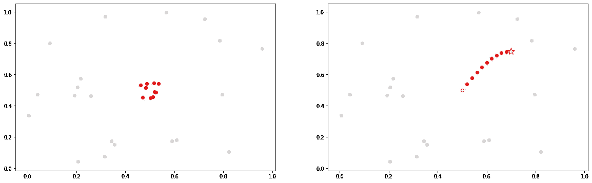
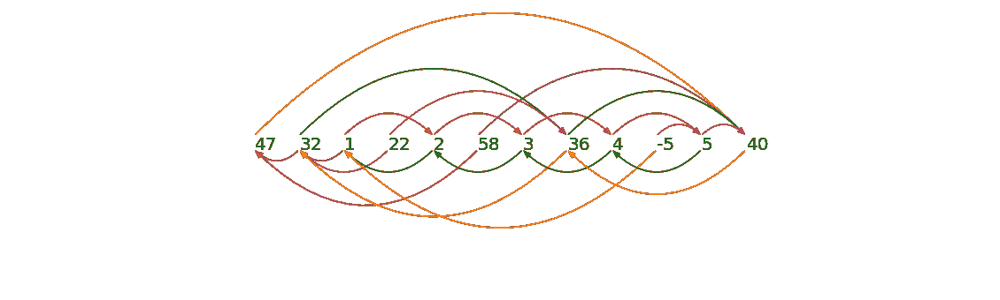
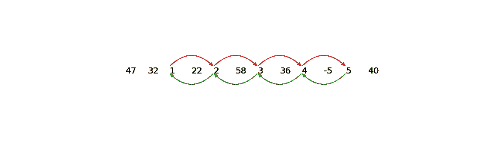
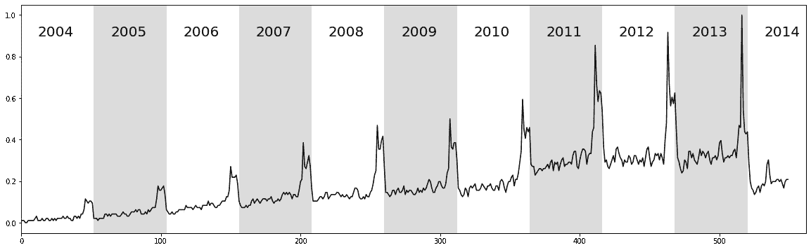
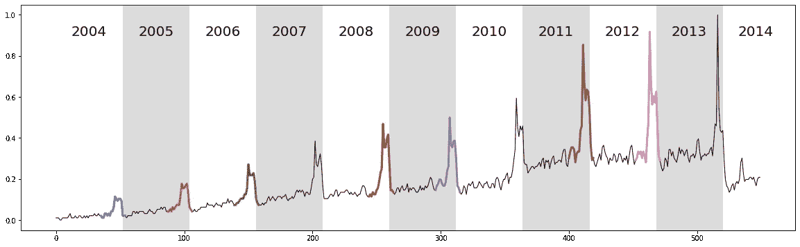
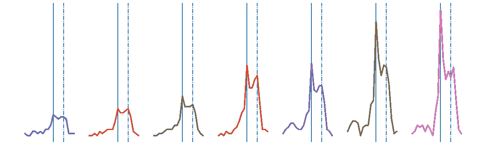

# 第 3 部分:时间序列链

> 原文：<https://towardsdatascience.com/part-3-time-series-chains-da281450abbf?source=collection_archive---------31----------------------->

## 用 STUMPY 进行时间序列预测的新方法


(图片由[马克西姆·霍拉维尔](https://unsplash.com/@mxhpics?utm_source=unsplash&utm_medium=referral&utm_content=creditCopyText)提供)

# 整体大于部分之和


(图片由作者提供)

[STUMPY 是一个强大且可扩展的 Python 库，用于现代时间序列分析](https://github.com/TDAmeritrade/stumpy)，在其核心，有效地计算出一种叫做*矩阵轮廓*的东西。这个多部分系列的目标是解释什么是 matrix profile，以及如何开始利用 [STUMPY](https://stumpy.readthedocs.io/en/latest/) 完成所有现代时间序列数据挖掘任务！

*注:这些教程最初出现在* [*STUMPY 文档*](https://stumpy.readthedocs.io/en/latest/tutorials.html) *中。*

第 1 部分:[矩阵轮廓图](/the-matrix-profile-e4a679269692)
第 2 部分: [STUMPY 基础知识](/stumpy-basics-21844a2d2d92)
第 3 部分:[时间序列链](/part-3-time-series-chains-da281450abbf)
第 4 部分:[语义分割](/part-4-semantic-segmentation-b42c3792833d)
第 5 部分:[用 STUMPY 快速近似矩阵轮廓图](/part-5-fast-approximate-matrix-profiles-with-scrump-c6d9c984c560)
第 6 部分:[用于流式时间序列数据的矩阵轮廓图](/matrix-profiles-for-streaming-time-series-data-f877ff6f9eef)
第 7 部分:[用 STUMPY 快速模式搜索](/part-7-fast-pattern-searching-with-stumpy-2baf610a8de1) 10: [发现多维时间序列模体](/part-10-discovering-multidimensional-time-series-motifs-45da53b594bb)
第 11 部分:[用户引导的模体搜索](/part-11-user-guided-motif-search-d3d317caf9ea)
第 12 部分:[机器学习的矩阵轮廓](/part-12-matrix-profiles-for-machine-learning-2dfd98d7ff3f)

# 用锚定时间序列链预测 Web 查询数据(ATSC)

之前，我们学习了什么是[矩阵轮廓](https://medium.com/@seanmylaw/the-matrix-profile-e4a679269692)，以及如何使用 [STUMPY](https://stumpy.readthedocs.io/en/latest/) 来[发现任何时间序列数据中的主题(模式)和不一致(异常)](https://medium.com/@seanmylaw/stumpy-basics-21844a2d2d92)。在这篇博客中，我们将把这些概念更进一步，探索从一个叫做*时间序列链*的矩阵剖面中衍生出来的东西。此示例改编自[网络查询量案例研究](http://www.www2015.it/documents/proceedings/proceedings/p721.pdf)，并利用了[矩阵概况 VII](https://www.cs.ucr.edu/~eamonn/chains_ICDM.pdf) 研究论文的主要内容。

# 入门指南

让我们导入加载、分析和绘制数据所需的包。

```
%matplotlib inline

import pandas as pd
import numpy as np
import stumpy
from scipy.io import loadmat
import matplotlib.pyplot as plt
from matplotlib.patches import Rectangle, FancyArrowPatch
import itertools

plt.rcParams["figure.figsize"] = [20, 6]  # width, height
plt.rcParams['xtick.direction'] = 'out'
```

# 什么是时间序列链？

*时间序列链*可以非正式地认为是随着时间的推移向某个方向演变或漂移的主题。下图说明了[时序主题](https://stumpy.readthedocs.io/en/latest/Tutorial_1.ipynb)(左)和时序链(右)之间的区别。

```
x = np.random.rand(20)
y = np.random.rand(20)
n = 10
motifs_x = 0.5 * np.ones(n) + np.random.uniform(-0.05, 0.05, n)
motifs_y = 0.5 * np.ones(n) + np.random.uniform(-0.05, 0.05, n)
sin_x = np.linspace(0, np.pi/2, n+1)
sin_y = np.sin(sin_x)/4
chains_x = 0.5 * np.ones(n+1) + 0.02 * np.arange(n+1)
chains_y = 0.5 * np.ones(n+1) + sin_y
fig, axes = plt.subplots(nrows=1, ncols=2)
axes[0].scatter(x, y, color='lightgrey')
axes[0].scatter(motifs_x, motifs_y, color='red')
axes[1].scatter(x, y, color='lightgrey')
axes[1].scatter(chains_x[0], chains_y[0], edgecolor='red', color='white')
axes[1].scatter(chains_x[1:n], chains_y[1:n], color='red')
axes[1].scatter(chains_x[n], chains_y[n], edgecolor='red', color='white', marker='*', s=200)
```



(图片由作者提供)

上面，我们将时间序列子序列可视化为高维空间中的点。左边显示的是一个时间序列主题，它可以被认为是一个近似柏拉图式理想的点的集合。相比之下，右边描绘的是一个时间序列链，它可以被认为是空间中的点的演化轨迹。在这里，开放的红色圆圈代表链中的第一个环节，锚。基序和链都具有这样的性质，即每个子序列都相对靠近其最近的邻居。然而，图案组(左)的直径也相对较小。相比之下，链中的点集(右)的直径比每个成员到其最近邻居的距离的平均值大得多，此外，链具有方向性的重要特性。例如，在一个基序的情况下，如果一个额外的成员被添加到基序集中，它的位置也将是接近柏拉图理想的某个地方，但是独立于前面的子序列。相比之下，在链的情况下，链的下一个成员的位置将在最后一个红色圆圈之后的某个地方，可能是开放的红星所在的位置。

# 一个简化的例子

改编自[矩阵图 VII](https://www.cs.ucr.edu/~eamonn/chains_ICDM.pdf) 文件，考虑以下时间序列:

47, 32, 1, 22, 2, 58, 3, 36, 4, -5, 5, 40

假设子序列长度为 1，两个子序列之间的距离就是它们之间的绝对差。明确地说，我们在这里做这些简单而病态的假设仅仅是为了说明；实际上，我们的目标是更长的子序列长度，并在我们的 [STUMPY](https://stumpy.readthedocs.io/en/latest/) 应用中使用 z 归一化欧几里德距离。为了捕捉时间序列链的方向性，我们需要将左右最近邻信息存储到左(IL)和右(IR)矩阵轮廓索引中:

```
Index  Value  Left Index (IL)  Right Index (IR)
1         47              N/A                12
2         32                1                 8
3          1                2                 5
4         22                2                 8
5          2                3                 7
6         58                1                12
7          3                5                 9
8         36                2                12
9          4                7                11
10        –5                3                11
11         5                9                12
12        40                8               N/A
```

在这个垂直/转置表示中，`index`列显示了时间序列中每个子序列的位置，`value`列包含来自我们上面的时间序列的原始数字，`IL`列显示了左矩阵分布指数，`IR`是右矩阵分布指数。例如，`IR[2] = 8`表示`index = 2`(有`value = 32`)的右最近邻在`index = 8`(有`value = 36`)。同样，`IL[3] = 2`表示`index = 3`(有`value = 1`)的左最近邻在`index = 2`(有`value = 32`)。为了更好地可视化左/右矩阵轮廓索引，我们使用箭头将时间序列中的每个子序列与其左、右最近邻链接起来:

```
nearest_neighbors = np.array([[1,  47, np.nan,     12],
                              [2,  32,      1,      8],
                              [3,   1,      2,      5],
                              [4,  22,      2,      8],
                              [5,   2,      3,      7],
                              [6,  58,      1,     12],
                              [7,   3,      5,      9],
                              [8,  36,      2,     12],
                              [9,   4,      7,     11],
                              [10, -5,      3,     11],
                              [11,  5,      9,     12],
                              [12, 40,      8, np.nan]])colors = [['C1', 'C1'],
          ['C2', 'C5'],
          ['C3', 'C5'],
          ['C4', 'C4'],
          ['C3', 'C2'],
          ['C5', 'C3'],
          ['C3', 'C2'],
          ['C2', 'C1'],
          ['C3', 'C2'],
          ['C6', 'C1'],
          ['C6', 'C2'],
          ['C1', 'C1']]style="Simple, tail_width=0.5, head_width=6, head_length=8"
kw = dict(arrowstyle=style, connectionstyle="arc3, rad=-.5",)xs = np.arange(nearest_neighbors.shape[0]) + 1
ys = np.zeros(nearest_neighbors.shape[0])
plt.plot(xs, ys, "-o", markerfacecolor="None", markeredgecolor="None", linestyle="None")x0, x1, y0, y1 = plt.axis()
plot_margin = 5.0
plt.axis((x0 - plot_margin,
          x1 + plot_margin,
          y0 - plot_margin,
          y1 + plot_margin))
plt.axis('off')for x, y, nearest_neighbor, color in zip(xs, ys, nearest_neighbors, colors):
    plt.text(x, y, str(int(nearest_neighbor[1])), color="black", fontsize=20) # Plot right matrix profile indices
    if not np.isnan(nearest_neighbor[3]):
        arrow = FancyArrowPatch((x, 0.5), (nearest_neighbor[3], 0.5), color=color[0], **kw)
        plt.gca().add_patch(arrow) # Plot left matrix profile indices
    if not np.isnan(nearest_neighbor[2]):
        arrow = FancyArrowPatch((x, 0.0), (nearest_neighbor[2], 0.0), color=color[1], **kw)
        plt.gca().add_patch(arrow)
```



(图片由作者提供)

从一个数字指向其右最近邻的箭头(显示在时间序列上方的箭头)可以称为向前箭头，从一个数字指向其左最近邻的箭头(显示在时间序列下方的箭头)可以称为向后箭头。根据时间序列链的正式定义(参见[矩阵剖面 VII](https://www.cs.ucr.edu/~eamonn/chains_ICDM.pdf) 的详细定义和讨论)，链中的每对连续子序列必须由向前箭头和向后箭头连接。敏锐的眼睛会发现，在我们的简化示例中，最长的链是:

```
nearest_neighbors = np.array([[1,  47, np.nan, np.nan],
                              [2,  32, np.nan, np.nan],
                              [3,   1, np.nan,      5],
                              [4,  22, np.nan, np.nan],
                              [5,   2,      3,      7],
                              [6,  58, np.nan, np.nan],
                              [7,   3,      5,      9],
                              [8,  36, np.nan, np.nan],
                              [9,   4,      7,     11],
                              [10, -5, np.nan, np.nan],
                              [11,  5,      9, np.nan],
                              [12, 40, np.nan, np.nan]])colors = [['C1', 'C1'],
          ['C2', 'C5'],
          ['C3', 'C5'],
          ['C4', 'C4'],
          ['C3', 'C2'],
          ['C5', 'C3'],
          ['C3', 'C2'],
          ['C2', 'C1'],
          ['C3', 'C2'],
          ['C6', 'C1'],
          ['C6', 'C2'],
          ['C1', 'C1']]style="Simple, tail_width=0.5, head_width=6, head_length=8"
kw = dict(arrowstyle=style, connectionstyle="arc3, rad=-.5",)xs = np.arange(nearest_neighbors.shape[0]) + 1
ys = np.zeros(nearest_neighbors.shape[0])
plt.plot(xs, ys, "-o", markerfacecolor="None", markeredgecolor="None", linestyle="None")x0, x1, y0, y1 = plt.axis()
plot_margin = 5.0
plt.axis((x0 - plot_margin,
          x1 + plot_margin,
          y0 - plot_margin,
          y1 + plot_margin))
plt.axis('off')for x, y, nearest_neighbor, color in zip(xs, ys, nearest_neighbors, colors):
    plt.text(x, y, str(int(nearest_neighbor[1])), color="black", fontsize=20) # Plot right matrix profile indices
    if not np.isnan(nearest_neighbor[3]):
        arrow = FancyArrowPatch((x, 0.5), (nearest_neighbor[3], 0.5), color=color[0], **kw)
        plt.gca().add_patch(arrow) # Plot left matrix profile indices
    if not np.isnan(nearest_neighbor[2]):
        arrow = FancyArrowPatch((x, 0.0), (nearest_neighbor[2], 0.0), color=color[1], **kw)
        plt.gca().add_patch(arrow)
```



(图片由作者提供)

因此，最长的提取链是 1 ⇌ 2 ⇌ 3 ⇌ 4 ⇌ 5。请注意，我们看到数据逐渐单调增加，但实际上，漂移的增加或减少可能以任意复杂的方式发生，可以通过时间序列链方法检测到。漂移的关键组成部分是时间序列必须包含具有明确方向性的链。

STUMPY 能够计算:

1.  锚定的时间序列链(ATSC)-从用户指定的锚(即特定的子序列)开始增长链
2.  全链集(ALLC)——一组锚定的时间序列链(即每个链以特定的子序列开始)，它们不被另一个更长的链所包含
3.  未锚定的时间序列链—时间序列中无条件最长的链(如果存在长度相同的链，则可能有多个链)

那么，这在真实时间序列中意味着什么呢？让我们来看一个来自 web 查询数据的真实例子！

# 检索数据

我们将看到一个欠采样且有增长趋势的噪声数据集，这将完美地说明关于时间序列链的想法。该数据包含十年之久的 GoogleTrend 对关键字美国柯尔百货公司(美国零售连锁店)的查询量(从 2004 年到 2014 年每周收集一次)。首先，我们将下载数据，提取数据，并将其插入到 Pandas 数据帧中。

```
df = pd.read_csv("https://zenodo.org/record/4276348/files/Time_Series_Chains_Kohls_data.csv?download=1")
df.head() volume
0  0.010417
1  0.010417
2  0.010417
3  0.000000
4  0.000000
```

# 可视化数据

```
plt.plot(df['volume'], color='black')
plt.xlim(0, df.shape[0]+12)
color = itertools.cycle(['white', 'gainsboro'])
for i, x in enumerate(range(0, df.shape[0], 52)):
    plt.text(x+12, 0.9, str(2004+i), color="black", fontsize=20)
    rect = Rectangle((x, -1), 52, 2.5, facecolor=next(color))
    plt.gca().add_patch(rect)
```



(图片由作者提供)

上面的原始时间序列显示了关键字“美国柯尔百货公司”十年的网络查询量，其中每个交替的白色和灰色垂直带代表从 2004 年到 2014 年的 52 周期间。如图所示，该时间序列有一个显著但不令人惊讶的“年末假日高峰”。回到时间序列链，我们可以看到，随着时间的推移，凸起通常会增加，因此我们可能能够在计算非锚定链时捕捉到这一点。

然而，正如我们在上面学到的，为了计算任何时间序列链，我们还需要左和右矩阵轮廓指数。幸运的是，根据 [STUMPY 文档](https://stumpy.readthedocs.io/en/latest/index.html),`stumpy.stump()`函数不仅分别返回 NumPy 数组第一和第二列中的(双向)矩阵轮廓和矩阵轮廓索引，而且第三和第四列分别由左矩阵轮廓索引和右矩阵轮廓索引组成。

# 计算左和右矩阵轮廓指数

因此，让我们继续计算矩阵轮廓指数，我们将设置窗口大小`m = 20`，这是一个“凸起”的大致长度。

```
m = 20
mp = stumpy.stump(df['volume'], m=m)
```

# 计算非锚定链

现在，有了左右矩阵轮廓索引，我们准备调用全链集 STUMPY 函数，`stumpy.allc()`，它不仅返回全链集，而且作为副产品，它还返回无条件最长链，也称为*非锚定链*。后者才是我们真正感兴趣的。

```
all_chain_set, unanchored_chain = stumpy.allc(mp[:, 2], mp[:, 3])
```

# 可视化未锚定的链

```
plt.plot(df['volume'], linewidth=1, color='black')
for i in range(unanchored_chain.shape[0]):
    y = df['volume'].iloc[unanchored_chain[i]:unanchored_chain[i]+m]
    x = y.index.values
    plt.plot(x, y, linewidth=3)
color = itertools.cycle(['white', 'gainsboro'])
for i, x in enumerate(range(0, df.shape[0], 52)):
    plt.text(x+12, 0.9, str(2004+i), color="black", fontsize=20)
    rect = Rectangle((x, -1), 52, 2.5, facecolor=next(color))
    plt.gca().add_patch(rect)
```



(图片由作者提供)

```
plt.axis('off')
for i in range(unanchored_chain.shape[0]):
    data = df['volume'].iloc[unanchored_chain[i]:unanchored_chain[i]+m].reset_index().values
    x = data[:, 0]
    y = data[:, 1]
    plt.axvline(x=x[0]-x.min()+(m+5)*i + 11, alpha=0.3)
    plt.axvline(x=x[0]-x.min()+(m+5)*i + 15, alpha=0.3, linestyle='-.')
    plt.plot(x-x.min()+(m+5)*i, y-y.min(), linewidth=3)
```



(图片由作者提供)

发现的链显示，在十年中，凸起从覆盖感恩节(实线垂直线)和圣诞节(虚线垂直线)之间的平稳凸起过渡到以感恩节为中心的更尖锐的凸起。这似乎反映了“网络星期一”日益增长的重要性，这是感恩节后星期一的营销术语。这个短语是营销公司为了说服消费者网上购物而创造的。这个词在 2005 年 11 月 28 日的一篇题为“网络星期一迅速成为今年最大的网上购物日之一”的新闻稿中首次亮相。请注意，这个日期与我们链中第一次看到锐化峰值的时间一致。

我们似乎还“遗漏”了链条中的几个环节。然而，请注意，数据是有噪声的和欠采样的，并且“错过的”颠簸失真太大，不符合一般的发展趋势。这个嘈杂的例子实际上说明了时间序列链技术的鲁棒性。如前所述，我们实际上并不需要“完美”的数据来寻找有意义的链。即使一些链接被严重扭曲，被发现的链仍然能够包括所有其他进化的模式。

最后一个要考虑的是链在预测或预报未来方面的潜在用途。人们可以利用链条中不断发展的链接来预测下一次碰撞的形状。我们建议读者参考[矩阵简介 VII](https://www.cs.ucr.edu/~eamonn/chains_ICDM.pdf) 以了解关于该主题的进一步讨论。

# 摘要

就是这样！您刚刚学习了如何使用矩阵剖面指数和利用`stumpy.allc()`函数在数据中识别方向趋势(也称为链)的基础知识。

# 资源

[Matrix Profile VII](https://www.cs.ucr.edu/~eamonn/chains_ICDM.pdf)
[Matrix Profile VII 补充资料](https://sites.google.com/site/timeserieschain/)
[STUMPY Matrix Profile 文档](https://stumpy.readthedocs.io/en/latest/)
[STUMPY Matrix Profile Github 代码库](https://github.com/TDAmeritrade/stumpy)

## ← [第二部分:STUMPY 基础知识](/stumpy-basics-21844a2d2d92) | [第四部分:语义切分](/part-4-semantic-segmentation-b42c3792833d) →