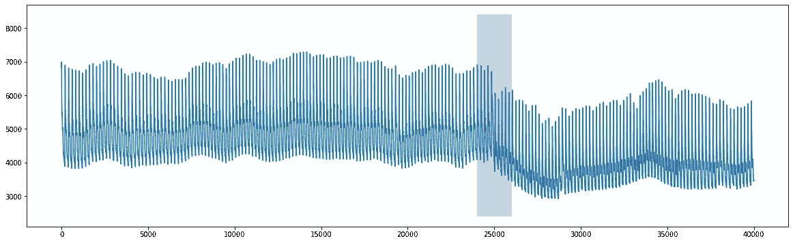
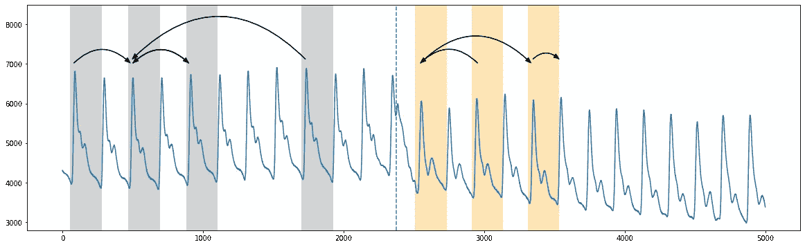
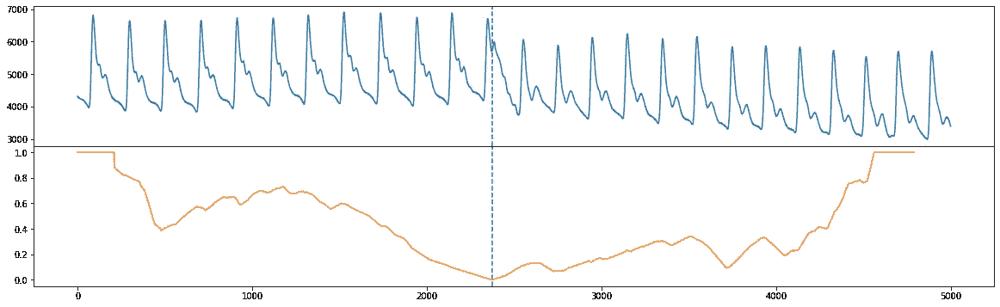
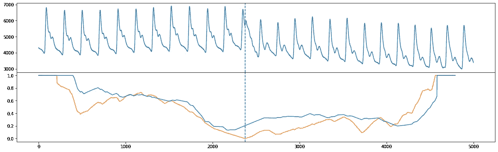
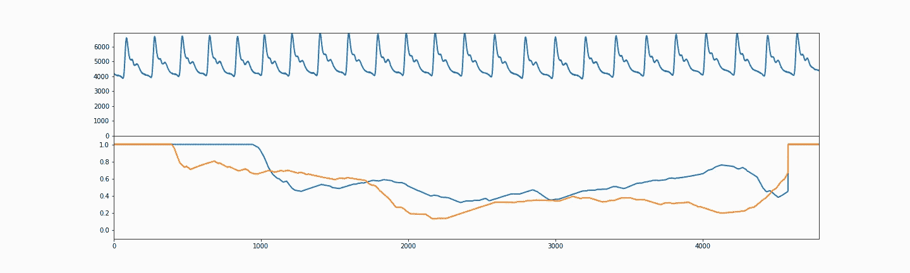

# 第 4 部分:语义分割

> 原文：<https://towardsdatascience.com/part-4-semantic-segmentation-b42c3792833d?source=collection_archive---------21----------------------->

## 用 STUMPY 寻找时间序列状态变化


(图片由[罗南古田](https://unsplash.com/@ronan18?utm_source=unsplash&utm_medium=referral&utm_content=creditCopyText)提供)

# 整体大于部分之和


(图片由作者提供)

[STUMPY 是一个强大且可扩展的 Python 库，用于现代时间序列分析](https://github.com/TDAmeritrade/stumpy)，在其核心，有效地计算出一种叫做*矩阵轮廓*的东西。这个多部分系列的目标是解释什么是 matrix profile，以及如何开始利用 [STUMPY](https://stumpy.readthedocs.io/en/latest/) 完成所有现代时间序列数据挖掘任务！

*注:这些教程最初出现在* [*STUMPY 文档*](https://stumpy.readthedocs.io/en/latest/tutorials.html) *中。*

第 1 部分:[矩阵轮廓图](/the-matrix-profile-e4a679269692)
第 2 部分: [STUMPY 基础知识](/stumpy-basics-21844a2d2d92)
第 3 部分:[时间序列链](/part-3-time-series-chains-da281450abbf)
第 4 部分:[语义分割](/part-4-semantic-segmentation-b42c3792833d)
第 5 部分:[用 STUMPY 快速近似矩阵轮廓图](/part-5-fast-approximate-matrix-profiles-with-scrump-c6d9c984c560)
第 6 部分:[用于流式时间序列数据的矩阵轮廓图](/matrix-profiles-for-streaming-time-series-data-f877ff6f9eef)
第 7 部分:[用 STUMPY 快速模式搜索](/part-7-fast-pattern-searching-with-stumpy-2baf610a8de1) 10: [发现多维时间序列模体](/part-10-discovering-multidimensional-time-series-motifs-45da53b594bb)
第 11 部分:[用户引导的模体搜索](/part-11-user-guided-motif-search-d3d317caf9ea)
第 12 部分:[机器学习的矩阵轮廓](/part-12-matrix-profiles-for-machine-learning-2dfd98d7ff3f)

# 用 FLUSS 和 FLOSS 识别时间序列数据中的变化点

本例利用了从[矩阵图 VIII](https://www.cs.ucr.edu/~eamonn/Segmentation_ICDM.pdf) 研究论文中获得的主要信息。对于适当的上下文，我们强烈建议您先阅读本文，但要知道我们的实现是紧密遵循本文的。

根据上述出版物，“一个人可以对[越来越多的时间序列数据被捕获]执行的最基本的分析之一是将其分割成同质区域。”换句话说，如果您能够将长时间序列数据分割或分割成`k`个区域(其中`k`较小),并且最终目标是只向人类(或机器)注释者呈现`k`个简短的代表性模式，以便为整个数据集生成标签，这不是很好吗？这些分割的区域也被称为“政权”。此外，作为一种探索性工具，人们可能会在数据中发现以前未发现的新的可操作的见解。快速低成本单值语义分割(FLUSS)是一种算法，它产生一种称为“弧形曲线”的东西，用有关政权变化可能性的信息来注释原始时间序列。快速低成本在线语义分割(FLOSS)是 FLUSS 的一种变体，根据原始论文，它是域不可知的，提供具有可操作实时干预潜力的流功能，并适用于真实世界数据(即，不假设数据的每个区域都属于定义明确的语义段)。

为了演示 API 和基本原理，我们将观察躺在医疗倾斜台上的健康志愿者的动脉血压(ABP)数据，并观察我们是否能够检测到倾斜台何时从水平位置倾斜到垂直位置。这与原始论文中的数据相同(见上文)。

# 入门指南

让我们导入加载、分析和绘制数据所需的包。

```
%matplotlib inline

import pandas as pd
import numpy as np
import stumpy
import matplotlib.pyplot as plt
from matplotlib.patches import Rectangle, FancyArrowPatch
from matplotlib import animation
from IPython.display import HTML

plt.rcParams["figure.figsize"] = [20, 6]  # width, height
plt.rcParams['xtick.direction'] = 'out'
```

# 检索数据

```
df = pd.read_csv("https://zenodo.org/record/4276400/files/Semantic_Segmentation_TiltABP.csv?download=1")
df.head()time      abp
   0  06832.0
   1  16928.0
   2  26968.0
   3  36992.0
   4  46980.0
```

# 可视化原始数据

```
plt.plot(df['time'], df['abp'])
rect = Rectangle((24000,2400),2000,6000,facecolor='lightgrey')
plt.gca().add_patch(rect)
```



(图片由作者提供)

我们可以清楚地看到，在`time=25000`附近有一个变化，对应于桌子被直立倾斜的时间。

# 弗卢斯

不使用完整的数据集，让我们直接放大并分析`x=25000`前后的 2500 个数据点(参见论文中的图 5)。

```
start = 25000 - 2500
stop = 25000 + 2500
abp = df.iloc[start:stop, 1]
plt.plot(range(abp.shape[0]), abp)
plt.ylim(2800, 8500)
plt.axvline(x=2373, linestyle="dashed")style="Simple, tail_width=0.5, head_width=6, head_length=8"
kw = dict(arrowstyle=style, color="k")# regime 1
rect = Rectangle((55,2500), 225, 6000, facecolor='lightgrey')
plt.gca().add_patch(rect)
rect = Rectangle((470,2500), 225, 6000, facecolor='lightgrey')
plt.gca().add_patch(rect)
rect = Rectangle((880,2500), 225, 6000, facecolor='lightgrey')
plt.gca().add_patch(rect)
rect = Rectangle((1700,2500), 225, 6000, facecolor='lightgrey')
plt.gca().add_patch(rect)
arrow = FancyArrowPatch((75, 7000), (490, 7000), connectionstyle="arc3, rad=-.5", **kw)
plt.gca().add_patch(arrow)
arrow = FancyArrowPatch((495, 7000), (905, 7000), connectionstyle="arc3, rad=-.5", **kw)
plt.gca().add_patch(arrow)
arrow = FancyArrowPatch((905, 7000), (495, 7000), connectionstyle="arc3, rad=.5", **kw)
plt.gca().add_patch(arrow)
arrow = FancyArrowPatch((1735, 7100), (490, 7100), connectionstyle="arc3, rad=.5", **kw)
plt.gca().add_patch(arrow)# regime 2
rect = Rectangle((2510,2500), 225, 6000, facecolor='moccasin')
plt.gca().add_patch(rect)
rect = Rectangle((2910,2500), 225, 6000, facecolor='moccasin')
plt.gca().add_patch(rect)
rect = Rectangle((3310,2500), 225, 6000, facecolor='moccasin')
plt.gca().add_patch(rect)
arrow = FancyArrowPatch((2540, 7000), (3340, 7000), connectionstyle="arc3, rad=-.5", **kw)
plt.gca().add_patch(arrow)
arrow = FancyArrowPatch((2960, 7000), (2540, 7000), connectionstyle="arc3, rad=.5", **kw)
plt.gca().add_patch(arrow)
arrow = FancyArrowPatch((3340, 7100), (3540, 7100), connectionstyle="arc3, rad=-.5", **kw)
plt.gca().add_patch(arrow)
```



(图片由作者提供)

粗略地说，在上面的截断图中，我们看到两个区域之间的分割发生在`time=2373`(垂直虚线)附近，在那里第一个区域(灰色)的模式没有跨越到第二个区域(橙色)(参见原始论文中的图 2)。因此“弧形曲线”是通过沿时间序列滑动并简单地计算其他模式“越过”该特定时间点的次数(即“弧形”)来计算的。从本质上讲，可以通过查看矩阵轮廓指数来提取这些信息(矩阵轮廓指数会告诉您最近的邻居在时间序列上的位置)。因此，我们预计在重复图案彼此靠近的地方电弧数高，在没有交叉电弧的地方电弧数低。

在我们计算“弧形曲线”之前，我们需要首先计算标准矩阵轮廓，我们可以看到窗口大小大约为 210 个数据点(由于主题/领域专家的知识)。

```
m = 210
mp = stumpy.stump(abp, m=m)
```

现在，为了计算“弧线”并确定状态变化的位置，我们可以直接调用`stumpy.fluss()`函数。但是，请注意`stumpy.fluss()`需要以下输入:

1.  矩阵轮廓索引`mp[:, 1]`(不是矩阵轮廓距离)
2.  一个合适的子序列长度，`L`(为了方便起见，我们只选择它等于窗口大小，`m=210`)
3.  要搜索的区域数量`n_regimes`(本例中为 2 个区域)
4.  一个排除因子，`excl_factor`，使弧线的起点和终点无效(根据论文，1-5 之间的任何值都是合理的)

```
L = 210
cac, regime_locations = stumpy.fluss(mp[:, 1], L=L, n_regimes=2, excl_factor=1)
```

请注意，`stumpy.fluss()`实际上返回了一种叫做“校正弧线”(CAC)的东西，它使这样一个事实正常化，即通常在时间序列的开始和结束附近的时间点上跨越的弧线较少，而在时间序列的中间附近跨越的可能性较大。另外，`stumpy.fluss()`返回虚线的区域或位置。让我们绘制原始时间序列(顶部)以及校正后的弧线(橙色)和单一状态(垂直虚线)。

```
fig, axs = plt.subplots(2, sharex=True, gridspec_kw={'hspace': 0})
axs[0].plot(range(abp.shape[0]), abp)
axs[0].axvline(x=regime_locations[0], linestyle="dashed")
axs[1].plot(range(cac.shape[0]), cac, color='C1')
axs[1].axvline(x=regime_locations[0], linestyle="dashed")
```



(图片由作者提供)

在这里，我们看到`stumpy.fluss()`不仅成功地识别出存在政权更迭，而且能够清晰明确地区分两种政权。

# 丝棉

与 FLUSS 不同，FLOSS 关注的是流数据，因此它计算的是修正圆弧曲线(CAC)的修改版本，它是严格单向的(CAC_1D ),而不是双向的。也就是说，我们不期望从两个方向交叉的可能性相等，而是期望更多的交叉指向未来(更少的指向过去)。所以，我们可以手动计算`CAC_1D`

```
# This is for demo purposes only. Use stumpy.floss() below!
cac_1d = stumpy._cac(mp[:, 3], L, bidirectional=False, excl_factor=1)
```

并且将`CAC_1D`(蓝色)与双向`CAC`(橙色)进行比较，我们看到全局最小值大约在相同的位置(参见原始论文中的图 10)。

```
fig, axs = plt.subplots(2, sharex=True, gridspec_kw={'hspace': 0})
axs[0].plot(np.arange(abp.shape[0]), abp)
axs[0].axvline(x=regime_locations[0], linestyle="dashed")
axs[1].plot(range(cac.shape[0]), cac, color='C1')
axs[1].axvline(x=regime_locations[0], linestyle="dashed")
axs[1].plot(range(cac_1d.shape[0]), cac_1d)
```



(图片由作者提供)

# 使用 FLOSS 传输数据

然而，我们可以直接调用实例化一个流对象的`stumpy.floss()`函数，而不是像上面那样手工计算`CAC_1D`。为了演示`stumpy.floss()`的用法，让我们取一些`old_data`并像上面那样计算它的矩阵轮廓指数:

```
old_data = df.iloc[20000:20000+5000, 1].values  # This is well before the regime change has occurredmp = stumpy.stump(old_data, m=m)
```

现在，我们可以像前面一样计算双向修正弧线，但我们希望看到弧线在添加新数据点后会如何变化。因此，让我们定义一些要流入的新数据:

```
new_data = df.iloc[25000:25000+5000, 1].values
```

最后，我们调用`stumpy.floss()`函数来初始化一个流对象并传入:

1.  从`old_data`生成的矩阵轮廓(仅使用矩阵轮廓索引)
2.  “旧数据”用于生成 1 中的矩阵轮廓。
3.  矩阵轮廓窗口大小，`m=210`
4.  子序列长度，`L=210`
5.  排除因素

```
stream = stumpy.floss(mp, old_data, m=m, L=L, excl_factor=1)
```

您现在可以通过`stream.update(t)`功能用新的数据点`t`更新`stream`，这将滑动您的窗口一个数据点，它将自动更新:

1.  `CAC_1D`(通过`.cac_1d_`属性访问)
2.  矩阵轮廓(通过`.P_`属性访问)
3.  矩阵轮廓指数(通过`.I_`属性访问)
4.  用于产生`CAC_1D`的数据滑动窗口(通过`.T_`属性访问——这应该与“旧数据”的长度相同)

让我们用`new_data`不断更新我们的`stream`，一次更新一个值，并将它们存储在一个列表中(一会儿你就知道为什么了):

```
windows = []
for i, t in enumerate(new_data):
    stream.update(t) if i % 100 == 0:
        windows.append((stream.T_, stream.cac_1d_))
```

下面，您可以看到一个动画，它是用新数据更新流的结果。作为参考，我们还绘制了`CAC_1D`(橙色)，这是我们从上面为静态数据手动生成的。您将看到，在动画进行到一半时，状态发生了变化，更新后的`CAC_1D`(蓝色)将与橙色曲线完美对齐。

```
fig, axs = plt.subplots(2, sharex=True, gridspec_kw={'hspace': 0})axs[0].set_xlim((0, mp.shape[0]))
axs[0].set_ylim((-0.1, max(np.max(old_data), np.max(new_data))))
axs[1].set_xlim((0, mp.shape[0]))
axs[1].set_ylim((-0.1, 1.1))lines = []
for ax in axs:
    line, = ax.plot([], [], lw=2)
    lines.append(line)
line, = axs[1].plot([], [], lw=2)
lines.append(line)def init():
    for line in lines:
        line.set_data([], [])
    return linesdef animate(window):
    data_out, cac_out = window
    for line, data in zip(lines, [data_out, cac_out, cac_1d]):
        line.set_data(np.arange(data.shape[0]), data)
    return linesanim = animation.FuncAnimation(fig, animate, init_func=init,
                               frames=windows, interval=100,
                               blit=True)anim_out = anim.to_jshtml()
plt.close()  # Prevents duplicate image from displaying
if os.path.exists("None0000000.png"):
    os.remove("None0000000.png")  # Delete rogue temp fileHTML(anim_out)
```



(图片由作者提供)

# 摘要

就是这样！您刚刚学习了如何使用矩阵剖面指数和利用`stumpy.fluss()`和`stumpy.floss()`以编程方式识别时间序列数据中的变化段/状态的基础知识。

# 资源

[Matrix Profile VIII](https://www.cs.ucr.edu/~eamonn/Segmentation_ICDM.pdf)
[STUMPY Matrix Profile 文档](https://stumpy.readthedocs.io/en/latest/)
[STUMPY Matrix Profile Github 代码库](https://github.com/TDAmeritrade/stumpy)

## ← [第 3 部分:时间序列链](/part-3-time-series-chains-da281450abbf) | [第 5 部分:带 STUMPY 的快速近似矩阵轮廓](/part-5-fast-approximate-matrix-profiles-with-scrump-c6d9c984c560) →