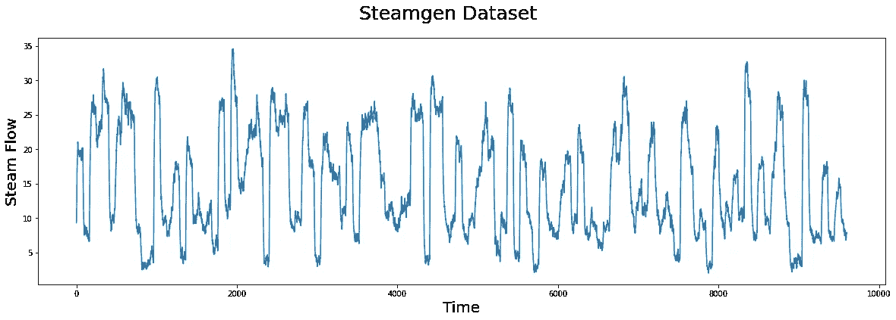
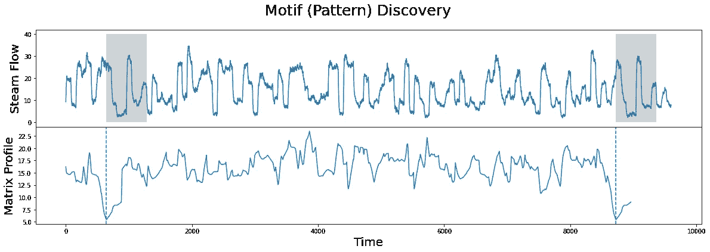
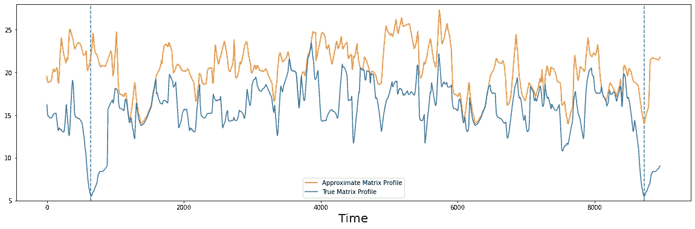
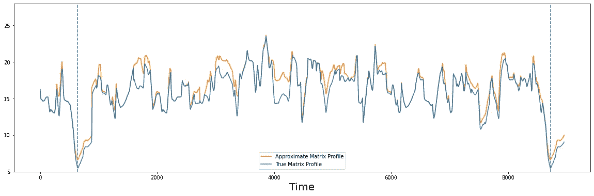
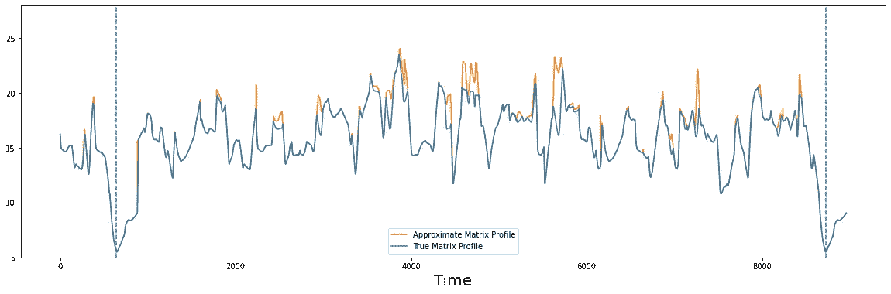

# 第 5 部分:用 STUMPY 快速近似矩阵轮廓

> 原文：<https://towardsdatascience.com/part-5-fast-approximate-matrix-profiles-with-scrump-c6d9c984c560?source=collection_archive---------52----------------------->

## 在很短的时间内计算出大致精确的矩阵轮廓


(图片由 [Djim Loic](https://unsplash.com/@loic?utm_source=unsplash&utm_medium=referral&utm_content=creditCopyText) 提供)

# 整体大于部分之和


(图片由作者提供)

[STUMPY 是一个强大且可扩展的 Python 库，用于现代时间序列分析](https://github.com/TDAmeritrade/stumpy)，在其核心，有效地计算出一种叫做*矩阵轮廓*的东西。这个多部分系列的目标是解释什么是 matrix profile，以及如何开始利用 [STUMPY](https://stumpy.readthedocs.io/en/latest/) 完成所有现代时间序列数据挖掘任务！

*注:这些教程最初出现在* [*STUMPY 文档*](https://stumpy.readthedocs.io/en/latest/tutorials.html) *中。*

第一部分:[矩阵轮廓](/the-matrix-profile-e4a679269692)
第二部分: [STUMPY 基础知识](/stumpy-basics-21844a2d2d92)
第三部分:[时间序列链](/part-3-time-series-chains-da281450abbf)
第四部分:[语义分割](/part-4-semantic-segmentation-b42c3792833d)
第五部分:[快速近似矩阵轮廓与 STUMPY](/part-5-fast-approximate-matrix-profiles-with-scrump-c6d9c984c560)
第六部分:[用于流式时间序列数据的矩阵轮廓](/matrix-profiles-for-streaming-time-series-data-f877ff6f9eef)
第七部分:[快速模式搜索与 STUMPY](/part-7-fast-pattern-searching-with-stumpy-2baf610a8de1)
第八部分:【T21 10: [发现多维时间序列模体](/part-10-discovering-multidimensional-time-series-motifs-45da53b594bb)
第十一部分:[用户引导的模体搜索](/part-11-user-guided-motif-search-d3d317caf9ea)
第十二部分:[机器学习的矩阵轮廓](/part-12-matrix-profiles-for-machine-learning-2dfd98d7ff3f)

# 利用有限的时间和资源计算矩阵轮廓

在[第 1 部分:矩阵分布图](https://medium.com/@seanmylaw/the-matrix-profile-e4a679269692)中，我们定义了矩阵分布图的含义，讨论了计算大型时间序列的矩阵分布图的复杂性，并且在[第 2 部分:STUMPY 基础知识](https://medium.com/@seanmylaw/stumpy-basics-21844a2d2d92)中，我们检查了它为我们提供的一些好处。然而，随着时间序列长度的增加，计算矩阵轮廓的成本可能会挑战你的耐心，甚至你的钱包。

在本文的[中，介绍了一种称为“SCRIMP++的新方法，它以增量方式计算矩阵轮廓。当只需要一个近似矩阵轮廓时，该算法使用矩阵轮廓计算的某些属性来大大减少总计算时间，在本教程中，我们将演示这种方法如何满足您的应用。](https://www.cs.ucr.edu/~eamonn/SCRIMP_ICDM_camera_ready_updated.pdf)

[STUMPY](https://github.com/TDAmeritrade/stumpy) 在`stumpy.scrump()`函数中为自连接和 AB 连接实现了这种方法，当需要更高分辨率的输出时，它允许矩阵轮廓被容易地细化。

# 入门指南

首先，让我们导入一些将用于数据加载、分析和绘图的包。

```
%matplotlib inline

import pandas as pd
import stumpy
import numpy as np
import matplotlib.pyplot as plt
from matplotlib.patches import Rectangle

plt.rcParams["figure.figsize"] = [20, 6]  # width, height
plt.rcParams['xtick.direction'] = 'out'
```

# 加载 Steamgen 数据集

该数据是使用模糊模型生成的，该模型用于模拟位于伊利诺伊州香槟市的 Abbott 电厂的蒸汽发生器。我们感兴趣的数据特性是输出蒸汽流量遥测，单位为 kg/s，数据每三秒“采样”一次，共有 9600 个数据点。

```
steam_df = pd.read_csv("https://zenodo.org/record/4273921/files/STUMPY_Basics_steamgen.csv?download=1")
steam_df.head()drum pressure  excess oxygen  water level  steam flow
    320.08239       2.506774     0.032701    9.302970
   1321.71099       2.545908     0.284799    9.662621
   2320.91331       2.360562     0.203652   10.990955 
   3325.00252       0.027054     0.326187   12.430107
   4326.65276       0.285649     0.753776   13.681666
```

# 可视化 Steamgen 数据集

```
plt.suptitle('Steamgen Dataset', fontsize='25')
plt.xlabel('Time', fontsize ='20')
plt.ylabel('Steam Flow', fontsize='20')
plt.plot(steam_df['steam flow'].values)
```



(图片由作者提供)

# 计算真实矩阵轮廓

现在，作为比较的基准，我们将使用`stumpy.stump()`函数和`m=640`的窗口大小来计算完整的矩阵轮廓。

```
m = 640
mp = stumpy.stump(steam_df['steam flow'], m)
true_P = mp[:, 0]fig, axs = plt.subplots(2, sharex=True, gridspec_kw={'hspace': 0})
plt.suptitle('Motif (Pattern) Discovery', fontsize='25')axs[0].plot(steam_df['steam flow'].values)
axs[0].set_ylabel('Steam Flow', fontsize='20')
rect = Rectangle((643, 0), m, 40, facecolor='lightgrey')
axs[0].add_patch(rect)
rect = Rectangle((8724, 0), m, 40, facecolor='lightgrey')
axs[0].add_patch(rect)
axs[1].set_xlabel('Time', fontsize ='20')
axs[1].set_ylabel('Matrix Profile', fontsize='20')
axs[1].axvline(x=643, linestyle="dashed")
axs[1].axvline(x=8724, linestyle="dashed")
axs[1].plot(true_P)
```



(图片由作者提供)

矩阵分布图的全局最小值(虚线)是顶部基序的索引(即，彼此最相似的两个子序列)。当使用矩阵图时，在许多应用中，这是两个最重要的子序列，我们将看到如何使用`stumpy.scrump()`快速得出一个近似的矩阵图，在很短的时间内挑出这些子序列。

此外，我们将使用下面的帮助器功能直观地比较真实的矩阵轮廓(`true_P` -用`stumpy.stump()`计算)和近似的矩阵轮廓(`approx_P` -用`stumpy.scrump()`计算)。

```
def compare_approximation(true_P, approx_P):
    fig, ax = plt.subplots(gridspec_kw={'hspace': 0}) ax.set_xlabel('Time', fontsize ='20')
    ax.axvline(x=643, linestyle="dashed")
    ax.axvline(x=8724, linestyle="dashed")
    ax.set_ylim((5, 28))
    ax.plot(approx_P, color='C1', label="Approximate Matrix Profile")
    ax.plot(true_P, label="True Matrix Profile")
    ax.legend()
```

# 使用 SCRUMP 计算近似矩阵轮廓

为了计算完整的矩阵分布，必须计算整个距离矩阵(即所有子序列对之间的成对距离)。然而，`stumpy.scrump()`以对角线方式计算这个距离矩阵，但是只使用所有对角线的子集(因此，只使用所有距离的子集)。您想要计算的对角线上的成对距离由`percentage`参数控制。计算的距离越多，近似值就越好，但这也意味着更高的计算成本。选择值`1.0`，或所有距离的 100%，产生完全精确的矩阵轮廓(相当于`stumpy.stump()`的输出)。重要的是要注意，即使正在计算较少的成对距离，也没有近似成对距离。也就是说，你总是保证在`percentage <= 1.0`时`approx_P >= true_P`，在`percentage=1.0`、`approx_P == true_P`(即它是精确的)。

现在，让我们调用`stumpy.scrump()`，通过仅计算所有距离的 1%来近似整个矩阵轮廓(即`percentage=0.01`):

```
approx = stumpy.scrump(steam_df['steam flow'], m, percentage=0.01, pre_scrump=False)
```

有几件事需要注意。首先，我们传入了一个`pre_scrump`参数，这是`stumpy.scrump()`的一个预处理步骤，当设置为`True`时，可以极大地提高近似值。现在，出于演示目的，我们关闭预处理步骤，并在下一节中再次讨论它。其次，`stumpy.scrump()`初始化并返回一个`scrump`对象，而不是直接返回矩阵配置文件，我们将在下面看到这为什么有用。

为了检索第一次近似(即，从所有距离的 1%计算的矩阵轮廓)，我们简单地调用`.update()`方法:

```
approx.update()
```

我们可以分别通过`.P_`和`.I_`属性访问更新的矩阵配置文件和矩阵配置文件索引:

```
approx_P = approx.P_
```

请记住，近似矩阵轮廓是通过随机计算对角线子集的距离来计算的。所以，每次你通过调用`stumpy.scrump()`初始化一个新的`scrump`对象，这将随机打乱距离计算的顺序，这不可避免地导致不同的近似矩阵轮廓(除了当`percentage=1.0`)。根据您的使用情况，为了确保可重复的结果，您可以考虑在调用`stumpy.scrump()`之前设置随机种子:

```
seed = np.random.randint(100000)
np.random.seed(seed)
approx = stumpy.scrump(steam_df['steam flow'], m, percentage=0.01, pre_scrump=**False**)
```

接下来，让我们在`true_P`上绘制`approx_P`，看看它们比较起来有多好:

```
compare_approximation(true_P, approx_P)
```



我们可以看到，这种近似(橙色)远非完美，但两者之间有一些相似之处。然而，近似值中的最低点(橙色)并不对应于真正的最小值(蓝色)。

# 细化矩阵轮廓

然而，我们可以通过再调用`.update()`九次(即`10 * 0.01 = 0.10`)来逐步细化近似，因此我们新的近似矩阵轮廓将使用全距离矩阵中所有成对距离的大约 10%来计算。

```
for _ in range(9):
    approx.update()approx_P = approx.P_compare_approximation(true_P, approx_P)
```



(图片由作者提供)

现在，这个结果更有说服力了，它只需要计算所有成对距离的 10%!我们可以看到这两个轮廓非常相似，特别是像全局最小值这样的重要特征几乎处于相同的位置，如果不是相同的话。对于大多数应用来说，这就足够了，因为几个点的偏移通常并不重要，并且必须计算的距离数量减少了十分之一！事实上，我们可以做得更好！

# 预处理的力量

到目前为止，我们只运行了`stumpy.scrump()`而没有强大的*pre crimp*预处理步骤。 *PRESCRIMP* 是对复杂度为`O(n log(n) / s)`的时间序列数据进行预处理的算法，其中`n`是数据点的个数，`s`称为采样率。`stumpy.stump()`和`stumpy.scrump()`(没有*预裁剪*)都是`O(n^2)`复杂度，所以一般来说，预处理是‘廉价’的。 *PRESCRIMP* 已经计算了一些成对距离的距离，并且采样率控制了要计算的数量。通常，一个好的值是`s=m/4`，与典型的禁区大小相同，如果将`None`传递给`scrimp.scrump()`函数调用，就会使用这个值。

下面我们将再次用所有对角线的 1%来近似矩阵轮廓，但是这一次，我们将通过设置`pre_scrimp=True`来启用预处理。显然，这将需要更长的计算时间，因为还需要执行一些计算:

```
approx = stumpy.scrump(steam_df['steam flow'], m, percentage=0.01, pre_scrump=True, s=None)
approx.update()
approx_P = approx.P_compare_approximation(true_P, approx_P)
```



然而，人们可以看到，在这个例子中，预处理之后的**仅计算 1%的成对距离**(即，仅调用`.update()`一次)，近似矩阵轮廓和真实矩阵轮廓在视觉上几乎无法区分。随着时间序列长度的增加，使用预处理的好处会进一步增加。当然，根据您需要分析的时间序列数据的大小以及您可以使用的计算资源，计算更高百分比的距离以确保近似值收敛可能是值得的。

# 摘要

就是这样！您已经学习了如何使用`stumpy.scrump()`来近似矩阵轮廓，希望能够在您的应用中使用近似矩阵轮廓。

# 资源

[Matrix Profile Xi](https://www.cs.ucr.edu/~eamonn/SCRIMP_ICDM_camera_ready_updated.pdf)
[STUMPY Matrix Profile 文档](https://stumpy.readthedocs.io/en/latest/)
[STUMPY Matrix Profile Github 代码库](https://github.com/TDAmeritrade/stumpy)

## ← [第 4 部分:语义分割](/part-4-semantic-segmentation-b42c3792833d) | [第 6 部分:流式时间序列数据的矩阵轮廓](/matrix-profiles-for-streaming-time-series-data-f877ff6f9eef) →