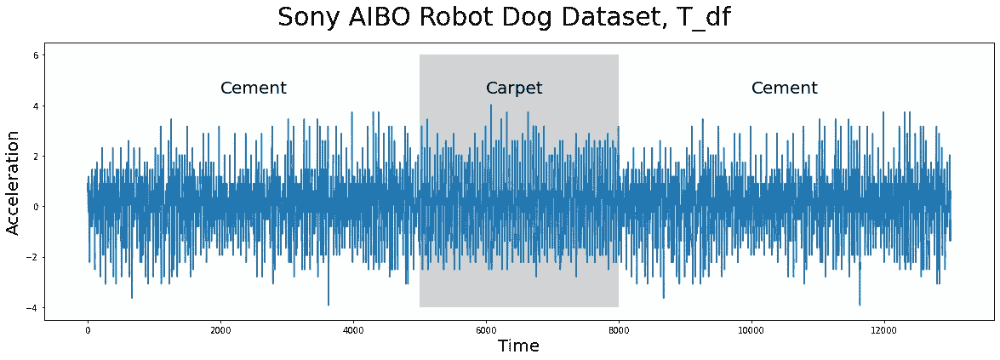
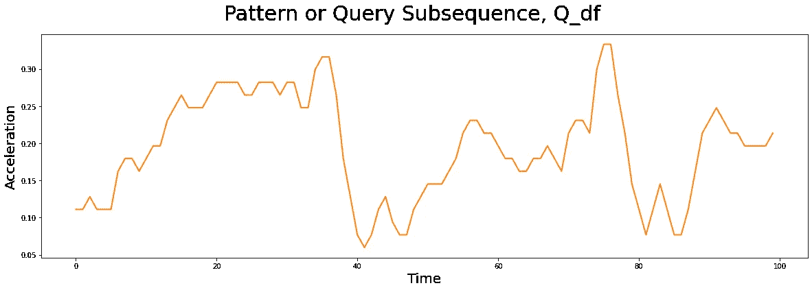
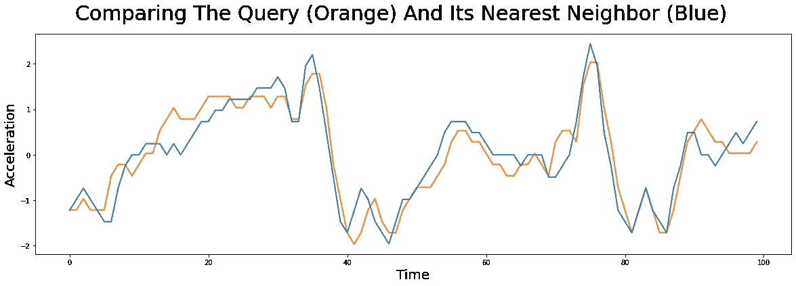
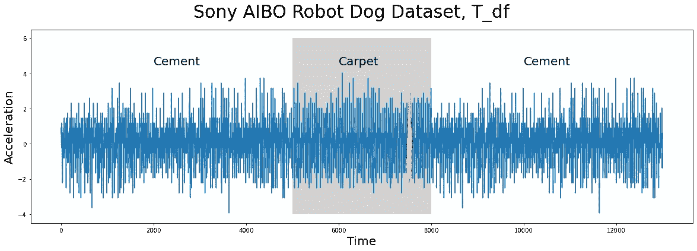
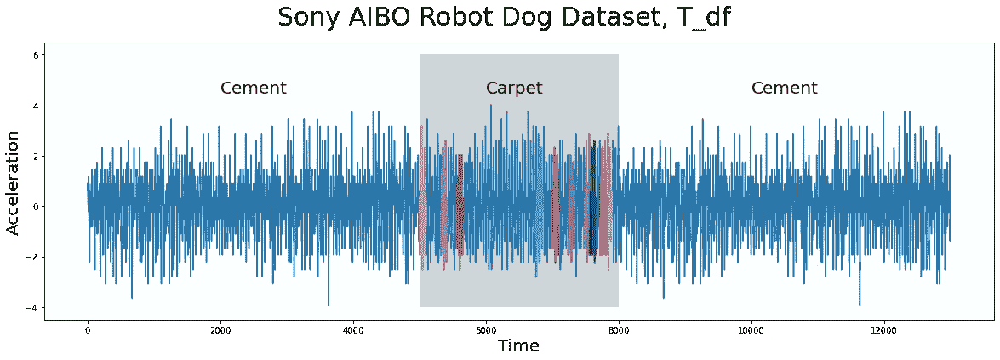

# 第 7 部分:用 STUMPY 进行快速模式搜索

> 原文：<https://towardsdatascience.com/part-7-fast-pattern-searching-with-stumpy-2baf610a8de1?source=collection_archive---------21----------------------->

## 为已知模式寻找相似的子序列匹配


(图片由[史蒂夫·赖特](https://unsplash.com/@stevenwright)提供)

# 整体大于部分之和


(图片由作者提供)

[STUMPY 是一个强大且可扩展的 Python 库，用于现代时间序列分析](https://github.com/TDAmeritrade/stumpy)，在其核心，有效地计算出一种叫做*矩阵轮廓*的东西。这个多部分系列的目标是解释什么是 matrix profile，以及如何开始利用 [STUMPY](https://stumpy.readthedocs.io/en/latest/) 完成所有现代时间序列数据挖掘任务！

*注:这些教程最初出现在* [*STUMPY 文档*](https://stumpy.readthedocs.io/en/latest/tutorials.html) *中。*

第 1 部分:[矩阵轮廓图](/the-matrix-profile-e4a679269692)
第 2 部分: [STUMPY 基础知识](/stumpy-basics-21844a2d2d92)
第 3 部分:[时间序列链](/part-3-time-series-chains-da281450abbf)
第 4 部分:[语义分割](/part-4-semantic-segmentation-b42c3792833d)
第 5 部分:[用 STUMPY 快速近似矩阵轮廓图](/part-5-fast-approximate-matrix-profiles-with-scrump-c6d9c984c560)
第 6 部分:[用于流式时间序列数据的矩阵轮廓图](/matrix-profiles-for-streaming-time-series-data-f877ff6f9eef)
第 7 部分:[用 STUMPY 快速模式搜索](/part-7-fast-pattern-searching-with-stumpy-2baf610a8de1) 10: [发现多维时间序列模体](/part-10-discovering-multidimensional-time-series-motifs-45da53b594bb)
第 11 部分:[用户引导的模体搜索](/part-11-user-guided-motif-search-d3d317caf9ea)
第 12 部分:[机器学习的矩阵轮廓](/part-12-matrix-profiles-for-machine-learning-2dfd98d7ff3f)

# 超越矩阵轮廓

在 STUMPY 的核心，人们可以获取任何时间序列数据，并有效地计算所谓的[矩阵轮廓](https://stumpy.readthedocs.io/en/latest/Tutorial_The_Matrix_Profile.html)，它基本上以固定的窗口大小`m`扫描整个时间序列，并为时间序列中的每个子序列找到最接近的邻居。矩阵配置文件允许您确定数据中是否有任何保守行为(即，保守子序列/模式)，如果有，它可以告诉您它们在时间序列中的确切位置。在[之前的教程](https://stumpy.readthedocs.io/en/latest/Tutorial_STUMPY_Basics.html)中，我们演示了如何使用 STUMPY 轻松获得矩阵轮廓，学习了如何解释结果，以及发现有意义的主题和不一致。虽然当您不知道正在寻找什么模式或保守行为时，这种强力方法可能非常有用，但是对于足够大的数据集，执行这种彻底的成对搜索可能会变得非常昂贵。

然而，如果你已经有一个特定的用户定义的模式，那么你实际上不需要计算完整的矩阵配置文件！例如，您可能已经根据历史股票市场数据确定了一个有趣的交易策略，并且您希望了解过去是否在一个或多个股票代码中观察到了该特定模式。在这种情况下，搜索一个已知的模式或“查询”实际上非常简单，可以通过使用 STUMPY 中出色的`core.mass`函数快速完成。

在这个简短的教程中，我们将采用一个简单的感兴趣的已知模式(例如，一个查询子序列)，我们将在一个单独的独立时间序列中搜索这个模式。我们开始吧！

# 入门指南

让我们导入加载、分析和绘制数据所需的包

```
%matplotlib inline

import pandas as pd
import stumpy
import numpy as np
import numpy.testing as npt
import matplotlib.pyplot as plt
from matplotlib.patches import Rectangle

plt.rcParams["figure.figsize"] = [20, 6]  # width, height
plt.rcParams['xtick.direction'] = 'out'
```

# 加载索尼 AIBO 机器狗数据集

时间序列数据(下图)，`T_df`，有`n = 13000`个数据点，它是从[索尼爱宝机器狗](https://en.wikipedia.org/wiki/AIBO)内部的加速度计收集的，当机器狗从水泥地面走到铺有地毯的地面，最后回到水泥地面时，它跟踪机器狗:

```
T_df = pd.read_csv("https://zenodo.org/record/4276393/files/Fast_Pattern_Searching_robot_dog.csv?download=1")
T_df.head() Acceleration
0  0.89969
1  0.89969
2  0.89969
3  0.89969
4  0.89969
```

# 可视化索尼 AIBO 机器狗数据集

```
plt.suptitle('Sony AIBO Robot Dog Dataset, T_df', fontsize='30')
plt.xlabel('Time', fontsize ='20')
plt.ylabel('Acceleration', fontsize='20')
plt.plot(T_df)
plt.text(2000, 4.5, 'Cement', color="black", fontsize=20)
plt.text(10000, 4.5, 'Cement', color="black", fontsize=20)
ax = plt.gca()
rect = Rectangle((5000, -4), 3000, 10, facecolor='lightgrey')
ax.add_patch(rect)
plt.text(6000, 4.5, 'Carpet', color="black", fontsize=20)
plt.show()
```



(图片由作者提供)

在上面的图中，机器狗在水泥地上行走的时间用白色背景显示，而机器狗在地毯上行走的时间用灰色背景突出显示。你注意到在不同的路面上行走有什么明显的不同吗？有什么有趣的见解可以用人眼观察到？在这个时间序列中是否存在任何保守的模式，如果存在，它们在哪里？

# 你见过这个图案吗？

我们有兴趣在时间序列(上图)中搜索的子序列模式或查询(下图)如下所示:

```
Q_df = pd.read_csv("https://zenodo.org/record/4276880/files/carpet_query.csv?download=1")plt.suptitle('Pattern or Query Subsequence, Q_df', fontsize='30')
plt.xlabel('Time', fontsize ='20')
plt.ylabel('Acceleration', fontsize='20')
plt.plot(Q_df, lw=2, color="C1")  # Walking on cement
plt.show()
```



(图片由作者提供)

这个图案`Q_df`的窗口长度为`m = 100`，它取自一个完全独立的行走样本。是不是一点都不眼熟？类似的模式是否存在于我们更早的时间序列中，`T_df`？您能说出收集这个查询样本时机器狗正在哪个表面上行走吗？

要回答其中的一些问题，您可以通过计算一种称为“距离剖面”的东西，将这个特定的查询子序列或模式与完整的时间序列进行比较。本质上，您获取这个查询，`Q_df`，并通过计算所有可能的(z-归一化欧几里得)成对距离，将其与`T_df`中的每个子序列进行比较。因此，距离轮廓只是一个一维向量，它告诉你`Q_df`与`T_df`中的每个子序列(长度相同)有多相似/不相似。现在，计算距离轮廓的简单算法需要花费`O(n*m)`时间来处理，但幸运的是，我们可以做得比这好得多，因为存在一种称为[“Mueen 的相似性搜索算法”](https://www.cs.unm.edu/~mueen/FastestSimilaritySearch.html) (MASS)的超级有效的方法，它能够以快得多的`O(n*log(n))`时间(`log`基数 2)来计算距离轮廓。现在，如果您只有几个短时间序列要分析，这可能不是什么大问题，但是如果您需要用不同的查询子序列多次重复这个过程，那么事情会很快增加。事实上，随着时间序列的长度`n`和/或查询子序列的长度`m`变得越来越长，朴素算法将花费太多时间！

# 用质量计算距离剖面

因此，给定一个查询子序列`Q_df`和一个时间序列`T_df`，我们可以执行一个快速相似性搜索，并使用 STUMPY 中的`core.mass`函数计算距离分布图:

```
distance_profile = stumpy.core.mass(Q_df["Acceleration"], T_df["Acceleration"])
```

并且，由于`distance_profile`包含了`Q_df`和`T_df`内每个子序列之间的成对距离的完整列表，我们可以通过找到`distance_profile`中的最小距离值并提取其位置索引来从`T_df`中检索最相似的子序列:

```
idx = np.argmin(distance_profile)print(f"The nearest neighbor to `Q_df` is located at index {idx} in `T_df`")zThe nearest neighbor to `Q_df` is located at index 7479 in `T_df`
```

所以，为了回答我们之前的问题“在我们之前的时间序列中是否存在类似的模式，T_df？”，让我们继续在`T_df`中绘制最相似的子序列，它位于索引 7479(蓝色)，并用我们的查询模式`Q_df`(橙色)覆盖它:

```
# Since MASS computes z-normalized Euclidean distances, we should z-normalize our subsequences before plotting
Q_z_norm = stumpy.core.z_norm(Q_df.values)
T_z_norm = stumpy.core.z_norm(T_df.values[idx:idx+len(Q_df)])plt.suptitle('Comparing The Query (Orange) And Its Nearest Neighbor (Blue)', fontsize='30')
plt.xlabel('Time', fontsize ='20')
plt.ylabel('Acceleration', fontsize='20')
plt.plot(Q_z_norm, lw=2, color="C1")
plt.plot(T_z_norm, lw=2)
plt.show()
```



(图片由作者提供)

注意，即使查询子序列不完全匹配它的最近邻，STUMPY 仍然能够找到它！然后，为了回答第二个问题“你能说出当这个查询样本被收集时机器狗正在哪个表面上行走吗？”，我们可以精确地看到`idx`在`T_df`中的位置:

```
plt.suptitle('Sony AIBO Robot Dog Dataset, T_df', fontsize='30')
plt.xlabel('Time', fontsize ='20')
plt.ylabel('Acceleration', fontsize='20')
plt.plot(T_df)
plt.text(2000, 4.5, 'Cement', color="black", fontsize=20)
plt.text(10000, 4.5, 'Cement', color="black", fontsize=20)
ax = plt.gca()
rect = Rectangle((5000, -4), 3000, 10, facecolor='lightgrey')
ax.add_patch(rect)
plt.text(6000, 4.5, 'Carpet', color="black", fontsize=20)
plt.plot(range(idx, idx+len(Q_df)), T_df.values[idx:idx+len(Q_df)], lw=2)
plt.show()
```



(图片由作者提供)

正如我们在上面看到的，与`Q_df`最近的邻居(橙色)是机器狗在地毯上行走时发现的子序列，事实证明，`Q_df`是从机器狗也在地毯上行走的独立样本中收集的！为了更进一步，我们可以查看顶部`k = 16`最近邻居的位置，而不是提取唯一的顶部最近邻居:

```
# This simply returns the (sorted) positional indices of the top 16 smallest distances found in the distance_profile
k = 16
idxs = np.argpartition(distance_profile, k)[:k]
idxs = idxs[np.argsort(distance_profile[idxs])]
```

然后让我们根据它们的索引位置来绘制所有这些子序列:

```
plt.suptitle('Sony AIBO Robot Dog Dataset, T_df', fontsize='30')
plt.xlabel('Time', fontsize ='20')
plt.ylabel('Acceleration', fontsize='20')
plt.plot(T_df)
plt.text(2000, 4.5, 'Cement', color="black", fontsize=20)
plt.text(10000, 4.5, 'Cement', color="black", fontsize=20)
ax = plt.gca()
rect = Rectangle((5000, -4), 3000, 10, facecolor='lightgrey')
ax.add_patch(rect)
plt.text(6000, 4.5, 'Carpet', color="black", fontsize=20)for idx in idxs:
    plt.plot(range(idx, idx+len(Q_df)), T_df.values[idx:idx+len(Q_df)], lw=2)
plt.show()
```



(图片由作者提供)

不出所料，当机器狗在地毯(灰色)上行走时，可以找到与`Q_df`最近的前`k = 16`(或最佳匹配，如上多种颜色所示)！

# 摘要

就是这样！您现在已经获得了一个感兴趣的已知模式(或查询)，使用 STUMPY 在`core.mass`中运行它，并且您能够在另一个时间序列中快速搜索这个模式。有了这些新发现的知识，你现在可以在你自己的时间序列项目中寻找模式。编码快乐！

# 附加注释-具有非归一化欧几里得距离的距离剖面

有时，您可能希望使用非归一化的欧几里德距离作为相似性/不相似性的度量，因此，您可以使用`core.mass_absolute`函数，而不是使用`core.mass`(在计算成对欧几里德距离之前，首先对您的子序列进行 z 归一化)。这是为那些对计算互补的`stumpy.aamp`、`stumpy.aamped`、`stumpy.gpu_aamp`和`stumpy.ammpi`函数中可用的非归一化矩阵轮廓感兴趣的人提供的。

# 奖金部分——是什么让质量如此之快？

MASS 比简单方法快得多的原因是因为 MASS 使用快速傅立叶变换(FFT)将数据转换到频域，并执行所谓的“卷积”，这将`m`操作减少到`log(n)`操作。你可以在最初的 [Matrix Profile I 论文](https://www.cs.ucr.edu/~eamonn/PID4481997_extend_Matrix%20Profile_I.pdf)中了解更多信息。

下面是计算距离剖面的一个简单实现:

```
def compute_naive_distance_profile(Q, T):
    Q = Q.copy()
    T = T.copy()
    n = len(T)
    m = len(Q)
    naive_distance_profile = np.empty(n - m + 1) start = time.time()
    Q = stumpy.core.z_norm(Q)
    for i in range(n - m + 1):
        naive_distance_profile[i] = np.linalg.norm(Q - stumpy.core.z_norm(T[i:i+m]))
    naive_elapsed_time = time.time()-start print(f"For n = {n} and m = {m}, the naive algorithm takes {np.round(naive_elapsed_time, 2)}s to compute the distance profile") return naive_distance_profile
```

对于随机时间序列`T_random`，有一百万个数据点和一个随机查询子序列`Q_random`:

```
Q_random = np.random.rand(100)
T_random = np.random.rand(1_000_000)naive_distance_profile = compute_naive_distance_profile(Q_random, T_random)For n = 1000000 and m = 100, the naive algorithm takes 44.1s to compute the distance profile
```

朴素算法需要半分多钟来计算！然而，MASS 可以在大约 1 秒钟内处理这个(甚至更大的数据集):

```
start = time.time()
mass_distance_profile = stumpy.core.mass(Q_random, T_random)
mass_elapsed_time = time.time()-startprint(f"For n = {len(T_random)} and m = {len(Q_random)}, the MASS algorithm takes {np.round(mass_elapsed_time, 2)}s to compute the distance profile")For n = 1000000 and m = 100, the MASS algorithm takes 1.13s to compute the distance profile
```

为了绝对确定，让我们确保并检查两种方法的输出是否相同:

```
npt.assert_almost_equal(naive_distance_profile, mass_distance_profile)
```

成功，没有错误！这意味着两个输出是相同的。来吧，试一试！

# 资源

[欧氏距离下时间序列子序列的最快相似性搜索算法](http://www.cs.unm.edu/~mueen/FastestSimilaritySearch.html)
[STUMPY 矩阵概要文档](https://stumpy.readthedocs.io/en/latest/)
[STUMPY 矩阵概要 Github 代码库](https://github.com/TDAmeritrade/stumpy)

## ← [第 6 部分:流式时间序列数据的矩阵剖面图](/matrix-profiles-for-streaming-time-series-data-f877ff6f9eef) | [第 8 部分:AB-Joins with STUMPY](/part-8-ab-joins-with-stumpy-af985e12e391) →