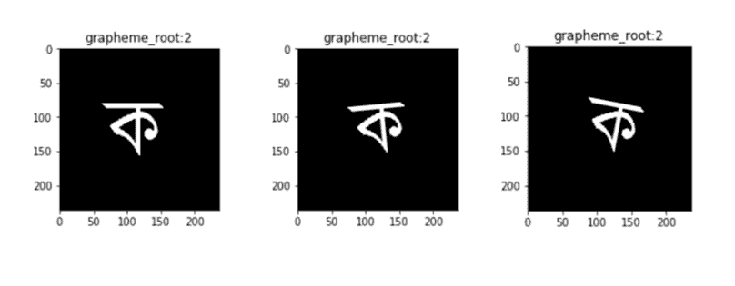
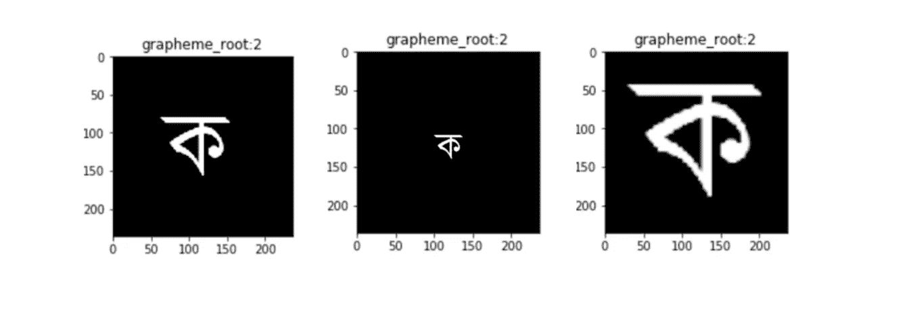

# 第二部分:孟加拉语。人工智能手写字素分类模型增强

> 原文：<https://towardsdatascience.com/part-ii-bengali-ai-handwritten-grapheme-classification-model-enhancements-20961b0805f?source=collection_archive---------55----------------------->

## 探索 CNN 图像分类模型的改进

*工作主持人:* [*大卫·柯布迪*](https://medium.com/u/abe8cf70429?source=post_page-----20961b0805f--------------------------------)*[*杰森·卡茨*](https://medium.com/u/da8692cb0f64?source=post_page-----20961b0805f--------------------------------)*[*迈克尔·哈德*](https://medium.com/u/8c20c2ac3641?source=post_page-----20961b0805f--------------------------------)*[*奈娜·沃顿*](https://medium.com/u/29b5f12bdec0?source=post_page-----20961b0805f--------------------------------)***

****查看** [**系列第一部分**](/bengali-ai-handwritten-grapheme-classification-adaa73762754) **和** [**第三部分**](https://medium.com/@michael_harder/part-iii-bengali-ai-handwritten-grapheme-classification-final-model-725daee16102)**

****[**更新型号笔记本**](https://www.kaggle.com/jasonkatz33/cnn-draft)****

****[**转移模型笔记本**](https://www.kaggle.com/jasonkatz33/transfer-cnn)****

****跟进我们的第一篇文章，其中我们概述了我们的基线模型；制作这篇文章是为了进一步记录我们团队在孟加拉卡格尔[比赛中的努力。AI 手写字形分类大赛](https://www.kaggle.com/c/bengaliai-cv19)。总之，我们的目标是使用卷积神经网络(CNN)对手写孟加拉字符的图像进行分类。我们在这个过程中的最初步骤已经在上面链接的最初文章中介绍过了。在这里，我们记录了我们采取的额外步骤，如数据扩充、迁移学习、ResNet 和超参数调整，以改进我们的基线模型。****

****正如我们在上一篇文章中提到的，我们希望使用数据增强来扩展我们的训练数据集，并创建一个更强大的模型。数据扩充是通过操纵现有图像的空间方向和大小来改变训练集中的现有图像从而生成新图像的过程。潜在的想法是，这些改变的图像可能类似于现实生活和测试数据集中可能出现的变化。对于手写的孟加拉字符，很明显，对于给定的字素词根、发音元音和发音辅音会有轻微的变化。因此，我们希望用增强图像训练模型将防止过度拟合，并正确地分类字符的轻微变化。****

****出于我们的目的，我们应用了三种不同的数据增强技术。我们使用的函数来自 Keras 中的 *ImageDataGenerator* 类，它清晰地输出与输入维数相同的图像。我们首先在 Keras 中实现了旋转功能，旋转范围为 5 度。这将产生新生成的训练图像，这些图像将在-5 度和+5 度之间随机旋转(见图 1)。****

********

****图 1****

****另外，我们上下左右移动了图像。这是由 Keras 类 *ImageDataGenerator* 中的宽度和高度移动参数 *width_shift_range* 和 *height_shift_range* 实现的。 *width_shift_range* 函数将随机将图像向左或向右移动图像总宽度的一定百分比。高度功能以类似的方式运行(见图 2)。****

********

****图 2****

****最后，我们应用了随机缩放论证。这个函数随机放大和缩小图像(见图 3)。由于数据的性质(即人们不写翻转的字母)，我们没有实现垂直翻转、水平翻转和反射参数。我们用来训练卷积神经网络(CNN)的图像是灰度的；因此，操纵颜色通道也是无益的。****

********

****图 3****

****尽管我们做出了努力，我们使用的数据扩充程序并没有显著改善我们的模型。这可能与用于训练模型的图像已经有相当多的变化这一事实有关，因为它们已经是手写图像(天生就有变化)。换句话说，训练集已经具有这些增强技术将模拟的变化。****

****下一个改进我们模型的尝试是通过迁移学习。我们首先调查了 Keras 网页上记录的一个玩具例子。示例模型的任务是在流行的 MNIST 数据集中对手写数字从 0 到 9 进行分类。迁移学习的玩具例子是通过在 MNIST 数据集的前五个数字(0-4)上训练 CNN 来执行的。接下来，冻结卷积层，添加然后调整密集层，以对最后五位数字(5–9)进行分类。使用这种方法，在第一个五位分类器上五个时期之后，CNN 具有 99.8%的测试准确度，并且在对原始分类器进行调整和实施迁移学习之后，对于最终的五位分类器具有 99.2%的测试准确度。我们的团队复制了这种方法，并在一个类别子集上训练了一个神经网络，然后使用这些训练好的权重来分类下一个类别子集。我们发现这种方法收效甚微。这种方法可能受益于额外的时间，然而，该技术在 MNIST 数据集上的成功是有意义的，因为神经网络只需分类 10 个类。相比之下，当组合所有的字素词根、元音发音符号和辅音发音符号时，我们的数据集总共有 186 个类。****

****我们下一次迁移学习的尝试源于我们在关于这个项目的上一篇文章的*“后续步骤”*部分提到的一篇论文。我们发现了 2019 年 2 月发表的一篇有趣的论文，该论文使用迁移学习来构建深度 NN。我们试图通过迁移学习来利用他们在 GitHub 存储库中公开发布的权重和代码。已发表的模型在“BanglaLekha-Isolated 数据集”(Chatterjee et al .，2019)上经过 47 个历元后，准确率达到 96.12%。不幸的是，在尝试利用该模型的权重进行迁移学习时，我们在配置过程中遇到了错误，这使我们无法继续沿着这条道路前进。****

****最后，我们尝试使用 Keras 的内置图像分类器进行迁移学习，该分类器已经在一个名为 ImageNet 的大型图像库中进行了训练。ImageNet 分类器权重在彩色(RGB)图像上训练。为了利用分类器，我们首先成功地将灰度图像转换为 RGB 图像。然而，当我们在 CNN 上添加新的可调密集层时，我们的计算能力最终限制了我们使用冻结的 ImageNet 权重。我们遇到了许多内存过载错误。为了解决这个问题，如果有必要的资金，我们可以尝试使用谷歌云计算来完成这项任务。****

****在尝试了迁移学习和数据扩充之后，我们试图实现一个模仿 ResNet 结构的 CNN。ResNet 是一个*“剩余学习框架，它简化了比以前使用的网络更深入的网络训练，”*正如建模技术的创造者，康奈尔大学的计算机科学家所说。当何等人在 2015 年发表“*图像识别深度残差学习”*时，人们普遍认为卷积神经网络的深度对模型的预测能力有很大影响。要了解原因，我们需要回到 1958 年和 1959 年。在那些年里，神经生理学家大卫·H·哈贝尔和托尔斯滕·威塞尔对猴子和猫进行了研究，以理解和充实视觉机制。他们发现“*视觉皮层中的许多神经元有一个小的局部感受野，这意味着它们只对位于视野有限区域的视觉刺激做出反应。”*****

********

****图 4([https://www . research gate . net/figure/Natural-scenes-and-curvature-detection-a-photo-of-Torsten-Wiesel-and-David-Hubel _ fig 1 _ 311479268](https://www.researchgate.net/figure/Natural-scenes-and-curvature-detection-a-Photograph-of-Torsten-Wiesel-and-David-Hubel_fig1_311479268))****

****简而言之，研究人员意识到，每个神经元都部分处理图片，只专注于入射光子平面上的特定区域。科学家们还意识到图像是分等级处理的；这意味着每一级神经元关注图像的不同复杂程度，模型越深入，复杂性就越大。结果，当较低层次识别垂直线时，第二层检测线条图案，第三层识别完整的彩虹等等。每个人都认为，以同样的方式通过卷积网络传递的信息会无限地变得更加复杂，从而更加准确地分类。何等人证明了这一观点是不正确的(见图 5)。****

********

****图 5([https://arxiv.org/abs/1512.03385](https://arxiv.org/abs/1512.03385))****

****研究人员举例说明，随着模型深度的增加，模型的性能会突然快速下降。他们假设消失梯度问题是网络训练时权重剩余减少的结果，导致性能下降。尽管这不是何等人提出的解决方案所要解决的主要问题，但由于消失梯度对非线性 ReLU 函数来说并不是一个大的威胁，所以它还是值得一提的。****

****创建残差网络是为了简化模型训练；"*当你初始化一个正则网络时，它的权值接近于零，所以网络只是输出接近于零的值。如果添加跳过连接，生成的网络仅输出其输入的副本；换句话说，它最初为身份功能建模。如果目标函数相当接近身份函数(这是经常发生的情况)，这将大大加快训练速度。*当何等人的开创性论文发表时，这一想法是革命性的，因为它允许信号轻松地穿过网络。ResNet 也可以解释为一堆 ru，每个残差单元就像一个小型神经网络(每个快捷连接覆盖一个完整的网络)。****

****我们使用 ResNet 快捷方式进行连接，使我们的模型更加高效和有效的训练。然而，与我们的预期相反，该模型在准确性和损失方面表现差 5%至 10%，准确性低于我们以前的任何尝试。****

********

****图 6([https://machine learning mastery . com/how-to-implementing-major-architecture-innovations-for-卷积神经网络/](https://machinelearningmastery.com/how-to-implement-major-architecture-innovations-for-convolutional-neural-networks/) )****

****我们假设孟加拉字母识别的身份和目标功能不相似，因为我们试图在同一张图片上使用 3 种不同的模型对 3 种不同的特征进行分类。因此，没有单一的标识函数可以映射单一的字形。****

****超参数调整对于训练是必不可少的，因为改进神经网络很大程度上是由于启发式。测试特定参数的不同组合可以显著提高模型的整体性能。我们调整了以下超参数:步幅、填充、卷积层数、滤波器数量和卷积的内核大小。****

****跨距是对图像中像素区域之间重叠程度的度量。步幅越大，丢失的信息就越多。填充是指用零值框住图像的边缘，以捕捉图像中的所有像素值。如果不对图像进行填充，图像边缘的像素值会丢失，从而导致潜在的大量信息丢失。过滤器是卷积层的组件，它们被训练来识别某种模式，如图像中的对角线。当过滤器“看到”图案时，它们被激活并触发。****

****虽然填充和步幅的调整对验证准确性没有影响，但卷积层数和内核大小的调整有影响。原始模型有 5 个卷积层，核大小为[7，3，3，3，3]，滤波器维数为[64，128，128，256，256]。在对这两个参数进行调整之后，更新的模型具有 7 层，核大小为[5，3，3，3，3，3]，滤波器维数为[32，64，64，128，128，256，256]。****

****通过调整不同的超参数，并将总的历元数增加到 10，我们提高了模型三个不同部分的精度值。****

****与我们的原始模型类似，字形根分类任务对于训练集具有最低的准确度分数 0.7973，对于验证集具有最低的准确度分数 0.7718(参见图 7)。虽然这些值仍然与辅音和元音音调符号分类的值一样高，但是当我们考虑到该模型需要正确地分类 168 个手写字素词根时，准确度分数是相当显著的。此外，我们原始模型的验证精度为 0.6963，因此我们能够将总体精度提高 10.8%。****

****图 8 是元音发音符号的训练和验证准确度分数的曲线图。CNN 的元音发音成分的训练精度为 0.9496，验证精度为 0.9277，略高于原始验证精度 0.9185。****

****辅音发音符号组件的训练精度为 0.9557。验证准确度为 0.9373(见图 9)。这比我们的基线模型验证精度 0.9209 有所提高。****

****虽然我们的团队对这些结果感到满意，这是对我们基线模型的改进，但我们的目标是通过利用谷歌云计算取得进一步进展。GCP 将为进一步的调整、更深的网络提供额外的计算能力，并有可能让我们克服在尝试使用迁移学习时遇到的内存过载问题。****

********

****图 7****

********

****图 8****

********

****图 9****

******资源:******

*****数据增强:*[https://machine learning mastery . com/how-to-configure-image-Data-Augmentation-when-training-deep-learning-neural-networks/](https://machinelearningmastery.com/how-to-configure-image-data-augmentation-when-training-deep-learning-neural-networks/)，[https://keras.io/preprocessing/image/](https://keras.io/preprocessing/image/)，[https://towards Data science . com/exploring-image-Data-Augmentation-with-keras-and-tensor flow-a 8162d 89 b 844](/exploring-image-data-augmentation-with-keras-and-tensorflow-a8162d89b844)****

*****转学:*【https://keras.io/examples/mnist_transfer_cnn/】T2，【https://arxiv.org/html/1902.11133】T4，[https://github.com/swagato-c/bangla-hwcr-present](https://github.com/swagato-c/bangla-hwcr-present)****

*****ResNet:*[https://www . researchgate . net/figure/Natural-scenes-and-curvature-detection-a-photo-of-Torsten-Wiesel-and-David-Hubel _ fig 1 _ 311479268](https://www.researchgate.net/figure/Natural-scenes-and-curvature-detection-a-Photograph-of-Torsten-Wiesel-and-David-Hubel_fig1_311479268)，[https://machinelingmastery . com/how-to-implementation-major-architecture-innovations-for-convolutionary-neural-networks/](https://machinelearningmastery.com/how-to-implement-major-architecture-innovations-for-convolutional-neural-networks/)，[https://arxiv.org/abs/1512.03385](https://arxiv.org/abs/1512.03385)，****

*****正文引用:*第。471 Ch。14:使用 CNN 的深度计算机视觉；盖伦，奥雷连恩。"使用 Scikit-Learn、Keras 和 TensorFlow 进行机器实践学习，第二版."*奥赖利在线学习*，奥赖利媒体公司。****