# 第二部分:利用人工智能打击假新闻

> 原文：<https://towardsdatascience.com/part-ii-using-a-i-to-combat-fake-news-modeling-update-d6931ff0f519?source=collection_archive---------64----------------------->

## 基于[竞赛](http://www.fakenewschallenge.org/)获胜模式

*所进行的工作:* [*大卫·柯布迪*](https://medium.com/u/abe8cf70429?source=post_page-----725daee16102----------------------)*[*杰森·卡茨*](https://medium.com/u/da8692cb0f64?source=post_page-----725daee16102----------------------)*[*迈克尔·哈德*](https://medium.com/u/8c20c2ac3641?source=post_page-----725daee16102----------------------)*[*奈娜·沃顿*](https://medium.com/u/29b5f12bdec0?source=post_page-----725daee16102----------------------)***

*第一部分:利用人工智能打击假新闻*

*[第三部:利用人工智能打击假新闻最终模式](/part-iii-using-a-i-to-combat-fake-news-final-model-933f75657ae0)*

*在这篇关于假新闻分类的后续文章中，我们将介绍我们自己的更新模型，并带您了解相关步骤。简而言之，手头的任务由 49，972 个观测值组成。在这 49，972 人中，约有 75%或 36，545 人属于“无关”阶层。任务的目标是将输入数据分类为(1)同意，(2)不同意，(3)讨论或(4)不相关，输入数据是文章的标题及其相关的文章正文。讨论标签妥协了 17.8% (8，8,909 obs。)的数据，其次是同意标签(7.3%)和不同意标签(1.68%)。*

*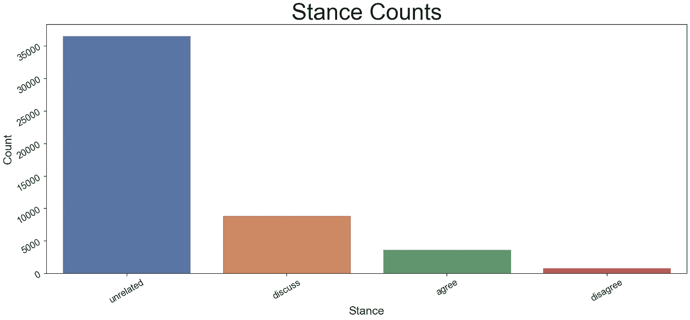*

*图 1 —站姿计数的条形图。这是一个不平衡的数据集。*

*[竞赛网站](http://www.fakenewschallenge.org)为参赛选手提供训练集和测试集，以及加权准确率达到 79.53%的基线 GradientBoosting 分类器。任务是一个多标签多类问题，其中网络需要首先决定标题和正文是**相关**还是**不相关**，然后，如果两者相关，则将它们的关系归类为**同意**、**不同意**或**讨论**。*

*参赛作品的准确性分数通过比赛组织者给出的函数计算得出，可总结为:*

*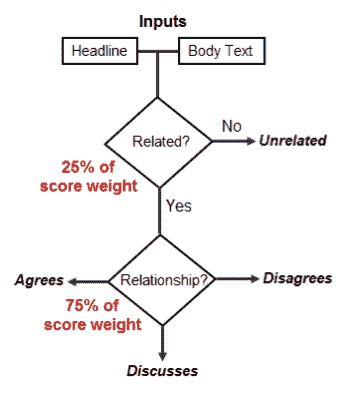*

*图 2 —竞赛的评分结构*

## *获奖模型*

*获胜的模型具有 82.02%的准确率，是我们在这个项目中试图改进的模型。获胜模型的神经网络体系结构如下:*

*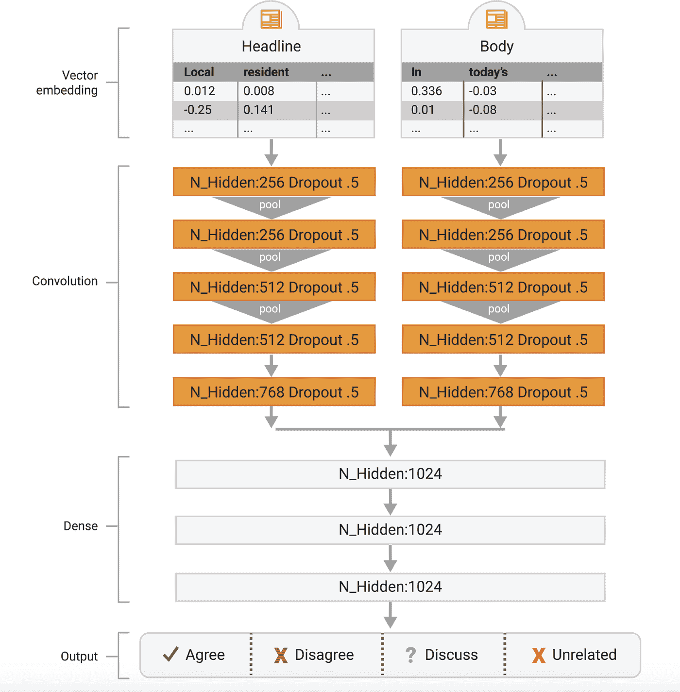*

*图 3 —竞争获胜的 CNN 模型结构([https://github . com/Cisco-Talos/fnc-1/tree/master/deep _ learning _ model](https://github.com/Cisco-Talos/fnc-1/tree/master/deep_learning_model))*

*该模型的架构将问题视为多类别、多标签问题，并将输入(标题文本和正文)输入网络。然而，在这样做的时候，它们使用不同的嵌入层，为标题和/或正文定制，随后在网络中连接输入。输入通过一系列相同的卷积层，最终通过一系列级联后的密集层。网络的最后一层是具有 4 个张量的密集层，代表 2 个类别及其 3 个(同意、不同意、讨论)和 1 个标签(相关、不相关)。*

*然而，该模型不在神经网络中处理工程特征，例如关于文本的情感特征。相反，模型的架构师选择使用 XGBoost 分类器对数据进行分类。*

*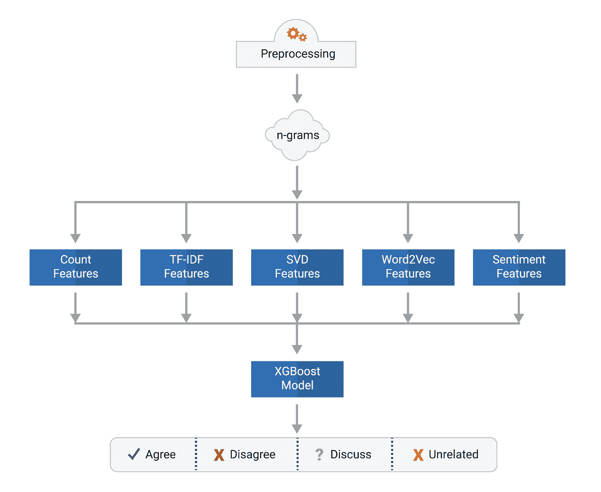*

*图 4 —竞赛获奖 XGBoost 模型结构(【https://github.com/Cisco-Talos/fnc-1/tree/master/tree_model】T2)*

*然后，他们将 CNN 和 XGBoost 这两个模型结合起来，用加权平均进行预测。用这种技术，它们达到 82.02%。*

# *我们的模型*

*我们的模型改进了两个要点:(1)将问题视为分类问题，以及(2)将工程特征输入 CNN。*

## *将问题重新定义为分类*

*竞赛定义的问题，如上所述，本质上是一个多标签多类问题。然而，我们不必作为一个整体来解决它。我们可以将问题分成两个主要部分，在这里我们为两种不同的分类训练模型。*

*第一个模型是对标题和正文是否相关进行分类。这个模型包括标题、正文、工程特征和标签。但需要注意的是，竞赛给出的数据并没有任何名为“相关”的标签。相反，如果相关，数据简单地将标题/正文关系分类为同意/不同意/讨论。因此，我们需要创建一个新的数据集，用标签“相关”代替“同意/不同意/讨论”。为此，我们只需使用以下代码块:*

*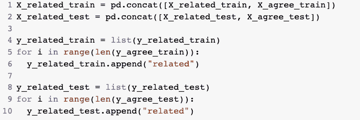*

*图 5 —数据预处理代码*

*我们将 agree 数据集(指仅具有“相关”标题/正文对的数据集)与仅具有“不相关”标签的相关数据集连接起来。然后，我们简单地对标签中不是“无关”和“相关”的任何内容进行编码。这也允许我们使用整个数据集来训练相关/不相关的模型。重要的是要记住在拼接后对新数据帧进行洗牌。如果没有它，数据集标签将在开始和结束时被极化。(上方无关，下方相关)。*

*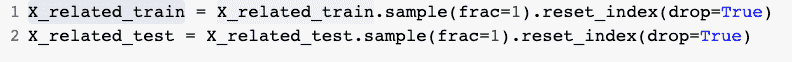*

*图 6 —数据采样代码*

*第二个模型简单地将标题和正文的关系分为同意/不同意/讨论。第二个模型的数据集明显小于第一个模型的数据集。这是因为整个数据中只有 25%实际上被归类为“相关”。还需要注意的是，这两个模型是相同的。*

## *模型架构*

*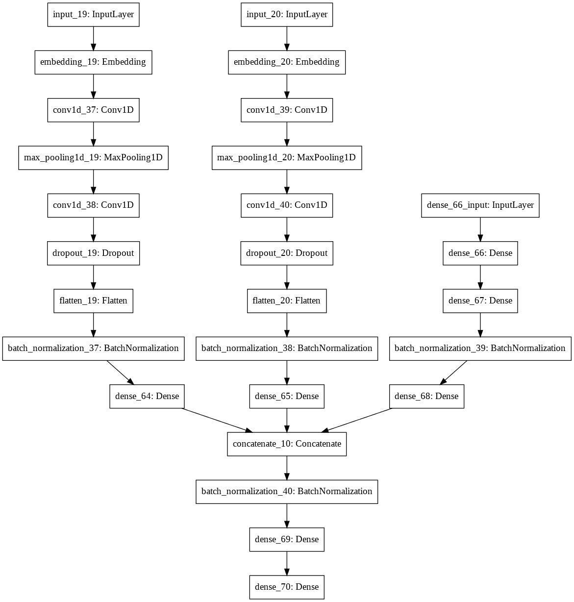*

*图 7 —具有三个输入的初始模型架构。一个是标题的卷积层，一个是正文的卷积层，一个是工程特征的密集层。*

*我们没有使用 XGBoost，而是决定为网络创建第三个输入，由密集层组成。该输入将是矩阵 nx3，其中 n 是观察的数量，3 表示三个工程特征:[“fk _ scores”、“word_count”、“num _ grammar _ errors”]。所有这三个特征都是针对身体的。fk_score 是一个广泛使用的语言指标，用来衡量文章所用语言的复杂程度。Flesch-Kincaid 等级测试是一种可读性测试，旨在表明一篇英语文章的理解难度。其计算方法如下:*

*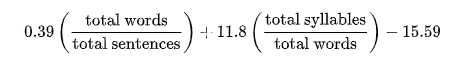*

*图 8——flesch-Kincaid 等级水平公式*

*该函数的结果是一个与美国年级相对应的数字。“num_grammar_errors”是使用一个名为[语言工具](https://bitbucket.org/spirit/language_tool/src/default/)的程序计算出来的，该工具可以检查文本中的语法错误。该模型由两个嵌入不同的细胞神经网络和一个密集网络组成。这三个层随后会聚并连接，在预测之前被处理另外几个密集层。*

## *卷积层*

*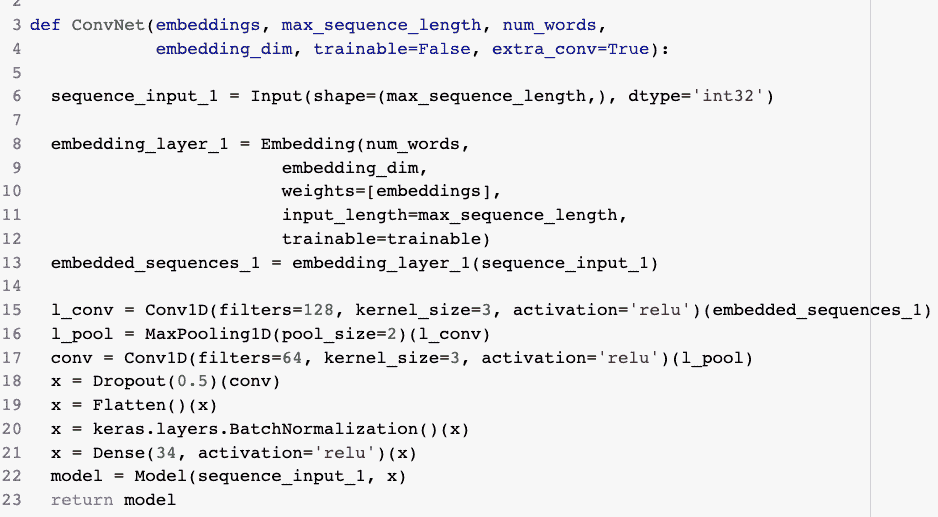*

*图 CNN 的代码*

*卷积网络(模型的输入 1 和输入 2)遵循具有两个卷积层的简单架构。它们输出具有 34 个张量的密集层，然后连接到连接层。*

*嵌入层作为网络的第一层，使用之前使用 Google 的 word2vec 计算的嵌入权重进行初始化。*

*在我们训练嵌入权重之前，我们通过去掉标点符号，然后将文本标记为单词数组来处理输入数据。我们考虑过使用一种语言词根简化方法，将单词转换成它们的词根。使得“**描述**”、“**描述【T3”)，都变成了“**描述**”。然而，由于嵌入问题，我们决定在这个版本的模型中不使用根。***

*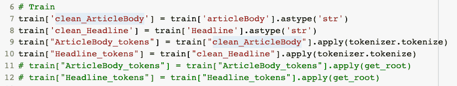*

*图 10 —创建训练数据的代码*

**

*图 11 —寻根代码*

*然后我们导入 Google 已经在数十亿篇新闻文章上训练过的 word2vec:*

*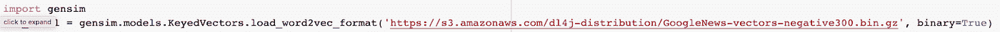*

*图 12 —导入 word2vec 的代码*

*然后，在单个嵌入矩阵创建方法中，我们为一致数据集和相关数据集分别传入模型的标题和主体。这为我们提供了 4 个矩阵，用于两种分类的 2 个不同模型。*

*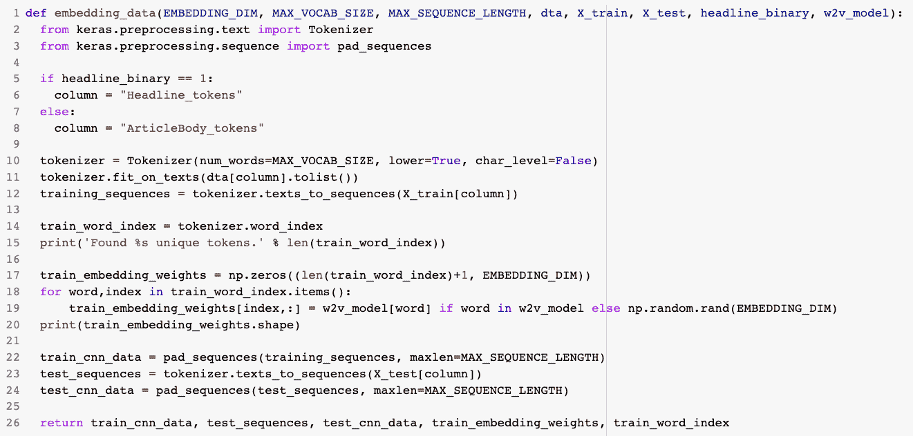*

*图 13 —数据嵌入代码*

## *致密层*

*网络的密集层也非常简单。我们使用了以下架构:*

*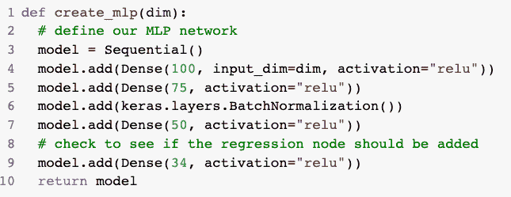*

*图 14 —创建 MLP 的代码*

*需要注意的是，虽然我们没有为它编写代码；我们使用 LabelEncoding 和 StandardScaler 对工程特征和标签进行预处理。在标签编码之后，我们对多标签同意/不同意/讨论模型使用了一次热编码。*

# *结果*

*计算竞争分数所描述的加权准确度分数，其中分数的四分之一对应于正确地将标题-正文对分类为相关或不相关，分数的剩余部分对应于正确地将标题-正文对表征为同意、不同意或正文讨论标题的准确度分数。从下面的图表中我们可以看到，将标题-正文对分类为相关或不相关的准确率为 73.13%。*

*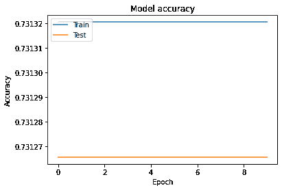*

*图 15 —测试准确率为 73.12%的训练结果*

*令人惊讶的是，在这 8 个时期中，训练和测试分数保持不变。下图显示了第二个 CNN 的准确性得分，它将标题-正文对分为同意、不同意或讨论类别。如前所述，只有大约 25%的数据被输入到第二 CNN 中，因为其他 75%在第一 CNN 中被分类为不相关。在 4 个时期之后，训练准确度分数为 96.01%，并且测试准确度分数为 94.97%。整体加权准确率得分为 89.51% = 73.13*( ) + 94.97*)，显著高于基线模型得分 79.53%。*

**

*图 16 —测试准确率为 94.97%的训练结果*

*此外，虽然该分数是针对测试集的，而不是竞争中使用的最终测试数据，因此不能直接进行比较，但仍然需要注意的是，获胜模型的准确度分数为 82.02%。因此，我们可以假设上面概述的模型比获胜的模型表现得更好。*

# *后续步骤*

## *训练你自己的 word2vec*

*改进模型的一个方法是为自己的语料库训练自己的 word2vec。由于这需要一个非常大的数据集来训练，我们可以简单地导入 Google 的 word2vec，然后使用 TFIDF 嵌入来根据我们较小的数据集训练已经训练好的权重。*

*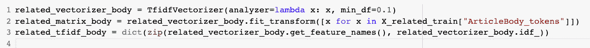*

*图 TFIDF 嵌入代码*

*为此，首先需要计算向量空间中的 TFIDF 值，这可以通过使用 TfidfVectorizer 轻松完成。*

*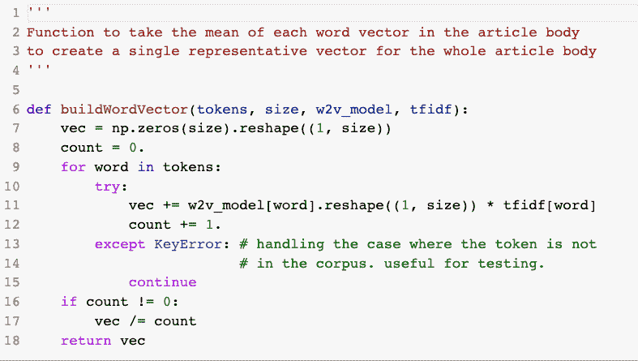*

*图 18 —构建 word2vec 的代码*

*一旦完成，然后你构建一个函数，根据之前计算的 TFIDF 矩阵更新 Google 的 word2vec 矩阵。*

*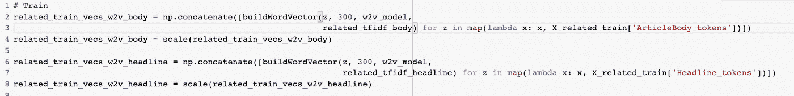*

*图 19 —建筑矩阵代码*

*然后，我们简单地使用新的权重将标记化的单词转换到向量空间。这一过程还允许用户跳过嵌入层，只需将输入馈入卷积层。*

*我们试图使用这种方法来构建一个更加定制化的 word2vector 空间，然而这一过程证明了其计算开销很大。因此，我们计划在项目的最后阶段这样做。*

## *建立一个多标签多类的单一模型，而不是两个模型*

*我们可以改进该项目的另一种方法是使网络更类似于获胜模型的网络。这意味着将问题视为多标签多类问题，而不是两个单独的分类问题。*

*有两种方法可以做到这一点。(1)我们简单地不创建两个数据集作为同意数据集和相关数据集来馈入网络，而是简单地馈入具有多类、多标签目标变量的单个数据集。(2)我们仍然有两个网络，但是它们在做出预测之前收敛。最后一层是具有 4 个张量的稠密层，将问题视为多标签多类问题。*

## *上采样*

*我们可以在相关模型中使用上采样，使数据集更加平衡。相关模型以 73%的准确度预测天平的准确度。数据的平衡已经达到 75%,其中 75%的数据集被归类为不相关。*

## *附加数字*

*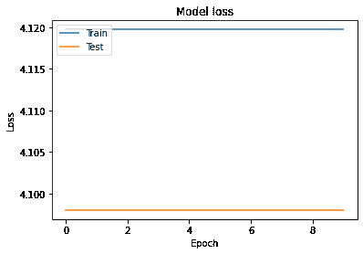*

*图 20 —与培训相关/无关的模型损失*

*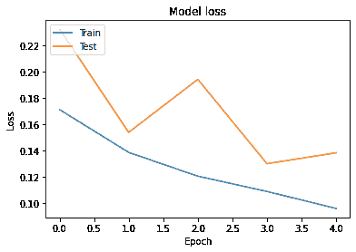*

*图 21-训练标题-正文对模型损失*

# *参考*

*训练 Google 的 Word2Vec 或创建自己的 word 2 vec 的两种不同技术。是部署技术的绝妙指南:[*https://towards data science . com/natural-language-processing-class ification-using-deep-learning-and-word 2 vec-50 cbad 3 BD 6a*](/natural-language-processing-classification-using-deep-learning-and-word2vec-50cbadd3bd6a)*

**Github Repo 为竞赛中使用余弦连接的第三个最佳模型，当连接神经网络的输入时:*[*https://github.com/uclnlp/fakenewschallenge*](https://github.com/uclnlp/fakenewschallenge)*

**解释 CNN 为什么以及如何与 NLP 任务一起工作:*[*https://medium . com/saarthi-ai/sentence-class ification-using-convolutionary-neural-networks-ddad 72 c 7048 c*](https://medium.com/saarthi-ai/sentence-classification-using-convolutional-neural-networks-ddad72c7048c)*

**编写多输入 keras 模型的文档:*[*https://www . pyimagesearch . com/2019/02/04/keras-multiple-inputs-and-mixed-data/*](https://www.pyimagesearch.com/2019/02/04/keras-multiple-inputs-and-mixed-data/)*

**2013 年发表的开创性 Word2Vec 论文:*[*https://arxiv.org/pdf/1301.3781.pdf*](https://arxiv.org/pdf/1301.3781.pdf)*

**为 NLP 任务编写多通道 keras 模型的文档:*[*https://machine learning mastery . com/develop-n-gram-channel-convolutionary-neural-network-opinion-analysis/*](https://machinelearningmastery.com/develop-n-gram-multichannel-convolutional-neural-network-sentiment-analysis/)*

**关于 NLP 如何在纯数学空间中与不同技术一起工作的解释:*[*https://towardsdatascience . com/NLP-learning-series-part-1-text-preprocessing-methods-for-deep-learning-20085601684 b*](/nlp-learning-series-part-1-text-preprocessing-methods-for-deep-learning-20085601684b)*

**Github 的矢量器方法示例:*[*https://Github . com/Cisco-Talos/fnc-1/blob/master/deep _ learning _ model/vectors . py*](https://github.com/Cisco-Talos/fnc-1/blob/master/deep_learning_model/Vectors.py)*