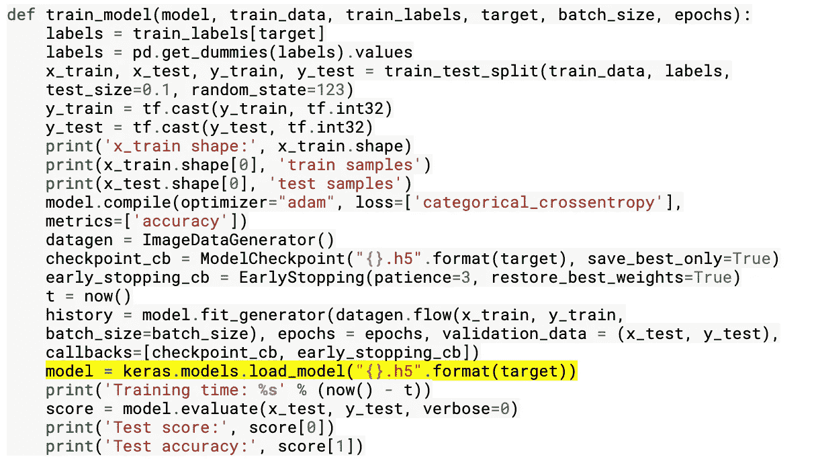

# 第三部分:孟加拉语。人工智能手写字形分类最终模型

> 原文：<https://towardsdatascience.com/part-iii-bengali-ai-handwritten-grapheme-classification-final-model-725daee16102?source=collection_archive---------51----------------------->

## 总结和归纳我们的项目

*工作主持人:* [*大卫·柯布迪*](https://medium.com/u/abe8cf70429?source=post_page-----725daee16102--------------------------------)*[*杰森·卡茨*](https://medium.com/u/da8692cb0f64?source=post_page-----725daee16102--------------------------------)*[*迈克尔·哈德*](https://medium.com/u/8c20c2ac3641?source=post_page-----725daee16102--------------------------------)*[*奈娜·沃顿*](https://medium.com/u/29b5f12bdec0?source=post_page-----725daee16102--------------------------------)***

**[**查看系列第一部分**](/bengali-ai-handwritten-grapheme-classification-adaa73762754)**

**[**查看 Pat II 系列**](https://medium.com/@michael_harder/part-ii-bengali-ai-handwritten-grapheme-classification-model-enhancements-20961b0805f)**

**[**最终模型笔记本**](https://www.kaggle.com/jasonkatz33/cnn-draft)**

**在过去的一个月里，我们一直致力于创建一个准确的孟加拉文字元分类器。虽然我们之前已经记录了我们的旅程(上面链接的以前的帖子)，这里我们将快速总结我们的故事，并重新介绍手头任务的复杂性。**

**这个博客是为了进一步记录我们团队在提交孟加拉文的参赛作品时所做的努力。AI 手写字形分类大赛。我们建立了几个卷积神经网络(CNN ),可以根据元音发音、辅音发音和石墨烯根正确识别任何给定石墨烯的属性。虽然这项任务并不容易，但有许多公开可用的 Kaggle 内核说明了其他团队构建最佳模型的努力(链接如下)。**

**孟加拉语是世界上第五大通用语言，有大约 13，000 个不同的字形字符(见图 1)。孟加拉文字有三个不同的部分:11 个元音、7 个辅音和 168 个词根。这导致总共约 13，000 个可能的不同字符。作为参考，英语只有 250 个不同的字符。**

****

**图一([http://omniglot.com/writing/bengali.htm)](https://omniglot.com/writing/bengali.htm)**

**作为开发解决方案的第一步，我们需要决定要训练多少个模型。这些选项是(1)训练一个单一的模型，用 13，000 个可能的类别对一个孟加拉字符进行分类，或者(2)建立 3 个不同的模型，每个模型对辅音发音符号、元音发音符号和字素词根进行分类。第二个选项将类的数量减少到(168+7+11=) 186，因此我们决定使用这种方法。虽然我们可以构建三个不同的 CNN，但这是对计算能力和时间的浪费。相反，我们建立了一个具有三种不同成分输出的模型，从而对字素根、元音发音符号和辅音发音符号进行分类。**

****基线模型****

**下面引用了我们用来构建第一个模型的代码(参见图 2)。初始模型由具有 ReLU 激活和填充的 5 个卷积层组成，这确保了包含在边界像素上的信息被保留。第一层之后是批量标准化和最大池层。在第三和第五卷积层之后，应用另一个最大池层。在 max-pooling 层之后，该层被展平，然后是两个密集层，每个层的 ReLU 激活率和退出率都为 0.5。辍学是一种技术，通过这种技术，在训练期间，一定百分比的神经元(在这种情况下为 50%)被有效地杀死，从而迫使剩余的神经元学习得同样好并分散信息。剔除可以防止辨别能力集中在少数神经元中，并可以略微提高模型的整体准确性。如前所述，该模型对三种不同的输入进行分类:字素根、元音发音符号和辅音发音符号。这些不同组件的验证精度分别为 0.6710、0.9185 和 0.9209。虽然基线模型表现良好，但我们希望通过一些常见的启发式技术(如数据扩充、迁移学习和 CNN 结构建模)来提高准确性值。**

****

**图 2**

****数据增强****

**数据扩充是一种通过修改数据集中的现有图像来生成新图像的技术。此技术的目的是模拟可能出现在测试集中的可想象的图像，并在训练数据有限时生成数据。这些图像然后与原始图像一起用于训练 CNN。**

**现有的图像可以通过旋转、移动、反射和操纵颜色通道等技术来修改。下面的图 3 展示了水平和垂直移动图像的几个例子。虽然我们并不缺少图像，但我们希望数据扩充将提高我们模型的稳健性和准确性。不幸的是，数据扩充并没有改善我们模型的性能。这可能是因为字符是手写的，所以在训练集中已经有相当多的变化。**

****

**图 3**

****迁移学习****

**为了增加我们模型的强度，我们考虑利用迁移学习。通过训练一个已经训练好的模型，同时保持较低的级别不变(见图 4)，我们希望在训练我们的模型时达到更高的精度和更高的效率。**

****

**图 4**

**在我们的迁移学习模型中有两种主要的方法。(1)我们训练一个模型，保存它，然后将它用作导入的模型，冻结它的更高层并用新数据训练它，(2)我们导入一个以前训练过的模型，并在其上运行一个新模型，通过改变输入/输出层来满足我们的需要。**

**尝试模型方法一；我们只使用了一部分训练数据(50%)来训练一个简单的模型。保存简单模型后，我们冻结了它的层，并在顶部添加了层，用于调整另一半数据(见图 5)。**

****

**图 5**

**这是一种迁移学习技术，可能会带来丰硕的成果。然而，我们看到这种技术的准确性和损失表现更差。这可能对我们没有帮助的一个原因是由于大量的目标类(186)。我们在流行的 MNIST 数据集上看到的成功例子总共只有 10 个目标类(见下面的链接)。**

**在第二次尝试中，我们使用了一个先前训练过的模型来实现迁移学习(链接如下)。这个先前使用的模型使用 CMATERdb 数据库(也在下面链接)。它还使用了一个*Conv2D—max pool—Conv2D—max pool—DropOut—FC—soft max(分类)，*自定义模型，其迁移学习模型包括一个 ResNet 结构。不幸的是，谷歌云计算和 Kaggle 中的内核未能编译新模型。**

****雷斯内特****

**当我们在迁移学习中了解到 GCP 无法编译我们的代码时，我们开始考虑可能的策略，以使模型的计算更有效。其中之一是剩余网络(或 ResNet)。在本系列的第二部分中，我们将深入解释 ResNet。需要注意的一个基本问题是，ResNet 整合了许多剩余学习模块(图 6)。虽然这个想法很有希望，但准确性分数比基线模型差 5%到 10%。**

****

**图 6([https://arxiv.org/abs/1512.03385](https://arxiv.org/abs/1512.03385))**

****最终型号****

**在尝试了各种方法后，我们提交给 Kaggle 竞赛的最终模型具有以下结构。首先，我们应用一个带有 ReLU 激活和填充的卷积层。接下来，有一个批处理规范化层，后跟一个最大池层。然后应用两个卷积层(都使用 ReLU 激活和填充),之后是最大池层。两个卷积层和一个最大汇集层的序列被应用两次以上。按照这个重复的顺序，在使用 ReLU 激活和删除的密集层之前应用展平层。应用具有 ReLU 激活和脱落的一个更密集的层。最后，根据网络认为图像属于的字符类型(字形根、元音发音符号或辅音发音符号)，网络分成三个分支。根据该初始分类，应用具有 softmax 激活的最终密集层，其中神经元的数量与相应字符类型中的类的数量相匹配。代码和网络结构可分别参考图 7 和图 8。**

****

**图 7**

****

**图 8**

**字形根分类任务在我们的最终模型中具有最低的准确性，对于训练集为 0.7973，对于验证集为 0.7718(参见图 9)。正如在以前的帖子中提到的，这是有意义的，因为这个字素根有 168 个类要正确分类。**

****

**图 9**

**最终的模型对于元音发音符号的训练精度为 0.9496，验证精度为 0.9277(见图 10)。最后，辅音发音符号的训练精度为 0.9557，验证精度为 0.9373(参见图 11)。**

****

**图 10**

****

**图 11**

**考虑到手头的重要任务，我们的团队对我们的最终模型非常满意。如果我们能在这个项目上花更多的时间，我们可以通过适当地利用 GCP 来进一步改善我们的 CNN。这将允许我们在更多的时期训练我们的模型，测试更广泛的超参数，并进一步探索我们的迁移学习道路。**

****资源:****

***用于基线模型的笔记本:*[https://www . ka ggle . com/deshwalmahesh/Bengali-ai-complete-beginner-tutorial-95-ACC/data](https://www.kaggle.com/deshwalmahesh/bengali-ai-complete-beginner-tutorial-95-acc/data)，[https://www . ka ggle . com/chekoduadarsh/tutorial-design-your-own-CNN-layer-by-layer](https://www.kaggle.com/chekoduadarsh/tutorial-design-your-own-cnn-layer-by-layer)，[https://www . ka ggle . com/chekoduadarsh/multi-output-CNN-starter-kit【T9](https://www.kaggle.com/chekoduadarsh/multi-output-cnn-starter-kit)**

***笔记本咨询了 EDA:*[https://www . ka ggle . com/kaushal 2896/Bengali-graphemes-starter-EDA-multi-output-CNN](https://www.kaggle.com/kaushal2896/bengali-graphemes-starter-eda-multi-output-cnn)、[https://www.kaggle.com/pestipeti/bengali-quick-eda](https://www.kaggle.com/pestipeti/bengali-quick-eda)、[https://www . ka ggle . com/gp reda/Bengali-ai-handled-grapheme-getting-started](https://www.kaggle.com/gpreda/bengali-ai-handwritten-grapheme-getting-started)**

***数据增强:*[https://machine learning mastery . com/how-to-configure-image-Data-Augmentation-when-training-deep-learning-neural-networks/](https://machinelearningmastery.com/how-to-configure-image-data-augmentation-when-training-deep-learning-neural-networks/)、[https://keras.io/preprocessing/image/](https://keras.io/preprocessing/image/)、[https://towards Data science . com/exploring-image-Data-Augmentation-with-keras-and-tensor flow-a 8162d 89 b 844](/exploring-image-data-augmentation-with-keras-and-tensorflow-a8162d89b844)**

***转学:*[https://keras.io/examples/mnist_transfer_cnn/](https://keras.io/examples/mnist_transfer_cnn/)，[https://arxiv.org/html/1902.11133](https://arxiv.org/html/1902.11133)，[https://github.com/swagato-c/bangla-hwcr-present](https://github.com/swagato-c/bangla-hwcr-present)**

***ResNet:*[https://www . research gate . net/figure/Natural-scenes-and-curvature-detection-a-photo-of-Torsten-Wiesel-and-David-Hubel _ fig 1 _ 311479268](https://www.researchgate.net/figure/Natural-scenes-and-curvature-detection-a-Photograph-of-Torsten-Wiesel-and-David-Hubel_fig1_311479268)，[https://machine learning mastery . com/how-to-implement-major-architecture-innovations-for-convolutionary-neural-networks/](https://machinelearningmastery.com/how-to-implement-major-architecture-innovations-for-convolutional-neural-networks/)，[https://arxiv.org/abs/1512.03385](https://arxiv.org/abs/1512.03385)，**