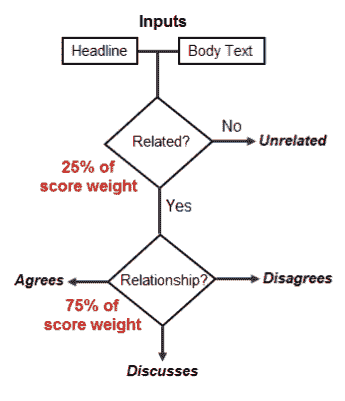
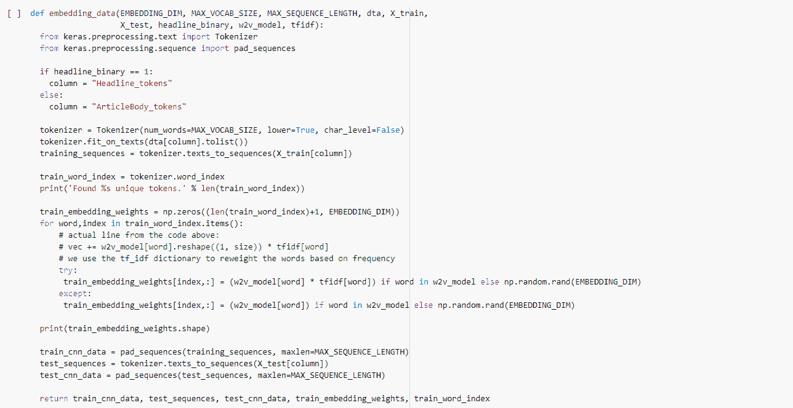

# 第三部分:利用人工智能打击假新闻的最终模式

> 原文：<https://towardsdatascience.com/part-iii-using-a-i-to-combat-fake-news-final-model-933f75657ae0?source=collection_archive---------55----------------------->

## 总结项目过程和最终模型创建

***工作主持人:*** [*大卫·柯布迪*](https://medium.com/u/abe8cf70429?source=post_page-----725daee16102----------------------)*[*贾森·卡茨*](https://medium.com/u/da8692cb0f64?source=post_page-----725daee16102----------------------)*[*迈克尔·哈德*](https://medium.com/u/8c20c2ac3641?source=post_page-----725daee16102----------------------)*[*奈娜·沃顿*](https://medium.com/u/29b5f12bdec0?source=post_page-----725daee16102----------------------)***

****第一部:** [利用人工智能打击假新闻](/using-a-i-to-combat-fake-news-34f5a51907d6?source=your_stories_page---------------------------)**

****第二部:** [利用人工智能打击假新闻建模更新](https://medium.com/@michael_harder/part-ii-using-a-i-to-combat-fake-news-modeling-update-d6931ff0f519)**

**在过去的一个月里，我们的团队一直致力于建立一个模型来准确地对假新闻进行分类。这个项目已被记录至今(上面链接)；然而，在这篇文章中，我们将总结我们的工作，并讨论我们的最终模型。**

## **工作**

**在假新闻挑战赛中，竞争对手获得了标记数据，并承担了创建姿态检测 ML 分类模型的任务。姿态检测是人工智能管道对假新闻进行分类的第一步，是确定新闻标题与其相应正文之间关系的过程。姿态检测中用于描述标题和正文之间关系的类别通常有:同意、不同意、讨论和不相关。[竞赛网站](http://www.fakenewschallenge.org)为参赛选手提供训练集和测试集，以及加权准确率达到 79.53%的基线 GradientBoosting 分类器。该任务是一个多标签多类问题，模型需要首先决定标题和正文是**相关**还是**不相关**。然后，如果两者有关联，把他们的关系归类为**同意**、**不同意**或者**讨论**。提交给竞赛的模型以加权平均进行评估，25%的权重用于将正文和标题正确分类为不相关，75%的权重用于将模型分类为同意、不同意或讨论。**

****

**图 1 —竞赛的评分结构**

**比赛于 2016 年举办；然而，鉴于深度学习的进步和我们社会中假新闻的剩余存在，我们的目标是创建一个可以超越竞争获胜模型的姿态检测模型。如果我们获得成功，我们的模型可能会被用于更广泛的人工智能管道，用于对假新闻进行分类。**

## **电子设计自动化(Electronic Design Automation)**

**当生成任何 ML 模型或深度学习网络时，第一步通常是 EDA。竞赛提供了两个 csv 文件，一个包含正文，另一个包含它们的标记姿态。为了更好地理解数据，我们首先合并了两个数据集。最终合并的熊猫数据框架有 49972 条观察结果，具有三个特征:文章主体、标题和立场。数据集相当不平衡，因为与*无关的*标签约占数据的 75%。**

****

**图 2 —站姿计数的条形图。这是一个不平衡的数据集。**

**EDA 带来的另一个有趣的事情是，训练数据有许多不同的标题链接到相同的正文。考虑到来自不同出版物的不同作者经常报道相同的新闻主题(相同文本的不同标题)，这是有意义的。该数据集包含 1，683 篇独特文章的 49，972 个标题，平均每篇文章约 30 个标题。然而，在进一步挖掘之后，很明显有些文章比其他文章更频繁地被“改变用途”。下图显示了一个文本正文被“改变用途”了 78 次，但是，一般来说，数据集主要包含唯一的标题和正文对。如果你想更深入地了解我们的 EDA 过程，请参考我们在这个系列中的第一篇文章(第一部分)。**

****

**图 3 —每个正文标题数量的直方图**

## ****竞赛获奖模型****

**接下来，我们想检查一下竞赛获胜模型，以此作为起点。赢得假新闻挑战的[模型是两个模型之间的加权平均值:梯度推进决策树和卷积神经网络(CNN)。深度 CNN 使用嵌入应用于标题和正文。嵌入应用谷歌新闻预训练向量。卷积层的输出被发送到具有四级输出的 MLP。这四类是我们的四个量词:同意、不同意、讨论和无关。他们的模型在所有卷积层中使用概率为 50%的丢失进行正则化。他们的超参数被设置为逻辑默认值，但没有被评估来优化他们的网络。他们的 CNN 结构在下图中有进一步的描述。](https://github.com/Cisco-Talos/fnc-1)**

****

**图 4 —竞争获胜的 CNN 模型结构([https://github . com/Cisco-Talos/fnc-1/tree/master/deep _ learning _ model](https://github.com/Cisco-Talos/fnc-1/tree/master/deep_learning_model))**

**获胜提交的第二部分加权平均是一个决策树模型。该模型接受来自文章标题和正文的基于文本的特征的输入。这些输入被输入到梯度推进决策树中，以预测标题和正文之间的关系(同意、不同意、讨论或不相关)。下图概述了这种模型结构。这个决策树模型的输入非常依赖于特征工程。获奖模型的创作者通过预处理(`generateFeatures.py`)、基本计数特征(`CountFeatureGenerator.py`)、TF-IDF 特征(`TfidfFeatureGenerator.py`)、SVD 特征(`SvdFeatureGenerator.py`)、Word2Vec 特征(`Word2VecFeatureGenerator.py`)和情感特征(`SentimentFeatureGenerator.py`)进行特征工程。**

****

**图 5 —赢得竞赛的 XGBoost 模型结构([https://github.com/Cisco-Talos/fnc-1/tree/master/tree_model](https://github.com/Cisco-Talos/fnc-1/tree/master/tree_model))**

## **初始模型**

**在改进竞赛获奖模型的最初尝试中，我们采取了两个步骤:我们重新定义了分类问题，并将工程特征纳入 CNN。**

**竞赛定义的问题，如上所述，本质上是一个多标签多类问题。但是，我们选择了稍微不同的解决方法。我们将问题分成两部分，针对两种不同的分类问题训练模型。**

**第一个模型是分类标题和正文是相关还是不相关。这个模型包括标题、正文、工程特征和标签。需要注意的是，比赛给出的数据没有任何与相关的标签名称*。我们简单地创建了一个新的数据集，用标签 *related* 代替*agree/disagree/discussion*。然后使用第二个模型将身体和头部之间的关系分类为*同意/不同意/讨论*。这两个模型在结构上是相同的，只是它们的分类任务不同。***

**

*图 6 —具有三个输入的初始模型架构。一个是标题的卷积层，一个是正文的卷积层，一个是工程特征的密集层。*

*如上面概述的模型架构所示，我们的网络包括由密集层组成的第三个输入。这个额外的网络输入取代了优胜模型中 XGBoost 的使用。输入将是一个*n×3*矩阵，其中 n 是观察的数量，3 代表三个工程特征:["fk_scores "、" word_count "、" num_grammar_errors"]。所有这三个特征都是针对身体的。fk_score 是一个广泛使用的语言指标，用来衡量文章所用语言的复杂程度。*

*卷积网络(模型的输入 1 和输入 2)遵循具有两个卷积层的简单架构。它们输出具有 34 个张量的密集层，然后连接到连接层。嵌入层作为网络的第一层，使用之前使用 Google 的 Word2vec 计算的嵌入权重进行初始化。在我们训练嵌入权重之前，我们处理数据以去除标点符号，然后对文本进行标记。最后，完成架构的密集层和批量标准化(如上图所示)也遵循简单的结构。这个初始模型的结果很好。使用竞赛规定的准确度分数计算；我们的总体加权准确率为 89.51%，显著高于基线模型的 79.53%。此外，该分数是针对测试集的，而不是竞赛中使用的最终测试数据。因此，我们不能直接将我们的结果与获胜模型的结果进行比较。然而，考虑获胜模型的 82.02%的准确度分数仍然是有用的。这个初始模型及其结果在本系列的第二篇文章(第二部分)中有更深入的介绍。*

## ***最终型号***

*正如本系列第二部分所建议的，我们希望使用上采样来重新平衡数据集，以便我们的神经网络可以更好地分类不相关和相关的标题-正文对。数据集的平衡非常偏向于不相关的标签，这大约占数据的 75%。注意，在前面的模型中，我们将正确分类不同标签的任务分成了两个不同的任务。第一个神经网络的测试准确度分数为 73.13%，略低于数据集的平衡，因此似乎对数据进行上采样可以提高该模型的准确度分数。然而，经过进一步的考虑，我们意识到对数据进行向上采样是没有意义的，因为现实生活中的数据在各个类别之间不会有均匀的分布。此外，如果我们期望真实生活数据来自分布，那么使用上采样技术是没有意义的。除此之外，上采样涉及模拟新数据，考虑到数据的性质需要生成文本，这将非常耗费时间。因此，鉴于我们不知道不同阶层的真实分布情况，对少数阶层进行抽样调查是没有意义的。*

*虽然我们最终决定不对数据进行上采样，但我们确实训练了 Word2Vec 嵌入。在我们模型的前一次迭代中，我们使用了 Google 的 Word2Vec 嵌入，它是在报纸文章上训练的。虽然这种嵌入非常好，并且已经在万亿字节的数据上进行了训练，但它并没有针对我们正在使用的数据进行个性化。训练我们自己的对数据集唯一的 Word2Vec 嵌入也没有意义，因为我们缺乏这样做的数据量。因此，一个方便且易于实现的解决方案是稍微修改 Google 的 Word2Vec 嵌入。我们为标题和正文创建了两个词频逆文档频率(TFIDF)矩阵。TF-IDF 是一种衡量一个单词在一个更大的短语的上下文中的相对重要性的方法。然后将 TF-IDF 矩阵与 Google 的 Word2Vec 嵌入相乘，以重新加权嵌入。换句话说，重新加权嵌入= TF-IDF 矩阵* Word2Vec 嵌入。下面提供了相关的代码。*

**

*图 7 —训练 TFIDF 矩阵的代码*

**

*图 8 —使用 TFIDF 创建嵌入权重的嵌入函数*

*除了重新加权 Word2Vec 嵌入，我们还重新设计了神经网络的结构。之前，我们将多级分类问题视为两个独立的模型，第一个模型区分相关和不相关的标题-正文对，第二个模型区分以下类别:同意、不同意和讨论。虽然这两个模型结合起来表现得相当好，但解决方案效率相当低。不仅训练两个模型花费了更多的时间，而且训练两个模型也不是合适的解决方案，因为第二个神经网络不能利用来自第一个模型的权重来改进对第二级标签进行分类的决策过程。此外，该问题的原始设计是一个多级多标签分类问题，因此我们认为坚持这种结构将提高模型的准确性得分。*

*而且，这个模型与之前的模型不同，因为它没有使用 CNN。代替 CNN 层，该模型具有双向 GRU 细胞。GRU 细胞是一种更复杂的版本，或者是一种循环神经细胞。GRU 细胞被设计成避免短期记忆的问题，在短期记忆中，细胞将只记住并考虑最近的输入。当大的文本序列被输入一个递归神经细胞时，该细胞可能只记住文本末尾的重要信息。GRU 细胞通过使用门来解决这个问题，因此可以更好地记住并跟踪一长串文本中的重要信息。在我们的模型中，我们使用双向 GRU 单元，因此文本通过该单元向前和向后处理，以更好地确定序列中的重要单词。*

*由于这些变化，我们的模型最初每个时期需要 15 个小时来训练，即使我们的数据集非常小。为了减少我们模型的训练时间，我们将批量大小从默认的 32 增加到 128，同时将输入的最大序列长度(考虑的单词数)从 4，600 减少到 1000。通过查看下面的图 9，我们决定将最大序列长度减少到 1000。从直方图可以看出，正文超过 1000 字的文章很少。我们还查看了标题中的字数，但是我们决定不需要减少最大序列长度(参见图 10)。*

**

*图 9 —文章正文长度直方图。正文中的字数太多，无法合理地输入神经网络。假设数据的分布通常上限为 1，000；我们将输入限制为字数少于 1000 的任何内容。*

**

*图 10 —文章标题长度直方图。每个标题中的字数是一个在神经网络中处理的合理数字。*

*下面以两种不同的方式展示了最终的模型结构:一个图表，一个层表(图 11 和图 12)。正如我们在下面看到的，这个模型和以前的模型的最大区别是，这个模型有双向 GRU 层而不是卷积层，并且这个模型是一个多级多类神经网络。*

**

*图 11 —最终模型结构*

**

*图 12 —最终模型结构图。这个模型又有三个输入，然而，它们如下:一个具有用于标题的双向 GRU 层，一个具有用于主体的双向 GRU 层，一个具有用于工程特征的密集层。*

*正如我们之前所做的，该模型在 39，977 个观察值上进行训练，并在 9，995 个观察值上进行验证。由于训练模型的密集时间成本，我们训练了 5 个时期的模型。将来，如果我们增加模型接受训练的时期数，模型的性能可能会更好。经过 5 个时期后，模型的训练准确率为 92.16%，测试准确率为 90.51%。这些值比之前 89.51%的准确率提高了 1.1%。虽然最终模型的准确性得分确实有所提高，但考虑到我们实施的变更数量，它并不像我们预期的那样显著。尽管如此，改善还是很显著的。*

**

*图 13 —测试准确度为 90.51%的最终模型训练结果*

**

*图 14-最终模型训练损失结果*

## *潜在的改进*

*虽然我们对这些模型结果非常满意，但总有改进的余地。通过对更多数据进行训练，通过向模型添加层来试验更深的网络，或者尝试向模型中加入额外的或替代的工程特征，可以对我们的模型进行潜在的增强。*

## *参考*

*训练 Google 的 Word2Vec 或创建自己的 word 2 vec 的两种不同技术。是部署技术的绝妙指南:[*https://towards data science . com/natural-language-processing-class ification-using-deep-learning-and-word 2 vec-50 cbad 3 BD 6a*](/natural-language-processing-classification-using-deep-learning-and-word2vec-50cbadd3bd6a)*

**Github Repo 为竞赛中使用余弦连接的第三个最佳模型，当连接神经网络的输入时:*[*https://github.com/uclnlp/fakenewschallenge*](https://github.com/uclnlp/fakenewschallenge)*

**编写多输入 keras 模型的文档:*[*https://www . pyimagesearch . com/2019/02/04/keras-multiple-inputs-and-mixed-data/*](https://www.pyimagesearch.com/2019/02/04/keras-multiple-inputs-and-mixed-data/)*

**2013 年发表的开创性 Word2Vec 论文:*[*【https://arxiv.org/pdf/1301.3781.pdf】*](https://arxiv.org/pdf/1301.3781.pdf)*

**为 NLP 任务编写多通道 keras 模型的文档:*[*https://machinelingmastery . com/develop-n-gram-channel-卷积-神经网络-情感分析/*](https://machinelearningmastery.com/develop-n-gram-multichannel-convolutional-neural-network-sentiment-analysis/)*

**关于 NLP 如何在纯数学空间中与不同技术一起工作的解释:*[*https://towardsdatascience . com/NLP-learning-series-part-1-text-preprocessing-methods-for-deep-learning-20085601684 b*](/nlp-learning-series-part-1-text-preprocessing-methods-for-deep-learning-20085601684b)*

**Github 的矢量器方法示例:*[*https://Github . com/Cisco-Talos/fnc-1/blob/master/deep _ learning _ model/vectors . py*](https://github.com/Cisco-Talos/fnc-1/blob/master/deep_learning_model/Vectors.py)*

**训练时如何让 RNNS 和 CNN 一样快:*[*https://openreview.net/forum?id=rJBiunlAW*](https://openreview.net/forum?id=rJBiunlAW)*

**双向 GRU 图层文档:*[*https://www . tensor flow . org/API _ docs/python/TF/keras/layers/Bidirectional*](https://www.tensorflow.org/api_docs/python/tf/keras/layers/Bidirectional)*