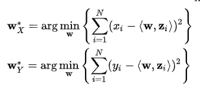
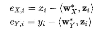
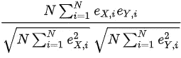
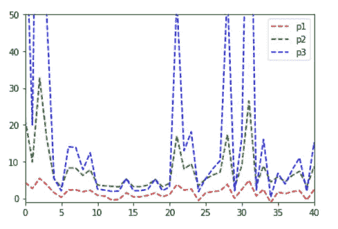
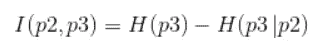
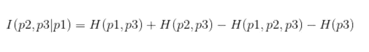
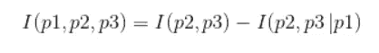
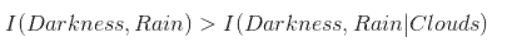

# 偏相关与相互作用信息

> 原文：<https://towardsdatascience.com/partial-correlation-vs-conditional-mutual-information-c7feffa9b88e?source=collection_archive---------29----------------------->

## 偏相关和交互信息是评估数据集中混杂变量之间关系的两个强大工具

在数据分析任务中寻找数据集中不同变量或要素之间的关系是数据科学家应该掌握的关键和基本技能之一。

在这篇短文中，我们将介绍一个你在研究和分析问题时可能遇到(也可能没有遇到)的现象。我们将创建一个简单的数据集，并应用我们的指标来发现这一现象并进行讨论。

在我们的数据集中找到变量之间的关系对于去除冗余变量进行预测、推断因果关系(如果可能的话)是至关重要的。)并大致了解我们的数据集在解释我们的假设方面有多丰富。

出现的一个主要问题是不同随机变量的相关性。我们可以使用相关矩阵、线性拟合和其他不同的方法来找出关系，并在我们认为合适的时候使用，从而解决这个问题。但是，如果我们有两个变量，我们认为它们之间有很强的相关性，但事实是它们都与第三个变量密切相关，而第三个变量增加了这种关系的强度，那该怎么办呢？

这个问题可能会破坏我们的假设，迫使我们对自己(和我们的上级……)撒谎。


X 和 Z 以及 Y 和 Z 的独立关系对 X 和 Y 的关系有什么影响

解决这个问题的一种可能的方法是使用一种叫做“部分相关”的方法。

与皮尔逊相关相比，偏相关考虑到了第三个变量的存在并“控制”它。

控制一个变量是什么意思？

在因果模型中，**对变量**的控制意味着根据变量的测量值的宁滨数据。这通常是为了使变量不再成为混杂因素，例如在观察性研究或实验中。

这样做的正式方法是在 X 和 Z 以及 Y 和 Z 之间进行线性回归，收集误差项，并在误差项之间使用标准皮尔逊相关。当我们想到这一点时，如果 X 和 Y 与 Z 无关，那么它们各自对 Z 的线性回归的误差将彼此相关(更高的偏相关)。如果误差项不同(较低的偏相关)，这意味着 X 和 Y 与混杂因素(Z)具有不同的关系，并以两种不同的方式受其影响，因此当考虑 Z 时，它们之间的关系(X 和 Y)应该较低。



用 Z 找出两个线性回归的 Wx 和 Wy 系数，<_>代表标量积，[维基百科](https://en.wikipedia.org/wiki/Partial_correlation)



错误术语的定义，[维基百科](https://en.wikipedia.org/wiki/Partial_correlation)



[偏相关的定义，维基百科](https://en.wikipedia.org/wiki/Partial_correlation)

让我们看一个例子。

首先，我们将导入相关的库并创建一个简单的数据集。

```
import numpy as np
from scipy import stats, linalg
import matplotlib.pyplot as plt
import randomrandom.seed( 30 )
mu1 = 2
sigma1 = 2
x = np.arange(100)
p1 =  np.random.normal(mu1,sigma1,100)
p2 = np.square(p1) + 3
p3 = np.power(p1,3) + 2 plt.figure
plt.plot(x, p1, 'r--',x, p2, 'g--',x, p3, 'b--')
plt.xlim(0, 40)
plt.ylim(-1, 50)
```



三个随机变量 p1、p2 和 p3

如你所见，我创建了 p2 和 p3，使它们基于 p1。p2 是 p1 加上一个常数的平方，p3 是 p1 加上一个常数的 3 的幂。让我们天真地检查 p2 和 p3 之间的皮尔逊相关性。

```
np.corrcoef(p2,p3)array([[1\.        , 0.91533677],
       [0.91533677, 1\.        ]])
```

因此，我们有一个 0.91 的相关性，如果我们看一下上图中的蓝线和绿线，这是有意义的，两个变量的趋势是一致的。

让我们使用我们之前描述的偏相关公式来检查 p2 和 p3 的偏相关，将 p1 视为控制变量。

```
def partial_corr(p1,p2,p3):
    p1k = np.expand_dims(p1, axis=1)
    p2k = np.expand_dims(p2, axis=1)
    p3k = np.expand_dims(p3, axis=1)

    beta_p2k = linalg.lstsq(p1k, p2k)[0]  # Calculating Weights (W*)
    beta_p3k = linalg.lstsq(p1k, p3k)[0]  # Calculating Weights(W*) res_p2k = p2k - p1k.dot(beta_p2k) # Calculating Errors
    res_p3k = p3k - p1k.dot(beta_p3k) # Calculating Errorscorr = stats.pearsonr(np.squeeze(res_p2k), np.squeeze(res_p3k))[0]return corrpartial_corr(p1,p2,p3)0.7327481408542633
```

p2 和 p3 之间的相关性为 0.73。我们可以看到，这种相关性低于我们之前认为的(0.91)，因为变量 p1 以不同的方式与它们相关。这反过来又导致两个变量的误差项不同，结果，部分相关性将更低。

可能有许多使用这种相关性度量的例子。
你可以在[行为科学](http://www.psychwiki.com/wiki/How_is_a_correlation_different_than_a_partial_correlation%3F)和[气候变化分析](https://www.researchgate.net/profile/Zhang_Jie55/post/Any_advice_on_partial_correlation_interpretation/attachment/5a6977374cde266d58862724/AS%3A586572701392896%401516861238925/download/aboutPatialCorrelation.docx)中看到它们。

现在让我们讨论离散随机变量情况下的另一种类似技术，条件互信息。

信息论中的互信息描述了两个随机变量之间的相互依赖关系。它比皮尔逊相关系数更普遍，因为它不需要线性关系和实值随机变量。MI 的概念与从信息论中更熟悉的[熵](https://en.wikipedia.org/wiki/Entropy_(information_theory))密切相关。



给定 p2，p2 和 p3 之间的互信息是 p3 的熵减去 p3 的[条件熵](https://en.wikipedia.org/wiki/Conditional_entropy)

现在假设我们有第三个变量，我们希望在两个变量之间的互信息估计中考虑这个变量。我们希望使用一种类似于偏相关的技术，来修正我们的估计，并给出它们三者之间相互作用的提示。

让我们首先定义另一个称为条件互信息(CMI)的度量:



条件互信息方程

我们将使用一种称为交互信息的度量，它是 MI 的一种推广。p1、p2 和 p3 之间交互信息的正式定义是:



交互信息的定义其中 I(p2，p3)是 p2 和 p3 之间的 MI，I(p2，p3|p1)是这些变量之间给定的[条件 M](https://www.sciencedirect.com/science/article/pii/S0019995878900268) I。

在这篇文章中，我不会进入 MI 和条件 MI 的严格数学定义，但你可以查看我之前附上的链接。

让我们举一个简短的例子来理解直觉:

假设我们前面例子中的 P1 是 100 天内测量的天空中的云量。我们还假设 P2 是用离散的光度计测量的 100 天的黑暗水平(黑暗的程度受云量的影响), P3 是 100 天的降雨量，以毫升为单位。

让我们使用我们的变量来计算 MI、条件 MI 和交互信息，以便更好地理解。

```
from pyitlib import discrete_random_variable as drvp1 = np.round(p1) # to get integer values
p2 = np.round(p2) # to get integer values
p3 = np.round(p3) # to get integer valuesMI = drv.information_mutual(p2,p3)
MI3.676603187392168CMI = drv.information_mutual_conditional(p2,p3,p1)
CMI1.35947929InteractionInformation = MI - CMI
InteractionInformation2.317123892473724
```

因此，我们得到了比条件 MI ( 1.35)更大的 MI (3.67)，结果得到了**正**交互信息(2.31)。

我们能解释一下吗？

正如我们所知，云(p1)会导致雨(p2)和黑暗(p3)，所以黑暗和雨之间的关系(或信息量)会受到云的影响。所以:



这将产生一个积极的互动信息，正如我们之前定义的那样！

人们应该小心解释相互作用信息，因为它也可能具有负值，并且从中得出的结论可能是棘手的(如在相关/部分相关中)。这也是为什么它在数据科学社区中不经常被用作评估随机变量之间关系的通用指标。

我们在这里介绍了两种不同的方法来评估混杂随机变量之间的相互作用:偏相关和相互作用信息。我使用了离散和连续变量来展示不同设置下的应用。这些方法更加“微妙”,因为它们要求对您的数据非常熟悉，所以要注意这一点。

你可以通过 zeogod@gmail.com 给我发评论或者关注我的 [Github 页面](https://github.com/Z30G0D/ML_codes)。

参考资料:

1.  来自 [Fabian Pedregosa](https://github.com/fabianp) 的偏相关函数实现
2.  维基百科(一个基于 wiki 技术的多语言的百科全书协作计划ˌ也是一部用不同语言写成的网络百科全书ˌ 其目标及宗旨是为全人类提供自由的百科全书)ˌ开放性的百科全书
3.  广义线性模型中交互效应筛选的相关、偏相关和条件互信息比较，**李稷**，*阿肯色大学费耶特维尔 2018—* [*链接*](https://scholarworks.uark.edu/etd/2860/)
4.  [https://pypi.org/project/pyitlib/](https://pypi.org/project/pyitlib/)—用于处理离散随机变量和信息论函数的 python 包