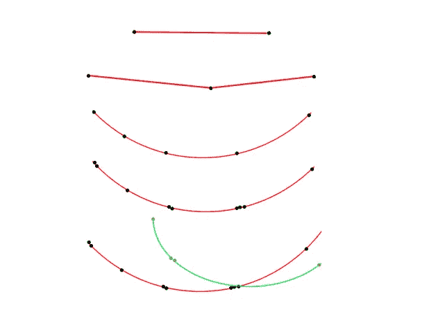

# 欧洲粒子物理研究所用机器学习进行粒子跟踪

> 原文：<https://towardsdatascience.com/particle-tracking-at-cern-with-machine-learning-4cb6b255613c?source=collection_archive---------15----------------------->

CMS 探测器中模拟的高能碰撞，L. Taylor — [CERN PhotoLab](http://cds.cern.ch/record/39444)

## 机器学习可以在高能物理中用于发现和表征新粒子吗？

[TrackML](https://www.kaggle.com/c/trackml-particle-identification/) 是 2018 年的一场 Kaggle 比赛，奖金为 25 000 美元，挑战是从硅探测器中留下的 3D 点重建粒子轨迹。 [CERN](https://home.cern/) (欧洲核研究组织)提供了粒子碰撞事件的数据。它们在那里发生的频率大约是每秒几亿次碰撞，或者每年几十千兆字节。在筛选如此大量的数据时，显然需要尽可能高效，这就是机器学习方法可能有所帮助的地方。

# 背景

粒子，在这种情况下是质子，在大型强子对撞机(LHC)中被提升到高能量——当碰撞时，每束可以达到 6.5 TeV，总共 13 TeV。电磁场被用来加速 27 公里长环路中的带电质子。当质子束碰撞时，它们会产生各种各样的亚原子副产品，这些副产品会迅速衰变，为一些最基本的物理学问题提供有价值的信息。

探测器由一层层的子探测器组成，每个子探测器都被设计用来寻找特定的粒子或特性。有测量能量的量热仪、确定粒子种类的粒子识别探测器和计算粒子路径的跟踪装置。我们当然对跟踪部分感兴趣，当粒子通过这些类型的探测器时，微小的电信号被记录下来。我将讨论的是重建这些记录的轨迹模式的方法，特别是涉及机器学习的算法。

# 数据

由于目的是将机器学习应用于数据，CERN 的人员将其分为训练集和测试集，以便验证模型。训练数据集包含粒子的初始参数及其记录的命中，以及生成粒子和命中之间的映射。测试数据只有记录的点击。然后，我们剩下的任务是将每次点击与一个音轨相关联。

我读到 2020 年是我们应该[与图表互动](/python-for-data-science-a-guide-to-data-visualization-with-plotly-969a59997d0c)的一年，所以这里是探测器中使用 [Plotly](https://plot.ly) 的 10 000 次点击的样子:

LHC 的粒子观测

根据它们的 *layer_id* 对命中进行着色，layer_id 是检测器层的数字标识符。坐标以毫米为单位，因此我们在这里考虑的探测器部分大约有三米长，横截面大约为一平方米。粒子需要通过不同的层来追踪，为了更好地理解轨迹可能的样子，我直接从训练数据中绘制了一些轨迹。我们可以看到，大多数粒子从原点出发，也就是碰撞发生的地方。

训练集中的实际粒子轨迹

# 螺旋聚类

我们可以做一些巧妙的预处理，利用大多数轨迹遵循螺旋模式的假设，使数据更有序。这是因为存在磁场，否则粒子会直线运动。粒子动量也会影响螺旋的紧密程度，动量越高，轨迹就越直。我们可以通过首先获得距离来说明曲率

然后用击中坐标除以它。这将使同一轨迹上的点相互靠近。

我们可以在训练数据上验证我们的假设，其中我们知道整个检测器中的粒子 id。因此，如果我们在应用螺旋变换之前以及之后可视化一些粒子的轨迹，我们可以清楚地看到集群出现。这意味着许多粒子像假设的那样在 z 方向上以螺旋模式行进。

与预处理时相比的点击横截面

这提供了在数据上使用聚类来将轨迹分组到某个原始粒子的机会。DBSCAN(带噪声的应用程序的基于密度的空间聚类)可用于此目的。该方法用 Python 编写，可转换为以下代码片段:

标准缩放器减去平均值并缩放到单位方差，它用于通过标准化变量来提高聚类的性能。特征缩放是机器学习预处理过程中的一个常见步骤。scaler 和 DBSCAN 都是从 scikit learn 导入的，还有一个定制的 [TrackML 库](https://github.com/LAL/trackml-library)用于处理加载事件或洗牌等。此处未显示。在任何情况下，在使用 eps=0.00715 的测试数据上，聚类给了我 0.20817 分(满分 1 分)。Eps 是两个样本之间的最大距离，其中一个样本被视为与另一个样本相邻。

考虑到分数，我们可以得出结论，在这种简单的形式下，螺旋聚类确实不是那么准确。至少它作为一个基线，剧透警报，表现最好的方法实现起来有点棘手。聚类仍然在许多算法中使用，一些算法达到 0.8 分以上。

# 挑战亚军

Kaggle 用户 outrunner 将其解决方案基于人工神经网络。该模型输出具有 1 和 0 的邻接矩阵，1 表示命中在同一轨道上，0 表示它们不在同一轨道上。模型的规模太大了(N ~ 100k ),必须分成更小的单元。它们将一对两次击中作为输入，并输出它们的关系，或者它们在同一轨道上的概率。

Outrunner 神经网络模型

考虑所有的匹配对，并且在每对中考虑 27 个特征。然后在其上训练一个具有 4k-2k-2k-2k-1k 个神经元的 5 隐层多层感知器(MLP)。通常，重建轨迹的方法并不将所有的命中对作为输入，而是仅将相邻的命中对作为输入，这或多或少是传统的连接点。所使用的特征包括击中方向的单位向量，并且使用轨迹是线性或螺旋形状的假设，可以减少假阳性的数量。因为如上所述，当所有可能的对都被使用时，不属于相同轨道的对占优势是不足为奇的。

为了重建轨迹，outrunner 从初始命中开始，并从具有最高预测分数的对中形成种子。添加的第三个匹配项是将两个匹配项放在一起时最大化概率总和的匹配项。它还会接受检查，以查看它是否符合从原点穿过种子对的圆。重复该过程，直到没有进一步的命中符合该轨迹。此后，以相同的方式创建导致新轨道的新的初始命中，直到数据中没有剩余命中。

最后一步是解决轨道之间的不一致，因为它们中的许多包括相同的命中。单个音轨的质量由唯一分配给它的点击量来量化。这一措施是用来排序重叠的轨道，并以最佳方式合并它们，如下所示。

示例轨迹重建

这种深度学习方法在 Kaggle 比赛中获得了第二名，得分为 0.90302。关于亚军的进一步阅读:

 [## 冠军访谈|粒子追踪挑战赛亚军，周佩莲

### 怎样才能接近顶峰？见见周佩莲，我们最近的多轨道粒子赛的亚军得主…

medium.com](https://medium.com/kaggle-blog/winner-interview-particle-tracking-challenge-first-runner-up-pei-lien-chou-41247be42dbf) 

# 获胜的选手

获胜的贡献来自得分为 0.92182 的团队顶级夸克。在机器学习方面，他们的解决方案有一些逻辑回归，用于修剪掉出现的多余轨迹，但除此之外，它是基于统计和 3D 几何的经典数学建模。它还包括磁场作为探测器中 z 位置的函数的原始模型。有趣的是，他们使用了很少的训练事件，大多数模型拟合只使用了一个事件[2]。

## **算法**

1.  **种子生成:**算法从选择有希望的命中对开始。大多数轨迹被探测器最内部的 50 对相邻层覆盖，因此起始点对的候选，或种子，都是这些层上的匹配对。通过使用不同参数的逻辑回归剪枝，减少了候选的数量，最明显的是如果从这两个点外推直线，离原点有多远，其次是给出粒子方向的击中角度。
2.  **扩展到三元组:**通过将现有点之间的线扩展到相邻层并将 10 个最接近的点存储为候选点，将第三个点添加到轨迹中。再次使用逻辑回归修剪，拒绝坏的三元组。
3.  **轨迹跟踪:**一个螺旋被安装到三联体并延伸到其他层。最接近它的点击被添加到轨道。
4.  **轨迹整合:**存在重叠模块，导致测量点未被考虑在内，或者换句话说，探测器中每层的多次命中。如果这些命中比阈值更接近，则它们被添加到轨迹中。
5.  **音轨歧义解决:**到目前为止，每个音轨都被认为是独立的，这导致了不同音轨之间在命中方面的大量重叠。使用基于训练数据的评分标准来选择最佳轨迹。然后，从所有其他冲突路径中移除包含在该路径中的所有命中，这是反复进行的，直到没有冲突剩余。

获胜算法:1。配对查找，2。延伸到三连音，3。添加来自重叠模块和 4 的命中。最终音轨歧义消除。[3]

# 结论

根据竞赛出版物[3]，无法与粒子跟踪的最新技术水平进行直接比较，但我们知道当前的带电粒子跟踪算法基于三个阶段:播种、轨迹跟踪和轨迹选择，许多顶级解决方案也使用这三个阶段。共有 651 个团队参加了竞赛，并由此发明了许多新颖的解决方案。

我已经介绍了一种对数据应用聚类的简单方法，还有更复杂、更精确的解决方案，使用同样的技术，速度相当快。获胜的算法也是如此，它使用高度优化的数据结构，很少使用机器学习，而神经网络的解决方案的运行时间根据早先链接的 Kaggle 采访是“一个天文数字”。我读到了一个很有希望的[评论](https://www.kaggle.com/c/trackml-particle-identification/discussion/63256)，它来自冠军和亚军，是关于合并他们两个成功的技术的:“我只能想象使用你的接近最佳的配对得分和我的曲目扩展/选择的解决方案会得分有多高”。所有这些不同的方法无疑给了 CERN 的科学家一些思考的素材。

[1]:欧洲粒子物理研究所，探测器如何工作，【https://home.cern/science/experiments/how-detector-works 

[2]: J. Wind，离群密度估计的快速可扩展跟踪，2018，[https://github . com/top-quarks/top-quarks/blob/master/top-quarks _ documentation . pdf](https://github.com/top-quarks/top-quarks/blob/master/top-quarks_documentation.pdf)

[3]: S .阿姆鲁什等人。al，跟踪机器学习挑战:准确性阶段，关于机器学习挑战的 Springer 系列，第 231-264 页，2019 年