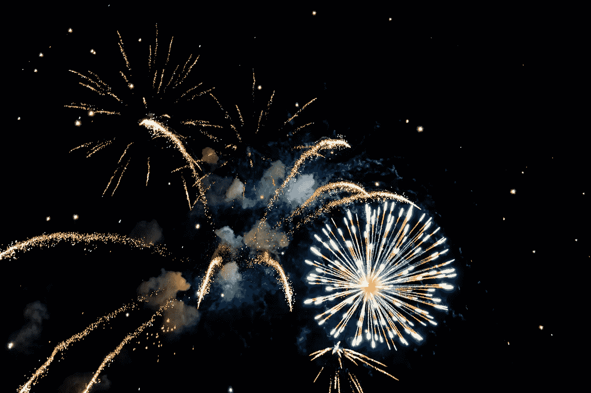
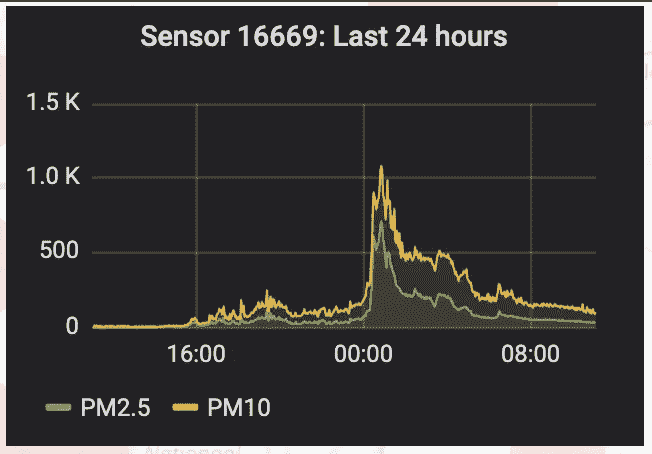
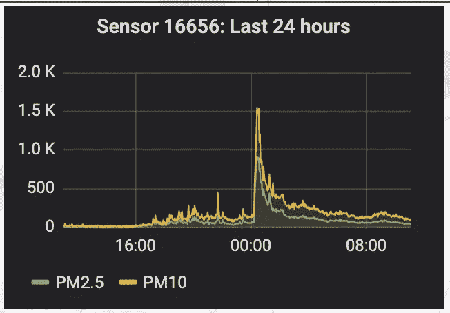
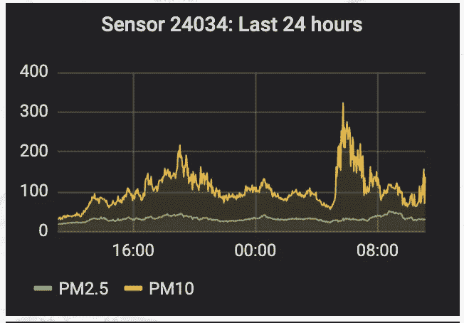

# 新年烟花造成的颗粒物污染

> 原文：<https://towardsdatascience.com/particulate-matter-pollution-by-new-years-fireworks-5baad6efd540?source=collection_archive---------26----------------------->

## PM10 的视频

照片由 [**米盖尔·阿科斯塔**](https://www.pexels.com/@mi1kel?utm_content=attributionCopyText&utm_medium=referral&utm_source=pexels) 发自 [**派克斯**](https://www.pexels.com/photo/photo-of-fireworks-during-nighttime-1259614/?utm_content=attributionCopyText&utm_medium=referral&utm_source=pexels)

每年新年，成吨的烟花被燃放到空中。众所周知，烟花既不利于环境，也不利于人们的健康。

一份关于荷兰新年烟花负面影响的清晰科学报告呈现在《自然》杂志的一篇文章中，你可以在这里找到: [Greven，F.E .，Vonk，J.M .，Fischer，P. *等*荷兰新年烟花期间的空气污染和每日死亡率。 *Sci Rep* **9，**5735(2019)doi:10.1038/s 41598–019–42080–6](https://www.nature.com/articles/s41598-019-42080-6)

我想，在新年前后的几天里，将荷兰及其周边地区的颗粒物(PM10)污染可视化可能会很有趣。

在之前的三篇文章中，我概述了我们如何利用公民科学和开放数据来做到这一点:

*   [空气质量测量](https://medium.com/@ignazw/air-quality-measurements-fcc32d59dca7)
*   [看不见的微粒云穿越欧洲](/invisible-clouds-of-particulate-matter-move-across-europe-6b39e2d57511)
*   [迷人的颗粒物天气](/mesmerizing-particulate-matter-weather-70ce6703da7f)

本视频显示了 PM10 污染的结果，时间跨度为 2019 年 12 月 30 日 00:00 至 2020 年 1 月 3 日 11:30。您可以随时暂停视频以查看特定时刻的细节。

不幸的是，Luftdaten.info 网站不像以前那样稳定，由于服务器错误，相当多的拍摄图像不得不被拒绝。这也导致了 12 月 31 日 20:30 和 1 月 1 日 06:00 之间的间隔。然而，PM10 浓度如何在新年前后达到峰值是相当清楚的。

如果我们检查单个传感器的数据，我们也可以看到这一点。午夜前后的峰值非常明显，水平高得令人难以置信！(一个传感器是从乌得勒支市随机选取的，另一个是从鹿特丹市随机选取的。)

相比之下，我自己的传感器，是在比利时的一个地区，禁止烟火，显示在同一时间范围内如下。水平低得多，午夜没有明显的高峰。

1 月 1 日 07:00 左右出现一个高峰，可能是由于 PM10 从其他地区(如荷兰)移入。

天气不好:浓雾和低云，无风，因此污染滞留在低层大气中。

如果烟火在今天被发明，它将永远不会被合法化；它将无法通过安全、环境和健康监管。