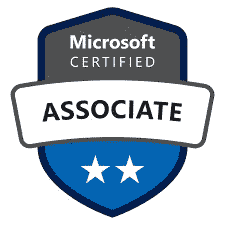

# 通过 DA-100 微软考试—我的经历

> 原文：<https://towardsdatascience.com/passing-da-100-microsoft-exam-my-experience-6a911b41ec79?source=collection_archive---------4----------------------->

## 打算考 DA-100，成为微软认证数据分析师？阅读我关于如何成功完成考试的经验

照片由来自[佩克斯](https://www.pexels.com/photo/man-climbing-on-gray-concrete-peak-at-daytime-946337/?utm_content=attributionCopyText&utm_medium=referral&utm_source=pexels)的[罗德里戈](https://www.pexels.com/@rodrigo-342429?utm_content=attributionCopyText&utm_medium=referral&utm_source=pexels)拍摄

自从我昨天晚上宣布我已经成功完成了用微软 Power BI 分析数据的 DA-100 考试，我在 LinkedIn 和 Twitter 上收到了大量关于考试准备、考试本身、哪些主题最重要等的消息。

因此，我决定在一篇文章中分享我的全部经验，希望可以帮助其他准备成为数据分析师认证的人。我真诚地希望我不会用这段文字打破任何 NDA，所以如果你期望看到一些问题，答案，描述等。请停止阅读，因为我不会在这里或其他任何地方分享…

## 什么是 DA-100？

从今年开始(或者甚至可能在去年年底)，微软宣布他们将改变认证策略。而不是针对特定工具(例如 SQL Server、Power BI 等)进行认证。)，认证现在基于特定的 ***角色*** (比如数据分析师、数据工程师、数据科学家、开发人员等等)。

这意味着旧的认证和考试将被取消(最初计划在 2020 年年中取消，现在在撰写本文时截止到 2021 年 1 月 31 日)，所以如果你打算参加“旧的”考试，赶快:)

DA-100 是使用 Power BI 分析和可视化数据的现有 70–778 的“合法”继任者。如果你简单看一下这两个考试的课程，我会说它们有 80%的重叠，这意味着如果你已经准备了 70-778，你可能很容易转换到 DA-100。

但是，由于 Power BI 变化如此之快，DA-100 中包含了许多新奇的新功能，尤其是与 AI 相关的功能。然而，如果你还不熟悉这些话题，不要害怕——它们只占考试的一小部分。

## 准备考试

老实说，我没有为考试做任何特别的准备。因为我每天都在使用 Power BI，所以我认为实践经验在我的案例中扮演了重要的角色。然而，我最担心的是，我主要使用 Power BI Desktop for Report Server(Pb IRS ),在企业环境中使用 Power BI 服务的经验非常有限。

也就是说，我对“部署和维护可交付成果”的技能感到很吃力。因此，我必须找到一种替代的方法来获取这一重要部分的知识。

皮查拜在 Pexels.com 拍摄的照片

我忘了说，我已经在测试阶段参加了考试，所以没有官方的学习指南，但是当考试开始时，我注意到微软为考试的每个部分发布了[学习路径！](https://docs.microsoft.com/en-us/learn/certifications/exams/da-100)

这是一个非常好的消息，因为你可以找到每一个主题的细节。我使用 Microsoft Learn 来提高我对 Power BI 服务的了解，我不得不承认他们确实做得很好。因此，如果你想免费准备，只需进入微软学习网站，开始浏览所有主题。

另一个很好的资源是来自 BI Elite 的 Parker Stevens 的[在线课程。这门课程不是免费的，但是你得到的东西也不贵。它将带您浏览准备列表中列出的每一个要点。我只看了几个视频，但是从我从其他人那里听到的和知道 Parker Stevens 是一个真正的 Power BI 专家，我相信这个课程也是值得考虑的。](https://training.bielite.com/courses/da-100-exam-prep-power-bi-certification/)

然而，老实说，对于打算成功通过考试的人来说，使用 Power BI 的实际操作经验是最大的优势。我不想让刚接触 Power BI 或以前没有使用过它的人气馁，只是准备好走更艰难的路…

## 三，二，一…考试

我知道你们大多数人对这一部分感兴趣，所以对之前的长故事没有什么不好的感觉:)…我需要为最有趣的部分打下基础。

考试本身 180 分钟，不急不躁的完成一切绰绰有余。所以，这篇博文的第一个要点是:

> **不要慌，不要急——真的有足够的时间来彻底思考问题和答案，并在以后回顾一切**

考试由多项选择题和案例分析组成。我的建议是:

> **在进行案例研究时，请保持高度专注，因为有些具体要求需要仔细研究**

最后，我的感觉是，主题的分布或多或少是均匀的，但如果我需要选择看起来比其他主题更有代表性的主题，这将是我的列表:

> **幂查询(尤其是幂查询转换)**
> 
> **特定可视化类型的使用**
> 
> **数据建模**

你们很多人问我 DAX 和 M 在考试中占多少。老实说，不多，只有一些非常基本的东西，在任何情况下，这都应该是任何有抱负的数据分析师(和权力 BI-er)的默认技能集的一部分。

## 后果

一旦你完成考试，你应该立即得到你的结果。我不得不等到考试从测试版变为正式版，但这是值得等待的:)

如果你成功地通过了考试(我相信每个正在阅读这篇文章的人都会这样做)，你就获得了 MCSA 认证(微软认证:数据分析师助理)，从你参加考试之日起两年内有效。

而不是一个结论，我的消息给任何计划参加这个考试的人: ***继续学习和练习*** ，如果你被卡住了，答案到处都是(Power BI 社区真的很棒)。如果你付出足够的努力和奉献，我相信最终你会获得认证的。

如果您有任何其他问题或考虑，请随时在下面留下评论…

[成为会员，阅读媒体上的每一个故事！](https://datamozart.medium.com/membership)

订阅[这里](http://eepurl.com/gOH8iP)获取更多有见地的数据文章！