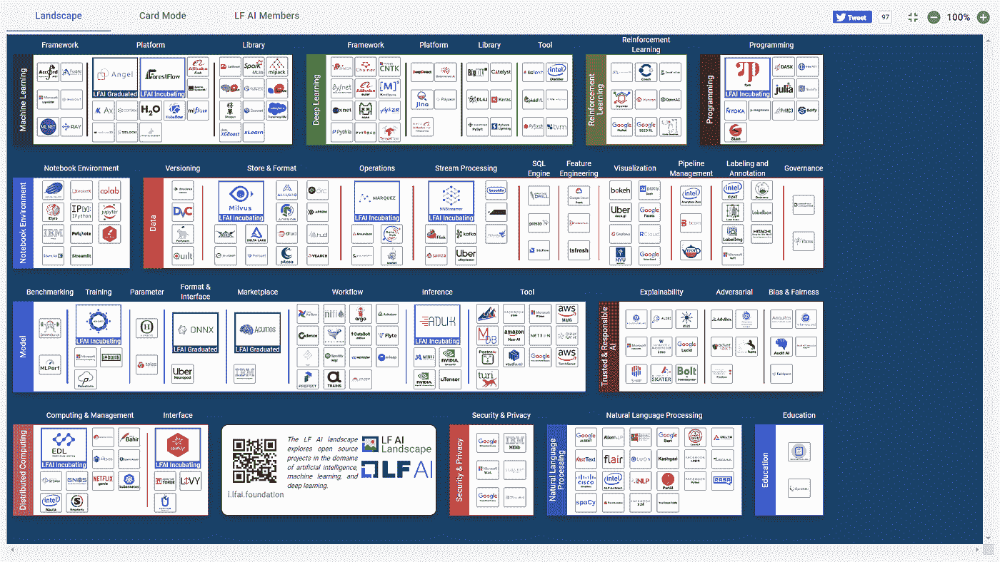
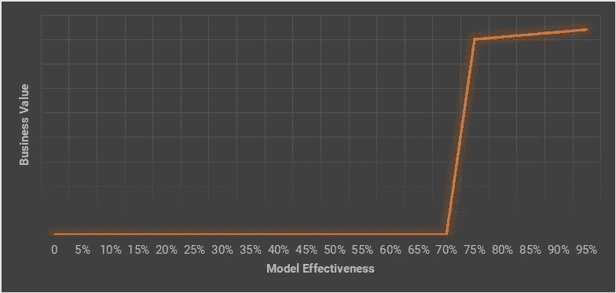
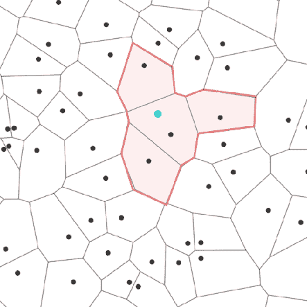
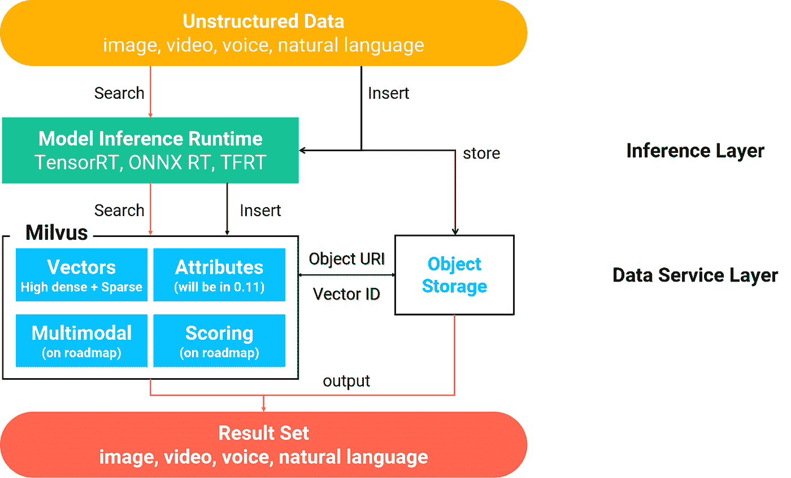

# 走过 AI 转型的拐点

> 原文：<https://towardsdatascience.com/passing-the-turning-point-of-ai-transformation-4855bc9742a1?source=collection_archive---------52----------------------->

## **您将如何受益于** [**Milvus**](https://milvus.io/) **，一个面向数据科学家的开源项目**

*谈到开源人工智能项目，人们会想到 Google TensorFlow、PyTorch 等模型框架项目。由于模型框架是训练人工智能模型的关键部分，这些项目通常受到最多的关注。但是人工智能(AI)不是一种技术。人工智能是一个复杂的技术领域，涉及几个子领域和许多不同的组成部分。*

M[**ilvus**](https://milvus.io/)是一个开源项目，为开源 AI 生态系统提供数据服务功能。

[开源 AI 项目在不同子区域的景观](https://landscape.lfai.foundation/) ( *作者图片*)

# AI 转型的转折点

一般来说，技术升级的转折点是技术升级的回报远远超出成本的点。当它应用于人工智能转换时，它将涉及包含模型(算法)、模型推理和数据服务的基本因素。

当谈到模型时，我们需要问自己关于利用人工智能技术的期望。如果我们想用人工智能技术击败并取代人类工人，例如，用人工智能驱动的对话机器人取代所有的客户支持专家。那么对人工智能模型的需求将会非常高，甚至在短期内都无法实现。

如果我们希望将我们的客户支持专家从繁琐的日常事务中解脱出来，这意味着我们打算利用人工智能技术作为放大器来提高人类的生产力和能力，那么今天的模型在许多场景中已经足够好了。

听起来很鼓舞人心。然而，关于模型的一个激烈的争论是，尽管一些模型是公开的，但是最好的模型(最先进的模型，SOTA)不是。那些可以雇佣拥有这些 SOTA 模型的人工智能科学家的公司。如果我只使用公共型号，我会失去竞争优势吗？

人们对此感到困惑，因为他们认为效率更高的模型会带来更高的商业价值。然而，这可能是错误的。在大多数情况下，模型有效性和商业价值之间的关系既不是线性的，也不是单调递增的。该函数的图形应该如下所示。

模型有效性和商业价值的关系(*图片作者*

它是一个分段函数。第一阶段，模型在应用场景中实用之前，没有商业价值。在第二阶段，虽然理论上更好的模型应该具有更好的性能(响应时间、有效性等)。)，这在现实世界中可能并不明显。让我们看看下面的情况。

在医生能够确认患者是否患有肺部感染之前，医生需要拍摄可疑患者肺部的 CT 图像。它会产生大约 300 张 CT 图像。一个有经验的医生必须花 5-15 分钟来研究这数百张 CT 图像。正常情况下，如果一个医生只处理少数病人，这不会是一个问题。然而，在像新冠肺炎这样的极端情况下，医生会被激增的病人压垮。

好消息是数据科学家已经尝试通过计算机视觉技术来帮助医生。他们训练模型可以处理数百张 CT 图像，并在几秒钟内提供诊断建议。因此，医生只需要花 1 分钟来查看模型生成的结果。

因此，在应用机器学习技术之前，平均需要 10 分钟来查看一次 CT 扫描产生的结果，现在只需要大约 1 分钟。生产率提高了近 90%。

如果我们有一个更快的模型，只需要 3 秒钟就可以生成结果，会怎么样？从 1 分 5 秒到 1 分 3 秒，看起来并不吸引人。

如果我们有一个更有效的模型，可以将准确率从 80%提高到 90%，会怎么样？医生可以减少检查结果吗？答案是否定的，因为**，**虽然这个模型只有十分之一是错误的，但我们无法知道哪一个是错误的。因此，最终审核者必须检查所有结果。因此，它不会节省更多的诊断时间。

此外，为了降低模型推理服务的成本，我们有时宁愿牺牲模型的有效性。这里有一个来自我们用户的真实例子，他们是一个拥有 5500 万张商标图片的商业智能平台。该公司希望提供一项服务，允许用户搜索这些商标的所有者。用户通过上传商标图像作为输入查询来执行搜索，而不是给出关键词。

背后的技术是计算机视觉，例如，VGG 模型。如果公司在后端服务器上运行模型推理，他们必须分配和保留数据中心的硬件资源。另一种选择是部署一个较小的模型，以便公司可以将模型推理放在边缘设备上(大多数情况下是智能手机)。肯定会砍掉 GPU 这种昂贵的模型推理硬件的成本。这是 SOTA 模式不可能在所有情况下都具有竞争力的另一个例子。

我们已经处于 AI 转型的转折点。接下来的问题是，我们如何度过这个转折点，并采用人工智能技术来增强我们的业务。

可用的模型是先决条件。然而，如果我们只有模型，我们就不能轻松地开发一个人工智能程序。与传统应用程序一样，数据服务始终是一个关键部分。我们可以看到它正在成为当今人工智能应用中的一个重要组成部分。这就是为什么我们发起了开源项目-Milvus，以加速人工智能的采用。

# 人工智能采用的数据挑战

我们试图通过人工智能技术处理的大部分数据都是非结构化的。我们期望 Milvus 项目为非结构化数据服务提供一个坚实的基础。

人们通常将数据分为三种类型，结构化数据、半结构化数据和非结构化数据。结构化数据包括数字、日期、字符串等。半结构化数据通常包括特定格式的文本信息，例如各种计算机系统日志。非结构化数据包括图片、视频、语音、自然语言和任何其他无法由计算机直接处理的数据。

据估计，非结构化数据至少占整个数字数据世界的 80%。例如，您可能每天与家人、朋友或同事发送和接收几千字节的文本消息。但即使你只在移动设备上拍了一张照片，比如说是 1200 万像素摄像头的 iPhone 11，也要好几兆。而如果用 720p 分辨率拍摄视频呢？

人们开发了关系数据库、大数据技术等技术来高效处理结构化数据。半结构化数据可以由基于文本的搜索引擎处理，如 Lucene、Solr、Elastic Search 等。然而，对于所有数据中的大块非结构化数据，人们过去没有有效的分析方法。直到近年来深度学习技术的兴起，非结构化数据处理的发展一直是不可想象的。

# 非结构化数据服务

嵌入是一种深度学习术语，指的是通过模型将非结构化数据转换为特征向量。由于特征向量是一个数值数组，所以很容易被计算机处理。因此，对非结构化数据的分析可以转化为向量计算。

一个最常见的论点是特征向量似乎是非结构化数据处理的中间结果。有必要建立一个通用的向量相似性搜索引擎吗？它应该包含在模型中吗？

从我的角度来看，特征向量不仅仅是中间结果。它是深度学习场景下非结构化数据的知识表示。这也被称为特征学习。

另一种说法是**、**既然特征向量也包含数值，为什么不在现有的数据处理平台如数据库或计算框架如 Spark 上进行向量计算。

准确地说，向量由一系列数字组成。它导致了向量计算和数值运算之间的两个显著差异。

第一，向量和数最频繁的运算不一样。对于数字来说，加、减、乘、除是最常见的运算。但是对于向量来说，最常见的要求是计算相似度。你看，这里我给出的是欧几里德距离的计算公式，向量的计算远高于普通的数值计算。

其次，数据的索引组织不同。在两个数字之间，我们可以相互比较数值。因此，我们可以根据类似 B 树的算法创建数字索引。但是在两个向量之间，我们无法进行比较。我们只能计算它们之间的相似度。因此，向量索引通常基于类似近似最近邻神经网络算法的算法。

一个空间分割算法(*图片作者*

由于这些显著的差异，我们发现传统的数据库和大数据技术很难满足向量分析的要求。他们支持的算法和关注的场景都不一样。

我们没有在 Milvus 项目中重新发明轮子。

Milvus 项目在典型人工智能应用中的位置(作者的*图片)*

# 找出使用案例

用例链接:

1.  米尔维斯× VGG:构建基于内容的图像检索系统
2.  [由 Milvus 支持的更智能的房屋搜索和推荐](https://medium.com/unstructured-data-service/smarter-housing-search-and-recommendation-powered-by-milvus-66cb0d201e7e?source=friends_link&sk=616944da30ddda4ba08d5b06faf22353)
3.  [加速新药研发](https://medium.com/unstructured-data-service/milvus-in-action-chemical-structure-similarity-search-33130767162a?source=friends_link&sk=b1e4f1100bd480f63f56eee368e17dd2)

# 加入开源社区

Milvus 项目是由 [LF AI 基金会](https://lfai.foundation/projects/milvus/)主办的孵化项目。

请随时 [**加入 Milvus 项目**](https://medium.com/unstructured-data-service/join-our-open-source-community-4ab0693baa9f?source=friends_link&sk=a1a8a8ac82787c77d72f224b87f070b0) **的社区。如果你对 Milvus 项目感兴趣，想在此基础上构建人工智能应用，或者想参与项目开发。**

如果您想了解有关该项目的更多细节，请关注出版物 [**非结构化数据服务**](https://medium.com/unstructured-data-service) 。

# 关于作者

我是 [**顾俊**](https://www.linkedin.com/in/gujun720/) ，一名数据库工程师，也是 Milvus 开源社区的热心组织者之一。

我现在是 LF AI 基金会技术顾问委员会(TAC)的成员。然而，我最长的工作经历是在金融技术领域。我在摩根士丹利的企业基础设施部工作了 8 年。