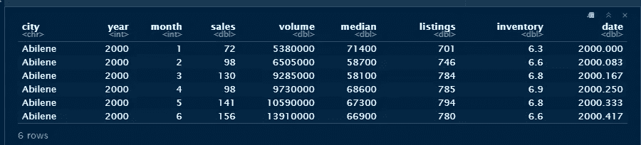
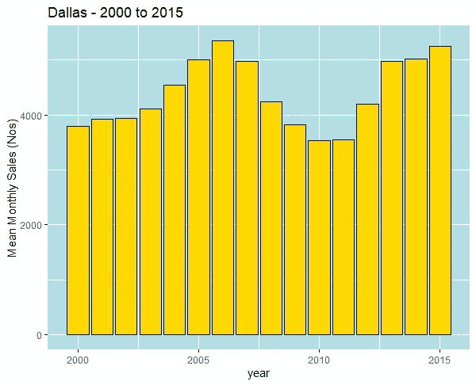
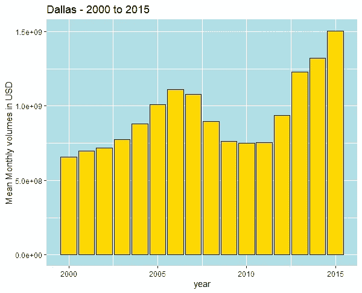
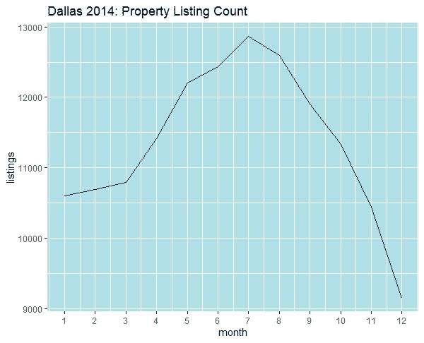
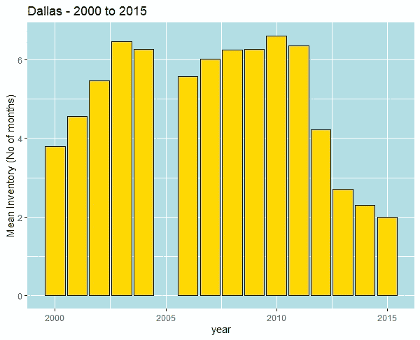
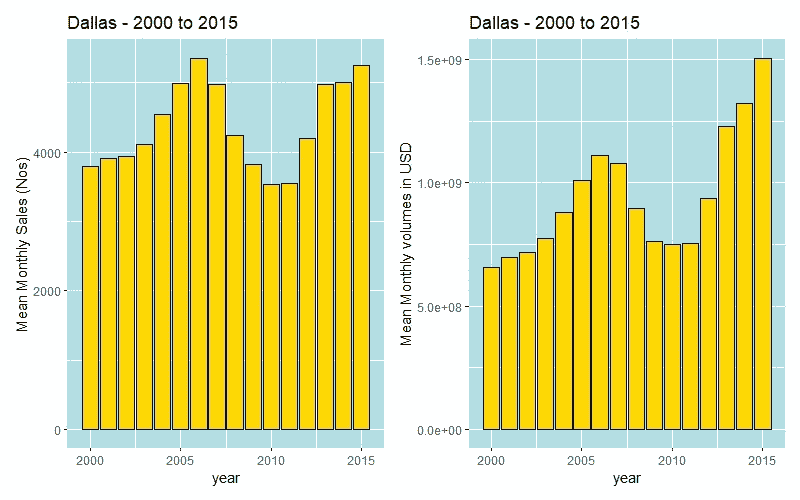
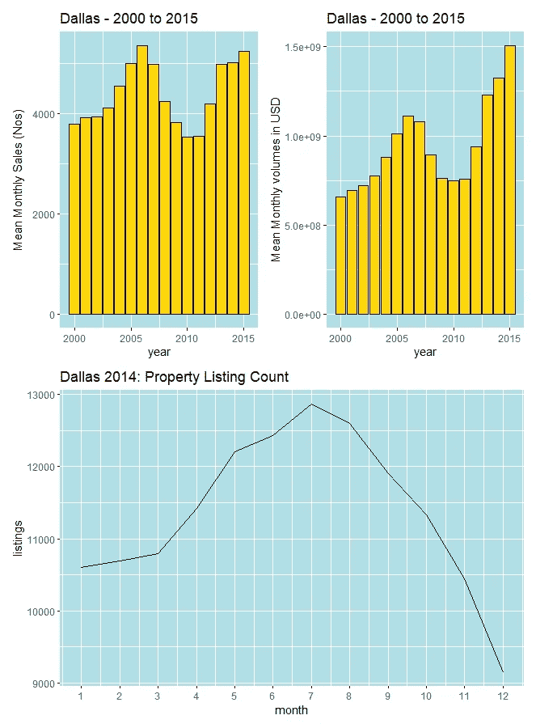
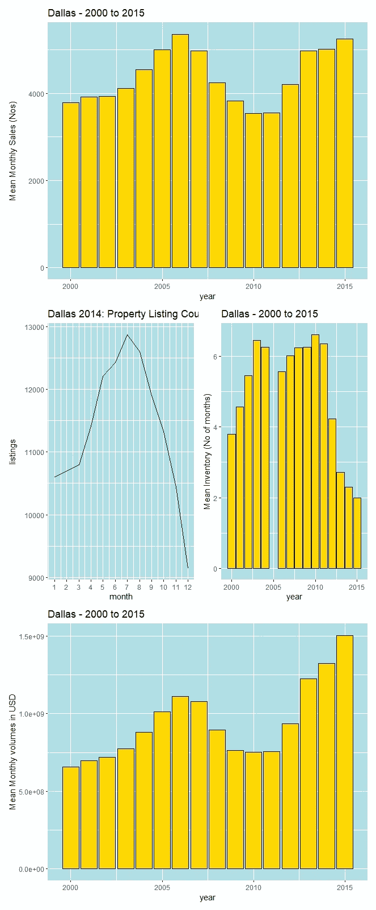

# 拼凑——下一代 ggplots

> 原文：<https://towardsdatascience.com/patchwork-the-next-generation-of-ggplots-1fcad5d2ba8a?source=collection_archive---------60----------------------->

## 进一步扩展 ggplot2 的多功能性..


尼古拉斯·彼尔托在 [Unsplash](https://unsplash.com/s/photos/patchwork-fields?utm_source=unsplash&utm_medium=referral&utm_content=creditCopyText) 上的照片

对于 R 中的数据可视化，`ggplot2`已经成为生成出色的、高质量的发布图的首选包。它的分层方法使我们能够从简单的视觉基础开始，并在每一层中不断添加修饰。即使是默认设置的最基本的绘图，看起来和感觉都比 base R 图形好得多。因此，如果你计划或需要与内部利益相关者或外部客户分享你的分析成果，你的技能组合中必须有 ggplot。是的，有一个学习曲线(自尊技能没有！)但一旦掌握，`ggplot2`提供了极好的定制可能性，并以引人注目的方式传达您的洞察力。

但是这个帖子本身并不是关于 ggplot 的！相反，它是关于现在可用的令人敬畏的布局功能，超越了通过`ggplot2`的`facet_wrap()`和`facet_grid()`方法可用的标准网格选项。

当您想要将一组相关的图组合到一个图形中，但是发现一些图看起来比其他的更宽，并且打乱了行和列以及行/列宽度的网格约束时，灵活的布局选项特别有用并且非常缺少。或者更糟的是，到处都有一连串的传说。

输入`patchwork`！

`patchwork`建立在`+`的基础上，现在不仅能让我们在`ggplot2`的基础剧情中增加一层，还能让我们控制支线剧情的位置和大小。所有这些只需要 3 个“操作符”:`+`、`()`和`/`。让我们来看看吧！

## 装置

确保您已经安装了`ggplot2`包。如果你以前没有用过`ggplot`，请点击 Selva Prabhakaran 的阅读这篇综合教程[。](http://r-statistics.co/Complete-Ggplot2-Tutorial-Part1-With-R-Code.html)

```
library(ggplot2)
install.packages('patchwork') # first time installation
library('patchwork') # load the library in to your R environment
```

我们将使用来自`ggplot2`的德克萨斯房屋`txhousing`数据集来演示`patchwork`的能力。让我们快速检查数据集的维度和前几行。

```
data = ggplot2::txhousing
dim(data)
```


```
head(data)
```



它有 9 列和 8602 个观察值，包含美国德克萨斯州 2000-2015 年各月的城市房屋销售和库存数据信息。您可以在 R 控制台上使用`help(txhousing)`命令来检查列的详细描述。为了演示的目的，让我们只考虑达拉斯市的数据。

```
dallas = data[data$city == "Dallas",] # take a subset of data only for Dallas
```

我们现在将创建一些将在`patchwork`使用的 gg 图

```
avg.monthly.sales = dallas %>% group_by(year) %>% summarise(mean = mean(sales))mytheme = theme(panel.background = element_rect(fill = "powderblue")) # set a ggplot theme for repeated use laterp1 = ggplot(avg.monthly.sales, aes(year,mean)) +
  geom_col(fill = "gold", color = "navyblue") + 
  ylab("Mean Monthly Sales (Nos)") +
  mytheme + labs(title = "Dallas - 2000 to 2015")p1
```



```
avg.monthly.vol = dallas %>% group_by(year) %>% summarise(mean = mean(volume))p2 = ggplot(avg.monthly.vol, aes(year,mean)) +
  geom_col(fill = "gold", color = "navyblue") + 
  ylab("Mean Monthly volumes in USD") +
  mytheme + labs(title = "Dallas - 2000 to 2015")p2
```



```
dal_2014 = dallas %>% filter(year ==2014)p3 = ggplot(dal_2014, aes(month,listings)) +
  geom_line(color = "navyblue") + mytheme + 
  scale_x_continuous(breaks = c(seq(1,12,1))) +
  labs(title = "Dallas 2014: Property Listing Count")p3
```



```
avg.monthly.inventory = dallas %>% group_by(year) %>% summarise(mean = mean(inventory))p4 = ggplot(avg.monthly.inventory, aes(year,mean)) +
  geom_col(fill = "gold", color = "navyblue") + 
  ylab("Mean Inventory (No of months)") +
  mytheme + labs(title = "Dallas - 2000 to 2015")p4
```



现在，假设我们希望将两个或更多的图显示为一个图形。像`gridExtra`这样的扩展可以胜任工作，但是选项仅限于正方形或矩形网格，每个单元格有一个子图。这里是`patchwork`一击即中的地方，几乎不需要布局代码。看着！！

```
p1 + p2
```



就是这样！像加法一样简单..现在对于一些部门来说。

```
(p1 + p2) /p3
```



再多堆一些..！


照片由 [amirali mirhashemian](https://unsplash.com/@amir_v_ali?utm_source=unsplash&utm_medium=referral&utm_content=creditCopyText) 在 [Unsplash](https://unsplash.com/s/photos/stacked-burger?utm_source=unsplash&utm_medium=referral&utm_content=creditCopyText) 上拍摄

```
p1/(p3+p4)/p2
```



很棒吧？这个包还可以选择将所有相同的支线剧情合并成一个单独的图例和更多的特性。我将发布一篇单独的文章来讨论这个问题。

关于 R 中另一个方便的探索性数据分析(EDA)工具，点击[这里](/eda-in-r-with-smarteda-eae12f2c6094)看我关于`SmartEDA`的文章。

感谢您的阅读，并请留下您的意见和反馈。